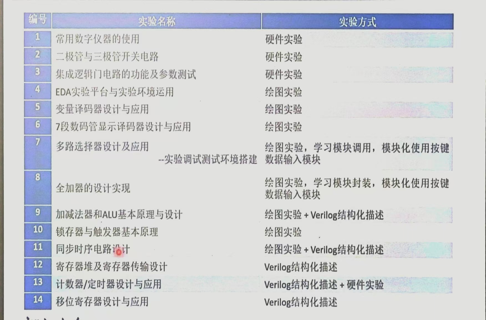

# 数字逻辑设计

- 教师：马德
- 学分：4.0
- 上课时间：周四6,7,8,9,10
- 评分规则：
    - 课上小测：30%（不提前通知，题目来自课本和作业）
    - 项目：10%（源码+报告，截止于期末考试一周前）
    - 实验：20%
    - 期末考试：40%
- 课程目录：
    - 数的表示
    - 布尔代数和逻辑最小化技术
    - 组合电路（Combinational Circuits）设计与分析
    - 时序电路（Sequential Circuits）设计与分析
    - 可编程逻辑设备和存储器
- 实验目录：
    
    
    
- 课程笔记：
    
    [Chapter 1: Digital Systems and Information](Chapter%201%20Digital%20Systems%20and%20Information%201a09c6b6155b80969c86c056c2730452.md)
    
    [Chapter 2: Combinational Logic Circuits](Chapter%202%20Combinational%20Logic%20Circuits%201a99c6b6155b803c9ed5de06190f10f3.md)