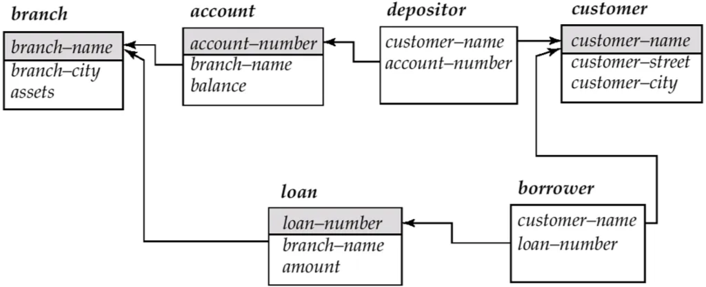
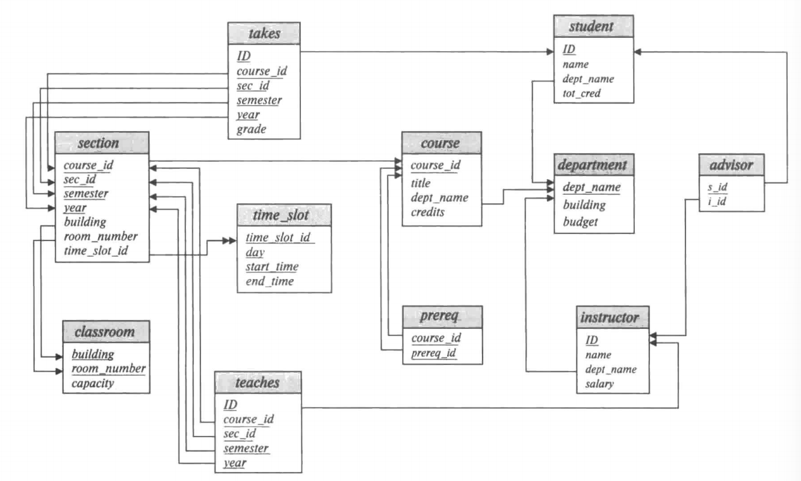

# 数据库系统

- 教师：陈刚
- 学分：4.0
- 上课时间：周一3,4,5
- 教材：Abraham Silberschatz, Henry F. Korth, and S. Sudarshan. Database System Concepts (7th Edition), 高等教学出版社, 2021.（涉及章节：1-7章、12-19章）
- 评分规则：
    - 作业/练习：10%
    - 课堂测验：10%
    - 实验项目：30%
    - 期末考试：50%（A4 开卷）
- 本课程最常用的关系模式：
    
    
    
    图：银行数据库的模式图
    
    
    
    图：大学数据库的模式图
    
- 课程笔记：
    
    [Chapter 1: Introduction](Chapter%201%20Introduction%2019d9c6b6155b803eb5f7c2fd986d31a6.md)
    
    [Chapter 2: Relational Model](Chapter%202%20Relational%20Model%2019d9c6b6155b80bcae35c2f428878643.md)
    
    [Chapter 3: SQL](Chapter%203%20SQL%201a99c6b6155b80828260f17b18776fc1.md)