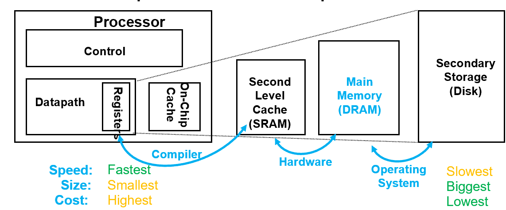

# Chapter 2: Memory Hierarchy Design

## 一、概述

### 1. 存储层次示意图

### 2. **评估标准**

1. **Bandwidth（带宽）**
2. **Latency（延迟）：**分为获取时间（Access Time）和循环时间（Cycle Time）
    - 获取时间：发送读请求到字到达需要的时间
    - 循环时间：不相关的内存请求需要的最小时间，即获取开始和下一次获取开始之间的最小时间

### 3. 硬件原理

1. **SRAM**
    - 全称：Static Random Access Memory
    - 每个 bit 使用六个晶体管保存，以防止信息在读取时受到干扰
    - 不需要刷新，Access Time 接近于 Cycle Time
2. **DRAM**
    - 全称：Dynamic Random Access Memory
    - 每个 bit 使用单个晶体管保存
    - 读操作会破坏信息
    - 需要周期性刷新
    - Cycle Time > Access Time
3. **DRAM 的访问方式**
    - DRAM 按**存储体（Bank）**的方式进行组织
    - 每个 Bank 包含若干个 **Row**，每个 Row 包含若干个 **Columns**
    - 发送 **ACT 命令（Activate）**会打开一个 Bank 和一个 Row，并将该 Row 的全部数据载入 Row Buffer
    - 将 Row 放入 Buffer 后，有两种方式传送数据：
        - 一种是根据 DRAM 的宽度采用连续列地址传送
        - 另一种是指定块传送方式，并给出起始地址
    - ACT 命令发送地址时，先在**行选通（row access strobe，RAS）**期间发送一半地址，再在**列选通（column access strobe，CAS）**期间发送另一半地址
    - **PRE 命令（Precharge）**会关闭 Bank 和 Row，为下一次访问做好准备
    
    
    
    
    
    图：访问 DRAM 第 0 行第 0 列的数据
    
4. **提高 DRAM 的性能**
    - **同步 DRAM（synchronous DRAM，SDRAM）：**对于异步 DRAM，每次进行列访问和传输时，都需要额外的同步时间；同步 DRAM 增加时钟信号，从而使得对单个 Row 进行多次 Column 访问时，不再需要额外的同步时间
    - **增加带宽：**DDR 的带宽为 4、8 或 16 位
    - **双倍数据倍率（double data rate，DDR）：**它使 DRAM 在存储器时钟周期的上升沿和下降沿都能传输数据，从而使峰值数据传输速率翻了一番
    - **使用多个 Bank：**将一整个 Bank 分拆为多个可以独立工作的 Bank，用于帮助功耗管理、缩短访问时间，并允许对不同存储体进行交织重叠的访问
    - **降低电压以降低功耗**
    - **低功耗模式（Power Down Mode）：**通知 DRAM 忽略时钟即可进入这一模式；该模式会禁用 SDRAM，但内部自动刷新除外；但从低功耗模式恢复为典型模式需要一定的延迟时间
        
        
        
5. **Graphics DRAM**
    - 该型 DRAM 具有 GPU 所需的更大带宽（32 位），包括 GDRAM（Graphics DRAM）和 GSDRAM（Graphics Synchoronous DRAM）
    - GDRAM 的最大时钟频率更高
    - 为了提高传输速率的同时不引起信号发送出错，GDRAM 通常直接与 GPU 相连，焊接在电路板上
6. **Stacked / Embedded DRAM**
    - 堆叠 / 嵌入式 DRAM 是一种封装创新，它将多个 DRAM 以堆叠方式嵌入到处理器内部，可以降低访问延迟，从而允许在处理器和 DRAM 间建立更多、更快的连接，进而提升带宽，又称为 **高带宽存储器（High Bandwidth Memory，HBM）**
    
    
    
7. **Flash**
    - Flash 是一种 EEPROM（Electrically Erasable Programmable Read-Only Memory，电可擦可编程只读存储器）
    - Flash 是只读的，但可以擦除，在覆写前必须擦除原有内容，因此写操作会消耗寿命
    - Flash 是非易失的（Non-violatile）
    - 常用于 PMD（Personal Mobile Device）的二级存储，SSD 是一种 Flash
    - 比 DRAM 便宜，比 Disk 贵；比 DRAM 慢，比 Disk 快
    - Write Leveling Technique：使写入的块均匀分布，从而提高整体寿命
8. **相变存储器 Phase-Change Memory**
    - SSD 未来的潜在方案

### 4. 提高存储器系统的可靠性

1. **错误类型**
    - 硬错误（Hard Error）/ 永久性故障（Permanent Fault）：由电路变化引起的可重复的错误
    - 软错误（Soft Error） / 瞬态故障（Transient Fault）：电路不改变的前提下，存储单元内容发生改变的情况
2. **错误检测和修复**
    - 可以通过奇偶校验（Parity）和纠错码（ECC，是更复杂的一类校验算法的统称）进行检测和纠正
        - 奇偶校验无法检测多位错误，所以必须限制用奇偶校验提供保护的位数，例如：每 8 个数据位使用 1 位奇偶校验位
        - ECC 可以检测两个错误并纠正一个错误，代价是每 64 个数据位占用 8 位的开销
    - Chipkill 技术：本质上类似于磁盘的 RAID，它分散数据和 ECC 信息，以便在单个存储芯片完全失效时，可以从其余存储芯片中重构丢失数据
    - 出现不可恢复的故障概率：
        
        $Parity\ only>ECC\ only>Chipkill$
        

## 二、Cache 基础

### **1. Cache 的组织形式**

- **Direct Mapped**

- **Set Associated**

- **Fully Associated**

### **2. 衡量标准与优化目标：平均访问时间（AMAT）**

降低 AMAT 是 Cache 优化的最终目标

- $Average\ Memory\ Access\ Time\\=Hit\ Rate\times Hit\ Time+Miss\ Rate\times Miss\ Time$
- $Average\ Memory\ Access\ Time\\=Hit\ Rate\times Hit\ Time+Miss\ Rate\times (Hit\ Time+Miss\ Penalty)$
- $Average\ Memory\ Access\ Time\\=Hit\ Time+Miss\ Rate\times Miss\ Penalty$

### **3. Miss 的种类**

- **Compulsory Miss：**冷启动或数据第一次被访问时，由于缓存中尚未缓存该数据，必然会发生未命中
- **Capacity Miss：**缓存容量已满时，缓存无法容纳所有需要的数据，导致部分数据被替换出去，再次访问这些被替换数据时引发的未命中
- **Conflict Miss：**在组相联或直接映射中，多个数据块映射到同一个缓存组，导致缓存块被频繁替换，即使缓存容量足够

## **三、Cache 优化的六条基本方法**

|  | **Hit Time** | **Miss Penalty** | **Miss Rate** |
| --- | --- | --- | --- |
| **Larger Block Size** |  | 增大 | 减小 |
| **Bigger Caches** | 增大 |  | 减小 |
| **Higher Associativity** | 增大 |  | 减小 |
| **Multilevel Caches** |  | 减小 |  |
| **Giving priority to read misses over writes** |  | 减小 |  |
| **Avoiding address translation during indexing of the Cache** | 减小 |  |  |

### **1. Larger Block Size**

- **Pros:** reduce compulsory misses，reduce static power
- **Cons:** increase miss panalty, capacity / conflict misses

### **2. Bigger Caches**

- **Pros:** reduce capacity misses
- **Cons:** increase hit time, cost and (static & dynamic) power

### **3. Higher Associativity**

- **Pros:** reduce conflict misses
- **Cons:** increase hit time and power
- **2 : 1 Cache 经验法则：**大小为 N 的直接寻址 Cache 和大小为 N/2 的二路组相连 Cache 具有几乎相同的 miss rate

### **4. Multilevel Caches**

- **Pros:** reduce miss penalty, reduce power
1. **设计原则**
    - L1 Cache 要足够小，以使其时钟周期和处理器的时钟周期接近
    - L2 Cache 要足够大，存储尽量多的内容，以减小 L1 的 Miss Penalty
2. **本地失效与全局失效**
    - Local Miss Rate = 该级缓存的缺失次数 / 该级缓存的访问次数
    - Global Miss Rate = 该级缓存的缺失次数 / 第一级缓存的访问次数
3. **多级包含与多级排除**
    - 多级包含（Multilevel Inclusion）：L1 的数据永远在 L2 中存在，当 L1 Miss 时会在 L2 中找到该数据，然后将该数据所在的块复制到 L1 中
    - 多级排除（Multilevel Exclusion）：L1 的一些数据不在 L2 中存在，当 L1 Miss 时会在 L2 中找到该数据，然后将该数据所在的块与 L1 中的块交换
4. **计算公式**
    - $Average\ Memory\ Access\ Time\\=Hit\ Time_{L1}+Miss\ Rate_{L1}\times \\ (Hit\ Time_{L2}+Miss\ Rate_{L2}\times Miss\ Penalty_{L2})$
    - $Average\ Memory\ Stalls\ Per\ Instruction\\ =Misses\ Per\ Instruction_{L1}\times Hit\ Times_{L2}\\ +Misses\ Per\ Instruction_{L2}\times Miss\ Penalty_{L2}$
    
    
    

### **5. Giving priority to read misses over writes**

**（为读取缺失指定高于写入操作的优先级）**

- **Pros:** reduce miss penalty
1. CPU 需要先读取数据到寄存器才能执行计算，而写入操作往往不会立即影响计算逻辑
2. 若发生 read miss，CPU 可能会被迫等待数据到达，造成指令流水线暂停；因此，使用 write buffer 处理写入，使得写操作不需要立即占用主存带宽，从而读操作的优先级高于写操作的优先级，降低对读操作的干扰

### **6. Avoiding address translation during indexing of the Cache**

**（在索引 Cache 期间避免地址转换）**

- **Pros:** reduce hit time

1. 实现原理
    - 使用 Page Offset（虚拟地址和物理地址的共同部分）来索引 L1 Cache，从而可在访问 TLB 完成前完成对 L1 Cache 的访问
    - TLB 读取完成后，只需比较刚刚读取的 L1 Cache Tag 与 TLB Data是否一致，即可判断刚刚读取的 L1 Cache Data 值是否有效
    - 由于 Page Offset 用于索引 L1 Cache，因此该技术限制了 L1 Cache 的大小（对于 Directed-mapped Cache，其大小不能大于 Page Size）

    

2. **Page Size 的选择**
    - Larger Page Size 的优点：
        - 使 Page Table 更小，占用更小的 Memory 空间
        - 可以设计更大的 Cache，同时降低 Cache 的 Hit Time
        - 在 Memory 与二级存储之间，传输更大的 Page 更加高效
        - 映射更多 Memory 空间，降低 TLB Miss Rate
    - Smaller Page Size 的优点：降低页面内部碎片化（Fragmentation）导致的空间利用率低下
    - 解决方案：Multiple Page Sizes：允许多种 Page Size 同时存在，最近的处理器已经开始支持

    !!! note "《计算机组成》中的 Virtual Memory"

        1. 地址转换（Address Translation）：将虚拟页号转化为物理页号，需访问 TLB / 页表来完成
        2. TLB（Translation Lookaside Buffer）：一块特殊的 Cache，保存了最近的 Address Translation 记录
            
            
            
            图：TLB 表
            
        3. 若没有 TLB，读取一次 Memory 的数据需要访问两次 Memory
            - 第一次：凭借虚拟地址访问 Page Table，获取物理地址（Page Table 很大，存储于 Memory 中）
            - 第二次：凭借物理地址访问真实数据
        4. Memory 使用的设计
            - Fully Associative：允许 Block 放置于 Memory 的任何位置
            - LRU：Virtual Memory Miss 时，移除最不常使用的块；使用 use / reference 位记录使用情况
            - Write-back：写磁盘需要的代价太大，所以不急于将数据写回磁盘，使用 Dirty 位记录更改

## 四、Cache 优化的十条高级方法

|  | **Hit Time** | **Bandwidth** | **Miss Penalty** | **Miss Rate** |
| --- | --- | --- | --- | --- |
| **Small and simple Cache** | 减小 |  |  | 增大 |
| **Way Prediction** | 减小 |  |  |  |
| **Pipelined Access** | 增大 | 增大 |  |  |
| **Nonblocking Caches** |  | 增大 | 减小 |  |
| **Banked Caches** |  | 增大 |  |  |
| **Critical Word First & Early Restart** |  |  | 减小 |  |
| **Merge Write Buffer** |  |  | 减小 |  |
| **Compiler Optimization** |  |  |  | 减小 |
| **Hardware Prefetching** |  |  | 减小 | 减小 |
| **Compiler Prefetching** |  |  | 减小 | 减小 |

### **1. Small and Simple L1 Cache 使用小而简单的第一级 Cache 以缩短命中时间，降低功率**

1. 使用更小的大小，从而使时钟周期更快，降低功耗
2. 使用更低的 Associativity，从而减小 Hit Time、降低功耗（原理：硬件开销减小，例如直接寻址 Cache 可以跳过 Tag 比较步骤）

### **2. Way Prediction 路预测以缩短命中时间**

1. 在组相连、全相连 Cache 中使用路预测，可以减小 Conflict Misses 和 Hit Time
2. 实现原理
    - 为 Cache 的每个 Way 添加一个预测位（Block Predictor Bits），用于预测下一次 Cache 访问中优先尝试的 Way
    - 根据预测值，提前设定好多选器；Cache 访问时，在与 Cache 数据读取并行的时钟周期内，只执行一次 Tag 比较；如果 Miss，则在下一个时钟周期中查看其它的 Way，以找出匹配项

### **3. Pipelined Access & Multibanked Caches 以提高带宽**

1. **Pipelined Access**
    - 对 Cache 访问进行流水化，从而缩短时钟周期时间、提高带宽，但会使 Latency 和预测错误分支的 Penalty 变大
2. **Multibanked Caches**
    - 采用多组相互独立、可同时访问（Simultaneous Access）的 Cache，从而提高带宽
    - 采用 “顺序交错”（Sequential Interleaving）的方式对 Cache 进行分组
    
    !!! example

        > **示例：**如果有 4 个组，则 $x$ 号组（ $0≤x≤3$）中的所有 Cache 块地址为对 4 求模后余 $x$
        > 
        > 
        > 
        > 

### **4. Nonblocking Caches 非阻塞 Cache 以提高带宽**

1. 在传统 Cache 中，若发生 Miss，CPU会停止执行后续指令，直到 Miss 被解决
2. 在支持乱序执行（Out-of-order Execution）的处理器中，允许 **Data Cache** （不包含 Instruction Cache）在 Miss 期间继续提供 Cache Hit，从而提高 Cache 的带宽
3. 在非阻塞 Cache 中，
    - 若在 Miss 期间发生 Hit，称为 Hit under miss
    - 若在 Miss 期间又发生 Miss，称为 Miss under miss
    - 若在 Miss 期间发生多次 Miss，随后发生 Hit，称为 Hit under mutiple miss
4. 非阻塞 Cache 会限制 Miss under miss 的次数

图：使用不同的编译器在不同的 Benchmark 下，使用非阻塞 Cache 对 Miss Penalty（纵轴）的影响

### **5. Critical Word First & Early Restart 关键字优先 & 提前重启以降低缺失代价**

1. 可以减小 Miss Penalty
2. 动机：发生 Cache Miss 时，常见的做法是将整个 Block 取到 Cache 中；然而，CPU 通常只需要其中的某一个 Word
3. **Critical Word First（关键字优先）**
    
    Cache **首先请求缺失的 Word**，并在它到达时立即发送给处理器，使得处理器可以继续工作；随后，Cache 再将整个 Block 取到 Cache 中
    
4. **Early Restart（提前重启）**
    
    Cache **按正常的顺序请求**整个 Block，并在缺失的 Word 到达时立即发送给处理器，使得处理器可以继续工作
    

### **6. Merging Write Buffer 合并写缓冲区以降低缺失代价**

1. 可以减少 Write Buffer 被填满导致的停顿，从而降低写操作的 Miss Penalty
2. 写入 Write Buffer 时，若目标地址已有修改数据，进行合并（write merging），避免创建新条目，从而使 Write Buffer 更不易被填满

上图：合并前，下图：合并后

### **7. Compiler Optimization 编译器优化以降低缺失率**

1. 可以减小 Miss Rate，主要包括循环交换和分块两种实现
2. **循环交换（Loop Interchange）**
    
    对于嵌套的循环，交换循环的内外次序以使代码按照二维数组中数据的存储顺序来访问它们，充分利用空间局部性
    
    !!! example

        > **示例：**
        > 
        > 
        > 
        > 

3. **分块（Blocking）**
    - 背景：在处理多个二维数组，有的数组按行来访问、有的数组按列来访问时（例如矩阵乘法），由于 Cache 的大小有限，导致数组无法完全存放于 Cache 中；这样，无论是使用行主序还是列主序存储数组，都会导致 Cache Miss 频繁发生
    - 解决方案：对每个二维数组进行分块
    
    !!! example

        > **示例：**
        > 
        > 
        > 
        > 
        > 图：使用分块优化前
        > 
        > 
        > 
        > 图：使用分块优化后
        > 

### 8. Hardware Prefetching 对指令和数据进行硬件预取以降低缺失代价和缺失率

1. 可以减小 Miss Penalty、Miss Rate
2. 基本原理
    - 在处理器请求一些项目之前，预先提取它们，通常预取被请求的块的下一个相邻块
    - 指令和数据都可以预先提取
    - 预取的指令或数据既可以直接放在 Cache 中，也可以放在外部缓冲区（External Buffer）中

### 9. Compiler Prefetching 用编译器控制预取以降低缺失代价和缺失率

1. 可以减小 Miss Penalty、Miss Rate
2. 基本原理：编译器在代码中插入预取指令
3. 分类
    - Register Prefetch：将数据预取到寄存器
    - Cache Prefetch：将数据预取到 Cache

### 10. 使用 HBM 扩展存储结构

1. 基本思路：使用 HBM 作为 L4 Cache，可将 L4 Cache 的体积扩展到 1 GB
2. 问题
    - 若 L4 Cache 的块太大，则块中的许多内容并不会用到，导致 Cache 使用效率低下（称为碎片化问题），且传送这样大的数据块也是效率低下的
    - 若 L4 Cache 的块太小，则：
        - 由于 L4 Cache 的总体积太大，导致其行数太多，无法将 L4 Cache 的 TLB 存放在空间有限的 SRAM 中，只能将 TLB 存放在 HBM 中
        - 这导致每次访问 L4 Cache 需要访问两次 HBM（第一次访问 TLB 进行地址转换，第二次进行 Tag 比较），降低运行效率
3. 优化方案
    - 优化 1：将 Tag 和 Data 放在 HBM 的同一行（row）
        - 尽管打开这样的行需要更长的时间，但访问同一行的不同部分带来的延迟大约是访问新行所需时间的三分之一
        - 因此，我们可以先访问该行内的 Tag，若 Tag 命中再继续访问 Data
    - 优化 2：Alloy Cache
        - 将 Tag 和 Data 融合在一起，使用直接映射的 Cache

## 五、虚拟内存与虚拟机

### 1. 通过虚拟内存提供保护

1. 页表用于将虚拟地址转化为内存的物理地址，通常每个进程（process）都有独立的页表
2. 不同的页表之间是相互隔绝的，从而避免进程之间相互干扰
    
    
    
3. 在运行用户进程时，体系结构必须限制用户进程能够访问的资源，但要允许操作系统进程访问更多资源；为此要做到以下四点：
    - 提供至少两种模式，用于指明当前正在运行的进程是用户进程（user process）或是系统进程（OS process / kernal / supervisor process）
    - 提供一部分处理器状态，使得只有系统进程可以写入，用户进程可以读取但不能写入
    - 提供处理器在用户模式（user mode）与系统模式（supervisor mode）之间相互切换的机制；其中，从用户模式切换到管理模式称为系统调用（system call）
    - 提供限制内存访问的机制，从而在进程切换时不需要将进程保存到磁盘就能保护该进程的内存状态

### 2. 虚拟机

1. 虚拟机（Virtual Machine）是一种代码库比整个操作系统小得多的保护模式（Protection Mode）
2. 虚拟机的管理程序称为 VMM（Virtual Machine Monitor）或 Hypervisor
3. 虚拟机的底层硬件平台称为宿主机（Host）
4. 虚拟机的使用动机
    - 现代操作系统中，隔离和安全的重要性日益增加
    - 标准操作系统可能存在安全性和可靠性故障
    - 在许多无关的用户之间共享一台计算机，例如云数据中心
    - 处理器速度的大幅提高，使虚拟机的开销更容易接受
5. VMM 的基本特征
    - VMM 为程序提供一个与原始机器基本相同的环境
    - 虚拟机内运行的程序速度下降程度有限
    - VMM 完全控制系统资源
6. VMM 的质量要求
    - 客户机软件（Guest Software）在虚拟机的行为应与在本机硬件上运行时完全相同
    - 客户机软件不应该能够直接更改系统资源的分配
7. VMM 的特权要求
    - 提供至少两种模式，用于指明当前正在运行的进程是用户进程（user process）或是系统进程（OS process / kernal / supervisor process）
    - 指令集中存在一个特权子集，该子集中的指令只能在系统模式下使用，若在用户模式下使用则会导致 Trap
    - 所有系统资源必须只能通过这些特权指令进行控制