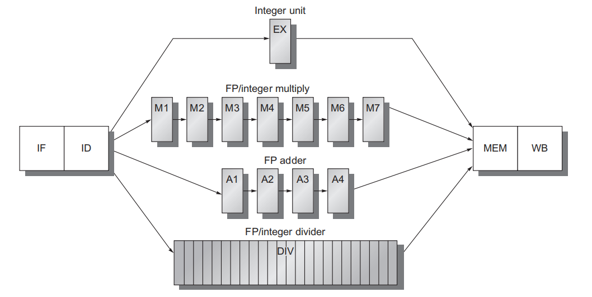

# Chapter 3: Instruction-Level Parallelism

## 一、支持浮点操作的流水线设计

### 1. 设计思路

- 浮点操作（Floating-Point Operations，FP）比整型操作耗费更多时间，难以在一个时钟周期内完成
- 将 EXE 阶段的运算分为多个功能单元（Functional Unit）（整型操作单元、浮点加法单元、乘法单元、除法单元），并使用流水化设计
    - 整型操作单元过于简单，不进行流水化，消耗 1 个时钟周期
    - 整型 / 浮点乘法单元设置为 7 个流水线层级，消耗 7 个时钟周期
    - 浮点加法单元设置为 4 个流水线层级，消耗 4 个时钟周期
    - 整型 / 浮点除法单元过于复杂，不进行流水化，消耗 24 个时钟周期
- 对功能单元进行流水化设计时，需添加对应的层级间寄存器，例如：ID/A1，M6/M7
- 这样的流水化设计允许多达 4 个同时执行的浮点加法、7 个同时执行的整型 / 浮点乘法，但只能同时执行 1 个整型 / 浮点除法

### 2. 功能单元的延迟与启动间隔

- 延迟（Latency）：使用数据与得出结果之间的时钟周期数；对于流水化的部分，延迟通常为流水线层级数 - 1
- 启动间隔 / 重复间隔（Initiation/Repeat Interval）：向同一功能单元发出两个操作之间必须间隔的周期数
    
    !!! example

        > **示例：**
        > 
        > - 对于 Integer ALU，使用数据和得出结果位于同一个时钟周期，因此 Latency 为 0；对于 Data Memory，得出结果位于使用数据的下一个时钟周期，因此 Latency 为 1

| **Functional Unit** | **Latency** | **Initiation Interval** |
| --- | --- | --- |
| Interger ALU | 0 | 1 |
| Data memory（数据载入） | 1 | 1 |
| FP add | 3 | 1 |
| FP multiply | 6 | 1 |
| FP divide | 24 | 25 |

- 流水线的 CPI = 理想 CPI + Structural Stalls + Data Hazard Stalls + Control Stalls

### 3. 冒险情形与处理

1. **Structural Hazard**
    - **情形一：**由于除法单元没有实现流水化，因此若存在多条除法指令，它们可能竞争除法单元，从而发生结构冒险
    - **情形二：**由于不同指令的 EXE 阶段用时不同，因此存在多条指令同时进入 MEM 或 WB 阶段的情形，它们竞争数据读写口，从而发生结构冒险
        
        
        
    - **处理方法一：**跟踪 ID 阶段对写端口的使用，并在一条指令发射之前使其停顿
        - 具体地，使用一个移位寄存器来跟踪写端口的使用，这个移位寄存器可以指示已发射的指令将在何时使用这个寄存器堆
        - 若 ID 中的指令需要与已发射的指令同时使用寄存器堆，则将 ID 中的指令停顿一个周期
        - 在每个时钟周期，移位寄存器会移 1 位，以进行记录的更新
        - 优势：所有互锁检测（Interlock Detection）都在 ID 层级进行
    - **处理方法二：**当冒险指令尝试进入 MEM 或 WB 级时，使其停顿
        - 已发射和待发射的指令都可以进行停顿
        - 通常为延迟最长的指令赋予优先级，因为延迟最长的指令最可能导致另一指令因 RAW 冒险而停顿
        - 优势：MEM 和 WB 阶段更容易检测冒险
        - 劣势：停顿可能发生在 MEM 和 WB 两个阶段，更难实现
2. **Write After Write Hazard（WAW，写后写）**
    - **概括：后发指令试图在前发指令之前完成写回同一个寄存器**
    - **情形：**由于不同指令的 EXE 阶段用时不同，因此各指令不再按它们发射时的顺序进入 WB 阶段，如果两条指令写内存的目标相同，且后发射的指令先进入 WB 阶段，可能导致数据的错误覆写
        
        
        
    - **处理方法一：**推迟 fld 指令的发射
    - **处理方法二：**要求 fadd.d 指令不写入内容（zero write control）
3. **Read After Write Hazard（RAW，写后读）**
    - **情形：**同普通流水线的数据冒险，但由于引入浮点单元后，延迟变得更长，所以需要插入的停顿数量更多
        
        
        
    - **处理方法：**对功能单元进行流水化设计时，为前递添加对应的数据通路，包括以下几种前递情形： EX/MEM，A4/MEM，M7/MEM，DIV/MEM，MEM/WB
4. **ID 阶段的冒险检测与处理**
    
    假定处理器在 ID 中进行所有冒险检测，则必须在执行以下三种检查后才能发射指令
    
    - 检查结构冒险
        - 对于除法指令，进行停顿，直到除法单元可用
        - 确保在需要寄存器写端口时该端口可用
    - 检查 RAW 数据冒险
        - 一直等到源寄存器未被列为流水线寄存器中的目的地为止
    - 检查 WAW 数据冒险
        - 检查是否任何在 A1-A4、DIV、M1-M7 中的指令和待发射的指令具有相同的目标寄存器
        - 若有，则为待发射的指令插入停顿

### 4. MIPS 流水线案例

1. 分解耗时较长的内存读写阶段，将流水线级数增长至 8 级，从而支持更高的时钟频率
    
    
    
2. MIPS 流水线会带来更长的延迟，例如 Load Delay 的开销为 2 个时钟周期
    
    
    

## 二、依赖问题 Dependence

!!! note

    **注意：**RAW、WAW、WAR 的称呼都是相对于指令序列中读写操作出现的位置来说的

    依赖可以分为三类：

    - 数据依赖（Data Dependence）
    - 名称依赖（Name Dependence）
    - 控制依赖（Control Dependence）

### 1. 数据依赖

- 概念：当一条指令的执行需要另一条指令的计算结果时，称为数据依赖，是一种真依赖
- 情景：RAW

### 2. 名称依赖

1. 概念：两条指令使用相同名称的寄存器（或内存地址），但两条指令之间不存在数据流动（data flow），是一种假依赖
2. 情景：WAR、WAW
3. 名称依赖可以分为两类：
    - 反依赖（Antidependence）：WAR，即指令 A 读取数据后，指令 B 向同一寄存器写入数据，可能因指令执行顺序而导致 A 错误读取到 B 写入的数据
    - 输出依赖（Output dependence）：WAW，即两条指令向同一个寄存器写入数据，可能因写入数据的先后顺序问题而产生冒险
    
    !!! example

        > **示例：**
        > 
        > 
        > 
        > 

4. 解决名称依赖的办法：寄存器重命名（Register Renaming）
    - WAR：对后面的寄存器进行重命名
    - WAW：对前面的寄存器进行重命名
    - 被重命名的寄存器存在真依赖的，依赖它的指令也要对应地进行寄存器重命名
    
    !!! example

        > **示例：**
        > 
        > - 示例 1
        >     
        >     
        >     
        > - 示例 2
        >     
        >     
        >     

### 3. 控制依赖

- 概念：指令的执行取决于分支指令（如 if、loop）的结果，导致执行路径的不确定性

## 三、静态调度 Static Scheduling

1. 实现 ILP 有两种方式：
    - 基于编译器的 **静态并行**（Compiler-based static parallelism）
    - 基于硬件的 **动态并行**（Hardware-based dynamic parallelism）
2. 静态调度有两种方式：
    - **流水线调度（Pipeline Scheduling）：**对指令进行重新排序，以避免或减少 Stall
    - **循环展开（Loop Unrolling）：**多次复制循环体，以减小分支指令开销，从而提高有用指令在整个程序中所占的比例

## 四、控制冒险与分支预测

### 1. 控制冒险的静态解决方法

1. 停顿流水线：只要出现分支指令，无论分支指令是否 Taken，都插入一次停顿，以确保正确跳转
2. 预测分支跳转或不跳转：将分支指令全部视为跳转或不跳转
    - 如果预测正确：无事发生
    - 如果预测错误：清空已执行的指令，重新取指令
3. 分支延迟槽（Branch Delay Slot）：只要出现分支指令，无论分支指令是否 Taken，都紧随其后插入一条与分支结果无关的指令，以确保正确跳转

### 2. 简单的动态分支预测器

1. **1-bit Predictor**
    - 使用一个分支预测缓冲区（Branch Prediction Buffer），又称分支历史表（Branch History Table，BHT）
    - 在 BHT 中，每条分支指令使用 1 位记录其上一次的跳转结果；1 表示 Taken，0 表示 Not taken
        
        
        
    - 分支预测缓冲区使用分支指令地址的低位作为 Index，高位作为 Tag，与 Cache 的组织形式类似
        
        
        
        
        
2. **2-bit Predictor**
    - 在 BHT 中，每条分支指令使用 2 位记录其近期的跳转结果；11 和 10 表示 Taken，01 和 00 表示 Not taken
        
        
        
    !!! example

        > **示例：**
        > 
        > 
        > 在下图中，T 表示 Taken，N 表示 Not Taken，某条指令在 BHT 中的初始记录值为 10，经过如图所示的 10 次跳转后，预测的正确率为 50%
        > 
        > 
        > 

3. **N-bit Predictor**
    - 在 BHT 中，每条分支指令使用 N 位记录其近期的跳转结果
    - 在实际情况中，2-bit-Predictor 已经足够出色了，因此 N-bit Predictor 很少用到
        - 若 BHT 记录的值 $\geq(2^N-1)/2$，则预测结果为 Taken；否则预测结果为 Not Taken

### 3. 局部预测器 Local Predictor

- **背景：**分支指令的跳转结果可能与 **该条分支指令** 过去的跳转结果相关联，我们希望根据其过去几次的跳转结果为其进行预测
    
    !!! example

        > **示例：**
        > 
        > 
        > 考虑这样的循环： `for(i=1;i<4;i++)`
        > 
        > 它每 3 次连续的 Taken，就会紧随 1 次 Not Taken
        > 
        > 一般的 N-bit Predictor 无法对这样的规律进行学习
        > 

- **方案：**
    - 为每个分支指令安排一个 $n$ 位移位寄存器，记录其最近 $n$ 次的跳转结果
    - 再安排 $2^n$ 个 2-bit-Predictor，使得寄存器任意取值均对应到一个 2-bit-Predictor 上
    - 从而，实现对跳转规律的学习

### 4. 全局预测器 Global Predictor

- 又称 **相关分支预测器（Correlate Branch Prediction）**
- **背景：**分支指令的跳转结果可能与 **所有分支指令** 过去的跳转结果相关联，我们希望根据过去几次的跳转结果为新的分支进行预测
- **方案：**
    - 安排一个 $m$ 位移位寄存器，记录 **所有分支指令** 最近 $m$ 次的跳转结果
    - 为每个分支指令（或所有分支指令）安排 $2^m$ 个 n-bit-Predictor，使得寄存器任意取值均对应到一个 n-bit-Predictor 上
    - 从而，实现对跳转规律的学习，该方案称为 (m, n) Predictor；(m,n) 预测器的含义是观察该跳转前 m 条跳转语句，选择一个 n 位的对应预测器
    - 相应地，没有全局历史记录的普通 2-bit Predictor 就是 (0, 2) Predictor
    
    
    
- 对于 (m, n) Predictor，其位数为 $2^m\times n\times$ 预测分支指令的数量

### 5. 局部预测与全局预测的联合

1. **混合预测器 Hybrid/Alloyed Predictor**
    - 将分支指令的 PC 地址与全局历史记录进行 XOR 运算
    
    
    
    
    
2. **竞争预测器 Tournament Predictor**
    - 同时包含局部和全局预测器，并使用 2-bit Predictor 在两个预测器中进行选择
    
    
    
    
    

## 五、数据冒险与动态调度

- **动态调度（Dynamic Scheduling）：**硬件对指令进行重新排序（乱序执行，out-of-order execution），以减少停顿，同时保持数据流（Data Flow）和异常（Exception）检测
- **将 ID 阶段分为两个阶段**
    - **Issue：**对指令进行解码，检查结构冒险（Structural Hazard）
    - **Read Operands：**等待数据冲突消失后，读取操作数
    - 优化后的流水线六个阶段分别为：IF、IS、RO、EX、MEM、WB
- **工作流程**
    - IF、IS 阶段是按顺序执行（in order）的
    - RO 进入 EX 阶段开始乱序执行：仅当一条指令不存在数据依赖、且硬件资源充足时，才发射进入 EX 阶段
    - 在 RO 阶段使用一个冒险检测和解决单元（Hazard detection and resolution unit）以支持乱序执行

### 1. 记分板 Scoreboarding

1. 记分板通过与功能单元、寄存器堆通信，控制指令向 EX 阶段的发射，包含三个组成部分：
    - 指令状态（Instruction Status）
    - 功能单元状态（Functional Unit Status）
    - 寄存器结果状态（Register Result Status）
2. **指令状态**
    - 记录每条指令进行到以下四步的哪一步：issue、read operands、execution、write back
3. **功能单元状态**
    
    记录功能单元的状态，每个功能单元（FU）对应以下九项记录：
    
    - **Busy：**功能单元是否正在占用
    - **Op：**功能单元正在执行的指令类型（例如：ALU 的 Op 既可以是 add，也可以是 sub）
    - **Fi：**目标寄存器号
    - **Fj，Fk：**源寄存器号
    - **Qj，Qk：**产生 Fj，Fk 结果的功能单元
    - **Rj，Rk：**用于指示 Fj、Fk 是否准备就绪且尚未被读取，可设置为 Yes 或 No
        - 在刚刚准备就绪且尚未被读取时，该字段为 Yes；在该字段还未准备就绪或已经完成读取时，该字段为 No
        - 要求在两个操作数都准备就绪后一起读取，因此可能出现 Yes 的情形
4. **寄存器结果状态**
    - 记录哪个功能单元（FU）将对特定寄存器的值进行修改

!!! example

    > **示例：**
    > 
    > 
    > 下图表示第二条 L.D 指令即将写回结果（Write Result）时的记分板，由于 F2 寄存器的值没有写回，导致后续的 MUL.D 和 SUB.D 指令无法进行 Read Operands
    > 
    > 
    > 

### 2. Tomasulo’s Algorithm

!!! note

    - Scoreboard 和 Tomasulo 在进入 IS 阶段之前检查结构冒险，若发生结构冒险，则不会进入 IS 阶段
    - 在 Tomasulo 中，对于 Load 指令，IS 和 EXE 阶段之间往往暂停一个时钟周期，该时钟周期是用于计算内存的目标地址的，但不便于归纳到某一个阶段中

1. **工作原理**
    - 指令队列（Instruction Queue）：取指令，并在不发生结构冒险的前提下发射指令
    - 存取缓冲区（Load/Store Buffers）：保存存取指令的内存地址等信息
        - Load 缓冲区：保存用于内存地址计算的相关信息（直到地址计算完成）、在等待内存操作时跟踪 Load 指令、在 Load 等待写入 CDB 时临时保存 Load 的值
        - Store 缓冲区：保存用于内存地址计算的相关信息（直到地址计算完成）、在等待内存操作时临时保存 Store 的值
    - 保留站（Reservation Stations）：保存指令信息、真实的操作数，以及检测和处理冒险的相关信息
    - 功能单元（FP Adders/Multipliers）：当保留站中的指令和操作数可用时，执行相关指令
    - CDB：对于存取指令和 FP 指令，结果放在 CDB 上，CDB 将这些结果广播（Broadcast）到需要这些结果的 FP 寄存器、保留站、存缓冲区
2. **Tomasulo 算法的优点**
    - 将冒险检测（Hazard Detection）逻辑分布到存取缓冲区和保留站
    - 通过寄存器重命名解决 WAW 和 WAR （两者都是名称依赖、假依赖）引起的停顿问题
3. **Tomasulo 算法包含三个组成部分：**
    - 指令状态（Instruction Status）
    - 保留站状态（Reservation Station Status）
    - 寄存器结果状态（Register Result Status）
4. **指令状态**
    
    记录每条指令进行到以下三步的哪一步：
    
    - Issue：当对应的保留站为空时，从指令队列的头部取下一条指令；如有必要，进行寄存器重命名
    - Execution：当全部操作数可用时，将指令送入功能单元执行；若遇到分支指令，在分支指令完成前，不允许执行任何指令
    - Write Result：结果产生后，将结果放在 CDB 上，CDB 将这些结果广播到需要这些结果的 FP 寄存器、保留站、存缓冲区
5. **保留站状态**
    
    每个保留站对应以下七项记录：
    
    - **Busy：**该保留站及其对应的功能单元是否正在占用
    - **Op：**该保留站的指令对应的指令类型（例如：add，sub）
    - **Vj，Vk：**操作数的真实值；对于 Load 指令，使用 Vk 存放地址偏移量
    - **Qj，Qk：**将产生操作数 Vj，Vk 结果的保留站；若操作数已经产生并送入该保留站，则将对应的 Qj，Qk 置为 0（即：对任意一条记录，Qj 和 Vj 只能有一个具有有效值）
    - **A：**对于 Load 与 Store 指令，使用 A 存放内存地址计算的相关信息：初始时存放指令的立即数，地址计算在 Execution 阶段完成，此后存放实际的内存地址（Effective Address）
6. **寄存器结果状态**
    - 记录哪个功能单元（FU）将对特定寄存器的值进行修改

!!! example

    > **示例：**
    > 
    > 
    > 下图表示第二条 fld 指令即将写回结果（Write Result）时的 Tomasulo 记录，由于 F2 的值没有提供给 CDB，导致后续的 MUL.D 和 SUB.D 指令无法开始执行
    > 
    > 
    > 
    > 
    > 

## 六、基于硬件的推测 Hardware Speculation

1. **推测：**通过预测分支结果，在假定预测正确的前提下执行程序，并在预测错误的情况下进行回退处理
2. **关键思想**
    - 允许执行一条指令、将其结果旁路给其它指令，但不允许这条指令执行任何不能撤销的更新操作，直到确认这条指令不再具有不确定性为止
    - 当一个指令不再具有不确定性时，就允许它更新寄存器堆或存储器，将指令执行的这一步骤称为 **指令提交（Commit）**
    - 允许指令乱序执行，但强制要求指令循序提交，以防止在指令提交之前发生任何不可挽回的操作；添加一组硬件缓冲区，用来保存已经完成执行但还没有提交的指令结果，这一缓冲区称为 **重排序缓冲区（Reorder Buffer，ROB）**
3. **ROB 条目字段**
    - 指令类型（Instruction Type）字段：存储指令类型，指明这个指令是下述三种指令的何种：
        - 分支指令（没有目的地结果）
        - Store 指令（目的地字段为存储器地址）
        - 寄存器操作指令（Load 指令和 ALU 指令，目的地字段为指令的目标寄存器号）
    - 目的地（Destination）字段：指令的目标寄存器号（Load 指令和 ALU 指令）或存储器地址（Store 指令）
    - 值（Value）字段：在提交指令之前保存指令的结果值
    - 就绪（Ready）字段：表明指令完成执行，结果值准备就绪（但还未提交）
4. **指令的执行阶段**
    - Issue：当对应的保留站为空，并且 ROB 有空闲条目时，从指令队列的头部取下一条指令；若 ROB 或寄存器中存在对应的操作数，将该操作数送入该条指令的保留站中
    - Execution：当全部操作数可用时，将指令送入功能单元执行；Store 指令要写入内存的操作数允许暂不可用，因为 Store 指令暂时只进行内存地址的计算
    - Write Result：结果产生后，将结果放在 CDB 上，CDB 将这些结果广播到对应的 ROB 和需要这些结果的保留站
    - Commit：当一个指令到达 ROB 的头部且结果值可用时，即进行提交；根据即将提交的指令类型，分为如下情形：
        - 提交正常指令（Normal Commit）：处理器用值字段存储的值更新寄存器，并从 ROB 清除该指令
        - 提交 Store 指令：与提交正常指令类似，但更新的是存储器而非寄存器
        - 提交预测错误的分支指令：清空 ROB，执行过程从该分支的后续正常指令处重新开始

!!! example

    > **示例：**
    > 
    > 
    > 
    > 
    > 
    >