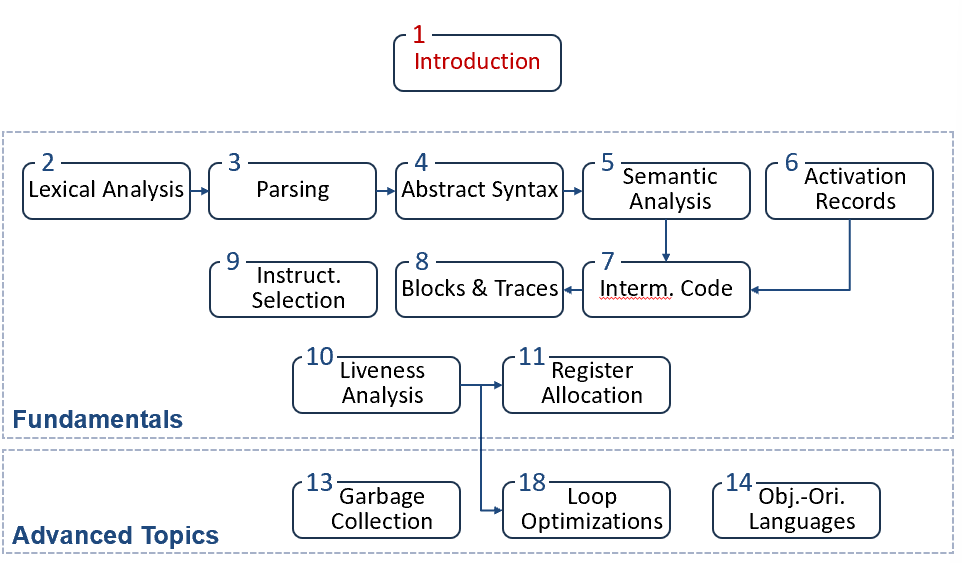

# Chapter 1: Introduction

## 1.1 课程总目录

## 1.2 编译器简介

**定义：**A  compiler is a program to translates one language to another.

## 1.3 编译器的工作流程

<aside>
💡

**两个重要概念**

- 阶段（Phase）：指由一个或多个模块组成，处理不同的抽象“语言”（例如上图的前端、中端、后端）。
- 接口（Interface）：编译器模块之间交换的信息（例如 AST、IR、Assem）。
</aside>

1. **前端-词法分析（Lexical Analysis/Lexing/Scanning）**
    - 将程序字符流分解为 Token（记号）序列
    - 删除字符串中不必要的部分（如空格）
    - 通常使用正则表达式匹配
    - 对应工具 Lex
    
    
    
2. **前端-语法分析（Parsing/Syntax Analysis）**
- 将 Token 序列解析为语法结构
- 在上述过程中，去除不必要的 Token（例如括号）
- 解析的语法结构一般使用抽象语法树（Abstract Syntax Tree, AST）表示
- 对应工具 Yacc
1. **前端-语义分析（Semantic Analysis）**
    - 决定语法结构的含义：检查变量类型，合法性检查等
    
    
    
2. **中端-中间代码生成**
    - 中间代码/表示（IR）：源语言与目标语言之间的桥梁，通常以树的形式表示
    
    
    
3. **中端-机器无关代码优化**
    - 基于中间表示进行分析与变换，降低执行时间，减少资源消耗
    
    
    
4. **后端-目标代码生成**
    - 把中间表示形式翻译到目标语言
    - 包含指令选择、寄存器分配、指令调度等
    
    
    

## 1.4 Tiger 编译器的工作流程

1. **前端阶段：从源码到语法树**
    - **Lex (词法分析)**：将源代码分割成一个最小的单元，称为 **Tokens**（如关键字、变量名）。
    - **Parse (语法分析)**：根据语法规则进行“归约”（Reductions），检查代码结构是否合法。
    - **AST (抽象语法树)**：语法分析生成的产物，它以树状结构表示代码的逻辑结构。
    - **Semantic Analysis (语义分析)**：检查逻辑错误（如变量未定义、类型不匹配）。它会维护**环境 (Environments)** 和**符号表 (Tables)**。

**2. 中间表示阶段：硬件无关的转换**

- **Translate (翻译)**：将 AST 转换为一种更接近底层但仍与具体硬件无关的形式——**IR Tree (中间代码树)**。
- **Frame Layout (栈帧布局)**：确定变量在内存栈中的位置。
- **Canonicalize (规范化)**：将复杂的 IR 树简化、扁平化，生成 **Canonicalized IR Tree**。这一步是为了方便后续生成具体的机器指令。

**3. 后端阶段 A：指令选择与流分析 (Back-end Analysis)**

- **Instruction Selection (指令选择)**：将规范化的 IR 转换成目标架构的汇编指令（**Assem**），但此时寄存器还是虚拟的。
- **Control Flow Analysis (控制流分析)**：分析程序的执行路径（分支、循环），生成 **CFG (控制流图)**。
- **Data Flow Analysis (数据流分析)**：分析变量在何时被定义和使用，生成 **Interference Graph (冲突图/干涉图)**。

**4. 后端阶段 B：代码生成与链接 (Back-end Generation)**

- **Register Allocation (寄存器分配)**：通过冲突图，将无限的虚拟寄存器映射到有限的硬件寄存器上。
- **Code Emission (代码发射)**：产生真正的汇编语言 (**Assembly Language**)。
- **Assembler (汇编器)**：将汇编转换成二进制的可重定位对象代码 (**Relocatable Object Code**)。
- **Linker (链接器)**：将不同的代码文件和库文件合并，最终生成可在计算机上运行的 **Machine Language (机器语言)**。