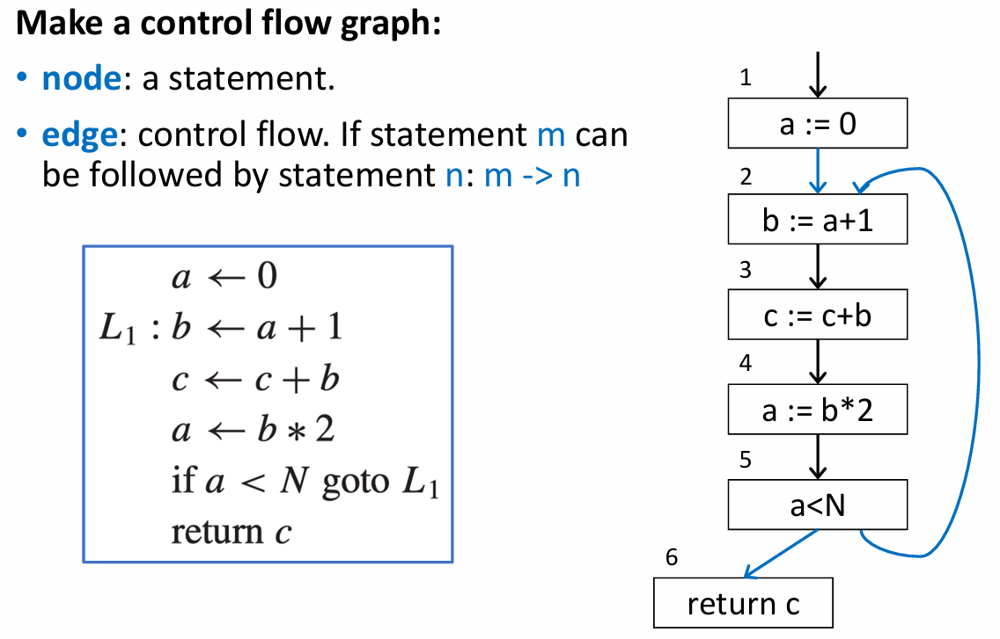

# Chapter 10: Liveness Analysis 活跃变量分析

## 10.1 概述

### 10.1.1 为什么需要活跃变量分析？

1. 在中介码（IR）阶段，编译器可以使用无限数量的临时变量（Temporaries）。但在真实的物理机器上，寄存器的数量是有限的 。
2. 如果两个临时变量（如变量 a 和 b）永远不会在同一时间“被使用”（in use），它们就可以被放入同一个物理寄存器中 。当临时变量过多，超出了物理寄存器的容量时，多余的变量会被存放在内存中 。
3. 活跃变量分析的目的就是确定每个变量的活跃性，以便共享物理寄存器 。如果一个变量所持有的值在未来可能会被用到，那么这个变量就是“活跃的”（Live）。

### 10.1.2 如何进行活跃变量分析？

1. 活跃变量分析基于程序的控制流图（Control Flow Graph, CFG）来进行。
2. **控制流图（CFG）的构建**
    - 节点（Node）：代表程序中的一条语句。
    - 边（Edge）：代表控制流。如果语句 m 执行后可能紧接着执行语句 n，则存在一条从 m 到 n 的边（`m -> n`）。
3. **变量的活跃状态沿数据流图的边流动。**通过遍历控制流图，我们可以梳理出每个变量在特定节点的生命周期。如果变量 a 和 b 在所有节点的活跃状态都不重叠，它们就可以被分配到同一个物理寄存器中 。

## 10.2 数据流方程的求解 Solution of Dataflow Equations

### 10.2.1 术语定义

1. **前驱与后继**：对于控制流图中的节点 n，`out-edges` 指向其后继节点，`in-edges` 来自其前驱节点 。`pred[n]` 表示前驱节点集合，`succ[n]` 表示后继节点集合 。  
2. **定义 (Def) 与使用 (Use)**：赋值给一个变量称“定义”了该变量；在赋值号右侧或表达式中出现一个变量，称“使用”了该变量 。`def[n]` 表示节点 n 定义的变量集合，`use[n]` 表示节点 n 使用的变量集合 。  
3. **活跃状态**：一个变量在某条边上是活跃的，当且仅当存在一条从该边出发的路径，能够到达该变量的一个“使用”位置，且路径中没有穿过该变量的“定义”位置 。  
4. **Live-in 与 Live-out**：
    - **Live-in (in[n])**：如果一个变量在节点 n 的任何一条入边上是活跃的，则称它在该节点 live-in 。
    - **Live-out (out[n])**：如果一个变量在节点 n 的任何一条出边上是活跃的，则称它在该节点 live-out 。

### 10.2.2 数据流方程

1. **数据流方程的直观理解**
    
    基于上述定义，可以推导出每个节点 n 的 `in[n]` 和 `out[n]` 的计算规则：
    
    - 如果节点 n 使用了变量 a，那么 a 在节点 n 的入口处必须是活跃的（`a ∈ in[n]`）。
    - 如果变量 a 在节点 n 的出口处活跃（`a ∈ out[n]`），并且节点 n 没有重新定义 a（`a ∉ def[n]`），那么 a 在节点 n 的入口处也必须是活跃的 。
    - 如果变量 a 在节点 n 的任意后继节点 m 的入口处活跃（`a ∈ in[m]`），那么 a 在节点 n 的出口处必然活跃（`a ∈ out[n]`）。
2. **数据流方程**
    
    根据上方分析，得到数据流方程的形式：
    
    - $in[n] = use[n] \cup (out[n] - def[n])$
    - $out[n] = \bigcup_{s \in succ[n]} in[s]$
3. **求解算法**
    - 方程可以通过 **迭代** 的方式求解：初始时将所有节点的 `in[n]` 和 `out[n]` 设为空集，然后在循环中不断应用上述方程更新集合，直到没有任何节点的集合发生变化为止 。
        
        
        
    - 逆向计算（从后向前计算，Backward analysis）：由于 `in` 是从 `out` 计算而来，而后继节点的 `in` 又是当前节点 `out` 的来源，因此逆着控制流箭头（从图的末端节点向前驱节点）计算，能极大加快收敛速度 。
4. **算法的变体**
    - 基本块（Basic blocks）：为减少冗余节点，可将只有一个前驱和一个后继的节点合并为基本块（这里的基本块概念与 Chapter 8 一致）。
    - 逐个变量分析：每次只分析一个变量，思维更清晰。
5. **算法的时间复杂度**
    - 理论最坏情况（Worst-case）： $O(N^4)$ 。
    - 实际应用情况（In practice）：如果选择了正确的计算顺序，通常会 $O(N)$ 到 $O(N^2)$ 之间 。

### **10.2.3 集合的表示方式**

在实现中如何表示 `in[n]` 和 `out[n]` ？

1. **位数组表示法 (Bit Arrays) —— 适用于稠密集合 (Dense Set)**
    - **结构设计**：假设程序中总共包含 N 个临时变量，计算机字长（Word Size）为 K 位。为每一个活跃变量集合分配一个长度为 N 位的位向量。
    - **集合操作**：求两个活跃变量集合的并集，可以对两个位向量进行按位或运算来实现 。
    - **时间开销**：单次集合并集操作仅需要 $\lceil N/K \rceil$ 次机器操作 。
2. **有序链表表示法 (Sorted Lists) —— 适用于稀疏集合 (Sparse Set)**
    - **结构设计**：变量存入链表中 。
    - **集合操作**：求并集的操作为**两个有序链表的合并（Merge）算法** 。
    - **性能优势**：当集合非常稀疏时（即集合中实际存在的元素个数平均远小于 $N/K$），有序链表的合并操作不需要遍历整个生命周期内的所有变量，其运行速度更快。

### 10.2.4 最小不动点理论 Least Fixed Points

- 由于控制流存在动态不确定性，活跃变量方程的求解本质上是对程序动态行为的一种保守近似（Conservative Approximation）。
- **核心定理**：数据流方程往往存在多组不同的解 。如果在所有解中，存在一个解 $X$ 能够被包含在其他任何解 $Y$ 之中（即 $X \subseteq Y$），则称 $X$ 为最小解/最小不动点（Least Fixed Point） 。前述的迭代求解算法被严格证明永远能计算出这个最小不动点。

### 10.2.5 静态活跃度与动态活跃度 Static and Dynamic Liveness

1. **语义盲区示例**
    - **代码逻辑**：
        - 节点 1：`a = b * b;` （由于平方项，此时 $a \ge 0$ 恒成立）
        - 节点 2：`c = a + b;` （可推导出 $c \ge b$ 恒成立）
        - 节点 3：`if (c >= b) goto L1; else goto L2;` （此条件永远为真）
    - **传统方程的局限性**：在传统的控制流图中，L2 分支（假设指向节点 4）是一条理论上的死代码路径，运行时绝不可能到达 。但标准的数据流方程并不知道符号本身的数学语义，它会盲目地认为两条分支均可达，从而将不可达路径上的变量使用也算作活跃，限制了寄存器的复用 。
2. **停机问题与不可判定性**
    - **定理（Halting Problem）**：图灵停机问题证明了不存在一个通用算法 H(P, X) 能够完美判定任意程序 P 在输入 X 下是否会陷入死循环 。
    - **推论**：同样不存在任何通用程序 H'(P, L) 能够绝对精准地判定，任意程序 P 中的某一个指定标签（或代码行） L 在实际运行中是否可达 。
3. **定义**
    - **动态活跃（Dynamic Liveness）**：变量 a 在节点 n 动态活跃，当且仅当程序的**某次真实动态执行**从 n 流向 a 的某次使用，且中途未经过 a 的重新定义 。
    - **静态活跃（Static Liveness）**：变量 a 在节点 n 静态活跃，当且仅当控制流图上存在**某条纯几何拓扑边构成的路径**从 n 通往 a 的使用，且中途不包含 a 的定义 。
4. **结论**：动态活跃必然属于静态活跃的子集 。既然动态活跃在理论上是不可判定的，编译器必须退而求其次，利用**静态活跃度**作为其完美的保守近似方案 。

### 10.2.6 冲突图 Interference Graph

1. 冲突（Interference）：如果两个不同的临时变量无法被安全地放入同一个物理寄存器中，我们就称它们之间存在“冲突”关系 。
2. **产生冲突的基本要素**
    - 活跃区间重叠（Overlapping live ranges）：两个变量在控制流图的某一处同时存活，若强行共用寄存器，后者的赋值会破坏前者的值 。
    - 架构约束（Architectural constraints）：例如在特定机器架构中，某条专用目标指令生成的变量 a 被硬性规定不能写入寄存器 r，此时即使没有重叠，变量 a 和寄存器 r 之间也构成了冲突 。
3. **冲突的数学表达**
    - 冲突矩阵（Interference Matrix）：使用二维交叉矩阵表示，行和列均表示变量，相互冲突的行列交叉点打上 `X` 标记 。
    - 无向冲突图（Undirected Graph）：
        - 节点：代表程序中所有的临时变量 。
        - 冲突边：相互冲突、无法共享寄存器的变量节点之间连上一条**实线**无向边 。
        - 传送边：对于形如 `t := s` 的赋值指令，为变量 `t` 和 `s` 之间连上一条**虚线**无向边。
        - 整个寄存器分配过程由此转化为数学上的图着色问题（Graph Coloring）。
    
    
    
4. **对 MOVE 指令的特殊处理**
    - 背景：
        - 考虑拷贝指令： `t := s` 。 如果源变量 `s` 在该指令之后依然保持活跃，按照常规的生存期重叠定义，新定义的 `t` 会与 `s` 产生重叠，从而在冲突图中连接一条冲突边 (s, t) 。
        - 但这违背了优化的初衷：因为 `t := s` 执行后它们持有的值完全相同，我们最希望看到的是让 `t` 和 `s` 共享完全相同的物理寄存器。如果它们共用一个寄存器，那么这行 `t := s` 代码就变成了 `r0 := r0`，在后续阶段可以被直接安全地删掉。
    - 特殊处理手段：
        - **规则 A：**当遇到普通的【非 MOVE 指令】 n 定义了变量 a 时：将新定义的变量 a 与该节点 Live-out 中的所有变量建立冲突边。
        - **规则 B：**当遇到【MOVE 指令】（如 `a := c`）定义了变量 a 时：将新定义的变量 a 与该节点 Live-out 中 **除了源变量 c 以外**的所有活跃变量建立冲突边 。
5. **零长度活跃区间的处理**
    
    如果一个临时变量被定义了，但之后从未被使用过，它看似没有生命周期。但由于该指令真的会执行并写入某个物理寄存器，该物理寄存器就绝不能被同一时间的其他活跃变量占用。因此，即使是“零长度”的活跃变量，也会与其定义时覆盖到的其他活跃变量产生冲突。