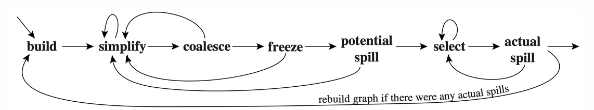

# Chapter 11: Register Allocation 寄存器分配

## 11.1 概述

1. 为了将无限数量的临时变量映射到有限数量的物理寄存器上，需要进行如下两步：
    - 通过活跃变量分析（Chapter 10），得到冲突图（Interference Graph）。
    - 为冲突图着色（Coloring）。
        - 每种颜色对应一个物理寄存器。
        - 由冲突边相邻的两个节点不能被分配同一种颜色。
2. 一条优化目标：尽量将 `MOVE` 指令的源操作数和目的操作数分配到同一个寄存器（变量合并，Coalescing），这样该 `MOVE` 指令就可以被安全删除，从而提高代码运行效率 。  
3. 寄存器分配和图着色问题在数学上都是 **NP-Complete（NP完全）** 问题 。这意味着在多项式时间内找不到完美的最优解，因此工业界都采用**线性时间复杂度的近似启发式算法**来获得良好效果 。

## 11.2 工作流：基础

如果不考虑变量合并，经典的寄存器算法包含四个主要阶段：**Build（构建）** $\rightarrow$ **Simplify（简化）** $\rightarrow$ **Spill（潜在溢出）** $\rightarrow$ **Select（选择着色）** 。

1. **Build**
    - 通过活跃分析，画出临时变量之间的冲突图 。
2. **Simplify**
    
    使用一种栈式启发算法。假设当前物理寄存器数量为 K：
    
    - **操作：**不断将度数（邻居数量）小于 K 的节点从图中切除，并压入栈中 。移除节点会导致其他节点的度数降低，从而引发连锁简化 。
    - **定理**：如果图 G 移除了一个低度数节点 b 得到 G'，只要 G' 是 K 可着色的，那么 G 也一定是 K 可着色的 。因为 b 的邻居少于 K 个，当邻居都涂上颜色后，至少还剩一种颜色留给 b 。
3. **Spill**
    - 如果图简化到某一阶段，所有剩余节点的度数都 $\ge$ K（被称为显著度数节点，Significant Degree） ，简化就卡住了。
    - 此时必须启用启发式策略，选择一个节点标记为**潜在溢出（Potential Spill）** ，将其从图中移除并压入栈中，然后继续尝试简化 。
    - 选择哪个节点作为潜在溢出？计算每个节点的 Spill Priority，选择分数最低者作为潜在溢出。
        - 原理：优先溢出度数高（代表冲突严重）、使用率低的变量。
        - 公式： $\text{Spill Priority} = \frac{(\text{循环体外的 Uses + Defs}) + 10 \times (\text{循环体内的 Uses + Defs})}{\text{Degree}}$
4. **Select**
    
    当图被完全清空后，开始**逐个出栈**恢复节点并上色 ：
    
    - **Simplify 阶段压栈的节点**：出栈时，由于当时保证了度数 < K，必然能找到一个安全的颜色分配给它 。
    - **Spill 阶段压栈的节点**：
        - 出栈恢复时，如果运气好，它的邻居在使用颜色时有重复，导致邻居使用的总颜色数 < K，那么该节点依然能成功着色，称为**乐观着色（Optimistic Coloring）** 。
        - 出栈恢复时，如果运气不好，它的邻居确实已经占满了 K 种不同的颜色，此时发生**实际溢出（Actual Spill）**。需要重写程序 。
5. **Start Over**
    - 一旦发生实际溢出，程序必须被重写：在程序中该变量**每次被定义（Def）之后立即插入 STORE 写入内存**，在**每次被使用（Use）之前立即插入 LOAD 从内存读出** 。
    - 这样一个长寿命的临时变量就被切碎成了数个寿命极短的新临时变量（Live Range 变小） 。
    - 重新构建冲突图并再次运行着色算法，直到不再发生溢出为止（通常 1~2 次迭代即可收敛） 。

## 11.3 变量合并技术 Coalescing

1. **基本原理**
    - 如果一条复制指令 `dst := src` 中的 `dst` 和 `src` **在冲突图中没有冲突边**，说明它们可以在同一时刻共享同一个寄存器 。
    - 我们可以将它们**合并（Coalesce）为一个新节点**，新节点的邻边是原来两节点邻边的**并集** 。
2. **保守合并策略**
    
    随意合并（Reckless Coalescing）会导致节点的度数暴增，可能把一个本来能有着色解的图变成无解的图 。因此，必须采用以下两种**保守合并安全策略**（Conservative Coalescing）之一 ：
    
    - **Briggs 判定法**：
        - 如果节点 a 和 b 合并为 ab 后，ab 的显著度数邻居（即度数 $\ge K$ 的邻居）的数量小于 K，则允许合并 。
    - **George 判定法**：
        - 对于节点 a 的每一个邻居 t，只要满足以下两个条件之一，就允许将 a 和 b 合并 ：
            1. t 和 b 冲突。
            2. t 是一个低度数节点（邻居数 $< K$）。
        
        > 注意：当把 George 策略应用于包含预着色节点的两个节点时，**必须且只能挑选“非预着色节点”去作为测试的主体 a**。
        > 

## 11.4 工作流：完整

如果考虑变量合并，完整的工作流如下：

1. **Build**：建立冲突图，并将节点归类为**传送相关（Move-related）或传送无关（Non-move-related）** 。如果某节点是 MOVE 指令的源或目的，则为传送相关 。
2. **Simplify**：**只移除低度数（度数** $< K$**）的、传送无关的节点** 。因为传送相关的节点我们要留给下一阶段合并，不能提前拆掉。
3. **Coalesce**：对剩下的图用 Briggs 或 George 策略进行保守合并 。合并成功的新节点如果变成传送无关的，就可以加入下一轮 Simplify 队列 。两阶段反复进行 。
4. **Freeze**：如果既不能简化，也不能合并了，就找一个**低度数的传送相关节点**，强行把与它相连的 MOVE 传送边**冻结（放弃合并希望）** 。这样它就变成了传送无关节点，重新激活 Simplify 阶段。
5. **Spill**：如果全是高度数节点，就选一个高度数节点标记为潜在溢出，推入栈中，重新激活 Simplify 阶段。
6. **Select**：出栈着色，若发生实际溢出则在重写程序后跳回 Build 重新开始 。

## 11.5 预着色节点 Precolored Nodes

1. 背景
    - 在实际的体系结构（如 RISC-V）中，某些物理寄存器有特殊用途（如参数寄存器 $a0 \sim a7$、栈指针 $sp$、帧指针 $fp$ 等） 。某些机器指令（例如非对称的乘除法指令）强制要求操作数必须放在特定的物理寄存器中。
    - 为了在同一个数学模型（图着色）中统一处理“临时变量”和“物理寄存器”，最自然的做法就是把每一个物理寄存器也抽象成冲突图中的一个节点。
    - 这些已经被硬件或架构规范“提前指定了颜色（即分配了具体寄存器）”的特殊节点，就被称为**预着色节点**。
2. 预着色节点的特性
    - 它们在算法开始前就已经涂上了固定的颜色 。
    - **不能被 Simplify 简化**（它们永远留在图中）。
    - **不能被 Spill 到内存中**（物理寄存器本身就在硬件中）。
    - 所有的预着色节点彼此之间存在冲突边 。
3. 寄存器生存期管理策略
    
    因为预着色节点不能溢出，如果让它们长期活跃，图就会变得极难着色。因此前端编译器必须**保持预着色节点的活跃范围尽可能短** ：
    
    - **做法**：在函数入口（Enter），立刻用 `MOVE` 指令将物理寄存器（如 callee-save 寄存器 r7）的值拷贝进一个普通的 IR 临时变量（如 $t_{231}$）；在出口（Exit）处，再通过 `MOVE` 指令拷贝回来 。
    - **结果**：如果函数内部寄存器压力大， $t_{231}$ 可以被安全地溢出到内存 ；如果压力小， $t_{231}$ 就会在 Coalesce 阶段被重新与 r7 合并，`MOVE` 指令被完美消除 。
4. 生存期分配常识
    - **Caller-save（调用者保存寄存器）**：如果一个普通变量**不跨越任何函数调用**，优先分配 Caller-save 寄存器 。
    - **Callee-save（被调用者保存寄存器）**：如果一个普通变量**生命周期内跨越了多个函数调用**，优先分配 Callee-save 寄存器 ，因为它会与 Caller-save 寄存器发生天然冲突 。
    
    <aside>
    💡
    
    #### 为什么不跨越函数调用的变量，优先分配 Caller-save 寄存器？
    
    1. 硬件规则背景
        
        Caller-save（调用者保存）寄存器的特点是：**函数可以不加限制地随意使用**它们，不需要在退出函数时恢复其原值 。这意味着，如果函数 `f()` 调用了函数 `g()`，那么 `g()` 极有可能会把这些寄存器里的内容全部覆盖掉。
        
    2. 原因解析
        - 免去保存的开销：如果一个普通变量 t 在局部被定义并使用，且其中途没有任何函数调用，那么它在整个生命周期里都是绝对安全的 。因为没有调用发生，就不会有别的函数来覆盖这个寄存器 。
        - 如果错误分配给 Callee-save 的后果：如果你把它强行分配给了一个 Callee-save 寄存器，根据硬件规定，你的程序在进入当前函数时，必须先插入一条 STORE 指令把该寄存器的原值存入内存，在函数退出时再插入一条 LOAD 指令恢复原值 。
        - 结论：既然变量不跨越函数调用，直接用 Caller-save 寄存器就可以白嫖，不需要任何额外的内存读写开销 。
    
    #### 为什么生命周期跨越多个函数调用的变量，优先分配 Callee-save 寄存器？
    
    1. 硬件背景
        
        Callee-save（被调用者保存）寄存器的特点是：**谁用谁负责恢复** 。如果你的函数 `f()` 把变量存放在 s1 中，中途调用了 `g()`，`g()` 哪怕也要用 s1，它也必须在退出时把 s1 还原本来的值 。因此，从 `g()` 返回后，`f()` 里的 s1 依然是完好无损的。
        
    2. 核心原因：与 Caller-save 寄存器发生“天然冲突”
        - 如果一个变量 x 的生命周期跨越了一个函数调用，那么在图着色模型眼里，x 会与所有的 Caller-save（预着色）寄存器连上冲突边 。
        - 为什么会产生冲突边？因为在函数调用的那一个时间点，被调用函数 `g()` 可能会用到任何一个 Caller-save 寄存器 。为了防止 `g()` 把 x 的值踩掉，编译器在活跃分析时，必须判定 x 在调用点与所有的 Caller-save 寄存器同时活跃 。
        - 图论层面的后果：如果一个变量 x 跨越了 5 个函数调用，它就会在冲突图中与所有的 Caller-save 节点牢牢地连满冲突边 。这时候，它能选择的颜色（寄存器）就被极大地压缩了。
    </aside>