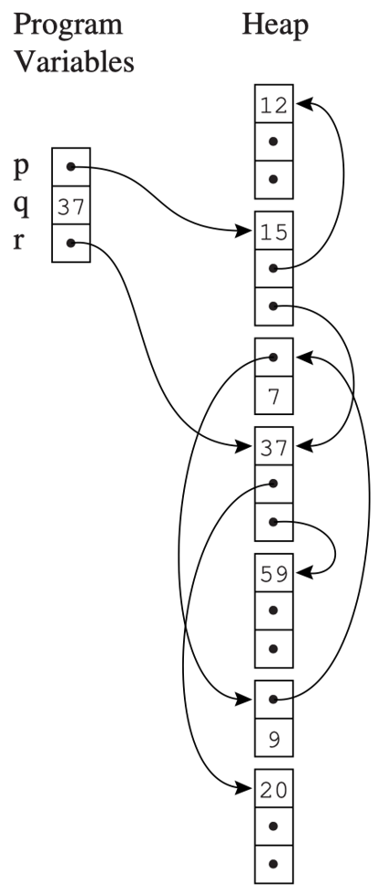

# Chapter 13: Garbage Collection

## 13.1 背景

1. **手动内存管理**
    - 操作方式：使用 `malloc` 和 `free` 来执行指针的动态分配和释放。
    - 手动管理的问题：极易引发安全问题。
2. **自动内存管理**
    - 定义：内存的回收是自动进行的。
    - 垃圾（Garbage）：已分配但不再被使用的存储空间。理想情况下，任何非动态活跃（在未来的计算中不会被使用）的记录都是垃圾。
    - 垃圾的判定：判断一个对象是否为垃圾是不可判定 (undecidable) 的，需要依赖一种保守的近似方法：
        - 无法从程序变量出发，通过任何指针链到达的堆分配记录就是垃圾。
        - 不可达 (not reachable) -> 垃圾 (garbage)。
        - 垃圾 (Garbage) -> 可能是可达的 (may be reachable)。
    - 可达性（Reachability）：一个对象 x 是可达的，当且仅当满足以下条件：
        - 一个寄存器包含一个指向 x 的指针，或者
        - 另一个可达对象 y 包含一个指向 x 的指针。
3. **垃圾回收（Garbage Collection，GC）**
    - 垃圾回收的定义：在没有显式调用 `free` 的情况下，回收已分配但不再使用的存储空间的过程。
    - 执行者：垃圾回收不是由编译器执行的，而是由运行时系统（与编译代码链接的支持程序）执行的。
    - 垃圾回收的方法：
        - 标记-清除收集法 (Mark-and-Sweep Collection)
        - 引用计数法 (Reference Counts)
        - 复制收集法 (Copying Collection)。

## 13.2 标记-清除收集法 Mark-and-Sweep Collection

1. **基本思想**
    
    
    
    - **数据结构**：程序变量和堆分配的记录构成了一个有向图。
    - **根节点**：程序变量是这个图的根 (roots)。
    - **可达性判断**：如果存在一条由有向边组成的路径 $r->...->n$（其中 r 是某个根），则节点 n 是可达的。
    - **标记阶段（Mark）**：可以使用深度优先搜索 (DFS) 等图搜索算法标记所有可达节点。
    - **清除阶段（Sweep）**：
        - 任何未被标记的节点必然是垃圾，应该被回收。
        - 具体做法是从堆的第一个地址到最后一个地址扫描整个堆，寻找未标记的节点。
        - 垃圾可以被链接到一个称为空闲链表（freelist）的链表中。
        - 清除阶段还必须将所有已标记的节点取消标记 (unmark)，以便进行下一次垃圾回收。
2. **基本算法**
    
    
    
    - **Mark 阶段**：对于每一个根 v，执行 `DFS(v)`。
    - **Sweep 阶段**：
        - 令 `p` 为堆的第一个地址。
        - 当 `p <` 堆的最后一个地址时，循环：
            - 如果记录 `p` 被标记了，则取消标记 `p`。
            - 否则，将 `p` 中的第一个字段指向 `freelist`，并将 `freelist` 更新为 `p`。
            - 将 `p` 更新为 `p + (记录 p 的大小)`。
    - **后续执行**：GC 结束后，编译好的程序恢复执行。当需要堆分配新记录时，它从空闲链表中获取记录；如果空闲链表为空，则通过另一次 GC 进行补充。
3. **基本算法的时间空间成本**
    - 时间成本：
        - DFS 搜索：与它所标记的节点数量成正比。
        - 清除阶段：与堆的大小 (H) 成正比。
    - 空间成本：
        - DFS 算法是递归的。在最坏的情况下，活动记录栈的长度会比整个堆还要大。
        - 解决方案：对于 DFS 部分，使用显式的栈（explicit stack）代替递归，这样只需要 H 个字 (words)，而不是 H 个活动记录。
4. **改进算法：使用显式栈（Explicit Stack）**
    
    
    
    - `t` ：表示栈顶的索引号（index）
    - 当遍历到一个未标记的指针字段时，将其推入显式栈中，并在循环中依次弹出处理。
5. **改进算法：指针翻转（Pointer Reversal）**
    
    
    
    - **目的**：为了进一步省略显式栈，从而在 DFS 算法中节省更多空间。
    - **原理**：
        - 将字段 `x.fi` 压入栈后，算法再也不会查看原始位置 `x.fi`。为了不浪费空间，将 `x.fi` 指向回 x 的父节点。
        - 当 `x.fi` 的处理完成后，可以通过 `x.fi` 返回并处理剩余部分，这恰好替代了栈的作用。
        - 当退栈时，字段 `x.fi` 会被恢复为其原始值。
    - **变量含义：**
        - `x` ：当前正在访问的节点。
        - `y` ：即将要访问的节点。
        - `t` ：当前遍历路径的上一个节点（父节点）。
        - `done` 数组：记录每个记录中已经处理了多少个字段。
    - **逐步解析：**
        - **动作 A：前进向下（类似于进栈）**
            
            当我们站在节点 `x`，准备顺着它的第 `i` 个指针字段去访问子节点 `y` 时：
            
            1. **保存现场并反转指针**：将父节点 `t` 的地址存入 `x` 的第 `i` 个字段中。公式： $x.f_i \leftarrow t$
            2. **整体向下移动一层**：
                - 原来的当前节点变成了父节点： $t \leftarrow x$
                - 原来的子节点变成了当前节点： $x \leftarrow y$
            
            此时，你成功往下走了一步，并且 `x` 原本指向 `y` 的边，现在反向指向了上面的 `t`。
            
        - **动作 B：回溯向上（类似于退栈并恢复现场）**
            
            当节点 `x` 的所有子节点都访问完毕（或者它是一个没有指针的叶子节点），我们需要往回走，回到它的父节点 `t`：
            
            1. **准备上移**：此时 `x` 变成了子节点 `y`（ $y \leftarrow x$ ），而父节点 `t` 重新成为了当前节点 `x`（ $x \leftarrow t$ ）。
            2. **恢复原始指针**：我们回到了父节点 `x`，需要把它刚才用来记路的指针恢复原状。我们把之前藏起来的更上一层的地址取出来（ $t \leftarrow x.f_i$ ），然后把 `x` 的指针重新指向子节点（ $x.f_i \leftarrow y$ ）。
        - **动作 C：切换相邻分支**
            
            如果在回溯回到 `x` 后，发现 `x` 还有未访问的字段（比如二叉树访问完了左子树，还要访问右子树）：算法会更新 `done[x]` 的计数，然后对新的字段重复“动作 A”，继续向下深入。
            
6. **外部碎片与内部碎片**
    
    
    

## 13.3 引用计数法 Reference Counts

1. **基本思想**
    - **核心思想**：直接通过跟踪指向每个记录的指针数量来识别垃圾，而不像标记-清除那样先找出可达对象。
    - **引用计数**：指向该记录的指针数量。该计数值与每个记录一起存储。
    - **如何跟踪**：编译器发出额外的指令。当把 `p` 存储到 `x.fi` 时，`p` 的引用计数增加，而 `x.fi` 之前所指对象的引用计数减少。
    - **回收机制**：如果某记录 `z` 的计数达到零，则 `z` 被放入空闲链表，同时 `z` 指向的所有其他记录的引用计数也随之减少。
    - **优化（递归递减）**：在将记录从空闲链表中取出时，而不是放入时，进行引用计数的“递归”递减更好。因为这能将工作分解成更短的片段以保持程序平稳运行（对交互式/实时程序很重要），并且只需在分配器一处完成。
2. **引用计数的问题与分析**
    - **问题一：引用循环 (Reference Cycle)**：一组对象互相循环引用。引用计数只跟踪引用数量，而不跟踪是否可达。这种循环垃圾无法被回收，这是使用该机制的语言（如 Perl, Firefox 2）中的主要问题。
    - **问题二：开销昂贵**：增加引用计数非常昂贵。相比于单一的赋值指令，程序必须执行一长串指令以完成计数的递减、归零检查（入列）以及递增操作。

## 13.4 复制收集法 Copying Collection

1. **基本思想**
    - **核心思想**：将内存分为两部分，并通过复制进行垃圾回收。
    - **过程**：
        - 在堆的一部分（称为 from-space）中遍历图结构，并在堆的另一部分空闲区域（称为 to-space）中构建同构的副本。
        - to-space 中的副本是紧凑的 (compact)，占用连续的内存，不存在碎片问题。
        - 根节点被更新为指向 to-space 的副本；此后整个 from-space 变得不可达。
        
        
        
2. **基本算法**
    - 指针 `next` 在初始化时，指向 to-space 的开头位置。
    - Forwarding 函数：将指向 from-space 的指针迁移到 to-space。
    
    
    
3. **改进算法：Cheney 算法**
    
    
    
    - Cheney 算法是一种使用广度优先搜索遍历可达数据的收集算法。
    - **变量含义：**
        - **`next` 指针（分配指针）**：永远指向目标空间（to-space）中**下一个可用的空白位置**。每当有一个存活对象被确认并复制过来时，就会放在 `next` 的位置，然后 `next` 向前推移该对象大小的距离。
        - **`scan` 指针（扫描指针）**：指向目标空间中**目前正在被检查**的对象。当一个对象刚刚被复制过来时，它里面的指针还未被复制，算法需要“扫描”它，把它的子节点也揪出来复制。
        - 初始化时，两指针都指向 to-space 的开头位置。
        - **重点**：在 `scan` 和 `next` 之间夹着的这部分对象，就是广度优先搜索的**队列**！它们是“已经被复制过来，但它们的子节点还没被处理”的对象。
    - **缺陷：**
        - 广度优先复制的指针数据结构会导致很差的引用局部性 (poor locality of reference)。相关的对象（如父子节点）在物理内存上可能会相隔很远。
        - 深度优先复制可以提供更好的局部性，但需要指针反转，速度慢且不方便。
    1. **改进算法：BFS-DFS 混合算法**
        
        
        
        - BFS-DFS 混合算法可以提供可接受的局部性。
        - **原理：**
            - 主体框架使用 BFS，但在复制每个对象时，顺手进行一次局部的 DFS。
            - 当一个对象被复制到新空间时，立刻看一眼它有没有哪个子节点还没被复制。如果有，就把这个子节点紧挨着它复制过去。
            - 这种做法不需要栈，因为它不追求遍历所有分支，每次只挑**一个**子节点往下“追（Chase）”，直到这条单传的链条断掉为止。至于那些没被挑中的其他子节点，就留给主循环的 BFS 扫描器（`scan` 指针）以后再慢慢收拾。
        - **逐步解析：**
            
            `Chase(p)` 函数循环里发生了什么：
            
            1. **安家落户**：`q <- next` 和 `next <- next + size`。在目标空间（to-space）给当前对象 `p` 划出一块新地盘 `q`，并把分配指针 `next` 往前推。
            2. **设定诱饵**：`r <- nil`。`r` 是用来记录“下一个要追踪的子节点”的地址的，先清空。
            3. **搬运家当与寻找猎物**：
                - 遍历老对象 `p` 的所有字段，一一复制到新对象 `q` 中（`q.fi <- p.fi`）。
                - 在复制的同时，顺便检查：这个字段是不是一个指针？它指向的子节点是不是还在旧空间没被搬走？
                - 如果是，**把这个子节点的地址赋给 `r`**（`r <- q.fi`）。注意，即使有多个符合条件的子节点，`r` 也只会保留最后一个找到的（或者第一个，取决于实现），**它每次只认准一个子节点往下追**。
            4. **留下线索**：`p.f1 <- q`。在老对象 `p` 身上留下一个转发指针，告诉后来者“我已经搬到 `q` 了”。
            5. **接力追踪**：`p <- r`。把目标更新为刚刚选中的子节点 `r`。
            6. **循环判断**：如果刚才没找到任何符合条件的子节点（`p = nil`），说明这条藤摸到底了，循环结束。否则，带着新的 `p` 再次进入循环，**这就保证了子节点会被紧接着分配在 `next` 位置，和父节点 `q` 亲密无间地挨在一起！**

## 13.5 编译器接口

对于使用垃圾回收（GC）机制的编程语言，其编译器不能完全独立工作，它必须通过以下几种方式与垃圾回收器进行深度交互 ：

- **生成分配代码**：编译器负责生成在堆内存中分配记录（records）的底层机器代码 。
- **定位根节点**：在每次触发垃圾回收周期时，编译器必须能够准确向回收器描述“根节点”（roots，即全局变量、栈上的局部变量等存活的起始点）的物理位置 。
- **描述数据布局**：编译器需要提供描述数据记录在堆内存中具体布局和结构的信息，以便回收器能正确扫描对象 。
- **生成内存屏障指令**：针对某些增量式垃圾回收（incremental collection）算法，编译器还需要在代码中自动插入并生成实现“读屏障”或“写屏障”（read or write barrier）的特殊指令，用于追踪并发过程中的引用变化 。

### 13.5.1 生成分配代码

- 在堆内存中动态创建数据记录通常伴随着较高的性能开销 。
- 为了配合快速分配（Fast Allocation），系统通常采用**基于复制的垃圾回收算法（Copying collection）** 。
- 在这种算法下，内存的分配空间被设计为一段连续的空闲区域（contiguous free region） 。
- 在此区域内，核心操作依赖两个指针：`next` 指向下一个可用的空闲内存首地址，而 `limit` 则标志着当前连续空闲内存块的边界（末尾位置） 。

#### 13.5.1.1 内存分配标准步骤（未优化）

当程序需要分配一个大小为 N 的记录时，最原始的执行逻辑包含以下步骤 ：

1. 发起对内存分配函数（allocate）的调用 。
2. **空间检查**：测试条件 next+N<limit 是否成立？如果测试失败，说明当前连续区域容量不足，必须触发并调用垃圾回收器（GC） 。
3. 将当前的 `next` 值（即新对象的起始地址）移动并赋值给变量 `result` 。
4. **清零初始化**：将这段新分配的内存空间（从 M[next] 一直延伸到 M[next+N-1]）进行清零操作 。
5. **推进指针**：执行指针更新逻辑 $next \leftarrow next+N$ 。
6. 从分配函数中执行返回指令 。

**后续计算操作（不属于分配环节的基本步骤）** ：

- A. 将 `result` 移动到一个在计算上便于操作的位置（例如寄存器中） 。
- B. 将程序计算得出的有用的数值实际存储到这个记录空间的字段中 。

#### 13.5.1.2 内存分配的四步极限优化

为了将分配开销降到最低，编译器会对上述标准步骤进行激进的代码级优化：

- **消除函数开销**：步骤 1（调用）和步骤 6（返回）应当被彻底消除 。具体的做法是通过内联展开（inline expanding），将 allocate 函数的内部逻辑直接嵌入到调用者的代码中 。
- **消除冗余赋值**：步骤 3（赋值给 `result`）往往也能被消除掉 。编译器可以将步骤 3 与后续的步骤 A 合并，即直接将当前的 `next` 值移动到后续计算所需的“实用位置”，从而省去了中间变量的流转 。
- **消除清零开销**：步骤 4（内存区块清零）在许多情况下是多余的，可以为了步骤 B 而被消除 。因为紧接着的步骤 B 会将有用的数值完整写入该记录空间中，这会自动覆盖掉原有的未初始化数据，无需提前浪费指令去清零 。
- **指令共享**：步骤 2（边界测试）和步骤 5（指针推进）作为核心控制流，虽然绝对不能被消除，但可以在同一个基本块（basic block）内被多个对象分配所共享 。

**总结**：如果编译器在寄存器分配阶段，将 `next` 和 `limit` 始终驻留在高速寄存器中，那么保留的步骤 2 和步骤 5 总共只需要 3 条机器指令即可完成 。结合上述所有优化，分配一个对象的整体成本（即便将后续最终的垃圾回收摊销进来考虑）可以被极致压缩到大约 4 条机器指令 。

### 13.5.2 描述数据布局 Describing Data Layouts

- **识别需求**：垃圾回收器在遍历内存时，必须能够处理程序声明的各种自定义类型的数据记录 。它必须精确得知每个记录由多少个字段组成，以及其中的哪些字段是指向其他对象的指针（用于继续追踪） 。这些元数据来源于编译器在语义分析（semantic analysis）阶段收集的信息 。
- **实现方式**：让每个对象内存块的第一个字（word）指向一个特殊的“类型或类描述符记录”（type- or class-descriptor record） 。
- **描述符内容**：该描述符由编译器基于静态类型信息自动生成，内部记录了该对象的总占用大小，以及每个包含指针字段的具体偏移位置 。
- **开销对比**：
    - 在静态类型语言中，这种布局策略会导致每个数据记录在堆中产生一个字（1 word）的额外空间开销 。
    - 在面向对象语言中，垃圾回收机制不会造成额外的对象级别开销 。这是因为面向对象语言本身就硬性需要这个指向描述符的指针，以支持“动态方法查找”（dynamic method lookup，例如虚函数表定位），GC 只是复用了这个现成的机制 。

#### 13.5.2.1 指针映射图 Pointer Map

- **概念背景**：
    - 在计算机的底层内存里，**指针（内存地址）和普通的数值（比如一个整数 `1024`）长得一模一样**，它们都是一串二进制代码。
    - 为进行区分，编译器必须为垃圾回收器生成一份准确的“指针映射图” ，标识出哪些活动记录（局部变量）或临时变量是指针，并指明它们是存储在物理寄存器中，还是存储在函数的活动调用栈帧（activation record）里 。
- **生成时机**：因为临时变量的活跃性（liveness）在每一条机器指令间都可能发生变化，导致映射图随时不同 。为了简化复杂性，编译器只在可能发生新垃圾回收的代码点上生成并记录映射图 。这些代码点包括显式调用分配函数（alloc）的地方，或者任何常规的函数调用处（因为被调用的函数内部最终也可能触发 alloc） 。
- **索引机制**：指针映射图的索引键（key）是**返回地址（return addresses）** 。因为当垃圾回收开始并扫描堆栈时，它在下一个活动栈帧中首先看到的就是返回地址 。
- **扫描流程**：回收器从栈顶开始向下逆向扫描 。通过返回地址索引到栈帧布局的映射图 。根据这些描述，回收器可以在每一帧中识别出所有的指针根节点 。
- **复杂场景处理**：被调用者保存寄存器（Callee-save registers）需要格外小心的特殊处理 。例如，如果函数 f 调用了 g，而 g 又调用了 h 。那么在 g 调用 h 的那个点，映射图必须能够精确区分 g 的被调用者保存寄存器中，究竟哪些装载了当前的指针数据，又有哪些只是从函数 f 那里“盲目继承”过来的历史状态 。

#### 13.5.2.2 派生指针的陷阱与解决 Derived Pointers

- **陷阱来源**：在代码优化后，有时会产生一种并没有指向堆对象正确起始位置的指针。它可能指向对象内存片段的中间，甚至是对象内存的外部边界之前或之后 。
    - **案例分析**：例如访问数组 a[i-2000]，底层可能将其转换为访问 M[a-2000+i] 。其内部计算分为三步：第一步 $t1 \leftarrow a-2000$，第二步 $t2 \leftarrow t1+i$，第三步 $t3 \leftarrow M[t2]$ 。
    - 如果该操作处于循环体内，编译器通常会执行外提优化（hoist），将 $t1 \leftarrow a-2000$ 移出循环体以消除重复计算 。如果循环中伴随着内存分配，且正好在 $t1$ 存活时触发了垃圾回收，由于 $t1$ 并未指向对象的起始内存，它会造成回收器行为异常，甚至错误地覆盖不相干的数据 。
- **解决方案**：变量 $t1$ 在这里被称为从基指针 $a$ 计算得出的**派生指针（derived pointer）** 。因为它会让收集器产生困惑（confused） ，所以编译器生成的指针映射表必须将每个派生指针明确标记出来，并绑定告知对应的“基指针”是谁 。当回收器将对象基指针从 $a$ 搬移到新地址 $a'$ 时，它必须利用偏移量同步更新所有的派生指针，使其指向新的计算地址 $t1+a'-a$ 。这就要求编译器在存活分析时保证：只要派生指针 $t1$ 还是活跃的，其基指针 $a$ 也就必须被认为是活跃的 。
- **生命周期延长保障**：任何一个派生指针都会隐式地、强制性地将其所依赖的基指针的存活期（live）一直维系延长 。