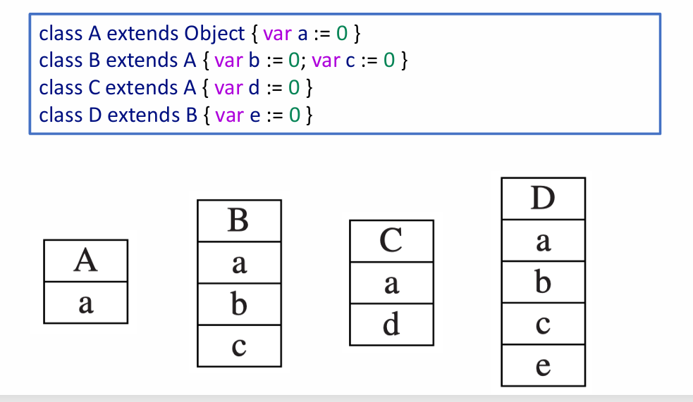

# Chapter 14: Object Oriented Languages

## 14.1 Overview

面向对象语言在编译中存在一些特定的挑战与特性：

- **信息隐藏与封装 (Information hiding / Encapsulation)：** 模块提供特定类型的值，但该类型的内部表示仅对模块可见 。客户端只能通过模块提供的方法（操作）来处理这些对象（值） 。
- **扩展与继承 (Extension / Inheritance)：** 如果某个程序上下文（如函数或方法的形参）期望一个支持 `m1, m2, m3` 方法的对象，那么它同样能接受一个支持 `m1, m2, m3, m4` 的对象 。

## **14.2 类与对象 Classes**

为了演示面向对象的编译，课程扩展了 Tiger 语言，引入了 **Object-Tiger**：

- **类声明：** 语法形如 `class B extends A { ... }`，声明一个继承自 A 的新类 B 。
- **继承机制：** 类 A 的所有字段和方法隐式地属于类 B 。类 B 可以重写（Override）A 中的方法（参数和返回值类型必须完全一致），但字段不允许被重写 。
- **基础类：** 存在一个预定义的、没有字段和方法的 `Object` 类 。
- **隐式参数：** 类 B 中的每个方法都有一个隐式的形参 `self`，类型为 B，它会在每个方法中自动绑定 。
- **对象操作表达式：** 使用 `new B` 创建类型 B 的新对象；使用 `b.x` 访问对象 b 的字段 x；使用 `b.f(x,y)` 调用对象 b 的方法 f 。

编译时的一个核心难点在于：当执行诸如 `v.position` 的字段获取，或者执行 `v.move()` 的方法调用时，如果变量 `v` 的声明类型是父类（例如 `Vehicle`），它在运行时可能指向子类（如 `Car` 或 `Truck`）的实例，编译器需要知道如何准确地在内存中定位字段和方法 。

## **14.3 单继承中的数据字段 Single Inheritance of Data Fields**

在单继承语言中，每个类只继承一个父类 。

- **前缀化内存布局 (Prefixing)：** 如果类 B 继承自类 A，那么在类 B 的对象记录（record）中，继承自 A 的字段将被放置在内存的最前面，且顺序与 A 中完全一致 。类 B 中新定义的、非继承的字段将被附加在这些字段之后 。
    
    
    
- **优势：** 这种布局保证了无论对象在运行时是父类还是子类，父类字段在内存中的相对偏移量（Offset）是固定不变的，从而使得字段的获取变得非常高效。

## **14.4 方法的编译与分发 Methods**

方法实例在编译时与普通函数非常相似，会被转换为存放在指令空间特定地址的机器码（例如 `Truck_move` 的入口点对应机器码标签） 。每个类描述符（Class Descriptor）包含一个指向其父类的指针，以及一个方法实例列表 。

**1. 静态方法 (Static Methods)**

- 静态方法不能被子类重写，其调用的目标在**编译时**即可确定 。
- 编译 `c.f()` 时，编译器从 `c` 的声明类开始向父类逐级查找方法 `f`。找到后，直接编译为对应标签（如 `A_f`）的函数调用 。

**2. 动态方法 (Dynamic Methods)**

- 动态方法可能在子类中被重写，因此编译时无法确定最终调用的是父类的方法还是子类的方法 。
- **方法表 (Method Table / Vtable)：** 类描述符必须包含一个向量（方法表），记录每个非静态方法的实例地址 。当 B 继承 A 时，B 的方法表开头包含 A 已知的所有方法，随后是 B 新声明的方法；如果 B 重写了 A 的方法，则在对应位置替换为 B 的方法地址 。
- **执行步骤：** 当执行动态方法 `c.f()` 时，编译后的代码需要执行三条指令：
    1. 从对象 `c` 的偏移量 0 处获取其类描述符 `d` 。
    2. 从描述符 `d` 中预先固定的方法 `f` 偏移量处，获取方法实例指针 `p` 。
    3. 保存返回地址并跳转到地址 `p`（即调用 `p`） 。

## **14.5 多继承 Multiple Inheritance**

在允许多继承的语言（如类 D 继承 A、B 和 C）中，寻找字段偏移量和方法实例变得极其困难，因为不可能将 A、B、C 的字段同时放在 D 内存的最前面 。

**解决方案 1：全局图着色算法 (Global Graph Coloring)**

- 在静态（链接时）一次性分析所有类，为每个字段名分配一个固定的偏移量（将其转化为图着色问题：节点为字段名，同一类中并存的字段之间连边） 。

- **缺点：** 这种方法会在对象的内存中留下大量的空槽（浪费空间） 。
- **改进：** 压缩对象的字段，但让类描述符记录每个字段的具体位置 。代价是每次数据读写需要额外的三步寻址指令（对象获取描述符指针 -> 描述符获取字段偏移量 -> 读写数据） 。该算法也适用于方法查找 。
- **缺陷：** 图着色只能在链接时完成，无法适应支持动态加载新类和增量链接的面向对象系统 。

**解决方案 2：哈希表 (Hashing)**

- 在每个类描述符中放置一个哈希表，将字段名映射到偏移量，将方法名映射到方法实例 。
- 这种方法与分离编译和动态链接兼容性良好 。获取字段时，需要通过哈希值查询并进行碰撞检测，找到匹配的字段偏移量后再去内存提取内容 。

## **14.6 测试类成员关系 Testing Class Membership**

面向对象语言通常允许在运行时测试对象是否属于某个类（例如 Java 中的 `instanceof` 或 Modula-3 中的 `ISTYPE`） 。

**1. 基础实现 (遍历法)**

- 通过循环不断读取当前对象描述符的 `super`（父类指针），直到匹配目标类，或者遇到 `nil`（失败），这种方法在继承层级深时速度较慢 。

**2. 快速实现 (Display 数组)**

- **Display 机制：** 假设类嵌套深度存在上限（如20），则在类描述符中预留一个 20 个字的块 `display` 。如果类 D 的深度为 `j`，则 `display[j] = D`，`display[j-1] = D.super`，以此类推 。
- **高效判断：** 判定 `x instanceof D` 时，只需从对象 `x` 中获取描述符，查看其第 `j` 个槽位是否与类 D 的描述符一致即可，这能在 O(1) 的时间内完成 。

**3. 类型强制转换 (Type Coercions) 与 Typecase**

- 将子类赋值给父类是合法且安全的 。但反向操作（向下转型）是不安全的，除非运行时对象确实是该子类的实例 。
- Java 和 Modula-3 等语言在向下转型时会伴随运行时的类型检查，失败则抛出异常（而 C++ 的 `static_cast` 则没有运行时检查，存在安全隐患） 。
- Modula-3 提供了 `TYPECASE` 语法用于优雅地处理分支转型，编译器会将其直接转换为带有实例测试和缩窄转换的 `else-if` 链 。

## **14.7 私有字段与方法 Private Fields and Methods**

- 真正的面向对象语言可以保护对象的字段免受外部直接操作 。
- **私有字段/方法：** 无法在对象外部声明的函数或方法中被获取、更新或调用 。
- **实现机制：** 这种隐私性**纯粹是静态的**，由编译器的类型检查阶段强制执行 。在类的符号表中，每个字段和方法偏移量旁边都会带有一个布尔标志（Boolean flag），用于指示其是否为私有成员 。如果在不合法的作用域尝试访问，编译器会直接报错拦截。