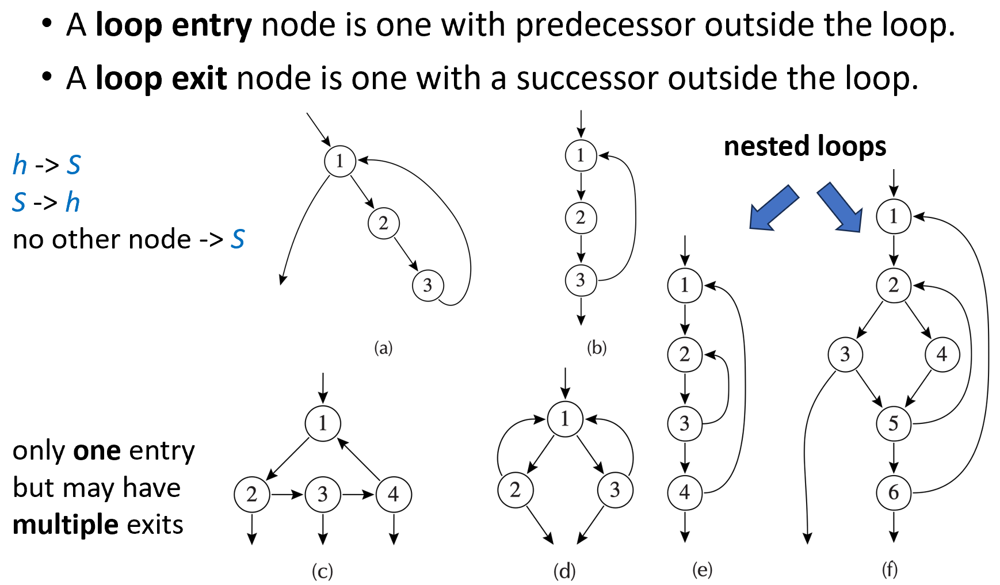

# Chapter 18: Loop Optimizations

## 18.1 Background

1. **循环的定义**
    
    在控制流图中，循环是指一个节点集合 S，其中包含一个头节点 h (header)，并且必须满足以下三个性质 ：  
    
    - 从集合 S 中的任何一个节点出发，都存在一条由有向边组成的路径指向头节点 h 。
    - 从头节点 h 出发，存在路径可以到达集合 S 中的任何一个节点 。
    - 除了头节点 h 之外，不存在任何从集合 S 外部的节点指向 S 内部节点的边（即 h 是唯一入口） 。
2. **为什么要进行循环优化？**
    - **帕累托法则 (Pareto Principle)：** 计算机程序在运行过程中，通常会有“80% 的时间消耗在仅仅 20% 的代码上”这一规律 。这 20% 的核心代码往往就是循环体 。
3. **常见的循环优化技术：**
    - **代码外提 (Hoisting / Code Motion)：** 将循环内部每次迭代都不变的部分移出循环 。
    - **强度削弱 (Strength Reduction)：** 用执行代价较低的运算替换代价较高的运算（例如用加法替换乘法） 。
    - **循环展开 (Loop Unrolling)：** 减少循环控制的开销，并暴露出更多的指令级并行性 。
4. **循环的结构**
    - **循环入口节点 (Loop entry node)：** 指存在来自循环外部的前驱节点的节点（通常即为头节点） 。
    - **循环出口节点 (Loop exit node)：** 指存在指向循环外部的后继节点的节点 。
    - 一个循环只能有一个入口节点（即头节点），但可以有多个出口节点 。
    
    
    

## 18.2 支配节点 Dominators

### 18.2.1 支配节点的定义与计算

- **作用：** 为了在控制流图中优化循环，我们首先需要识别出循环的位置，而“支配节点”这一概念正是为此目的而引入的 。
- **定义：** 如果从控制流图的起始节点 $s_0$ 到节点 $n$ 的每一条可能路径都必须经过节点 $d$，我们就称节点 $d$ 支配节点 $n$ 。
- **基本性质：**
    - 每个节点都支配它自己 。
    - 一个节点 $n$ 可以有多个支配节点 。
- **求解算法：** 采用数据流分析中的迭代求解法 。
    - 初始状态：起始节点的支配集只包含它自身，即 $D[s_0] = \{s_0\}$ 。
    - 对于所有其他节点 $n \neq s_0$，初始化其支配集 $D[n]$ 为图中所有节点的集合 。
    - 迭代方程：节点 $n$ 的支配集等于它自身，并上其所有前驱节点 $p$ 支配集的交集。
    $D[n] = \{n\} \cup \left(\bigcap_{p \in pred[n]} D[p]\right)$

### 18.2.2 直接支配节点 Immediate Dominators

- **定理：** 在一个连通图中，如果节点 $d$ 支配节点 $n$，并且节点 $e$ 也支配节点 $n$，那么必然存在严格的线性关系：要么 $d$ 支配 $e$，要么 $e$ 支配 $d$ 。
- **直接支配节点的定义：** 对于控制流图中的每个节点 $n$（除起始节点 $s_0$ 外），都有且仅有一个“直接支配节点”，记为 $idom(n)$，它满足以下条件 ：
    - $idom(n)$ 不能是节点 $n$ 自身 。
    - $idom(n)$ 必须支配节点 $n$ 。
    - $idom(n)$ 不支配节点 $n$ 的任何其他支配节点（即在支配 $n$ 的所有节点中， $idom(n)$ 是“距离 $n$ 最近”的那个） 。

### 18.2.3 支配树 Dominator Tree

- **构建方法：** 绘制一个包含控制流图中所有节点的图，对于图中的每个节点 $n$，添加一条从 $idom(n)$ 指向 $n$ 的有向边 。
- **性质：** 因为每个节点只有一个 $idom$，所以这种构造方式必然会生成一棵树结构 。

图：(b) 是控制流图 (a) 对应的支配树 

## 18.3 循环的识别与嵌套结构

### 18.3.1 自然循环 Natural Loops

- **单入口的重要性：** 在编译器优化中，我们特别关注只有一个入口节点的循环，因为这样可以确保在每次循环迭代开始前，某些初始条件必定成立，从而极大地简化了优化过程 。这也是引入“自然循环”概念的动机 。
- **回边 (Back edge)：** 如果控制流图中的一条边 $n \to h$，其目标节点 $h$ 支配了源节点 $n$，这条边就被称为回边 。
- **自然循环的定义：** 一条回边 $n \to h$ 对应的自然循环包含特定的节点集合 $x$，这些节点满足：节点 $h$ 支配节点 $x$，并且存在一条从 $x$ 到 $n$ 的路径，且该路径不经过头节点 $h$ 。这里的节点 $h$ 就是该自然循环的头节点 。

### 18.3.2 嵌套循环 Nested Loops

- **定义：** 假设有两个循环 A 和 B，它们的头节点分别为 $a$ 和 $b$。如果 $a \neq b$，且节点 $b$ 属于循环 A，同时循环 B 的所有节点都是循环 A 节点的真子集，那么我们就称循环 B 嵌套在循环 A 内部，或者称 B 是内层循环 。

### 18.3.3 循环嵌套树 Loop-Nest Tree

- 构建步骤 ：
    - 计算控制流图的支配节点 。
    - 构建支配树 。
    - 找出所有的自然循环，并确定所有的循环头节点 。
    - 合并循环：对于每个头节点 $h$，将其所有的自然循环合并为一个整体循环 $loop[h]$ 。
    - 构建树结构：如果头节点 $h2$ 存在于 $loop[h1]$ 中，则在树中 $h1$ 位于 $h2$ 的上方（作为父节点） 。
- **伪循环 (Pseudo-loop)：** 可以将整个过程体（Procedure body）看作是一个伪循环，它位于循环嵌套树的根节点位置 。

### 18.3.4 循环前置节点 Loop Preheader

- **目的：** 许多循环优化操作（如代码外提）需要在循环真正开始执行之前插入一些语句 。
- **构造方法：**
    - 在循环头节点之前创建一个初始为空的新节点 $p$（即前置节点） 。
    - 将循环外部指向循环头节点 $h$ 的所有边 $y \to h$ 重定向，使其指向前置节点 $p$ 。
    - 添加一条从 $p$ 指向 $h$ 的边，从而安全地在 $p$ 中插入需要外提的优化代码 。

## 18.4 循环不变量计算与代码外提 Loop-Invariant Computations & Hoisting

- **基本思想：** 如果循环中包含一条赋值语句 $t \leftarrow a \text{ op } b$，且每次循环迭代时 $a$ 和 $b$ 的值都保持不变，那么计算结果 $t$ 的值显然也是不变的 。  将这种重复且不变的计算移出循环（外提），以节省计算资源 。
- **难点：**编译器如何判定 $a$ 或 $b$ 在每次迭代中是不变的？

### 18.4.1 循环不变量的定义

- 一条定值语句 $d: t \leftarrow a_1 \text{ op } a_2$ 中，操作数 $a_i$ 被认为是循环不变量，必须满足以下三个条件之一 ：
    - $a_i$ 是一个常量 。
    - 所有能够到达语句 $d$ 的关于 $a_i$ 的定值（定义），都位于循环的外部 。
    - 到达语句 $d$ 的关于 $a_i$ 的定值只有一个，并且该定值语句本身也是循环不变量 。
- **判定算法：** 使用迭代算法遍历循环体中的所有指令，不断标记满足上述条件的循环不变量 。

### 18.4.2 代码外提的安全性条件

确定了循环不变量 $d: t \leftarrow a \text{ op } b$ 后，能否安全地将其外提到循环前置节点？必须严格满足以下所有条件（否则会导致错误优化）：

1. **节点** $d$ **必须支配所有** $t$ **为活跃输出 (live-out) 的循环出口节点。**
    
    反例分析 (b)： 如果 $d$ 存在于某个分支中（如 `if` 语句内），它可能不会在每次循环退出时都被执行。贸然外提会导致它必定执行，若该定值未被预期执行，则逻辑出错 。  
    
2. **在循环内部，变量** $t$ **只能有一个定值。**
    
    反例分析 (c)： 如果循环内有多处修改了变量 $t$ 的值，外提其中一个定值会破坏程序的正常覆盖逻辑 。  
    
3. **变量** $t$ **在循环前置节点不能是活跃输出 (live-out)。**
    
    反例分析 (d)： 这意味着在循环内部，在定值 $d$ 发生之前，不能存在对变量 $t$ 的使用。如果存在“先使用，后定值”的情况，外提会改变变量使用的初始值 。  
    

### 18.4.3 隐式副作用与 while 循环的特殊处理

- **While 循环的结构劣势：** 代码外提的第一条规则（ $d$ 必须支配循环出口节点）通常会阻碍大量的优化。这是因为在 `while` 循环中，出口判定（条件检查）往往位于循环的头节点，循环体内部的语句无法支配这个位于头节点的出口判定 。
- **解决思路：** 现代编译器通常会在后端将 `while` 循环转换为 `repeat-until`（或者 `do-while`）的形式。这种转换将条件判断移动到循环底部，使得循环体内的计算能够支配出口节点，从而满足外提条件，激活更多的优化潜力 。

