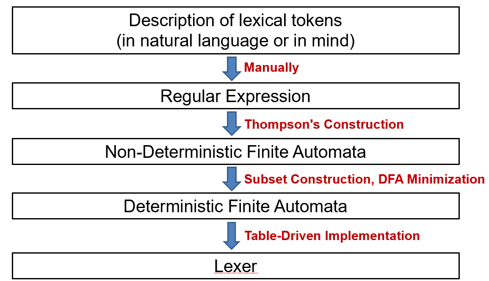

# Chapter 2: Lexical Analysis 词法分析



## 2.1 Lexical Token 词法记号

1. **定义**：词法记号是一个字符序列，是编程语言语法中的一个基本单元（例如终结符）。
2. **分类**：Token 可以分为有限的几种类型。
    - **标识符（ID）**：如 `foo`、`n14` 等。
    - **数字（NUM / REAL）**：如 `73`、`66.1.5`、`1e67` 等。
    - **保留字**：如 `IF`、`VOID`、`RETURN` 等。
    - **标点符号**：如逗号 `COMMA`、左括号 `LPAREN`、不等于 `NOTEQ`等。
    - **非记号（Non-tokens）**：有些内容不属于记号，例如注释（`/* comment */`）、预处理指令（`#include`、`#define`）、宏，以及空格、制表符和换行符。
3. 部分 Token 有附加的语义值，例如标识符。
    
    
    

## 2.2 Regular Expression

1. **语言（Language）**：一个可能无限的字符串集合。字符串（String）是有限字母表中的符号（Symbol）组成的有限序列。
2. **正则表达式的基本组成**
    - **普通字符**：代表其自身（如 `a`）。
    - $\epsilon$：仅包含空字符串的语言。
    - **M | N（Alternation）**：表示 M 或 N。
    - **M · N（Concatenation）**：表示 N 紧随 M 之后。
    - **M*（Kleene Closure）**：表示 M 出现零次或多次的连接。
3. **正则表达式的扩展缩写**
    - **M+**：表示 M 出现一次或多次的连接。
    - **M?**：表示 M 出现零次或一次 ，即 （M | $\epsilon$）。
    - **[abcd]**：字符集选择 ，表示 ( a | b | c | d )。
    - **[a-z]**：字符集选择 ，表示 a-z 的任意单个字符。
    - **.（句点）**：代表除换行符外的任意单个字符。
    - **“”**：引号内部的字符串保持其字面量进行匹配。
4. **书写说明**
    - 连接符号和 $\epsilon$ 符号可以省略，例如 (a |) 与 (a | $\epsilon$ ) 等价。
    - 结合性：Kleene Closure > Concatenation > Alternation
5. **消歧义规则（Disambiguation Rules）**
    - **最长匹配原则（Longest match）**：选取能匹配任意正则表达式的最长初始子串作为下一个 Token。
    - **规则优先级（Rule priority）**：对于特定的最长初始子串，第一个能匹配的正则表达式决定了它的 Token 类型（因此书写正则表达式的顺序非常重要）。例如，`if8` 会根据最长匹配原则被识别为标识符，而单纯的 `if` 会根据规则优先级被识别为保留字。

## 2.3 Deterministic Finite Automata

1. **由 Token 构造 DFA**
    - 列出 Token 及其正则表达式
        
        
        
    - 由正则表达式为各 Token 构造 DFA
        
        
        
    - 使用手工特定尝试法（Ad Hoc Method）合并上述 DFA，合成一个能识别上述全部 Token 的 DFA
        
        
        
2. **由 DFA 转化为 Lexer**
    
    基本思路：**Table-Driven Implementation**（DFA 类似于图，可以使用矩阵—— **Transition Matrix** 表示状态转移）。包含以下数据结构：
    
    - **转移矩阵 `trans_table[N_states][N_characters]`**：
        - 存储状态转移关系。
        - 行代表自动机的当前状态，列代表输入的字符，单元格内容代表下一个目标状态。
        - 如果从状态 `s` 读入字符 `c` 没有定义的转移，填入一个特殊的“死状态”（Dead State，常用数字 0 表示，死状态的下一状态永远是死状态）。
    - **接受状态表 `is_final[N_states]`**：
        - 一个布尔数组或映射表，记录哪些状态是“接受状态”（Final States）。
    - **动作映射表**：
        - 当进入某个接受状态时，记录该状态对应哪种 Token 类型（如 `ID`、`NUM`、`IF` 等）。
        - 接受状态表与动作映射表可以合为一张表。
    
    为识别最长匹配，需要维护两个关键变量来记录“最后一次成功的匹配”：
    
    - **Last-Final（最后终态）**：
        - 记录最近一次进入的接受状态（Final State）的状态编号。
        - 作用：一旦后续匹配失败（匹配失败的标志：被死状态接受），它告诉 Lexer 应该回退到哪一个合法的 Token。
    - **Input-Position-at-Last-Final（最后终态对应的输入位置 ）**：
        - 记录进入上述“最后终态”时，输入指针所指向的位置。
        - 作用：标记当前识别到的合法 Token 在哪里结束。

## 2.4 Nondeterministic Finite Automata

1. **NFA 与 DFA 的区别**
    - NFA 在相同状态在相同输入下允许有多个下一状态
    - NFA 可以不接受输入而跳转到下一状态
2. **由正则表达式构造 NFA：Thompson’s Construction**
    
    
    
3. **由 NFA 构造 DFA 的第一步：子集构造法**（Subset Construction）
    - 核心思想：用 DFA 的一个状态来表示 NFA 状态的一个集合。
    - 核心概念
        - $\epsilon$ **- 闭包**：对于 NFA 状态集合 S，其 $\epsilon$ - 闭包是指：从 S 中的状态出发，仅通过 $\epsilon$ 边（不消耗任何输入字符）所能到达的所有状态的集合。
        - **DFA 边转移函数（DFAedge）**：
            
            假设 d 是 DFA 的一个状态（对应 NFA 状态的一个集合），对于输入字符 c：
            $DFAedge(d, c) = \text{closure}(\text{move}(d, c))$
            即：先找到从集合 d 出发接收字符 c 能直接到达的所有 NFA 状态，再对结果取 $\epsilon$ - 闭包。
            
    - 算法流程
        - **初始化**：计算 NFA 起始状态的 $\epsilon$ - 闭包，将其作为 DFA 的起始状态 $D_1$。
        - **迭代查询**：对于每一个已经发现的 DFA 状态 $D_i$ 和字母表中的每一个字符 c：
            - 计算 $T = DFAedge(D_i, c)$。
            - 如果 T 是一个全新的集合，则将其作为一个新的 DFA 状态加入.
            - 在 DFA 的转移表中记录：从 $D_i$ 接收 c 跳转到 T.
        - **终止条件**：直到没有新的 DFA 状态（NFA 状态子集）产生为止。
        - **确定接受状态**：如果一个 DFA 状态包含原 NFA 中的任何一个接受状态，则该 DFA 状态也是接受状态。
4. **由 NFA 构造 DFA 的第二步：合并冗余状态**（DFA Minimization）
    - **等价性：**两个状态 s 和 t 是等价的，即从 s 出发能识别的所有字符串集合，与从 t 出发能识别的字符串集合完全相同。
    - 算法流程
        - **初始划分（Initial Partition）**：
            - 将所有 DFA 状态分为两个组：接受状态组（Final）和非接受状态组（Non-final）。
            - 这是因为接受状态和非接受状态在逻辑上显然是不等价的。
        - **迭代细化（Refinement）**：
            - 对于当前的每一个状态组 G：
            - 检查组内的状态 s 和 t。如果对于某个输入字符 c，状态 s 跳转到了组 $G_1$，而状态 t 跳转到了不同的组 $G_2$，说明 s 和 t 的行为不一致，将 s 和 t 拆分到不同的新组中。
        - **终止条件**：
            - 重复上述拆分过程，直到没有任何一个组可以再被拆分为止（即组内所有状态对于所有字符的跳转目标都落在同一个组内）。
        - **状态合并**：
            - 每个最终形成的组代表最小化 DFA 中的一个单一状态。

## 2.5 Lex: A Lexival Analyzer Generator

1. Lex 是一个词法分析器生成器，程序员只需在输入文件中通过正则表达式描述词法规则，Lex 就能自动生成高效的 C 语言词法分析代码，而无需手动编写复杂的 DFA 状态转换逻辑。
2. Lex 的输入文件（.l）的格式：
    
    ```python
    { 定义 (definitions) }
    %%
    { 规则 (rules) }
    %%
    { 辅助例程 (auxiliary routines) }
    ```
    
    - 第一部分：定义（Definitions）
        - 任何必须插入到函数外部的 C 代码都应出现在此部分，并位于分隔符 `%{` 和 `%}` 之间。
        - 记号（Token）的类型名称必须在此部分定义。
        - 定义部分出现在第一个 `%%` 之前。
    - 第二部分：规则（Rules）
        - 这部分由一系列正则表达式组成，每个正则表达式后跟一段 C 代码。当对应的正则表达式被匹配时，该 C 代码将被执行。
        - 在第二部分中调用的例程若未在其他地方定义，则应放在第三部分。
    - 第三部分：辅助例程（Auxiliary routines）
        - 此部分包含用户自定义的函数支持。