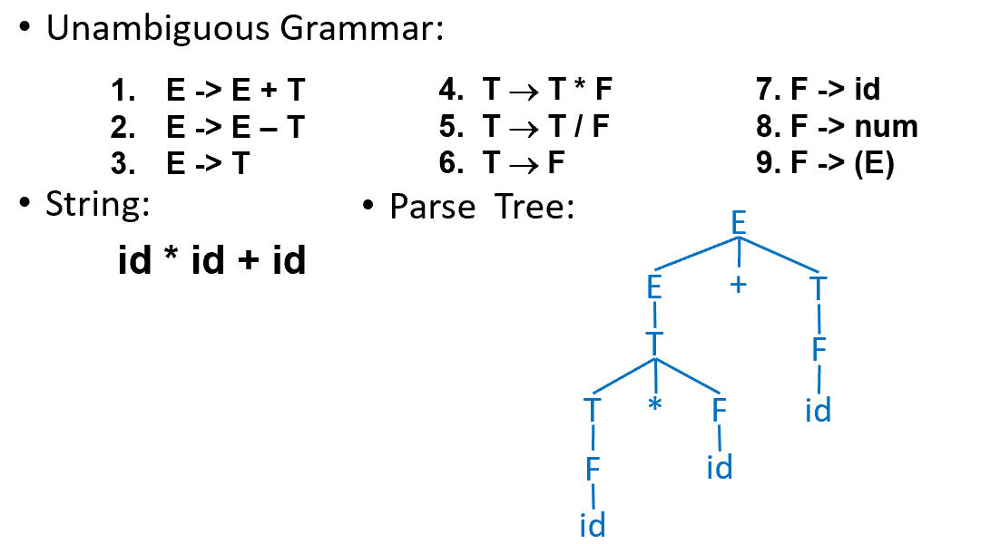

# Chapter 3-1: Parsing 语法分析

## 3.1 上下文无关语法

1. 语法（Syntax）是将 Token 组合在一起形成语句的方式，可以使用上下文无关语法（CFG）对编程语言的语法进行描述。
2. **上下文无关语法的构成**
    - 终结符集合 T：由词法记号（Lexical Tokens）组成
    - 非终结符集合 N
    - 一个开始符号 S，其中 $S\in N$
    - 一组推导规则（Productions/Rules），形如：
        
        $X\rightarrow Y_1Y_2…Y_k$，其中 $X\in N,\ Y_i\in N\cup T\cup\{\epsilon\}$
        
3. **推导过程与最左/最右推导**
    - 推导过程可以使用语法分析树（Parse Tree）描述。
    - 最左/最右推导（Leftmost/Rightmost Derivation）：在每一个推导步骤中，对最左侧/最右侧的非终结符运用规则。
    - 对语法分析树的叶子节点进行中序遍历（In-order Traversal，左-中-右），可还原得到原始输入。
4. **冲突（Ambiguity）**
    - 在无冲突情况下，最左与最右推导可得到相同的语法树。
    - 若同一字符串可以推导得到两棵不同的语法树，则称该语法是冲突的。含有语法冲突的语言不适合作为编程语言。
    - 为消除冲突，需要满足以下要求：
        - 结合性（Precedence）：又称优先级，例如乘法的结合性比加法更强。
        - 左关联（Left-Association）：例如 1 - 2 - 3 应解析为 (1 - 2) - 3，而非 1 - (2 - 3)。
    - 为消除冲突，可以引入新的非终结符，使用以下策略：
        - 为满足结合性要求，优先级较高的运算符要么不出现，要么只能稍后派生。
        - 为满足左关联要求，可以使用左递归（推导式右侧的第一个符号与左侧的符号相同）。
        
        
        
    
    <aside>
    💡
    
    使用左递归（Left-Recursion）可以满足左关联要求（Left-Association），但使用左递归无法满足 LL(1) 要求，需要继续进行语法变换。
    
    </aside>
    
5. **文件结束符（EOF）**
    - 使用美元符号 $ 表示文件结束符。
    - 实现方案：
        
        
        

## 3.2 自顶向下解析的相关概念

1. 语法解析器（Parser）是基于上下文无关语法构造的。
2. **自顶向下解析**（Top-Down Parsing）：从语法的根节点（开始符号）开始，试图推导出与输入字符串匹配的叶子节点（终结符）
3. **递归下降解析**（Recursive Descent Parsing）：自顶向下解析的一种代码实现手段，为文法中的每个非终结符编写一个对应的递归函数。通过函数之间的互相调用来模拟推导过程。
4. **预测解析**（Predictive Parsing）：递归下降解析的一种类型，特点是高效且不回溯。仅适用于 LL(k) 文法。在解析过程中，程序能够根据扫描到的前 k 个终结符，“预见性”地准确选择唯一的产生式。
5. **LL(k) 文法**
    - **定义**：一种特殊的上下文无关文法（CFG），满足：通过只看 k 个终结符，就能唯一确定将要应用的产生式。
    - **含义**：**L**eft-to-Right Parse，**L**eftmost Derivation，**k** Symbol Lookahead
    - 如果文法有左递归或二义性，它就不满足 LL(1)，无法用简单的预测解析来实现。

## 3.3 LL(k) 解析

1. **语法变换——消除左递归（Eliminate Left-Recursion）**
    - 左递归可能导致无限循环，不满足 LL(1)。
        
        预测解析（如递归下降）的工作方式是：为了识别一个非终结符 T，它会调用对应 T 的函数。如果文法中存在左递归规则 $T \rightarrow T+E$：
        
        - 解析器为了解析 T，首先调用函数 `T()`。
        - 进入 `T()` 后，根据产生式的第一项，它发现又需要解析一个 T。于是它再次调用 `T()`。
        - 这个过程会无限重复，而此时解析器甚至还没有机会读取输入流中的任何一个字符。
    - 解决方案：将左递归变为右递归。
        
        
        
2. **语法变换——提取左公因子（Left Factoring）**
    - 当一个非终结符的多个产生式以相同的符号串开头时，预测解析器在看到这个开头符号时，无法确定该选哪条路径，不满足 LL(1)。
        
        > **示例：**
        > 
        > 
        > $S \to \text{if } E \text{ then } S \text{ else } S$
        > 
        > $S \to \text{if } E \text{ then } S$
        > 
        > 当读到输入符号 `if` 时，解析器发现这两条规则都符合！它不知道后面到底有没有 `else` ，在解析时会发生冲突。
        > 
    - 解决方案：提取左公因式
        
        
        
3. **准备工作——计算 FIRST / FOLLOW / NULLABLE 集合**
    - NULLABLE 集合
        - 定义：NULLABLE(X) = True if X ->*𝜀
        - 计算：
            
            
            
    - FIRST 集合
        - 定义：FIRST(𝛾): if 𝛾 ->* t𝛽, then t ∈ First(𝛾)
        - 计算：
            
            
            
    - FOLLOW 集合
        - 定义：if S ->* 𝛽Xt𝛿, then t ∈ Follow(X)
        - 计算：
            
            
            
    - FIRST / FOLLOW / NULLABLE 集合的计算机解法
        
        
        
4. **准备工作——计算预测解析表（Predictive Parsing Table）**
    - 预测解析表的结构
        - 行（Row）：每行对应一个非终结符 X
        - 列（Cow）：每列对应一个终结符 T
        - 单元格：行 X 列 T 的单元格记录了在对非终结符 X 进行解展开时，若读取到终结符 T 时应当应用的规则。
    - 预测解析表的填充规则
        
        在行 X 列 T 的单元格填充规则 $X\rightarrow \gamma$ 的两种情况：
        
        - $T\in First(\gamma)$
        - $Nullable(\gamma)=True$，且 $T\in Follow(X)$
    - 预测解析表的同一个格子里若出现两个产生式，则说明该语法不满足 LL(1)。
    - 在 LL(k) 语法的预测解析表中，每列对应长度为 k 的终结符序列，所有可能出现的长度为 k 的终结符序列都要有对应的列。
    
    
    
5. **解析过程——基于栈的实现**
    
    预测解析器通常维护一个栈。
    
    - **初始化：** 栈中压入栈底符 $ 和文法开始符号 S。
    - **匹配：** 如果栈顶是终结符且与输入符号匹配，则将其弹出栈。
    - **展开：** 如果栈顶是非终结符 A，输入符号为 a，则查预测解析表 M[A, a]。
        - 如果有对应产生式 $A \to XYZ$（X，Y，Z 可为终结符或非终结符），则将 A 弹出，并按反序压入 Z，Y，X（保证 X 在栈顶）。
        - 如果有空产生式 $A \to \epsilon$，则直接弹出 A。
    - **结束：** 当栈空且输入也处理完毕时，解析成功。
    
    <aside>
    💡
    
    - 栈底是栈的最内侧，栈顶是栈的最外侧。插入和删除仅能在栈顶进行。
    - 若栈顶为终结符，则表示正在尝试对该终结符进行匹配。
    - 若栈顶为非终结符，则表示正在尝试对该非终结符进行解展开。
    </aside>
    
    > **示例：**
    > 
    > 
    > 
    > 
6. **解析过程——错误恢复（Error Recovery）**
    - 在查找预测解析表中，若对应的表项为空白，则说明出现语法错误（Syntax Error）。
    - 错误处理方式：
        - 法一：抛出异常，并退出解析。
        - 法二：打印错误信息，并从错误中恢复。这种方式旨在尽可能多地发现后续错误，提高开发效率。
    - 错误恢复方式：
        - 替换/插入 Token：假设正确的 Token 存在，并按假设继续执行。这种方式可能会导致程序无法停止，这是因为如果替换/插入逻辑写得不好，解析器可能会在同一个位置不断插入同一个 Token。
        - 删除 Token：不断跳过后续的 Token，直到读取到一个属于 FOLLOW(A) 集合的 Token（假设我们正在对非终结符 A 进行解析）。此时，我们认为 A 的解析已经“强行完成”，从栈中弹出 A 并继续后续解析。这种方式更安全，程序读到 EOF 会自动停止，不会产生死循环。