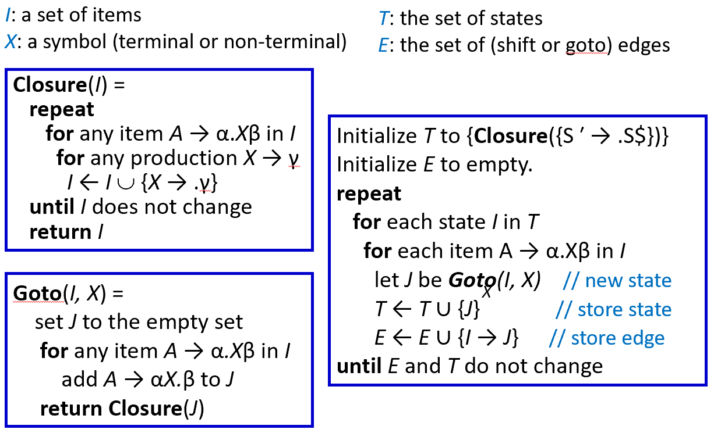

# Chapter 3-2: Parsing 语法分析

## 3.4 自底向上解析的相关概念

1. **自底向上解析**（Bottom-Up Parsing）：从解析树的叶子节点（底部）开始，逐步向根节点（顶部）构建解析树，将输入字符串“归约（Reduce）”回文法的起始符号。
2. **LR(k) 文法**
    - LR(k) 解析是最普遍的解析方法，比 LL(k) 解析更强大，它能推迟解析决策，直到看到对应于整个产生式右部的输入 Tokens。
    - **核心：**移进（Shift）与规约（Reduce）
        - 移进：读取下一个输入 Token
        - 规约：使用产生式的左部替代右部
    - **含义**：**L**eft-to-Right Parse，**R**ightmost Derivation，**k** Symbol Lookahead

## 3.5 LR(0) 解析

1. **基本概念**
    - LR(0) 是最简单的 LR 解析，它在做移进/归约决策时不需要任何搜索符（Lookahead）。
    - 使用确定性**有限自动机**（DFA）执行推导过程 。
2. **LR(0) 项目（Item）**
    - 含义：使用圆点（.）表示解析器的当前位置。例如 $A \to \alpha.\beta$ 表示解析器已处理 $\alpha$，期望看到 $\beta$ 。
    - 起始项目： $S’\rightarrow. S\$$
3. **LR(0) 自动机构建**
    - **闭包（Closure）：**自动机的状态是由项目组成的集合，通过闭包方法构建。
    - **转换（Goto）：** 定义了在当前状态下接收某个符号（终结符或非终结符）后转换到的新状态 。
    
    
    
4. **LR(0) 解析算法动作**
    
    解析器在执行时会维护一个**状态栈**和**符号栈**（事实上，仅状态栈是必需的），并根据当前状态和输入执行以下动作之一：
    
    - **移进（Shift）**
    当从当前状态 $i$ 出发，经过一个**终结符** $t$ 到达状态 $n$ 时：
        - **动作：** $T[i, t] = sn$
        - **含义：** 将终结符 $t$ 压入符号栈，将状态 $n$ 压入状态栈，转移到状态 $n$。
    - **规约（Reduce）**
    当状态 $i$ 中存在一个**点在最后**的项目（如 $X \rightarrow \beta.$）时：
        - **动作：** $T[i, \text{each terminal}] = rk$
        - **含义：** 将 $\beta$ 弹出符号栈，并将 $X$ 压入符号栈；从状态栈弹出 $|\beta|$ 个状态，并转移到此时状态栈顶所示的状态。
        - **说明：** 使用编号为 $k$ 的产生式进行规约。
    - **跳转（Goto）**
    当从当前状态 $i$ 出发，经过一个**非终结符** $X$ 到达状态 $n$ 时：
        - **动作：** $T[i, X] = gn$
        - **含义：** 将状态 $n$ 压入状态栈，转移到状态 $n$。
        - **说明：**上一步进行规约而转移到状态 $i$ 后，还要继续根据非终结符 $X$ 跳转到状态 $n$。
    - **接受（Accept）**
    当状态 $i$ 中包含结束项目 $S' \rightarrow S.\$$ 时：
        - **动作：** $T[i, \$] = \text{accept}$
    
    
    

## 3.6 SLR 解析

1. **移进-归约冲突（Shift-Reduce Conflict）**
    - 当文法不是 LR(0) 时，解析表在同一单元格内可能同时出现移进和归约动作 。
    
    
    
2. **SLR（Simple LR）解析**
    - 在 LR(0) 中，只要 DFA 处于某一特定状态，就允许进行规约。
    - SLR 进一步缩小了允许规约的范围：只有当下一个输入符号属于产生式左部的 FOLLOW 集时，才允许使用该产生式进行归约动作。
    - SLR 的能力比 LR(0) 更强，可以减少移进-规约冲突，但不能完全避免。

## 3.7 LR(1) 解析

1. LR(1) 在 SLR 的基础上进一步缩小了允许规约的范围，其能力比 SLR 更强，可以进一步减少移进-规约冲突，但不能完全避免。
2. **LR(1) 项目（Item）**
    - LR(1) 在项目（Item）中直接记录搜索符（Lookahead）。
    - 项目格式为 $(A \to \alpha.\beta, x)$，意指下一个输入的符号必须 $\in First(\beta x)$ （$\beta$ 可以为空）
    - 对于规约情形，解析器仅在下一个输入字符恰好为 $x$ 时才允许进行规约。
    - 起始项目： $(S’\rightarrow. S\$,?)$
3. **LR(1) 自动机构建**
    
    
    
    
    
    
    
    

## 3.8 LALR(1) 解析

- LR(1) 的状态数可能非常多，将 LR(1) 自动机中除了 Lookahead 集外其余部分完全相同的状态进行合并，即为 LALR(1) （Look-Ahead LR） 解析。
- 对于一些语法，LALR(1) 的解析表可能会出现规约-规约冲突，即同时存在多条可用于规约的产生式，而 LR(1) 无此问题。
- LALR 常用于现代编程语言，为 Yacc 等工具采用。

## **3.9 文法层级结构**

各类文法之间的包含关系如下 ：

- $LL(0) \le LL(1) \le LL(k)$
- $LL(k) \le LR(k)$
- $LR(0) \le SLR \le LALR(1) \le LR(1) \le LR(k)$

## **3.10 LR 语法分析中的歧义处理**

1. **核心问题：悬空 else（Dangling else）**
    
    `if-then-else` 语句存在天然的语法歧义。
    
    - **歧义语法示例：**
        - $S \rightarrow \text{if } E \text{ then } S \text{ else } S$
        - $S \rightarrow \text{if } E \text{ then } S$
        - $S \rightarrow \text{other}$
    - **歧义表现：**对于输入语句：`if a then if b then s1 else s2`，有两种合法的解析方式：
        - **最近匹配**：`if a then { if b then s1 else s2 }`
        - **强制匹配**：`if a then { if b then s1 } else s2`
        - 编程语言通常以最近匹配为标准。
2. **LR 分析中的“移进-归约”冲突**
    
    当 LR 分析器遇到这类歧义时，会在解析表中产生**冲突（Conflict）**。
    
    - **冲突场景**
        
        假设分析器已经处理了 `if a then if b then s1`，此时栈顶状态可以匹配产生式 $S \rightarrow \text{if } E \text{ then } S$，而下一个输入字符是 `else` 。
        
        - **归约**：将栈顶的 `if b then s1` 立即归约为 $S$。这会导致 `else` 被留给外层的 `if a`。
        - **移进**：将 `else` 压入栈，期望后续匹配内层 `if b` 的 `else` 部分。
        **结论**：在 LR 解析中，通过**优先选择移进**即可解决“悬空 else”问题，使其符合“最近匹配”原则。
3. **消除歧义的两种方案**
    - **方案 A：改写语法（引入辅助非终结符）**
        
        通过将语句分为“已匹配（Matched）”和“未匹配（Unmatched）”两类，从逻辑上强制绑定。
        
        - **M (Matched)**：所有的 `then` 都有对应的 `else`。
            - $M \rightarrow \text{if } E \text{ then } M \text{ else } M \mid \text{other}$
        - **U (Unmatched)**：至少有一个 `then` 后面没有 `else`。
            - $U \rightarrow \text{if } E \text{ then } S$ （最简单的未匹配情况）
            - $U \rightarrow \text{if } E \text{ then } M \text{ else } U$
    - **方案 B：保持语法不变，直接修改解析表**
    这是实践中最常用的方法（如 Yacc/Bison）：不需要改写复杂的语法。当在解析表中发现 `else` 带来的移进-归约冲突时，**人为规定选择“移进”**。