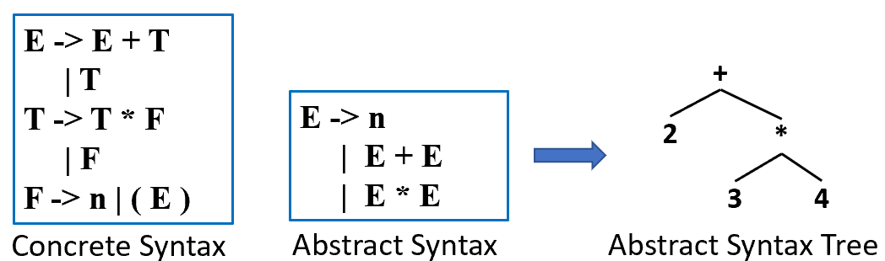

# Chapter 4: Abstract Syntax 抽象语法

## 4.1 语义动作 Semantic Actions

语义动作是指在语法分析过程中执行的有用操作 。

1. **递归下降解析中的语义动作** 
    - **实现方式**：语义动作通常表现为解析函数的**返回值**或产生的**副作用** 。
    - **副作用示例**：
        - 遇到赋值语句 `id := num` 时，将标识符与数值存入查找表。
        - 遇到打印语句 `print(id)` 时，输出该标识符的值 。
    - **类型关联**：文法中的每个终结符和非终结符都会关联一个语义值类型，该类型由编译器的实现语言（如 C 语言）定义 。

**2. Yacc 生成的解析器中的语义动作**

- **实现机制**：
    - Yacc 维护一个与状态栈并行的**语义值栈** 。
    - 当解析器执行归约操作时，会弹出右部符号对应的语义值，执行对应的 C 代码，并将计算结果（`$$`）压入栈中 。
- 在语法树中，语义动作的执行顺序遵循**自底向上、从左到右**的后序遍历（左-右-中）顺序（postorder）。

## 4.2 Abstract Parse Trees

1. **为什么需要 AST？** 
    - **解耦**：将语法分析（Syntax）与语义检查/翻译（Semantics）分离 。
    - **避免“一趟式”编译的缺点**：一趟式编译器（在解析时直接生成代码）难以处理“先使用后定义”的函数调用，且代码难以维护 。
    - **精简信息**：
        - 具体语法树（Concrete Parse Tree）：包含所有记号（如括号 `()`），非常冗余且依赖文法细节 。
        - 抽象语法树（AST）：去除了无用的格式符号，仅保留程序的结构信息，作为前端与后端的清晰接口 。
        
        
        
2. **AST 的数据结构实现** 
    - 在 C 语言中，通常为每个非终结符定义一个 `typedef`，为每个产生式定义一个 `union` 变体 。
    - **示例**：表达式 `E -> E + E | E * E | n`
        - 使用 `enum` 区分表达式类型（加法、乘法、数字） 。
        - 使用 `struct` 存储左右操作数或数值 。
3. **自动构建 AST** 
    
    通过在 Yacc 规则中嵌入构造函数（如 `$$ = A_PlusExp($1, $3);`），可以在解析过程中自动生成 AST 。
    
4. **位置信息嵌入** 
    - **必要性**：当后续阶段（如语义分析）发现错误时，需要准确报告错误在源代码中的位置（行号、列号） 。
    - **实现方法**：
        - **词法分析器**：将每个记号的首尾位置传给解析器 。
        - **AST 节点**：在每个 AST 节点结构中增加一个 `pos` 字段 。