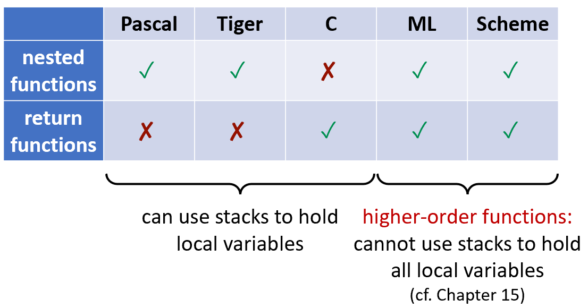

# Chapter 6: Activation Records

## 6.1 内存的存储组织

1. **内存布局**
    
    内存从低到高地址通常被划分为以下几个主要区域 ：
    
    - **代码区（Code）**：存放可执行的目标代码 。
    - **静态区（Static）**：存放编译时就能确定大小的数据对象，例如全局常量和编译器生成的数据（如用于垃圾回收的数据） 。
    - **堆区（Heap）**：用于在程序控制下动态分配和释放的数据（例如 C 语言中的 `malloc` 和 `free`） 。
    - **栈区（Stack）**：存放称为“活动记录”（Activation Records）的数据结构，这些结构在过程（函数）调用时动态生成 。
2. **活动记录与栈帧**
    - 函数调用的行为遵循“后进先出”（LIFO）的模式，因此通常使用控制栈（Control Stack）来管理 。
    - 每次调用函数时，都会为其局部变量在栈上分配空间并压栈 。函数终止时，这些空间会被弹出释放 。
    - 每一个活跃的函数调用都会在控制栈上拥有一个内存块，称为**“活动记录”或“栈帧”（Frame）** 。
    - **栈的生长方向**：从高内存地址开始，向低地址方向生长 。
3. **高阶函数（Higher Order Functions）**
    - **定义：**高阶函数是指满足以下至少一个条件的函数：
        - **接受函数作为参数（Nested Functions）**：例如将一个排序规则函数传递给排序算法。
        - **返回一个函数作为结果（Return Functions）**：函数执行完毕后，生成的不是具体数值，而是一个新的函数。
        
        ```c
        // 函数 f 是一个高阶函数，返回一个函数 g
        fun f(x) =
          let fun g(y) = x + y
          in g
        end
        
        a = f(3)
        b = a(4) // b = 3 + 4
        ```
        
    - **问题：变量逃逸 （Escaping）**
        
        在传统语言（如 C 语言）中，函数的局部变量存储在栈上。当函数 `f` 返回时，它的栈帧会被立即销毁。
        
        然而，高阶函数打破了这个规则：
        
        - 在上面的例子中，当我们调用 `a = f(3)` 时，`f` 已经执行完毕并返回了。
        - 但此时返回的函数 a（即内部的 `g`）在未来被调用时，仍然需要访问 `x` 的值（即 3）。
        - **矛盾点**：如果 `x` 随着 `f` 的栈帧一起销毁了，那么 `h` 在调用时就会找不到 `x`。这种现象被称为**变量逃逸**。
    - 对于支持高阶函数的编程语言，局部变量的生命周期需要比包围它的函数调用时间更长，不能仅仅依靠传统的栈来保存所有的局部变量（不在本章讨论范围之内）。
        
        
        

## 6.2 栈帧的布局


1. **栈指针与帧指针**
    - 栈指针（Stack Pointer, SP）：指向栈的当前位置，区分已分配的栈空间和未分配的垃圾（空）空间 。
        
        
        
    - 帧指针（Frame Pointer, FP）：由于局部变量的大小可能变化，或者帧在栈上并不总是连续的，使用帧指针可以提供一个固定的基准地址来访问当前函数的参数和局部变量 。如果帧大小固定，帧指针有时可以通过栈指针加上帧大小计算得出 。
    - 函数调用时，会将旧栈帧的 FP 存入新栈帧的内存，将新的 FP 设为旧的 SP 值。
2. **栈帧布局**
    
    栈帧包含以下几个部分（从高地址到低地址排布） ：
    
    - **局部变量（Local variables）**：当前函数内部定义的变量 。
    - **返回地址（Return address）**：函数执行完毕后，控制流需要返回到调用者函数内部的地址 。
    - **临时变量与保存的寄存器（Temporaries & Saved registers）**：为其他用途腾出寄存器而保存的值 。
    - **传出参数（Outgoing arguments）**：当前函数准备传递给下一个被调用函数（Callee）的参数。对于下一个被调用函数来说，该字段称为 **传入参数（Incoming arguments）**。
    - **静态链（Static link）**：用于访问外层嵌套函数的局部变量 。
3. **寄存器与参数传递**
    
    由于访问寄存器的速度远快于访问内存，机器通常利用寄存器来优化函数调用 。
    
    - **参数传递约定**：通常规定，函数的前 k 个参数（通常 k = 4 或 6）通过寄存器传递，剩余的参数才通过内存栈传递 。
    - **寄存器保存责任**：
        - 调用者保存（Caller-save）：由调用函数的代码负责在调用前保存该寄存器，并在调用后恢复 。
        - 被调用者保存（Callee-save）：由被调用的函数负责在修改寄存器前保存它，并在返回前恢复 。
    - **优化方案：**
        - 叶子过程（Leaf Procedures）的优化
            - 叶子过程不需要为了保护现场而将传入的参数保存到内存中，从而减少内存读写次数。
            - 叶子过程指不再调用其他任何过程（函数）的过程。
        - 过程间寄存器分配（Interprocedural Register Allocation）
            - 编译器会给不同的过程分配互不冲突的寄存器来接收参数和存放局部变量，从而减少内存读写次数。
        - 死变量（Dead Variable）的处理
            - 假设参数 x 在调用函数 h(z) 的那个时间点之后不再被使用，那么 x 就是一个“死变量”。
            - 既然 x 已经没用了，函数 f(x) 就可以直接覆盖掉存放 x 的寄存器 $r_1$，而不需要先花时间把 $r_1$ 的旧值备份到内存中。
        - 寄存器窗口（Register Windows）
            - 每当一个函数被调用时，硬件会自动为其分配一组“新鲜”的寄存器。调用者和被调用者之间有一部分重叠的寄存器用于传递参数，而其他的则是私有的。
            - 需要额外硬件支持。
4. **返回地址（Return Address）**
    - 返回地址通常为调用函数所在处的下一条指令。
    - 机器通过 `call` 指令发起调用时，会自动将返回地址写入指定寄存器。非叶子的过程必须将该寄存器保存到栈上，除非启用了过程间寄存器分配（Interprocedural Register Allocation）。
5. **逃逸变量（Frame-Resident Variables）**
    
    虽然编译器尽量把局部变量放在寄存器中，但有些变量**必须**被写入到内存的栈帧中。一个变量如果必须保存在内存中，则被称为“逃逸”（Escapes） 。必须写入内存的情况包括：
    
    - 变量通过引用或地址传递（例如 C 语言中的 `&` 操作符） 。
    - 变量被当前函数内部嵌套的其他函数访问 。
    - 变量的值太大，单个寄存器装不下 。
    - 变量是一个数组，提取元素时需要进行地址算术运算 。
    - 局部变量和临时值太多，导致寄存器不够用，产生寄存器“溢出”（Spilled） 。
6. **高阶函数与块结构作用域**
    - 块结构作用域（Block Structure）：在支持函数嵌套定义的语言中，内层函数可能需要访问在外层函数中定义的局部变量 。
    - 块结构作用域的实现：
        - 静态链（Static Link）
            - 每一个函数在调用时，都会随函数参数一同接收一个额外的隐藏指针，即静态链。
            - 静态链指向在函数定义中**直接包围它的那个函数**的最近一次活跃栈帧 的帧指针 FP。
            - 当内层函数需要访问外层变量时，它会沿着静态链进行一系列的解引用查找 。查找所需的“链条长度”（Fetch chain length）正好等于这两个函数在静态嵌套深度上的差值 。
        - 显示表（Display）
            - 静态链在嵌套很深时（比如要爬 5 层链条）效率较低。**Display** 是为了加速访问而设计的“快捷方式数组”。
            - `Display[i]` 总是指向当前活跃的第 i 层函数的栈帧。
            - 无论变量在多深的外层，函数只需要访问 `Display[i]` 就能直接定位到那个栈帧，时间复杂度是 $O(1)$，不需要像静态链那样一层层去数。
        - Lambda Lifting
            - 不依赖特殊的指针或全局数组，而是通过**改写函数签名**来解决问题。把外层函数中定义的局部变量自动转化为内层函数的参数。从而消除对外部环境的依赖，使嵌套函数可以在任何地方独立运行。