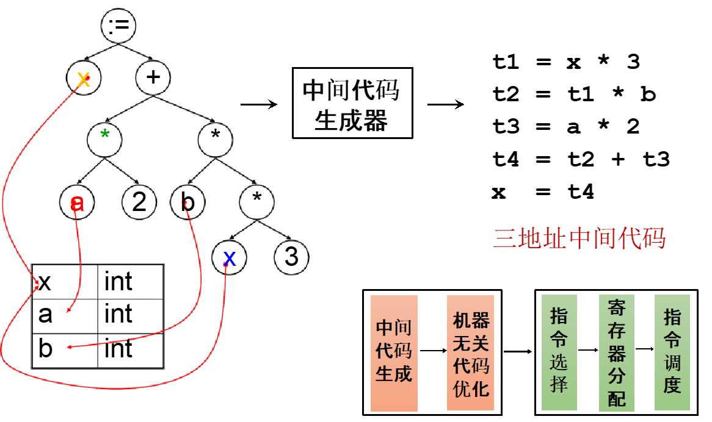

# Chapter 7: Intermediate Code 中间表示

## 7.1 中间表示概述

1. IR 的意义：独立于源语言与目标机器，便于优化和移植。
2. IR 的种类：
    - Three-Address Code（TAC）
    - Static Single-Assignment（SSA）
    - Control-Flow Graph（CFG）
    - Abstract Syntax Tree（AST）
    - Expression Trees（Intermediate Representation Tree，IR Tree）

## 7.2 Three-Address Code 三地址码



1. 特点：每条指令最多只包含三个地址或操作数，基本形式为 `x = y op z`。
2. 没有统一的规范与表示形式。
3. 三地址码之间通常使用数组（Array）或链表进行组织。
4. 每条三地址码通常使用形如 （操作指令，操作数 1，操作数 2，操作数 3）的四元组进行表示。


## 7.3 IR Tree

1. **语句（T_stm）**
    
    **定义：** **没有返回值**；执行时可能会产生副作用。
    
    | **语法** | **说明** |
    | --- | --- |
    | **MOVE(TEMP t, e)** | 计算表达式 e 的值，并将其存入临时变量（寄存器）t 中。 |
    | **MOVE(MEM(** $e_1$**),** $e_2$**)** | 计算 $e_1$ 得到地址 a。计算 $e_2$，并将结果存入从地址 a 开始的 `wordSize` 字节内存中。 |
    | **EXP(e)** | 计算表达式 e 并丢弃结果（仅用于执行 e 可能产生的副作用）。 |
    | **JUMP(e, labs)** | 跳转到地址 e。目的地 e 可以是一个字面标签（如 `NAME(lab)`），也可以是通过表达式计算出的地址。labs 指定了 e 可能跳转到的所有目标位置（用于数据流分析）。 |
    | **CJUMP(o,** $e_1$**,** $e_2$**, t, f)** | 依次计算 $e_1$ 和 $e_2$ 得到值 a 和 b。使用关系运算符 o 比较 a 和 b。如果结果为真，跳转到标签 t；否则跳转到标签 f。 |
    | **SEQ(** $s_1$**,** $s_2$**)** | 语句 $s_1$ 紧接着语句 $s_2$ 执行。 |
    | **LABEL(n)** | 定义名字 n 的常量值为当前机器代码的地址（类似于汇编中的标号）。 |
2. **表达式（T_exp）**
    
    **定义：** 每个表达式都有一个**返回值**；执行时可能会产生副作用。
    
    | **语法** | **说明** |
    | --- | --- |
    | **CONST(i)** | 整数常量 i。 |
    | **NAME(n)** | 符号常量 n（汇编语言标签）。 |
    | **TEMP(t)** | 临时变量 t（类似于真实机器中的寄存器）。 |
    | **BINOP(o,** $e_1$**,** $e_2$**)** | 将二元运算符 o 应用于操作数 $e_1$ 和 $e_2$。
      • **算术运算符：** PLUS, MINUS, MUL, DIV
      • **位运算符：** AND, OR, XOR
      • **逻辑位移：** LSHIFT, RSHIFT
      • **算术右移：** ARSHIFT |
    | **MEM(e)** | 从地址 e 开始的 `wordSize` 字节内存内容。
    **注意：** 当 `MEM` 作为 `MOVE` 的左子节点时表示“存储（Store）”，在其他任何地方都表示“取值（Fetch）”。 |
    | **CALL(f, l)** | 过程调用：将函数 f 应用于参数列表 l。从左到右依次计算参数表达式（运算顺序的不同可能会产生不同的副作用，特此规定）。 |
    | **ESEQ(s, e)** | 首先执行语句 s 以产生副作用，然后计算表达式 e 作为结果返回。 |

## 7.4 Translation into IR Trees

### 7.4.1 Expressions

1. 在将抽象语法树翻译为 IR 时，需要区分表达式的不同特性 ：
    - **Ex（有返回值的表达式）**：适合转换为 `T_exp` 指令 。
    - **Nx（无返回值的表达式）**：适合转换为 `T_stm` 指令 。
    - **Cx（条件表达式）**：产生布尔值的表达式（如比较操作）。
2. **Cx 表达式的数据结构**
    - Cx 表达式的数据结构被定义为：`Tr_Cx (patchList trues, patchList falses, T_stm stm)` 。
    - **`T_stm` ：**通常为条件跳转指令 `cjump`。例如 Cx 表达式 `x < 5` 的条件跳转指令为 `CJUMP(LT, x, CONST(5), NULL, NULL)` 。
    - **`PatchList` ：**称为补丁列表。由于在解析条件跳转时，编译器往往此时还不知道真正的真假分支地址，因此会先填入 `NULL`，并将这些待填充位置分别记录在 trues 列表和 falses 列表中，待标签确定后再回填 。
    
    
    
3. **表达式的类型转换**
    - 编译器经常需要在这些表达式种类间进行等效转换。例如需要将条件表达式（Cx）作为普通值域（Ex）赋值时，需要实现特殊的转换函数（如 `toEx()`） 。
    - `toEx()` 的实现：分配一个新的临时寄存器 `r`，当 Cx 跳转到真分支时向寄存器写入 1，跳转到假分支时写入 0 。
        
        
        
        
        

### 7.4.2 Simple Variables

- 在 Tiger 编译器中，所有的变量（整型/指针）占用的内存大小相同，都为机器的 Word Size。
- 对于在当前过程堆栈帧中声明的局部变量 v，其内存地址的计算公式是栈帧指针 `fp` 加上该变量在帧内的固定偏移量 `k` 。
- 它的 IR 树结构表示为 `MEM(BINOP(PLUS, TEMP fp, CONST k))`，为了书写简便，通常简记为 `MEM(+(TEMP fp, CONST k))` 。


### 7.4.3 Array Variables

- 不同编程语言对数组的处理逻辑大相径庭。在 Pascal 中，数组变量直接代表整个数组的内容（赋值时会拷贝所有元素）；在 C 语言中，数组的行为像是“指针常量” 。
- 在 Tiger 语言的设定中，数组变量和记录（Record）变量本质上都是指针 。因此，在进行数组或记录赋值时，实际发生的是指针引用的赋值，并不会发生大块内存的数据拷贝（这一点与 C 语言中拷贝完整结构体字段的行为不同） 。

### 7.4.4 Structured L-Values

1. **左值与右值**
    - **左值（L-value）**：指的是能够出现在赋值等号左侧的表达式（如 `x`, `p.y`, `a[i+2]`），它代表了一个实际存在、可以被覆写的物理内存位置 。
    - **右值（R-value）**：只能出现在等号右侧的表达式（如 `a+3`, `f(x)`），它只代表一个计算结果，不占用固定的可赋值内存 。
2. **结构化左值**
    - 在 Tiger 语言中，所有的变量和左值本质上都是“标量”（大小正好是一个字长），因为哪怕是数组或记录，它们在 Tiger 里也仅仅是一个指针（标量）。
    - 对于 C 或 Pascal 这种支持真正的结构体/大数组直接操作的语言，就需要引入结构化左值 。此时取内存操作 `T_Mem` 必须被改造，加入一个额外的参数 `size`（`S`），用来向底层的机器指令表明我们需要抓取或存储的内存块到底有多大：`MEM(+(TEMP fp, CONST k), S)` 。

### 7.4.5 Subscripting and Field Selection

1. **数组元素的地址计算**
    
    要访问数组 `a[i]`，必须经过严谨的算术计算 。  
    
    - **纯数学公式**： $(i - l) \times s + a$ 。
        - $l$ 是数组下标的下界（lower bound）。
        - $s$ 是每个数组元素的字节大小 。
        - $a$ 是数组元素的起始基地址 。
    - **完整的 IR 树**：假设变量 `a` 在内存中的物理地址为 `e`，最里层的 `MEM(e)` 负责把指针变量 `a` 里面存的基地址读出来，加上偏移量后，最外层的 `MEM` 再对最终算出的目标物理地址进行解引用 。
        
        
        
2. **左值与右值的严格区分**
    - 在严格的中间代码表达中，**左值应该仅仅是一串地址计算表达式**，它的顶部**不能**带有 `MEM` 节点 。因为它只代表一个“位置”。
    - 当一个左值被用作右值（比如需要读取它的内容参与运算）时，编译器会在这个地址表达式的顶端包裹一个 `MEM` 节点，表示“从这个地址去取（fetch）数据” 。
    - 当针对左值进行赋值操作时，这个纯地址会被丢给 `MOVE` 指令的左侧，此时 `MOVE` 结合 `MEM` 表达的是“向这个地址写入（store）数据” 。

### 7.4.6 Arithmetic

- **二元操作符：**IR 树语言中的二元操作符可以非常直接地映射到目标机器的整数算术指令 。
- **一元操作符**：Tree IR 语言的设计中没有任何一元操作符 。
    - 如果要对整数求负号（ $-n$ ），必须通过翻译为“用 0 去减”来实现（ $0-n$ ）。
    - 如果要进行二进制按位取反，必须翻译为“与全 1 掩码进行异或（XOR）”操作。
    - **浮点数陷阱**：对于浮点数，“用 0 去减”这个折中方案是严重错误的 。因为许多浮点数标准（如 IEEE 754）允许“负零”的存在，负零取反应该是正零，而 $0 - (-0)$ 无法正确处理这种情况。这是目前 Tree IR 语言的一个设计缺陷 。

### 7.4.7 Conditionals

- 如前所述，比较操作符会生成 Cx 表达式 。
    
    例如 `x < 5` 会被翻译为：`CJUMP(LT, x, CONST(5), NULL, NULL)`，并带有待补充的真假补丁列表 。
    
- **难点：如何优雅地翻译 `if e1 then e2 else e3`？**
    1. **最粗暴的方法**：把 `e1` 当作条件 Cx，强行把 `e2` 和 `e3` 转换为普通值 Ex 。伪代码逻辑是：开辟一个临时寄存器 `r`，跳到真分支就把 `e2` 的值赋给 `r`，跳到假分支就把 `e3` 赋给 `r`，最后统一步调跳到一个汇总节点 `join` 。这种方法绝对正确，但性能极差 。
        
        
        
    2. **恐怖的嵌套噩梦**：如果 `e2` 或 `e3` 本身也是一个条件语句（Cx），这种粗暴的转换会导致产生一大团毫无意义的跳转和标签（比如多层 if 嵌套时）。
    3. **优化方案**：优秀的编译器会“特事特办”，专门识别出“e2 和 e3 都是语句或条件”的情况，将它们的判断逻辑直接融入到外层的跳转图中，省去不必要的临时变量赋值和二次转换 。

### 7.4.8 While Loops

- While 循环在底层的标准模板是极其固定的 ：


- 如果在循环体内部遇到了 `break` 语句，直接翻译为一个指向 `done` 标签的无条件 `JUMP` 。
- **嵌套循环的难点**：如果有多个 while 循环嵌套，最内层的 `break` 怎么知道它该跳向哪个 `done`？编译器在翻译函数体时，必须引入一个新的隐式形式参数 `break`，专门用来存储“最近一层包裹当前代码的循环的 done 标签”，以此来实现精准跳转 。

### 7.4.9 For Loops

**For 循环的溢出危机**

- 很多人认为 For 循环（`for i := lo to hi do body`）可以极其简单地改写为一个 while 循环 。但这里有一个致命的陷阱 。
- **死循环与溢出**：如果你用 `while i <= limit do (body; i := i + 1)` 来实现，一旦循环上限 `hi` 被设定为系统的最大整数值 `maxint`，当 `i` 到达 `maxint` 并执行完最后一次循环体后，`i := i + 1` 会触发整型溢出，变成一个极小的负数，导致循环条件永远成立，变成死循环 。
- **安全的底层翻译方案**：必须在执行递增 `i := i + 1` 之前，先利用跳转逻辑判断 `i` 是否已经大于等于上限值 `limit`。若是，立刻跳出循环（goto done），从而避免执行那次会导致溢出的加法 。

### 7.4.10 Function Call

将函数调用 `f(a1, ..., an)` 翻译为 IR 非常直观，但绝大多数初学者会忽略极其关键的一点 。

- **隐藏的第一个参数**：在像 Tiger 这样支持嵌套函数定义的语言中，为了让内部函数能访问外部函数的局部变量，编译器必须将 **静态链（Static Link, sl）** 作为一个隐含的额外参数塞进参数列表的最前面 。
- **实际 IR 格式**：`CALL(NAME l_f, [**sl**, e1, e2, ..., en])` 。这里的 `sl` 平时在高级语言的源码中是看不见的，由编译器在翻译生成 IR 树时偷偷加上 。
- 在手绘 IR Tree 时，无需标注出这个隐含的静态链参数。

## 7.5 Translation of Declarations

在编译器处理函数体内的声明时，主要分为两种情况：

- **变量声明**：每当在函数体内声明一个新变量，编译器都必须在当前的栈帧（Frame）中为其预留出额外的空间 。
- **函数声明**：每当声明一个新函数，编译器都会为该函数体单独生成一个新的代码“片段（Fragment）” 。

### 7.5.1 Variable Definition

在 Tiger 语言中，局部变量的声明是有极其严格的地盘划分的，必须包裹在 `let ... in ... end` 结构里：

```c
let 
    /* 这里是声明区：变量、类型、函数的声明都在这里 */
    var a := 5
    var b := a + 2
in 
    /* 这里是执行区（主体 body）：实际的运算在这里发生 */
    print(b)
end
```

变量的翻译主要由 `transDec` 函数负责，它在 `let` 表达式的处理中起核心作用：

- **环境更新**：它会为 `let` 表达式的主体部分更新值环境（Value Environment，记录变量被分配到的内存位置）和类型环境（Type Environment，记录变量的类型） 。
- **初始化翻译**：变量的初始化操作会被翻译成一个 Tree 表达式（通常是赋值操作），这个表达式必须被放置在 `let` 主体代码执行之前 。
- **类型与函数声明的处理**：在 `let` 声明区里，不仅可以声明变量，还可以声明自定义类型（比如 `type myInt = int`）或者声明一个新的内部函数。如果在这一步遇到了函数或类型的声明，`transDec` 通常会返回一个“空操作（no-op）”表达式，例如 `Ex(CONST(0))` 。

### 7.5.2 Function Definition

一个 Tiger 函数在翻译后会形成一个完整的逻辑块，由三个核心部分组成：

**第一阶段：入口处理代码（Prologue）** 

这是函数执行前的准备工作，包含以下 5 个步骤：

1. **伪指令标记**：发射特定的汇编伪指令，用于向汇编器宣告一个新函数的开始 。
2. **标签定义**：定义一个代表函数名称的标签，作为跳转目标 。
3. **栈指针调整**：发射指令调整栈指针，从而为该函数分配一个新的栈帧空间 。
4. **参数保存与转移**：
    - 将所有“逃逸变量”（包括静态链）保存到内存栈帧中 。
    - 将非逃逸参数移动到全新的临时寄存器中 。
5. **保存寄存器**：发射存储指令，备份该函数内部将要使用的所有“被调用者保存（Callee-save）”寄存器（包括返回地址寄存器） 。

**第二阶段：函数主体（Body）** 

1. **表达式翻译**：执行函数体本身的逻辑，它在 Tiger 中被视为一个表达式，翻译后产生对应的 Tree 代码 。

**第三阶段：出口处理代码（Epilogue）** 

这是函数完成后的收尾工作，包含最后 5 个步骤：

1. **结果转移**：将函数的计算结果（返回值）移动到约定的返回值寄存器中 。
2. **还原寄存器**：发射加载指令，恢复在入口处备份的“被调用者保存”寄存器的原始值 。
3. **重置栈指针**：发射指令重置栈指针，从而销毁（释放）该函数的栈帧 。
4. **返回指令**：执行返回操作（通常是跳转回保存的返回地址） 。
5. **结束标记**：发射必要的伪指令，宣告该函数块的结束 。

### 7.5.3 代码片段 Fragment

在翻译阶段，编译器会为每个函数产生一个 Fragment 结构体，它像一个“包裹”，封装了以下关键信息：

- **frame（帧描述符）**：包含关于局部变量、参数排布等机器相关的描述信息 。
- **body（代码主体）**：即上述经过入口/出口处理后的完整 IR 树语句 。

根据操作对象的不同，Fragment 分为两类 ：  

- **F_stringFrag**：用于存储字符串常量，包含标签（Label）和字符串内容（Str） 。
- **F_procFrag**：用于存储过程（函数），包含代码主体（Body）和帧信息（Frame） 。