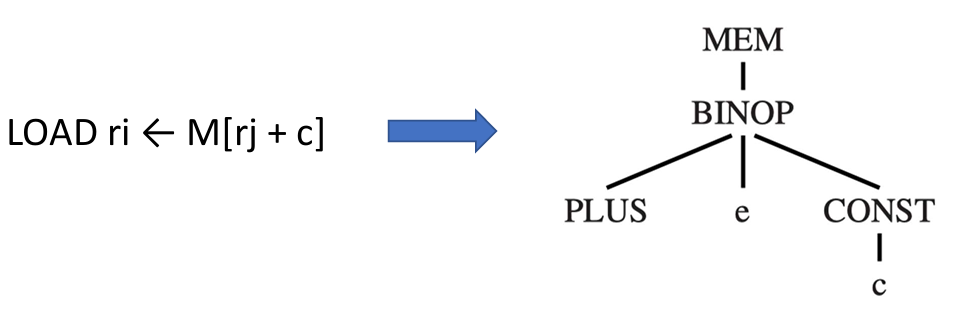

# Chapter 9: Instruction Selection

## 9.1 概述

1. **导言与核心概念**
    - **指令选择的目标**：将源语言程序的中间表示（IR 树）转换为目标机器语言程序（如汇编语言）。
    - **为什么需要指令选择**：中间表示（如树语言）的每个节点通常只表达一种操作（例如：取数、存数、加减法、条件跳转等）。而真实机器的指令往往可以通过一条指令同时执行多个基本操作 。因此，指令选择阶段的任务就是找到合适的机器指令来实现给定的 IR 树 。
2. **树模式与覆盖（Tree Patterns & Tiling）**
    - **树模式（Tree Pattern）**：每条机器指令都可以表示为一个 IR 树的片段，这被称为树模式 。某些机器指令可能对应多个不同的树模式 。
        
        
        
    - **覆盖（Tiling）**：指令选择的过程实际上就是用最小数量的树模式去“覆盖”整棵 IR 树 。覆盖必须保证各个树模式之间不重叠 。
    - **Jouette 架构示例**：课件中使用了一个名为 Jouette（法语中意为玩具）的假设指令集架构进行说明，包含指令如下：
        
        
        
3. **最优覆盖与最佳覆盖（Optimal vs. Optimum Tilings）**
    
    在评估覆盖质量时，有两个关键概念：
    
    - **最佳覆盖（Optimum Tiling）**：指所有覆盖图块的代价总和达到可能最低值的覆盖 。这是一种全局（global）的最优状态 。
    - **最优覆盖（Optimal Tiling）**：指在覆盖方案中，没有任何两个相邻的图块可以合并成一个代价更低的单个图块 。这是一种局部（local）的最优状态 。
    - **两者关系**：每一个最佳覆盖（Optimum）必定也是最优覆盖（Optimal），但反之不然 。
    - **代价评估**：最好的覆盖通常是指令序列最短的，或者指令总执行时间开销最低的序列 。

## 9.2 **指令选择算法**

### **9.2.1 最大吞噬法（Maximal Munch）**

- 一种用于寻找 **最优覆盖（Optimal Tiling）**的贪心算法 。
- **工作原理**：算法自顶向下（top-down）工作，从树的根节点开始，寻找能够匹配的包含最多节点的最大图块 。使用该图块覆盖根节点及附近的节点后，会留下几个子树，接着对每个子树重复相同的过程 。

### **9.2.2 动态规划算法**

- 动态规划算法可以自底向上（bottom-up）地找到 **最佳覆盖（Optimum Tiling）** 。
- **工作原理**：为树中的每个节点分配一个代价（Cost）。节点的代价是能覆盖以该节点为根的子树的最佳指令序列的成本总和 。
- **计算过程**：首先递归计算所有子节点的代价，然后将每个树模式（图块）与当前节点进行匹配 。对于每个在节点 n 匹配的图块 t（代价为 $C_t$），其匹配总代价为： $C_t + \sum_{all\ leaves\ i\ of\ t} C_i$ 。算法最终选择代价最小的树模式 。
- **指令发射**：一旦找到了根节点（即整棵树）的代价，就开始指令生成阶段（Emission），先按需递归地生成叶子节点的指令，再输出当前节点匹配的指令。

### **9.2.3 树文法**

1. **为什么需要树文法？**
    - 在像早期 RISC 那样的简单架构中，所有通用寄存器都是平等的（只有一种整数/指针寄存器类）。但在许多 CISC 机器中，寄存器被划分成了不同的类别，并且某些操作只能在特定的寄存器上执行。
    - 课件中为了说明这一点，假设了一个“脑残版（brain-damaged）的 Jouette 架构” 。在这个架构中，寄存器被分为了两类：
        - **`a` 寄存器**：专门用于寻址（addressing） 。
        - **`d` 寄存器**：专门用于处理数据（"data"） 。
    - 在这种架构下，当我们要用图块（tile）去覆盖一棵 IR 树时，仅仅匹配操作符是不够的。我们还必须标记每个图块的根节点和叶子节点到底期望产生/接受哪种类型的寄存器（是 `a` 还是 `d`） 。
2. **什么是树文法？**
    - 为了形式化地描述这些带有特定寄存器限制的图块，我们可以借用上下文无关文法（Context-Free Grammar, CFG）的概念 。这就是所谓的树文法。
    - 在树文法中，非终结符（Nonterminals）代表了不同的寄存器类别或语句类型。例如：
        - `s`：代表计算不产生结果的语句（statements） 。
        - `a`：代表计算结果存入 `a` 寄存器的表达式 。
        - `d`：代表计算结果存入 `d` 寄存器的表达式 。
    - 产生式规则（Grammar rules）则对应着一条条具体的机器指令（及其树模式）。例如 ：
        - $d \rightarrow MEM(+(a, CONST))$ ：对应 `LOAD` 指令（将基于 `a` 寄存器加偏移量寻址的内存值，加载到 `d` 寄存器中）。
        - $d \rightarrow a$ ：对应 `MOVED` 指令（将 `a` 寄存器的值移入 `d` 寄存器）。
        - $a \rightarrow d$ ：对应 `MOVEA` 指令（将 `d` 寄存器的值移入 `a` 寄存器）。
3. **如何使用树文法进行匹配？**
    
    有了这套文法，指令选择的过程就变成了一个解析（Parsing）过程：给定一棵 IR 树（可以看作是输入的句子），我们尝试用树文法推导出这棵树，推导的过程就决定了指令的选取。
    
    - **遇到的问题：高度二义性**
        
        这种文法是高度二义性的 。对于同一个表达式，往往存在许多条不同的指令序列能够实现它 。因此，传统的语法分析技术（如第 3 章讲的预测分析或 LR 分析）在这里并不是很有用 。
        
    - **解决方案：推广的动态规划**
        
        为了解决二义性并找到最优解，我们将前面提到的动态规划（Dynamic Programming）算法进行了推广 ：
        
        - 在标准的 DP 算法中，我们只为每个节点记录一个最小代价。但在树文法的推广版本中，**我们必须为每个节点上的每一个非终结符（如 `a` 和 `d`）分别计算并记录最小代价匹配** 。
        - 例如，在计算某个节点时，算法不仅会问“覆盖这个子树的最小代价是多少？”，而是会分别问：
            - “如果把这个子树的结果强行放在 `a` 寄存器里，最小代价是多少？用什么模式？”
            - “如果把这个子树的结果强行放在 `d` 寄存器里，最小代价是多少？用什么模式？”
            
            算法会同时维护这几种状态，自底向上计算。这样，即使到了更上层的节点发现必须要求使用特定的寄存器类型（比如某条加法指令强制要求右操作数必须在 `d` 寄存器），下层节点也已经准备好了对应状态的最小代价和生成路径，从而保证全局最优。
            

### 9.2.4 时间复杂度分析

1. **参数定义**
    - $T$：目标机器架构中不同图块（即树模式或指令）的总数 。
    - $K$：平均下来，一个成功匹配的图块所包含的“非叶子节点”的数量 。可以理解为一条指令平均能“吞噬”掉多少个操作节点。
    - $K'$：在检查哪些图块能匹配当前子树时，算法最多需要向下检查的节点数量 。这取决于指令集中最复杂的那个图块有多深。
    - $T'$：平均而言，能在每一个树节点上成功匹配的图块数量 。
    - $N$：输入的中间表示（IR）树中包含的总节点数 。
2. **算法的时间开销**
    - **最大吞噬法（Maximal Munch）的开销：** 正比于 $(K' + T')N / K$ 。
    - **动态规划（Dynamic Programming）的开销：** 正比于 $(K' + T')N$ 。
    - 对于任何给定的目标机器架构， $K$、 $K'$ 和 $T'$ 都是常数，因此最大吞噬法和动态规划算法的运行时间都是 **线性** 的（即 $O(N)$ 的时间复杂度） 。

## **9.3 CISC 与 RISC 架构下的指令选择**

### **9.3.1 RISC 与 CISC 对比**

- **RISC（精简指令集）**：拥有大量寄存器（如32个），指令长度统一（32位），只有唯一的整数/指针寄存器类，所有算术运算只在寄存器之间进行（三地址指令），仅提供基本的内存寻址模式 。对于 RISC 机器，最佳覆盖和最优覆盖之间通常没有任何区别 。
- **CISC（复杂指令集）**：寄存器较少（如6到16个），分为不同的类，提供双地址指令和多种复杂的内存寻址模式，指令长度可变，且常带有副作用（如自动递增） 。对于 CISC 机器，最佳覆盖和最优覆盖的区别很明显 。

### 9.3.2 CISC 的问题与解决方案

1. 寄存器数量稀少 (Few Registers)
    - **面临问题**：与 RISC 动辄 32 个寄存器不同，CISC 机器的寄存器数量通常很少（例如只有 16、8 甚至 6 个） 。
    - **解决方案**：在指令选择阶段，编译器无需过度担忧物理寄存器的匮乏，可以自由地生成大量的 `TEMP` 节点（虚拟寄存器），并假设后续的寄存器分配器（Register Allocator）能够凭借优秀的算法妥善处理好寄存器的映射和溢出问题 。
2. 寄存器被强制分类 (Classes of Registers)
    - **面临问题**：CISC 机器不仅寄存器少，还往往将寄存器划分为不同的类别，某些特定的操作甚至被限制在特定的物理寄存器上执行 。例如，在 Pentium 处理器上执行乘法时，左操作数必须强制放在 `eax` 寄存器中；运算结果的高位会放入 `edx` 寄存器，而低位会放入 `eax` 寄存器 。对于 Tiger 这类语言的程序来说，结果的高位往往是无用的（垃圾数据） 。
    - **解决方案**：通过显式地生成 `MOVE` 指令来提前就位操作数和转移结果 。
        - **示例**：要实现 $t_1 \leftarrow t_2 \times t_3$：
            1. `mov eax, t2`  （将操作数移入指定寄存器） 
            2. `mul t3` （执行乘法，结果默认覆盖相关寄存器） 
            3. `mov t1, eax` （提取有用的低位结果，丢弃 `edx`） 
3. 双地址指令格式 (Two-Address Instructions)
    - **面临问题**：RISC 通常采用三地址指令（如 $r_1 \leftarrow r_2 + r_3$），而 CISC 常常使用双地址指令（如 $r_1 \leftarrow r_1 + r_2$） 。这意味着运算的目标寄存器必须与第一个源寄存器完全一致 。
    - **解决方案**：在执行运算之前，强制插入额外的 `MOVE` 指令进行数据拷贝 。
        - **示例**：要实现 $t_1 \leftarrow t_2 + t_3$：
            1. `mov t1, t2` 
            2. `add t1, t3` 
    - **后续优化**：编译器会期望后续的寄存器分配器能够聪明地将 $t_1$ 和 $t_2$ 分配到同一个物理寄存器中，一旦分配成功，这条冗余的 `MOVE` 指令就可以被安全删除 。
4. 算术运算可直接访问内存 (Arithmetic Operations Accessing Memory)
    - **面临问题**：CISC 架构允许算术指令直接对内存地址进行操作 。在指令选择阶段，每一个 `TEMP` 节点最终都会变成一个引用，其中很多实际上指向的是内存位置 。
    - **解决方案**：安全起见，通常的策略是在进行运算前，将所有操作数从内存提取到物理寄存器中，运算完成后再将结果存回内存 。
        - **对比**：
            - 做法 A：`mov eax, [ebp-8]; add eax, ecx; mov [ebp-8], eax`
            - 做法 B：`add [ebp-8], ecx`
        - **分析**：虽然做法 B 看起来非常简洁，但实际上这两种序列的执行速度是一样快的 。做法 A（使用显式 load/store）最大的优势在于它不会隐式地破坏（trash）寄存器中的原有状态，对编译器来说更可控 。
5. 繁杂的寻址模式 (Several Addressing Modes)
    - **面临问题与优势**：CISC 提供了多种非常复杂的寻址模式 。一个能同时完成六件事情的复杂寻址模式，实际上在底层通常也需要花费六个步骤的时间来执行，并不会带来绝对的性能提升 。但它有两个明显的优势：一是操作过程中“破坏”的寄存器更少，二是能有效缩短指令的二进制编码长度 。
    - **解决方案**：虽然编译器开发者可以花费精力修改基于树匹配的代码生成器来适配这些 CISC 特性，但实际上，即使生成的程序完全只使用类似 RISC 的简单基础指令，也能运行得一样快 。
6. 可变长指令 (Variable-Length Instructions)
    - **面临问题**：CISC 的指令长度是不固定的，由变长的操作码和变长的寻址模式组合而成 。
    - **解决方案**：幸运的是，这并不是编译器（Compiler）需要头疼的问题 。只要编译器选出了正确的指令序列，生成最终机器码的那些繁琐的编码工作，完全可以交给汇编器（Assembler）去处理 。
7. 带有副作用的指令 (Instructions with Side Effects)
    - **面临问题**：某些 CISC 机器拥有一种“自动递增”（autoincrement）的内存获取指令，它在读取内存的同时还会自动修改指针寄存器的值（例如完成 $r_2 \leftarrow M[r_1]$ 的同时执行 $r_1 \leftarrow r_1 + 4$） 。传统的“树模式”（Tree Patterns）很难对这种行为建模，因为树结构上的一个节点通常只能产生**一个**结果，而这类指令产生了**两个**结果 。
    - **解决方案**：编译器通常有三种处理方式：
        1. 直接忽略这类复杂的自动递增指令，当作它们不存在 。
        2. 在基于树模式匹配的代码生成器内部，编写特殊且临时（ad hoc）的规则来生硬地匹配这种代码习惯用法 。
        3. 彻底改变算法架构，使用基于 DAG（有向无环图）模式而非树模式的指令选择算法，DAG 天然支持单个节点有多个输出 。