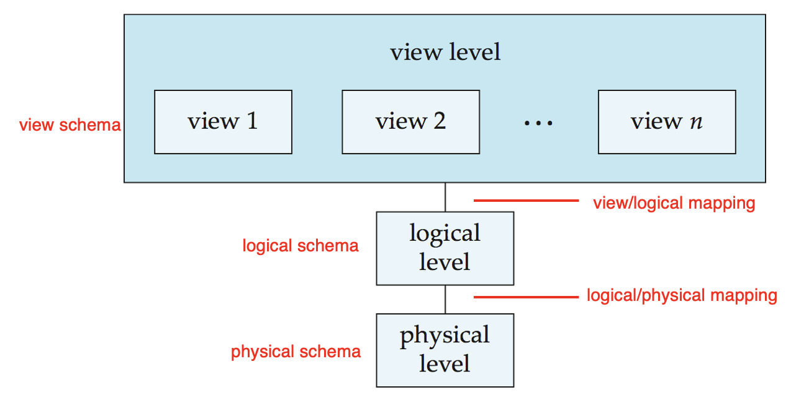

# Chapter 1: Introduction

## 一、数据库系统的特性

1. 数据独立性（Data independence）：包括物理独立性 （physical data independence）和逻辑独立性（logical data independence）
2. 并发访问（Concurrent access）和鲁棒性
3. 数据完整和安全性（Data integrity and security）

## 二、数据视图（View of data）

### 1. 抽象层级（Abstraction）

图：抽象层级的划分

- 物理级别（Physical Level）：描述记录的存储方式（比如磁盘）
- 逻辑级别（Logical Level）：描述存储在数据库中的数据以及与上层数据的关系
- 视图级别（View level）：应用程序隐藏数据类型的详细信息
    - 视图级别还可以出于安全目的隐藏信息（比如员工的薪水）

### 2. 范式（Schemas）和实例（Instances）

1. **范式（Schema）：**数据库的逻辑结构（又称：架构）
    - 示例：数据库包含有关一组客户和帐户以及它们之间的关系的信息
    - 物理范式（Physical Schema）：物理级别的数据库设计
    - 逻辑范式（Logical Schema）：逻辑级别的数据库设计
    - 子范式（SubSchemas）：视图（View）层级的范式
2. **实例（Instance）：**数据库在特定时间点的实际内容

图：数据库的模式结构

### 3. 独立性（Independence）

- **定义：**能够在不影响更高层级的条件下对当前层级的范式进行修改（Ability to modify a schema definition at one level without affecting a schema definition at a higher level）
    - 物理数据独立性（Physical Data Independence）：在不更改逻辑范式的情况下修改物理范式的能力
    - 逻辑数据独立性（Logical Data Independence）：在不更改用户视图范式的情况下修改逻辑范式的能力（难以实现）

### 4. 数据模型（Data Models）

1. **数据模型：**用于描述数据（Data）、联系（Data Relationships）、语义（Data Semantics）、约束（Data Constraints）的工具集合
2.  **常见的数据模型**
    - 关系模型（Relational Model）
    - 实体-联系数据模型（Entity-Relationship，ER）：将企业建模为数据实体和关系的集合，由实体关系图以图示方式表示
    
    
    
    图：实体-联系数据模型
    

## 三、数据库语言（Database Language）

### 1. Data Definition Language （DDL，数据定义语言）

- 用于定义数据库架构（database schema）的规范表示法：关系架构（relational schema）、存储结构（storage structure）、访问方式（access methods）、一致性约束（consistency constraints）
- DDL 编译后，编译器生成一组存储在数据字典（Data Dictionary）中的表模板，数据字典包含元数据（Metadata）

### 2. Data Manipulation Language （DML，数据操作语言）

- 用于对数据进行查询、插入、删除、更新等操作，又称查询语言（query language）
- **DML 的分类**
    - 过程式（Procedural）：用户指定需要哪些数据，并指定如何获取这些数据，例如：C、Java
    - 非过程式/声明式（Non-Procedural/Declarative）：用户指定需要哪些数据，但不指定如何获取这些数据，例如：SQL（Structured Query Language）

## 四、数据库用户（User）和管理员（DBA）

## 五、数据库结构（Database Architecture）

### 1. 存储管理器（Storage Manager）

存储管理器组件包括：

- 文件管理器（File Manager）
- 缓冲区管理器（Buffer Manager）
- 授权和完整性管理器（Authorization and Integrity Manager）
- 事务管理器（Transaction Manager）

### 2. 查询处理器（Query Processor）

查询处理器组件包括：

- DDL 解释器（DDL Interpreter）：解释 DDL 语句并将定义记录在数据字典中
- DML 编译器（DML Compiler）：将查询语言中的 DML 语句转换为由查询评估引擎理解的低级指令组成的评估计划（Evaluation Plan）
    - DML 编译器执行查询优化（Query Optimization），即从各种备选方案中挑选成本最低的评估计划
- 查询评估引擎（Query Evaluation Engine）：执行 DML 编译器生成的低级指令

### 3. 事务管理组件（Transaction Management Component）

- 事务（Transaction）是在数据库应用程序中执行单个逻辑功能的集合
- 事务要求包括原子性（atomicity）、一致性（consistence）、隔离性（isolation）、持久性（durability）
- 事务管理组件确保数据库在系统故障（system failures）（例如电源故障和系统崩溃）和事务故障（transaction failures）时保持一致（或正确）状态
- 并发控制管理器（Concurrency-control manager）控制并发事务（concurrent transactions）之间的交互