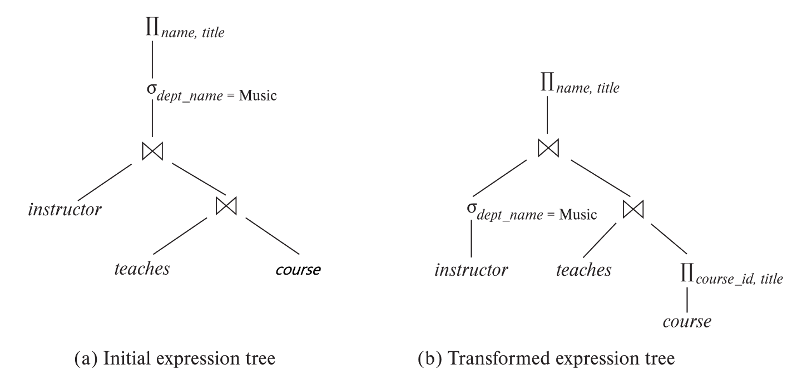

# Chapter 10: Query Optimization

## 一、概述

1. **优化器（Optimizer）：**结合统计数据，在关系代数的若干等价形式中选择最优的等价形式，确定关系代数的执行算法，输出执行方案
    - 在关系代数的层级：在关系代数的若干等价形式中选择最优的等价形式
    - 在实现层级：确定详细的查询执行方案，例如选取执行某个操作的算法、选取要使用的特定索引等
2. **执行方案（Evaluation Strategy）：**可以用一棵自底向上的树表示
    
    
    

## 二、关系代数的转化 Transformation of Relational Expressions

### **1. 等价关系代数式的定义**

- 称两个关系代数式是等价的，如果两个代数式在任意一个合法的数据库实例上产生相同的元组
- 元组的顺序无关紧要
- 不考虑因数据库实例不满足约束条件而导致关系代数式执行结果不同的情况

### 2. 等价规则

1. R1：与关系的选择运算可以拆解为一系列选择运算
    
    $\sigma_{\theta_1\land\theta_2}=\sigma_{\theta_1}(\sigma_{\theta_2}(E))$
    
2. R2：选择运算满足交换律（Commutative）
    
    $\sigma_{\theta_1}(\sigma_{\theta_2}(E))=\sigma_{\theta_2}(\sigma_{\theta_1}(E))$
    
3. R3：在一系列投影运算中，只有最后一个投影运算起作用，其它投影运算可以忽略
    
    $\Pi_{L_1}(\Pi_{L_2}(\Pi…E))=\Pi_{L_1}(E)$ ，where $L_1\subseteq L_2\subseteq …$
    
4. R4：选择运算可以和笛卡尔乘积、Theta 连接相结合
    - $\sigma_\theta(E_1\times E_2)=E_1\bowtie_\theta E_2$
    - $\sigma_{\theta_1}(E_1\bowtie_{\theta_2}E_2)=E_1\bowtie_{\theta_1\land\theta_2}E_2$
5. R5：Theta 连接和自然连接满足交换律
    
    $E_1\bowtie_\theta E_2=E_2\bowtie_\theta E_1$
    
6. R6A：自然连接满足结合律（Associative）
    
    $(E_1\bowtie E_2)\bowtie E_3=E_1\bowtie (E_2\bowtie E_3)$
    
    R6B：Theta 连接在下述条件下满足结合律，其中 $\theta_2$ 只包含来自 $E_2$ 和 $E_3$ 的属性
    
    $(E_1\bowtie_{\theta_1} E_2)\bowtie_{\theta_2\land\theta_3} E_3=E_1\bowtie_{\theta_1\land\theta_3} (E_2\bowtie_{\theta_2} E_3)$
    
7. R7：选择运算在以下情形对连接运算具有分配律
    
    （先连接后选择 $\rightarrow$ 先选择后连接）
    
    - 情形一：当 $\theta_1$ 只包含来自 $E_1$ 的属性时
        
         $\sigma_{\theta_1}(E_1\bowtie_\theta E_2)=(\sigma_{\theta_1}(E_1))\bowtie_{\theta}E_2$
        
    - 情形二：当 $\theta_1$ 只包含来自 $E_1$ 的属性， $\theta_2$ 只包含来自 $E_2$ 的属性时
        
        $\sigma_{\theta_1\land\theta_2}(E_1\bowtie_\theta E_2)=(\sigma_{\theta_1}(E_1))\bowtie_{\theta}(\sigma_{\theta_2}(E_2))$
        
8. R8：投影运算在以下情形对连接运算具有分配律
    
    （先连接后投影 $\rightarrow$ 先投影后连接）
    
    - 情形一：当 $\theta$ 只包含来自 $L_1\cup L_2$ 的属性时
        
        $\Pi_{L_1\cup L_2}(E_1\bowtie_\theta E_2)=(\Pi_{L_1}(E_1))\bowtie_\theta (\Pi_{L_2}(E_2))$
        
    - 情形二：
        - 令 $L_1$ 和 $L_2$ 分别是来自 $E_1$ 和 $E_2$ 的属性集合
        - 令 $L_3$ 是 $E_1$ 的属性中包含在连接条件 $\theta$，但不包含在 $L_1\cup L_2$ 的属性集合
        - 令 $L_4$ 是 $E_2$ 的属性中包含在连接条件 $\theta$，但不包含在 $L_1\cup L_2$ 的属性集合
        
        $\Pi_{L_1\cup L_2}(E_1\bowtie_\theta E_2)=(\Pi_{L_1\cup L_3}(E_1))\bowtie_\theta (\Pi_{L_2\cup L_4}(E_2))$
        
9. R9：集合的交运算和并运算满足交换律
    - $E_1\cup E_2=E_2\cup E_1$
    - $E_1\cap E_2=E_2\cap E_1$
10. R10：集合的交运算和并运算满足结合律
    - $(E_1\cup E_2)\cup E_3=E_1\cup (E_2\cup E_3)$
    - $(E_1\cap E_2)\cap E_3=E_1\cap (E_2\cap E_3)$
11. R11：选择运算可以跨越交、并、差运算
    - $\sigma_\theta (E_1 \cup E_2)=\sigma_\theta (E_1)\cup \sigma_\theta (E_2)$
    - $\sigma_\theta (E_1 \cap E_2)=\sigma_\theta (E_1)\cap \sigma_\theta (E_2)$
    - $\sigma_\theta (E_1 - E_2)=\sigma_\theta (E_1)- \sigma_\theta (E_2)$
12. 连接（Join）中的等价关系
    - 全外连接满足交换律
        
        $E_1⟗E_2=E_2⟗E_1$
        
    - 左外连接和右外连接不满足交换律，但它们可以互相交换
        
        $E_1⟕E_2=E_2⟖E_1$
        
    - 若选择条件 $\theta$ 只包含来自 $E_1$ 的属性，则有：
        - $\sigma_{\theta_1}(E_1⟕_\theta E_2)=(\sigma_{\theta_1}(E_1))⟕_\theta E_2$
        - $\sigma_{\theta_1}(E_1⟖_\theta E_2)=(\sigma_{\theta_1}(E_1))⟖_\theta E_2$

### 3. 关系代数的转化原则

1. 选择运算、投影运算应当尽早进行，以减小连接关系的大小
2. 多个同类别运算同时出现时，应当使临时关系的大小越小越好

### 4. 关系代数转化的实现

1. 查询优化器使用上述等价规则，生成与给定关系代数表达式等价的全部表达式，并使用统计数据对这些表达式的执行代价进行评估
2. 然而，上述过程的代价非常大，使用动态规划（Dynamic Programming）和启发式优化（Heuristics）以减小上述代价

## 三、代价估计的统计数据 Statistics for Cost Estimation

### 1. 存储的统计数据类型

关系 $r$ 的以下信息被数据库存储:

- $n_r$：关系中元组的数量
- $b_r$：存储关系所用的块数
- $l_r$：每条元组所占的空间大小（单位：字节）
- $f_r$：每个块存储的元组数量，有 $b_r=\lceil \frac{n_r}{f_r}\rceil$
- $V(A,r)$：关系 $r$ 中属性 $A$ 出现的不同取值的数量，如果 $A$ 为键，则 $V(A,r)=n_r$

### 2. 选择运算的估计

1. 对于 $\sigma_{A=v}(r)$ 的形式：估计结果的大小： $n_r/V(A,r)$
2. 对于 $\sigma_{A≤v}(r)$ 的形式：
    - 如果统计数据中记录了属性 $A$ 的最大值 max 和最小值 min：
        - 若 $v<min$，估计结果的大小为 0
        - 否则，估计结果的大小为 $n_r\times\frac{v-min}{max-min}$
    - 如果统计数据中记录了直方图（Histogram），则可利用直方图进行更精确的估计
    - 现代的 DBMS 可在记录中进行取样（Sampling），从而提高估计的精确性

### 3. 复杂选择运算的估计

1. 条件 $\theta_i$ 的选择性（Selectivity）
    - 表示关系中任一元组满足条件 $\theta_i$ 的概率
    - 设满足条件 $\theta_i$ 的元组数目为 $s_i$，则 $\theta_i$ 的选择性可以表示为 $s_i/n_r$
2. 对于 $\sigma_{\theta_1\land…\land\theta_n}(r)$ 的形式，假设各选择条件独立，估计结果的大小： $n_r\times\frac{s_1\times s_2\times…\times s_n}{n_r^n}$
3. 对于 $\sigma_{\theta_1\lor…\lor\theta_n}(r)$ 的形式，假设各选择条件独立，估计结果的大小： $n_r\times(1-(1-\frac{s_1}{n_r})\times ...\times(1-\frac{s_n}{n_r}))$
4. 对于 $\sigma_{\lnot\theta}(r)$ 的形式，估计结果的大小： $n_r-size(\sigma_\theta (r))$

### 4. 连接运算的估计

1. 笛卡尔乘积：$r\times s$ 包含 $n_r\times n_s$ 个元组
2. 若 $R\cup S=\emptyset$，则 $r\bowtie s$ 估计结果的大小同 $r\times s$
3. 若 $R\cup S$ 是 $R$ 的键，则 $s$ 中的每个元组最多与 $r$ 中的一个元组连接，即 $r\bowtie s$ 估计结果的大小 $≤ n_s$
4. 若 $R\cup S$ 是 $S$ 指向 $R$ 的外键，则 $r\bowtie s$ 估计结果的大小 $=n_s$
5.  若 $R\cup S=\set A$ 不是 $R$ 或 $S$ 的键，则 $r\bowtie s$ 估计结果的大小为 $\min\set{\frac{n_r\times n_s}{V(A,s)},\frac{n_r\times n_s}{V(A,r)}}$

### 5. 其它运算的估计

1. 投影运算 $\Pi_A(r)$ 估计结果的大小： $V(A,r)$
2. 聚合函数运算 ${}_G\gamma_A(r)$ 估计结果的大小： $V(G,r)$
3. 集合运算
    - 对于同一个关系 $r$ 上不同条件的交、并运算：
        
        将关系代数式进行重写，转化成如下形式进行估计
        
        $\sigma_{\theta_1}(r)\cup\sigma_{\theta_2}(r)\Rightarrow\sigma_{\theta_1\lor\theta_2}(r)$
        
    - 对于不同关系上的交、并、差运算：
        - $r\cup s$ 估计结果的大小： $n_r+n_s$
        - $r\cap s$ 估计结果的大小： $\min\set{n_r,n_s}$
        - $r-s$ 估计结果的大小： $n_r$
        - 上述估计是很不准确的，但提供了结果可能值的上界
4. 外连接
    - $r⟕s$ 估计结果的大小： $r\bowtie s$ 的大小 $+\ n_r$
    - $r⟗s$ 估计结果的大小： $r\bowtie s$ 的大小 $+\ n_r+n_s$

### 6. V 的估计

1. **选择运算**
    
    
    
2. **连接运算**
    
    
    
3. **其它运算**
    
    