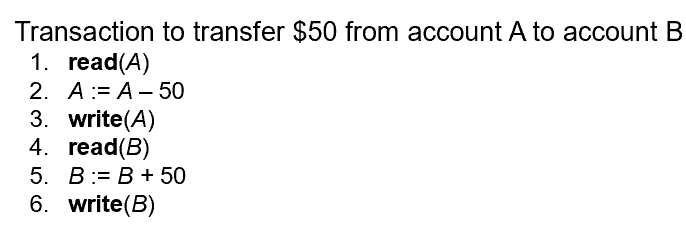

# Chapter 11: Transactions

## 一、事务 Transactions

### 1. 事务的基本概念

1. **概念：**事务是作为单个逻辑单元执行的一系列查询和数据更新语句
2. **事务终止的条件**
    - COMMIT WORK：使事务的所有更新在数据库中永久存在
    - ROLLBACK WORK：撤消事务执行的所有更新（如果事务的任何步骤失败，则事务已完成的所有工作都可以通过 ROLLBACK WORK 撤消）

### 2. 事务的特性 ACID Properties

1. **原子性（Atomicity）**
    - 事务中的所有语句，或者都执行，或者都不执行
2. **一致性（Consistence）**
    - 一致性的要求包含显式指定的数据库约束（例如主键、外键约束）和隐式的逻辑关系（例如库存大于 0）
    - 事务执行的隔离性保证数据库的一致性
    - 某个事务的中间状态可以不一致，但中间状态对其它事务是隐藏的
3. **隔离性（Isolation）**
    - 虽然多个事务可能并发执行，但每个事务的执行都不受其它正在执行事务的干扰
    - 隔离性的简单实现：对事务进行序列化，逐个执行事务（Run Transactions Serially）
4. **持久性（Durability）**
    - 事务成功执行后，其对数据库的改变是持久的，即使发生系统故障

!!! example

    > **示例：**
    > 
    > 
    > 
    > 
    > - 原子性要求：如果语句 4 出错，则已执行的语句 3 需要进行回滚
    > - 一致性要求：A 与 B 的账户余额之和（A+B）在事务执行前后不变
    > - 隔离性要求：若在语句 3 和 6 之间插入执行另一个事务 T2，则 T2 输出的 A+B 将小于期望值，违背一致性要求；这是由于事务 T1 和 T2 之间未满足隔离性要求导致的
    >     
    >     
    >     

### 3. 事务的状态 Transaction State

- **Active：**初态，事务在执行过程中处于该状态
- **Partially Committed：**事务的最后一条语句完成执行，但此时要输出的结果数据还在内存中，未写回磁盘
- **Failed：**发现事务难以正常执行后进入该状态
- **Aborted：**事务失败，且数据库完成回滚后进入该状态
- **Committed：**事务成功执行后进入该状态

## 二、原子性和持久性的实现

1. 数据库系统的恢复管理组件（Recovery-Management Component）实现了对原子性和持久性的支持
2. **影子数据库方案 Shadow-Database Scheme**
    - 存在一个指针 `db_pointer`，始终指向数据库的当前一致版本（current consistent copy），该版本称为影子拷贝（Shadow Copy）
    - 每次对数据库执行事务时，新创建一个数据库副本，所有修改在副本上进行
    - 若事务执行成功，将 `db_pointer` 指针指向该副本；若事务执行失败，直接丢弃该副本
    - 该方案要求 `db_pointer` 的更新是原子性的、无并发事务、假设硬盘不会故障
    - 由于更新时需要拷贝整个数据库，因此该方案对较大的数据库性能很低
    
    
    
    
    

## 三、并发执行 Concurrent Executions

1. 并发执行允许数据库系统同时执行多个事务，有助于提高处理器和磁盘利用率、降低事务的平均等待时间（Average Response Time），但调度不当会破坏一致性
2. **并发控制方案（Concurrency Control Scheme）：**用于对并发事务进行调度，从而实现事务之间的隔离性
3. **调度 Schedules**
    - 由于 CPU 是顺序执行指令的，因此需要为一组并发事务中的各指令确定执行顺序
    - 调度是指示一组并发事务中各指令执行顺序的序列
    - 一组事务的调度必须包括每个事务中的所有指令，必须保持指令在每个事务中出现的顺序
4. **序列调度 Serial Schedule**
    
    
    
    - 在上述两个调度 Schedule 1 和 Schedule 2 中，事务 T1 和 T2 是串行的，称为序列调度
    - $N$ 个并行事务有 $N!$ 种可选择的序列调度
    - 序列调度必能保持一致性，但低效
5. **并行调度 Concurrent Schedule**
    
    
    
    - 在上述两个调度 Schedule 3 和 Schedule 4 中，事务 T1 和 T2 的执行相互交叉，称为并行调度
    - 在上例中，显然 Schedule 4 不满足一致性，接下来我们进一步研究如何检查调度是否满足一致性

## 四、序列化 Serializability

1. **可序列化的概念**
    - 一个并行调度是可序列化的（Serializable），若它与一个序列调度等价
    - 合法的并行调度都是可序列化的
    - 冲突等价（Conflict Equivalent）是常用一种等价定义方式
    - 在简化的调度问题中，只研究读指令与写指令，忽略其它指令
2. **冲突指令 Conflicting Instructions**
    - 设 $I_i,I_j$ 分别是事务 $T_i,T_j$ 中的指令，若这两条指令都访问了同一个元素 $Q$，且至少其中一条指令对元素 $Q$ 进行了写操作，则称这两条指令冲突（Conflict）
        
        
        | $I_i$ | $I_j$ |  |
        | --- | --- | --- |
        | Read (Q) | Read (Q) | 不发生冲突 |
        | Read (Q) | Write (Q) | 发生冲突 |
        | Write (Q) | Read (Q) | 发生冲突 |
        | Write (Q) | Write (Q) | 发生冲突 |

    - 若 2 个指令是有冲突的，则二者执行次序不可交换；若 2 个操作不冲突，则可以交换执行次序
    
3. **冲突序列化 Conflict Serializability**
    - 若调度 $S$ 可通过执行次序的交换转化为调度 $S'$，则称 $S,S'$ 冲突等价
    - 称调度 $S$ 是冲突可序列化的（Conflict Serializable），若它与一个序列调度冲突等价
    
    !!! example

        > **示例：**
        > 
        > 
        > 
        > 
        > 
        > 

## 五、可恢复性 Recoverability

1. **可恢复调度 Recoverable Schedule**
    - 若事务 $T_j$ 读取了某个先前由事务 $T_i$ 写入的数据，则事务 $T_i$ 的提交（Commit）需要先于 $T_j$ 的提交，从而保障调度的可恢复性
    
    !!! example

        > **示例：**
        > 
        > 
        > 
        > 

2. **级联回滚 Cascaing Rollback**
    - 在一些设计不佳的调度中，某个事务的失败可能导致一系列事务发生回滚
    - 这样的调度是可恢复的，但执行恢复的代价太大，应该避免这种设计
    
    !!! example

        > **示例：**
        > 
        > 
        > 
        > 

3. **无级联调度 Cascadeless Schedule**
    - 若事务 $T_j$ 读取了某个先前由事务 $T_i$ 写入的数据，则事务 $T_i$ 的提交（Commit）需要先于 $T_j$ 的读取
    - 无级联调度保障了调度的可恢复性，同时避免发生级联回滚

## 六、可序列化的检测

1. 合法的并行调度都是可序列化的，因此需要对并行调度进行可序列化检测（Testing For Serializability）
2. **优先级图 Precedence Graph**
    - 优先级图是有向图，每张图表示一个调度，每个节点表示一个事务
    - 若两个事务之间存在一对冲突指令，则在这两个事务对应的节点之间加一条弧线；弧线由先执行指令的事务出发，指向后执行指令的事务
    - 一个调度是冲突可序列化的，当且仅当其优先级图是无环的（Acyclic），与其等价的序列调度为该图的拓扑排序
    - 检测图是否有环的算法，时间复杂度为 $O(n^2)$，其中 $n$ 为节点数
    
    !!! example

        > **示例：**
        > 
        > 
        > 图 (a) 为一个无环的优先级图，其对应的调度是冲突可序列化的，与该调度等价的序列调度
        > 
        > 
        >