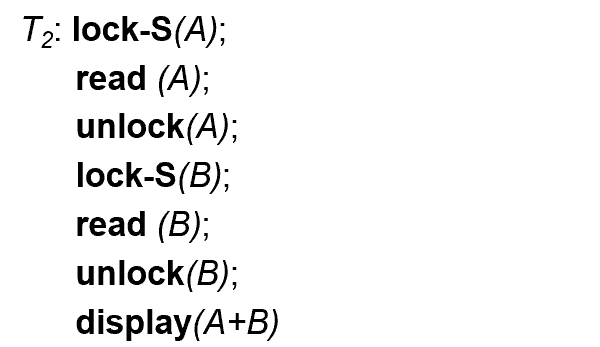

# Chapter 12: Concurrency Control

## 一、基于锁的协议 Lock-Based Protocols

### 1. 锁的基本原理

1. **锁的类型**
    - 排他锁（Exclusive Mode，X 锁）：被锁定的数据可读、可写
    - 分享锁（Shared Mode，S 锁）：被锁定的数据可读、不可写
2. **锁相容性矩阵 Lock-Compatibility Matrix**
    
    
    |  | S | X |
    | --- | --- | --- |
    | S | True | False |
    | X | False | False |

    - 一项数据只能被一个排他锁锁定，被排他锁锁定的数据无法被其他锁锁定
    - 一项数据可以被多个分享锁锁定，被分享锁锁定的数据可被其他分享锁锁定，但无法被排他锁锁定
    
3. **锁的缺陷**
    - 设计不佳导致锁无效
    - 死锁（Deadlock)：多个事务/进程因互相等待资源而无限阻塞
    - 饥饿（Starvation）：单个事务因调度策略不公平或优先级低被持续忽略
    
    !!! example

        > **示例：设计不佳导致无效的锁**
        > 
        > 
        > 
        > 
        > - 上述锁无法保证序列执行：若在上述代码的 A 与 B 读取之间，其它事务对 A 或 B 的值进行了修改，则上述代码显示的（A+B）将与实际不符
    
    !!! example

        > **示例：死锁 Deadlock**
        > 
        > 
        > 
        > 
        > - $T_4$ 的 `lock-s(B)` 等待 $T_3$ 释放 B 的排他锁， $T_3$ 的 `lock-x(A)` 等待 $T_4$ 释放 A 的共享锁，导致两个事务互相等待，造成死锁
        > - 为解决死锁， $T_3,T_4$ 其一必须进行回滚并释放锁

### 2. 两阶段锁 Two-Phase Locking Protocol

1. **两阶段锁 2PL**
    
    对于每一个事务，分为两个阶段：
    
    - 阶段 1：Growing Phase
        
        在该阶段中，事务可以获得锁，但不可以释放锁
        
    - 阶段 2：Shrinking Phase
        
        在该阶段中，事务可以释放锁，但不可以获得锁
        
2. **两阶段锁的分析**
    - 对某个调度的全部事务使用两阶段锁，可保证调度是冲突可序列化的
        - 可以证明：该调度可以按照不同事务上锁点（Lock Point，获得最后一个锁的时间）的先后顺序进行序列化
        
        !!! info

            > **证明：**
            > 
            > 
            > 
            > 

    - 不是所有冲突可序列化的调度都可以使用两阶段锁
    - 对某个调度的部分事务使用两阶段锁、部分事务不使用两阶段锁，则该调度不一定是冲突可序列化的；因此，为保证冲突可序列化，应当对调度的全部事务都使用两阶段锁
    - 两阶段锁无法消除出现死锁的可能性
3. **变体：Strict 2PL**
    - 背景：两阶段锁无法消除 Cascade Rollback，为消除 Cascade Rollback，可以使用 Strict 2PL
    - Strict 2PL 要求所有事务在 Commit/Rollback 前不得释放它持有的排他锁
4. **变体：Rigorous 2PL**
    - Rigorous 2PL 要求所有事务在 Commit/Rollback 前不得释放它持有的任何锁
    - 比 Strict 2PL 更严格
    - 使用 Rigorous 2PL 的调度可以按照不同事务 Commit 的先后顺序进行序列化
5. **变体：2PL With Lock Conversions**
    
    对于每一个事务，分为两个阶段：
    
    - 阶段 1：Growing Phase
        
        在该阶段中，事务可以获得锁，可以将 S 锁转化为 X 锁（Upgrade），但不可以释放锁
        
    - 阶段 2：Shrinking Phase
        
        在该阶段中，事务可以释放锁，可以将 X 锁转化为 S 锁（Downgrade），但不可以获得锁
        
!!! example

    > **示例：**
    > 
    > 
    > 
    > 

### 3. 锁的实现

1. **读与写的自动上锁**
    
    ```cpp
    // Read D
    if (T_i has a lock on D) {
    	read(D);
    }
    else {
    	wait until no other transaction has a lock-X on D...
    	lock-S(D);
    	read(D);
    }
    
    // Write D
    if (T_i has a lock on D) {
    	write(D);
    }
    else {
    	wait until no other transaction has a lock on D...
    	lock-X(D);
    	write(D);
    }
    
    // All locks are released after commit or abort
    ```
    
2. **锁管理器 Lock Manager**
    - 锁管理器可以作为一个单独的进程来实现，事务向该进程发送锁定和解锁请求（Requests）
    - 锁管理器通过发送锁授权消息（或在死锁的情况下要求事务回滚的消息）来回复锁请求
    - 请求锁的事务将等待，直到其锁请求得到锁管理器的回复
    - 锁管理器维护一个称为锁表（Lock Table）的数据结构，用于记录已授予的锁和待处理的请求
    - 锁表为以被锁定的数据项的名称为索引的内存哈希表
    
    !!! example

        > **示例：锁表的实现**
        > 
        > 
        > 
        > 
        > - 数据项 123 被事务 T1 和 T8 的共享锁锁定，事务 T2 等待该数据项的排他锁

### 4. 基于图的协议 Graph-Based Protocols

1. **基于图的锁**
    - 基于图的锁是两阶段锁的一种替代
    - 在数据项集合 $D=\set{d_1,d_2,…,d_n}$ 上定义一个偏序关系
    - 若 $d_i\rightarrow d_j$，则任何需要同时访问 $d_i,d_j$ 的事务都必须先访问 $d_i$，再访问 $d_j$
    - 这使得集合 $D$ 可被当作一个有向无环图，称为数据库图（Database Graph）
2. **树协议 Tree-Protocol**
    
    
    
    - 树协议是一种简化的基于图的锁
    - 对于每一个事务，遵循以下加锁、解锁规则：
        - 只允许加排他锁
        - 事务 $T_i$ 的第一个锁可以被加在任何数据上，此后的锁只能加在父节点正被 $T_i$ 锁定的元素上
        - 事务可以随时释放锁（不像 2PL 必须分阶段释放）
        - 事务一旦释放某个节点的锁，就不能再重新获取它或其祖先的锁
    - 优点：
        - 树协议通过严格的加锁顺序和层次化数据访问规则，保证了事务调度的冲突可序列化，同时避免死锁发生
        - 树协议中，某个数据的解锁可能比在 2PL 中更早发生，从而缩短等待时间，提高并发性
    - 缺点：
        - 无法保证 Recoverability
        - 无法消除 Cascade Rollback
        - 事务可能对不需要访问的数据上锁
    - 不适用两阶段锁的事务可能适用树协议，不适用树协议的事务可能适用两阶段锁
    
    !!! example

        > **示例：**
        > 
        > 
        > 
        > 

## 二、多粒度 Multiple Granularity

### 1. 概述

- 为了方便起见，允许根据要求以多种不同粒度锁定各种大小的对象
- 定义一个数据粒度层次结构，其中小粒度嵌套在大粒度中，可以表示为如下的树，粒度由大到小分别为：整个数据库、区域、表、元组
    
    
    
- 当一个事务显式（Explicitly）锁定树中的一个节点时，它会以相同的模式隐式（Implicitly）锁定该节点的所有后代
- 粒度大小的影响：
    - 细粒度（Fine Granularity）：高并发性、高上锁开销
    - 粗粒度（Coarse Granularity）：低并发性、低上锁开销

### 2. 意向锁 Intention Lock

1. **意向锁的分类**
    - 共享型意向锁（Intention-Shared，IS）：表明其后代存在 S 锁
    - 排他型意向锁（Intention-Exclusive，IX）：表明其后代存在 X 锁
    - 共享排他型意向锁（Shared and Intention-Shared，SIX）：表明以该节点为根的子树存在 S 锁，而其后代存在 X 锁（SIX = S + IX）
    
    !!! example

        > **示例：**
        > 
        > 
        > 
        > 
        > 
        > 
        
2. **锁相容性矩阵 Lock-Compatibility Matrix**
    
    
    

### 3. 加锁和解锁流程


## 三、死锁处理 Deadlock Handling

### 1. 死锁预防 Deadlock Prevention

死锁预防的方法包含下面几种：

1. 要求每个事务在开始执行前完成所需所有锁的获取（Conservative 2PL）
2. 为所有数据项指定一个偏序，任何事务只能按顺序上锁（Graph-Based Protocol），从而避免锁的相互等待
3. 基于锁超时（Lock Timeout）的方法：请求锁的事务至多等待一定量的时间；如果在这段时间内还没向事务授予锁，那么该事务被认为是超时了，需要回滚并重新开始
4. 基于抢夺（Preemption）的方法
    - 当事务 $T_j$ 向已被 $T_i$ 加锁的数据项请求锁时，通过回滚 $T_i$ 或者令 $T_j$ 继续等待，从而向 $T_j$ 授予锁
    - 决定是否等待或回滚的，是每个事务的开始时间（用时间戳 Timestamp 记录），包含以下两种策略：
        - Wait-Die：当事务 $T_j$ 向已被 $T_i$ 加锁的数据项请求锁时，若 $T_j$ 开始更早（时间戳更小），则 $T_j$ 可以继续等待，否则令较晚开始的事务回滚
        - Wound-Wait：当事务 $T_j$ 向已被 $T_i$ 加锁的数据项请求锁时，若 $T_j$ 开始更晚（时间戳更大），则 $T_j$ 可以继续等待，否则令较晚开始的事务回滚
    
    
    

### 2. 死锁检测 Deadlock Detection

可以用等待图（Wait-For Graph）表示锁之间的等待关系

- 其中，每个节点代表一个事务，每条有向边代表节点之间的锁等待关系
- 若等待图中出现环，则表示出现死锁


### 3. 死锁恢复 Deadlock Recovery

- 检测到死锁时，为打破死锁，需对一些事务进行回滚
- 回滚包括两种类型：
    - 完全回滚（Total Rollback）：放弃整个事务，重新开始
    - 部分回滚（Partial Rollback）：只回滚事务的一部分，打破死锁即可
- 选择待回滚的事务时，需令回滚的代价最小化

## 四、插入和删除操作 Insert and Delete Operations

1. **幽灵现象 Phantom Phenomenon**
    - 当一个事务在执行过程中，多次执行相同的查询，但由于其他并发事务插入或删除了符合查询条件的新记录，导致后一次查询的结果集与前一次查询的结果集不同
    - 可以使用索引锁协议解决幽灵现象
2. **索引锁协议 Index-Locking Protocol**
    - 每个关系必须至少有一个索引
    - 查询操作必须通过索引进行，执行时为对应的索引加上 S 锁
    - 插入和删除操作必须对相应的索引进行更新，因此在执行时为对应的索引加上 X 锁
    - 必须遵守两阶段锁协议的规则