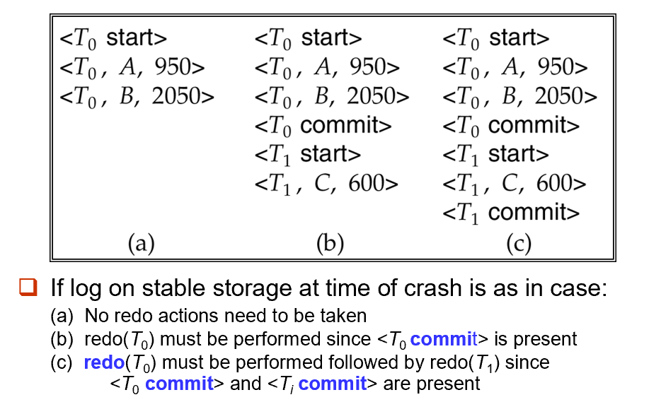
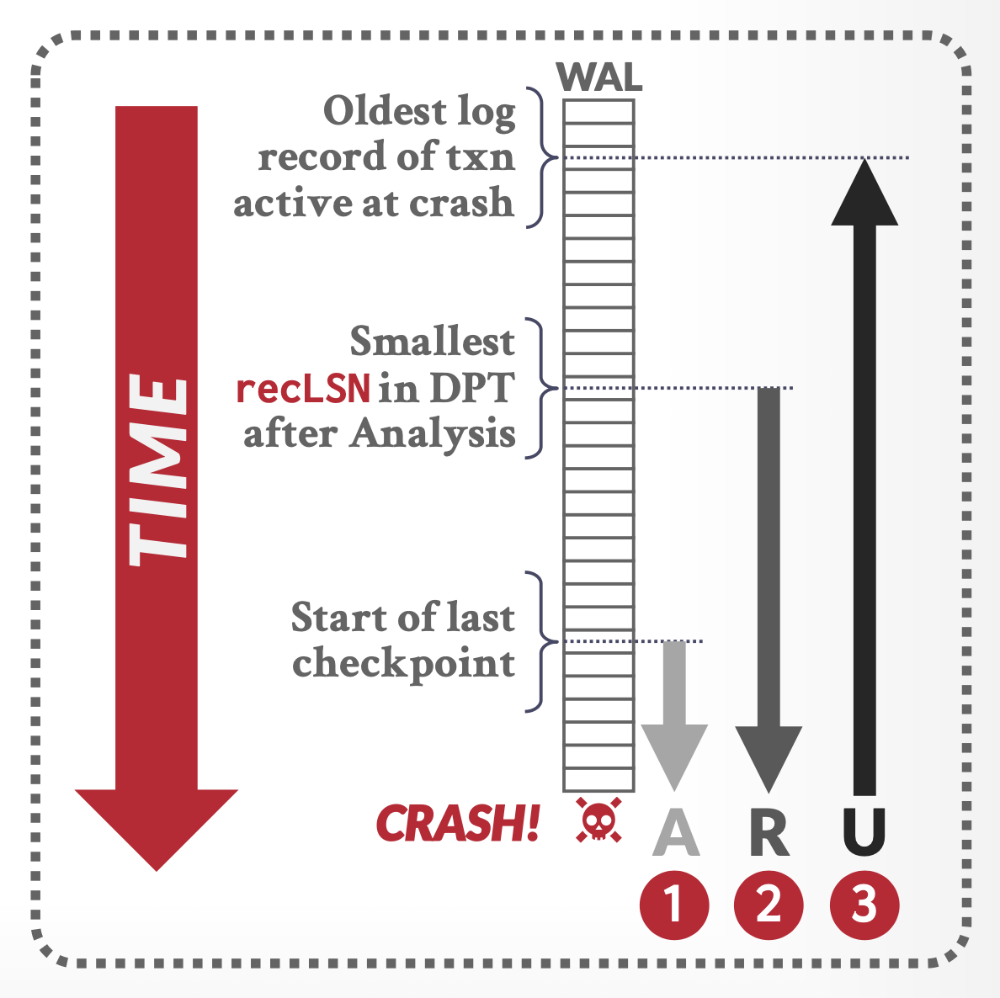

# Chapter 13: Recovery System

## 一、故障的分类 Failure Classification

1. **事务故障 Transaction Failure**
    - Logical Errors：事务内部逻辑错误导致的事务故障，例如输入格式不正确、数据溢出等
    - System Errors：由于错误情况（如检测到死锁），数据库系统必须中止事务的执行
2. **系统崩溃 System Crash**
    - 电源、硬件、软件等故障导致的系统崩溃
    - 假设非易失性存储不会因为系统崩溃而被破坏
3. **磁盘故障 Disk Failure**
    - 磁盘出现故障，导致磁盘的部分或全部数据被破坏

## 二、基于日志的恢复 Log-Based Recovery

### **1. 日志 Log**

- 日志由一系列日志记录（Log Record）组成
- 事务 $T_i$ 开始时，写入日志记录 `<T_i Start>`
- 事务 $T_i$ 执行 `write(X)` 操作时，写入日志记录 `<T_i, X, V1, V2>`，其中 `X` 表示写入的对象，  `V1` 表示写入对象的旧值， `V2` 表示写入对象的新值
- 事务 $T_i$ 结束时，写入日志记录 `<T_i Commit>`

!!! example

    > **示例：**
    > 
    > 
    > ```
    > <T1 start>
    > <T1, A, 100, 200>
    > <T2 start>
    > <T2, B, 300, 400>
    > <T3 start>
    > <T1, C, 500, 600>
    > <T1 commit>
    > <T3, C, 600, 700>
    > <T3, C, 700, 800>
    > <T3 commit>
    > <T2, C, 800, 900>
    > <T2, B, 400, 500>
    > ```
    > 

### 2. 延迟修改技术 Deferred Database Modification

- 假设事务是序列执行的
- 事务执行 `write(X)` 操作时，实时写入日志记录，但不立即更新数据库存储的实际值，而是将更新进行延迟（Defer），直到发生故障
- 当发生故障时，对于已结束并提交的事务，将该事务的更新应用到数据库（ `redo(T_i)` ）；对于发生故障的事务，不进行任何操作，因为这些事务并未应用到数据库
    
    !!! example

        > **示例：**
        > 
        > 
        > 
        > 

### 3. 立即修改技术 Immediate Database Modification

1. 延迟修改技术仅在事务结束并提交后才能对数据库进行更新，而立即修改技术允许未结束的事务对数据库进行更新
    
    !!! example

        > **示例：**
        > 
        > - Output 表示向 Disk 输出的更新的块
        > - 块的输出既可以在涉及的事务提交前进行，也可以在事务提交后进行
        > - 块的输出和它们的更新顺序可能不同
        > 
        > 
        > 

2. **发生故障的恢复操作**
    
    定义两种运算：
    
    - `undo(T_i)` ：将事务 $T_i$ 进行的所有更新进行回退（从 $T_i$ 的最后一条日志记录开始，倒序进行回退）
    - `redo(T_i)` ：将事务 $T_i$ 进行的所有更新进行应用（从 $T_i$ 的第一条日志记录开始，顺序进行更新）
    
    !!! example

        > **示例：**
        > 
        > 
        > 
        > 

3. **检查点 Checkpoint**
    - 若仅依赖重做/撤销日志（Redo/Undo Log）恢复，系统崩溃后需处理整个日志，导致时间成本高；通过设置检查点，定期保存和更新数据库状态，将恢复范围限制在最近一个检查点之后，从而大幅减少恢复时需处理的日志量
    - **检查点的执行流程**
        - 将所有未写入磁盘的日志记录强制写入磁盘，无论对应的事务是否执行完成
        - 向日志写入一条检查点记录 `<checkpoint L>`，其中 `L` 为检查点时正在执行的事务列表
        - 检查点执行期间，暂停所有数据更新
    - **由检查点进行恢复**
        - 定位检查点：从日志末尾反向扫描，找到最近的`<checkpoint L>`记录。
        - 确定恢复范围：仅对检查点 `L` 后的日志对应的事务进行 Redo 或 Undo 操作
    
    !!! example

        > **示例：**
        > 
        > 
        > 
        > 

## 三、并发事务的恢复 Recovery with Concurrent Transactions


!!! example

    > **示例：**
    > 
    > 
    > 
    > 

## 四、缓冲区管理 Buffer Management

### 1. 日志记录缓冲 Log Record Buffering

1. **概述**
    - 日志记录先写到缓冲区（内存），再由缓冲区输出（Output）到稳定存储器（Stable Storage）
    - 通常情况下，由缓冲区输出到稳定存储器是以块（Block）为单位的，而每条日志记录的体积远远小于块的大小，因此日志向稳定存储器的写入往往是不及时的
    - 一些重要的日志记录必须在产生后立即写入稳定存储器，称为强制日志（Log Force）
2. **先写日志规则 Write-Ahead Logging Rule（WAL）**
    - 日志记录要按照它们产生的顺序输出到稳定存储器
    - 记录 `<T_i commit>` 必须在事务 $T_i$ 进入提交状态之前输出到稳定存储器
    - 在记录 `<T_i commit>` 输出到稳定存储器之前，所有与 $T_i$ 相关的日志记录都必须已输出到稳定存储器
    - 在数据块输出到稳定存储器之前，所有与该数据块上数据相关的日志记录都必须已输出到稳定存储器

### 2. 数据块缓冲 Database Buffering

- 记录存储数据的块先写到缓冲区（内存），再由缓冲区输出（Output）到稳定存储器（Stable Storage）
- 恢复算法支持 No-Force Policy，即事务提交之时不必将数据块输出到稳定存储器
- 恢复算法支持 Steal Policy，即包含未提交事务的数据块允许输出到稳定存储器
- 将数据块输出到稳定存储器期间，不允许任何事务对数据块进行修改，为此需为相应的数据块加上一个临时锁（Latch），待输出完成再进行解锁

## 五、ARIES Recovery Algorithm

### 1. 数据结构定义

1. **Log Sequence Number（LSN）**
    - 每条日志记录都有一个唯一的编号，称为 LSN
    - LSN 编号在分配时必须是递增的
    - 每条日志记录包含该记录的 LSN、同一事务上一条日志记录的 LSN（称为 PrevLSN），以及用于执行 Redo、Undo 操作的必要信息
        
        
        
2. **PageLSN**
    - 每个页维护一个 PageLSN 记录，它记录对该页进行最后一次更新的日志记录的 LSN
    - 无论是位于 Buffer 中的页还是位于 Stable Storage 中的页，都具有 PageLSN 记录
3. **Compensation Log Record（CLR）**
    - 事务回滚（Undo）期间会生成特殊的补偿日志记录（CLR）
    - CLR 记录增设了 UndoNextLSN 字段，用于在事务回滚时标记下一个待撤销操作的 LSN。此字段用于跳过已回滚的日志记录，防止一些日志记录被多次回滚
        
        
        
    !!! example

        > **示例：**
        > 
        > 
        > 
        > 

1. **DirtyPageTable（脏页表）**
    - 记录了 Buffer 中被修改过的页列表
    - 针对每个页，DirtyPageTable 中存储 PageLSN（指 Buffer 中页面最新的 PageLSN）及 RecLSN 字段（用于识别已应用到硬盘页版本的日志记录）
    - 当某个页首次在缓存池中被修改并加入到 DirtyPageTable 时，RecLSN 值被设为当前日志末尾
    - 每当某个页被刷写到硬盘后，该页便从 DirtyPageTable 中移除
    
    !!! example

        > **示例：**
        > 
        > 
        > 
        > 

2. **Checkpoint-Log Record（检查点日志记录）**
    - 检查点日志记录包括了 DirtyPageTable 和活跃事务列表（List of active transactions）
    - 对于每个活跃事务，检查点日志记录还会在活跃事务列表中为其标注 LastLSN，即与该事务相关的最近一条日志记录的 LSN
    - 硬盘上的固定位置会标注最近一次（完整）检查点日志记录的 LSN，便于在恢复时快速找到检查点日志记录
    - 在检查点时，脏页不会立即写回硬盘，而是在后台持续地写回磁盘，因此检查点的开销很低，可以以较高的频率执行检查点

### 2. 恢复算法的阶段划分



恢复算法分为三个阶段：

- **分析阶段**：确定需要撤销哪些事务（Undo-List）、崩溃时哪些页是脏的，以及 Redo 阶段应从哪个 LSN 开始（称为 RedoRSN）
- **重做阶段**：从 RedoRSN 开始，执行 Redo 操作
- **撤销阶段**：回滚所有在崩溃时未完成的事务

### 3. 阶段 1：Analysis Pass


### 4. 阶段 2：Redo Pass


### 5. 阶段 3：Undo Pass


!!! example

    > **示例：**
    > 
    > 
    > 
    > 

!!! example

    > **示例：**
    > 
    > - **注意：**在 Crash 之前 Abort 和 Commit 的事务都无需手动进行回滚
    > 
    > 
    >