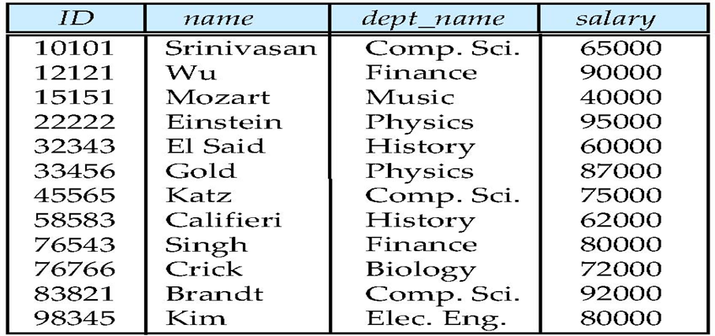

# Chapter 2: Relational Model

## 一、基本定义

- 关系（Relation）：是一个数学概念，即具有**行（row）**、**列（col）**的表格（table）

图：关系（Relation）的示例

!!! note
    相对应地，relationship表示实体（entry）之间的关联，与此处的relation不同

- 关系型数据库（Relational Database）：一种或多种关系的集合

## 二、关系型数据库的结构

### 1. 基本结构

给定集合：$D_1,D_2,...,D_n\space (D_i=a_{ij}|{}_{j=1...k})$ ，则它们的笛卡尔乘积（Cartesian Product）为 $D_1\times D_2\times...\times D_n$，关系 $r$ 即为上述笛卡尔乘积的子集

!!! example
    > **示例：**
    > 
    > 
    > 
    > 
    > 图：关系的含义示例
    > 

### 2. 属性（Attribute）

- 关系中的每个属性都有一个名字
- 属性的 **域**（Domain）：属性的取值范围组成的集合（The set of allowed values）
- 特殊值 NULL 是每个域的成员
- 关系理论第一范式（1NF）：属性值（Attribute Values）是原子的（不可分的）
    - 多值属性值（multivalued attribute values）不是原子的
    - 复合属性值（composite attribute values）不是原子的

### 3. 关系的概念

关系包含两个概念：**关系范式**（relation schema）和 **关系实例**（relation instance）

1. 关系范式：描述关系的结构
    - 假设 $A_1,A_2,...,A_n$ 是属性
    - $R=(A_1,A_2,...,A_n)$ 是关系范式
        
        !!! example
            > **示例：**instructor-schema  = (ID, name, dept_name, salary)
            > 

    - $r(R)$ 是基于关系范式 $R$ 的关系，该关系的名称为 $r$
        
        !!! example
            > **示例：**instructor(instructor-schema)
            > 
            > 
            > = instructor(ID, name, dept_name, salary)
            > 

2. 关系实例：关系中的数据在某一特定时刻的快照（snapshot）
    - 使用表（table）来表示
    - 关系 $r$ 中的元素（element）$t$ 是一个元组（tuple），使用表格中的一行（row）来表示

### 4. 关系的特性

- 在关系中，元组的顺序无关紧要
- 在关系中，不允许出现重复的元组（duplicated tuples）
- 在关系中，属性值（Attribute Values）是原子的

### 5. 码 / 键（Key）

!!! warning

    - 以下的 $K$ 均为集合而非元素，即 $K$ 内可含多个属性
    - 如果一个集合既不是超键，也不是候选键、主键，则这个集合只是普通的属性集，不能称为键

- 令 $K\subset R$ ，即 $K$ 是 $R$ 的属性的一个子集
- $K$ 是 $R$ 的 **超键**（superkey），若在每一个关系 $r(R)$ 中， $K$ 的值足够识别出独一无二的元组
    - 例：由属性 ID 和 name 组成的集合可以作为学生数据库的超键
- $K$ 是 $R$ 的 **候选键**（candidate key），若 $K$ 是 $R$ 的超键，且 $K$ 的任意真子集都不是 $R$ 的超键
- $K$ 是 $R$ 的 **主键**（primary key），若 $K$ 是 $R$ 的候选键，且由用户决定它为主键
    - 主键通常使用下划线标记
    - 主键是表中的一列或多列，它能够唯一地标识表中的每一行数据。主键的值必须唯一且不能为空
    - 每个表只能有一个主键，主键约束确保了表内数据的唯一性，防止了重复记录的产生

### 6. 外码/外键（Foreign Key）

- 设存在关系 $r$ 和 $s$ ：r ( A , B , C ) , s ( B , D )，则在关系 $r$ 中，属性 $B$ 是参照 $s$ 的外键
    - $r$ 是参照关系（referencing relation）
    - $s$ 是被参照关系（referenced relation）
- 在参照关系中，外键或者为 NULL，或者其值在被参照关系中实际存在
- **外键** 是表中的一列或多列，它指向另一个表的主键，用来建立表与表之间的联系
- 模式图（Schema Diagram）

图：银行数据库的模式图

### 7. 查询语言（Query Languages）

- 查询语言：用户从数据库中请求信息所用的语言
- 纯语言（Pure Languages）构成了查询语言的基础
- 纯语言包括：
    - 关系代数（Relational Algebra）：SQL 的基础
    - 元组关系演算（Tuple Relational Calculus）
    - 域关系演算（Domain Relational Calculus）

## 三、关系代数 Relational Algebra

### 1. 基本运算

1. **Select（选择）**
    - 符号： $\sigma_p(r)=\{t|t\in r\ and\ p(t)\}$
        
        $p$ 为命题演算公式（Propositional Calculus），它的每个部分支持运算符： $=、\neq、\geq、\leq、>、<$，各部分之间使用 and、or、not 相连接
        
    !!! example
        > **示例：**
        > 
        > 
        > 
        > 

2. **Project（投影）**
    - 符号： $\prod_{A1,A2,…}(r)$，A1, A2… 为属性名
    - 由于关系是集合（set），因此在包括投影运算在内的各种运算中，结果会消去重复项
    
    !!! example
        > **示例：**
        > 
        > 
        > 
        > 

3. **Union（并）**
    - 符号： $r\cup s$
    - 生效条件：r 和 s 的属性数量必须相同，属性的域必须兼容
    
    !!! example
        > **示例：**
        > 
        > 
        > 
        > 

4. **Set Difference（差）**
    - 符号： $r-s=\{t|t\in r\ and\ t \notin s\}$
    - 生效条件：r 和 s 的属性数量必须相同，属性的域必须兼容
    
    !!! example
        > **示例：**
        > 
        > 
        > 
        > 

5. **Cartesian Product（笛卡尔积）**
    - 符号： $r\times s$
    
    !!! example
        > **示例：**
        > 
        > 
        > 
        > 

6. **Rename（命名）**
    - Rename 操作用于为同一组关系设置一个新的名字（refer to a relation by more than one name）
    - Rename 操作也可同时为关系及其属性命名
    - 符号：
        - $\rho_X(E)$ 返回 关系 E 在名称 X 下的表达式
        - $\rho_{X(A_1,A_2,…,A_n)}(E)$ 将 关系 E 命名为 X，并将它的 n 个属性命名为 $A_1,A_2,…,A_n$

### 2. 额外运算

1. **Set Intersection（交）**
    - 符号： $r\cap s =r-(r-s)$
    - 生效条件：r 和 s 的属性数量必须相同，属性的域必须兼容
    
    !!! example
        > **示例：**
        > 
        > 
        > 
        > 

2. **Natural Join（自然连接）**
    - 含义：连接两个关系中同名属性值都相等的元组
    - 符号： $r\bowtie s$
    - 生效条件：r 和 s 有共同的属性（名和域都对应相同）
    
    !!! example
        > **示例：**
        > 
        > 
        > 
        > 

3. **Theta Join**
    - 含义：先进行笛卡尔乘积再按条件 $\theta$ 进行筛选
    - 符号： $r\bowtie_\theta s=\sigma_\theta (r\times  s)$
4. **Division（除）**
    - 符号： $r\div s=\{t|t\in \prod_{R-S}(r)\land [\forall u\in s(tu\in r)]\}$
    - 性质：若 $q=r\div s$ ，则 q 是满足 $q\times s \subseteq r$ 的 **最大** 关系
    - 使用基本代数运算的定义：
        
        设 $r(R)$ 和 $s(S)$ 都是关系，且 $S\subseteq R$，则有
        
        $r\div s=\prod_{R-S}(r)-\prod_{R-S}((\prod_{R-S}(r)\times s)-\prod_{R-S,S}(r))$
        
    - 常在“for all”为关键词的查询中使用，例如“查找选修了某门课的所有同学姓名”
    
    !!! example

        > **示例：** $Q=R\div S$
        > 
        > 
        > 
        > 
        > 
        > 
        > 
        > 

5. **Assignment（赋值）**
    - 赋值运算（ $\leftarrow$）为表示复杂的查询提供了便捷的方式，它将符号右侧的关系赋值给左侧的关系
    - 符号左侧的关系需要是一个临时变量
    
    !!! example

        > **示例：**
        > 
        > 
        > 
        > 

### 3. 扩展运算

1. **Generalized Projection（广义投影）**
    - 符号： $\prod_{F1,F2,…}(r)$，F1, F2… 为计算表达式
    !!! example

        > **示例：**
        > 
        > 
        > 
        > 

2. **Aggregate Functions（聚合函数）**
    - 聚合函数的种类：avg、min、max、sum、count（计数）
    - 使用格式： $_{G_1,G_2,…,G_n}g_{F_1(A_1),F_2(A_2),…}(E)$
        - $G_1,G_2,…,G_n$ 是属性的列表，用于指定聚合函数的分组规则，也可以不指定
        - $F_i$ 是聚合函数， $A_i$ 是聚合函数所作用的属性名称
    - 聚合函数的运算结果没有名称，可使用 as 为其指定名称
        
        
        
    !!! example

        > **示例：**
        > 
        > 
        > 
        > 

### 4. 多集运算（Multiset）

<aside>
💡

上述定义将关系称为集合（Set），即不允许重复元组（Dumplicate）的出现。而在实际应用中，重复元组的出现是有可能的。以下运算经过重新定义，允许重复元组的出现，称为多集运算

</aside>

### 5. 总结

1. 关系代数运算接收一或两个关系作为输入，返回一个新的关系作为结果
2. **运算的优先级**
    1. Project
    2. Select
    3. Cartesian Product
    4. Join、Division
    5. Intersection
    6. Union、Difference 
    
    !!! example
        > **示例：**
        > 
        > 
        > Find the names of all customers who have loans at the Perryridge branch but do not have an account at any branch of the bank. 
        > 
        > **解：**
        > 
        > 
        > 
    
    !!! example
        > **示例：**
        > 
        > 
        > Find the largest account balance (i.e., self-comparison). 
        > 
        > **解：**
        > 
        > 
        > 
    
    !!! example
        > **示例：**
        > 
        > 
        > Find all customers who have an account from at least the “Downtown” and the “Uptown” branches.
        > 
        > 
        > 

### 6. 数据库操作的实现

1. **Deletion（删除）**
    - 符号： $r\leftarrow r-E$
    
    !!! example
        > **示例：**
        > 
        > 
        > 
        > 

2. **Insertion（插入）**
    - 符号： $r\leftarrow r\cup E$
    
    !!! example
        > **示例：**
        > 
        > 
        > 
        > 
    
3. **Updating（更新）**
    - 含义：改变一条数据内的若干属性（不必为全部属性重新赋值）
    
    !!! example
        > **示例：**
        > 
        > 
        > 
        >