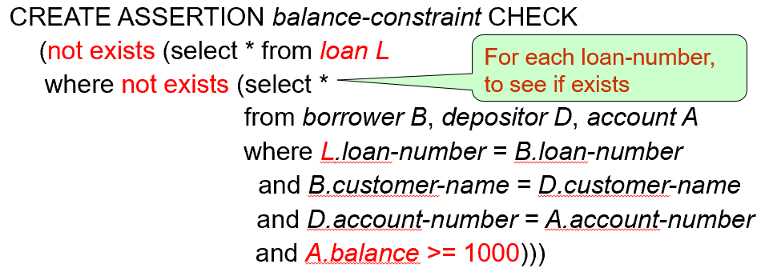

# Chapter 4: Advanced SQL

## 一、SQL Data Types and Schemas

1. **用户定义数据类型 User-defined types**
    - 用户定义数据类型允许创建枚举、结构体等复杂数据类型
    - 在使用上，与 SQL 的默认数据类型无差异
    
    ```sql
    -- 创建自定义数据类型
    Create type person_name as varchar (20)
    -- 使用自定义数据类型
    Create table student
    		               (sno char(10) primary key, 
       		              sname person_name
       		             )
    -- 删除自定义数据类型
    Drop type person_name 
    ```
    
2. **域 Domains**
    - 域是对已有数据类型的约束封装，它不能创建全新的数据结构，而是基于现有数据类型定义一套通用的规则
    - 适用于多个表需要复用相同的数据约束的场景
    - 允许为域添加默认值和约束条件（ `CHECK`）
    
    ```sql
    -- 创建域
    Create domain Dollars as numeric(12, 2) not null
    -- 使用域
    Create table employee 
    			        (eno char(10) primary key, 
    			         salary Dollars
    			        ); 
    ```
    
3. **大型对象类型 Large Object**
    - 大型对象使用 Large Object 类型存储，分为以下两类：
        - blob（binary large object）：存储二进制对象
        - clob（character large object）：存储字符对象
    - 程序请求大型对象时，返回指向大型对象的指针，而非返回对象本体
    
    ```sql
    Create table students 
    						(sid char(10) primary key, 
    						 name varchar(10), 
    						 photo blob(20MB), 
    						 cv clob(10KB)) ;
    ```
    

## 二、完整性约束 Integrity Constraints

### 1. 表和域的完整性约束

1. **单个表的约束**
    - `Not NULL`
    - `Primary Key`
    - `Unique`
    - `Check(P)` （P 为检查条件）
2. **域的约束**
    
    ```sql
    -- 创建带约束的域
    -- 其中子句 Constraint ... 是可选的，用于当约束违背时指示更新违反了哪个约束
    Create domain Dollars as numeric(12, 2) not null
    Constraint money-positive-test Check (Dollars >= 0.00); 
    ```
    

### 2. 参照完整性 Referential Integrity

1. **基本概念**
    - 在参照关系中，外键或者为 NULL，或者其值在被参照关系中实际存在
    - 在元组被插入、更新、删除时，都会对参照完整性进行检查
    - 仅在事务结束时检查引用完整性；即：如果事务的步骤中产生了冲突，但后续步骤在事务结束前删除了冲突，则该事务可以正常执行
2. **级联 Cascading**
    - 级联更新与删除（Cascading Update / Deletion）
        - 当被参照的元组发生更新或删除，导致参照关系失效时，参照它的元组将同步进行更新或删除
        - 如果跨多个关系存在外键依赖关系链，并且为每个依赖关系指定了级联删除，则链一端的删除或更新可以传播到整个链中
        - 如果级联更新或删除导致进一步的级联作无法处理的约束冲突，则系统会中止事务，由事务及其级联作引起的所有更改都将被撤消
    - 级联操作（Cascading Actions）
        - 当被参照的元组发生更新或删除，导致参照关系失效时，参照它的元组将把对应的外键置为 `NULL`
3. **SQL 实现**
    - 指定主键、候选键
        
        ```sql
        -- 指定主键
        primary key (customer-name, account-number)
        -- 指定候选键
        unique key (...)
        ```
        
    - 指定外键
        
        ```sql
        -- 默认情况，外键引用被引用表的主键属性
        foreign key (account-number) references account
        -- 指定外键引用的属性名称
        foreign key (account-number) references account(account-number)
        -- 行内简写
        account-number char(10) references account
        ```
        
    - 指定级联
        
        ```sql
        -- 中括号内为可选项，分别对应级联删除、级联更新、级联操作
        -- 在 SQL 语句中，不要出现下面的中括号
        foreign key (branch-name) references branch 
        		[ on delete cascade] 
        		[ on update cascade] 
        		[ on delete set null]
        		[ on update set null]
        		[ on delete set default]
        		[ on update set default]
        ```
        
    !!! example

        > **示例：**
        > 
        > 
        > ```sql
        > Create table depositor 
        > 	(customer-name	char(20), 
        > 	 account-number	char(10), 
        > 	 primary key (customer-name, account-number), 
        > 	 foreign key (account-number) references account on delete cascade, 
        > 	 foreign key (customer-name) references customer on delete cascade
        > 	 ); 
        > ```
        > 

### 3. 断言 Assertions

1. **基本概念**
    - 断言是用于多个关系的复杂检查条件，是我们希望数据库始终满足的条件
    - 系统将在每次可能违反的断言的更新中测试断言的有效性，可能会带来大量开销
2. **SQL 实现**
    - 格式：
        
        ```sql
        Create assertion assertion-name
        		Check <condition>;
        ```
        
    - SQL 无法表示形如 $for\ all\ X,P(X)$ 的表达式，需要转化为 $not\ exist\ X,such\ that\ not\ P(X)$ 的形式
    
    !!! example
        > **示例：**设置断言 “对每一笔借款, 至少有一个借款人有存款 $1000以上”
        > 
        > 
        > **分析：**上述断言等同于 “不存在这样一笔借款，其不存在存款在 $1000以上的借款人”
        > 
        > 
        > 
    
    !!! example
        > **示例：**断言的定义
        > 
        > 
        > 
        > 

### 4. 触发器 Triggers

1. **基本概念**
    - 触发器是系统自动执行的语句，作为对数据库的修改的副作用
    - 要设计触发机制，必须指定触发条件，以及触发器执行时要执行的操作
    - 分为 **行级触发器** 和 **语句级触发器**
    - 触发器早些年用于维护摘要数据等（例如：每个部门的总工资），但如今有更好的替代方案
    - 有时需要在数据库更新时触发外部操作（例如：库存不足时打开警报灯）；但触发器无法直接执行外部操作，实现方案如下：
        - 触发器将要执行的操作记录在一个单独的表中
        - 有一个外部进程，该进程重复扫描表、执行外部操作并从表中删除记录
    
    !!! example
        > **示例：**
        > 
        > 
        > 假设银行不允许账户余额为负数，而是通过以下方式处理透支：
        > 
        > - 将账户余额设置为零
        > - 创建透支金额的贷款，为该贷款提供与透支账户账号相同的贷款编号
        > 
        > 于是执行触发器的条件是：导致负余额值的账户关系更新
        > 

2. **行级触发器 Row-Level Trigger**
    - 关键词： `FOR EACH ROW` 指明该触发器是行级触发器
    - 触发时机：`BEFORE` 或 `AFTER` ，针对每一行数据触发一次
    - 触发操作：`INSERT`、`UPDATE`、`DELETE`
    - 支持 `NEW` 和 `OLD` 关键字，可访问受影响的具体行数据
        - `NEW` 关键字不适于 `DELETE`
        - `OLD` 关键字不适于 `INSERT`
    - 可以使用 `Referencing Old Row AS ...` 或 `Referencing New Row AS ...` 语句来引用受影响行
    
    ```sql
    -- 中括号内为可选项，用于为触发器指定具体的触发属性列
    -- 在 SQL 语句中，不要出现下面的中括号
    CREATE TRIGGER trg-name
    BEFORE UPDATE [OF attribute-name] ON table-name
    FOR EACH ROW
    BEGIN
        IF NEW.salary < 0 THEN
            ... ;
        END IF;
    END;
    ```
    
    ```sql
    -- 中括号内为可选项，用于为触发器指定具体的触发属性列
    -- 在 SQL 语句中，不要出现下面的中括号
    CREATE TRIGGER trg-name
    BEFORE UPDATE [OF attribute-name] ON table-name
    REFERENCING OLD ROW AS orow, NEW ROW AS nrow
    FOR EACH ROW
    BEGIN
        IF nrow.salary < 0 THEN
            ... ;
        END IF;
    END;
    ```
    
3. **语句级触发器 Statement-Level Trigger**
    - 关键词： `FOR EACH STATEMENT` 指明该触发器是语句级触发器
    - 每个 SQL 语句执行时只触发一次（无论影响多少行）
    - 不支持针对具体行的 `NEW` 和 `OLD`
    - 可以使用 `Referencing Old Table AS ...`  或 `Referencing New Table AS ...` 来引用包含受影响行的临时表 （称为转换表，Transition Tables）
    
    ```sql
    CREATE TRIGGER trg-name
    AFTER DELETE ON table-name
    FOR EACH STATEMENT
    BEGIN
        ... ;
    END;
    ```
    

## 三、授权 Authorization

### 1. 权限的形式

1. 适用对象为数据库范式的权限
    - Index：允许创建和删除索引
    - Resources：允许创建新的关系（表），但即使没有此权限也可以创建新的视图
    - Alteration：允许添加或修改关系中的属性
    - Drop：允许删除关系（表）
2. 适用对象为数据库实例的权限
    - Read：允许读数据
    - Insert：允许插入新数据
    - Update：允许修改数据
    - Delete：允许删除数据

### 2. 使用视图进行授权

1. 用户可以被授予基于视图（而非某张表）的权限
2. 用户获得视图权限后，不会自动获得对应的表的权限，从而提高安全性
3. 视图的创建者只能获得其已有的表权限范围内的视图权限，即权限不会因为视图的创建而扩大

### 3. 权限授予与撤回的 SQL 实现

1. **SQL 的权限名称**
    - SELECT
    - INSERT
    - UPDATE
    - DELETE
    - REFERENCES：允许在创建新的关系时指定该关系中的属性为外键
    - ALL PRIVILEGES（ALL）：表示所有权限
2. **使用 `GRANT` 语句进行授权**
    - 格式：
        
        ```sql
        GRANT <权限列表> ON <表名或视图名> TO <用户列表>
        ```
        
    - 用户列表允许的内容：
        - 用户名、角色名
        - `PUBLIC` 关键词
3. **使用 `REVOKE` 语句撤回授权**
    - 格式：
        
        ```sql
        REVOKE <权限列表> ON <表名或视图名> FROM <用户列表> [restrict | cascade]
        ```
        
    - 用户列表允许的内容：
        - 用户名、角色名
        - `PUBLIC` 关键词
    - 如果某个用户的某个权限被不同的用户授予了多次，那么撤回权限后，该用户的该权限可能仍然保留
    - 撤销用户的权限可能会导致其他用户也失去该权限
        - 可用 `CASCADE` 关键词设置权限的级联撤销（默认）
        - 可用 `RESTRICT` 关键词避免权限的级联撤销


!!! note

    **使用 SQL 进行权限管理的限制**

    - SQL 不支持在元组层级上进行权限管理（例如：不能允许学生只查看自己的成绩）
    - 上述功能的实现由 Web 服务器完成，事实上 Web 程序的所有终端用户都使用同一个数据库用户


### 4. 权限的传递

1. 权限可以由一个用户 $A$ 传递给另一个用户 $B$；但当 $A$ 的权限被撤回时， $B$ 的权限也会被同时撤回
2. 使用授权图（Authorization Graph）表示权限传递关系
    - $U_1,U_2…$ 表示用户
    - 箭头表示权限在用户之间的传递
    - 所有权限的最终来源是数据库管理员（DBA）
    - 在下图中，若 $U_1、U_2$ 的权限都被撤回， $U5$ 的权限才会被自动撤回
        
        
        
3. 在 SQL 中，默认不允许权限进行传递；如果希望在授权时允许该用户将权限传递给其它用户，需使用 `WITH GRANT OPTION` 关键词
    
    ```sql
    GRANT SELECT, DELETE ON table-name TO User1, User2 WITH GRANT OPTION;
    ```
    

### 5. 使用角色进行授权

1. 通过创建角色（Role），可以对某一类用户的权限进行批量管理
2. 角色可以被授予给用户或其它角色
3. 将权限授予给用户和授予给角色的 SQL 操作完全相同
    
    ```sql
    // 创建角色
    CREATE ROLE employee;
    CREATE ROLE manager;
    // 将角色授予给用户或其它角色
    GRANT manager TO Alice, Bob;
    GRANT employee TO manager;
    // 将权限授予给角色
    Grant select on branch to manager; 
    ```
    

### 6. 审计追踪 Audit Trails

1. 审计跟踪是数据库的一种日志（Log），记录数据库的所有更改（插入 / 删除 / 更新），以及进行更改操作的用户和操作时间
2. 可以使用触发器来实现，但许多数据库系统提供直接支持
3. SQL 实现
    
    
    

## 四、Embedded SQL

### 1. 基本概念

- SQL 可以嵌入各种编程语言，被嵌入的编程语言称为宿主语言（Host Language）
- 嵌入式 SQL 需要预处理器（pre_compiler），预处理器与宿主语言和使用的 DBMS 相关
- 宿主变量：宿主变量可在宿主语言程序中赋值，从而将值代入 SQL；在 SQL 中使用宿主变量时，需在宿主变量前加 `:`
- 基本语法： `EXEC SQL <嵌入式 SQL 语句> END_EXEC`

### 2. 查询操作

1. **单行查询**
    
    ```sql
    // 宿主变量定义区
    EXEC SQL BEGIN DECLARE SECTION; 
    	     char V_an[20], bn[20]; 
    	     float  bal; 
    EXEC SQL END DECLARE SECTION; 
    
    // 读入账号到宿主变量
    scanf(“%s”, V_an);
    
    // 执行 SQL 查询，使用 INTO 关键字将查询结果写入宿主变量
    EXEC SQL 
    SELECT branch_name, balance INTO :bn, :bal 
    FROM account WHERE account_number = :V_an; 
    END_EXEC
    
    printf(“%s, %s, %f”, V_an, bn, bal); 
    ```
    
2. **多行查询**
    - 步骤一：指定 SQL 语句，并为该 SQL 语句定义游标（cursor）
        
        `DECLARE <cursor_name> FOR <SQL 语句>`
        
    - 步骤二：打开游标
        
        `EXEC SQL OPEN <cursor_name> END_EXEC`
        
    - 步骤三：将游标中的值转存到宿主变量中
        - 重复执行此语句以读取所有的结果行
        - 在 SQL 通讯区（SQLCA）有一个变量 sqlcode，用于保存语句的执行状态：每次执行 SQL 语句返回代码（success, not_success），用于判断行的读取是否结束
        
        `EXEC SQL FETCH <cursor_name> INTO <host_variable_list> END_EXEC`
        
    - 步骤四：关闭游标
        
        `EXEC SQL CLOSE <cursor_name> END_EXEC`
        
    
    ```sql
    Exec SQL include SQLCA
    
    // 宿主变量定义区
    Exec SQL BEGIN DECLARE SECTION; 
    	char bn[20], bc[30]; 
    Exec SQL END DECLARE SECTION; 
    
    // 指定 SQL 语句，并定义游标
    Exec SQL DECLARE branch_cur CURSOR FOR 
    	Select branch_name, branch_city From branch; 
    	
    // 打开读取游标，将游标中的值转存到宿主变量中，并关闭游标
    Exec SQL OPEN branch_cur; 
    While (1) {
    	Exec SQL FETCH branch_cur INTO :bn, :bc; 
      if (sqlca.sqlcode <> SUCCESS) BREAK; } 
    Exec SQL CLOSE branch_cur; 
    
    ```
    

### 3. 更新操作

1. **单行更新**
    
    ```sql
    // 宿主变量定义区
    Exec SQL BEGIN DECLARE SECTION; 
    	char an[20]; 
    	float bal; 
    Exec SQL END DECLARE SECTION; 
    
    // 读入账号及要增加的存款额到宿主变量 
    scanf(“%s, %d”, an, &bal);   
    
    // 执行 SQL 更新
    Exec SQL update account 
    	SET balance = balance + :bal 
    	WHERE account_number = :an; 
    ```
    
2. **多行更新**
    - 步骤一：指定 SQL 语句，并为该 SQL 语句定义用于更新的（ `FOR UPDATE` ） 游标（cursor）
        
        `DECLARE <cursor_name> FOR <SQL 语句> FOR UPDATE OF <table_name>` 
        
    - 步骤二：打开游标
    - 步骤三：将游标中的值转存到宿主变量中（与多行查询相似）
    - 步骤四：执行 SQL 更新，使用 `CURRENT OF <cursor_name>` 进行定位
    - 重复执行步骤三、四以更新所有的行
    - 步骤五：关闭游标
    
    ```sql
    // 宿主变量定义区
    Exec SQL BEGIN DECLARE SECTION;  
    	char an[20]; 
    	float bal; 
    Exec SQL END DECLARE SECTION; 
    
    // 指定 SQL 语句，并定义用于更新的游标
    EXEC SQL DECLARE csr CURSOR FOR 
    	SELECT * FROM account WHERE branch_name = ‘Perryridge’ 
    	FOR UPDATE OF balance; 
    	
    // 打开读取游标，将游标中的值转存到宿主变量中，然后执行 SQL 更新，最后关闭游标
    EXEC SQL OPEN csr;
    While (1) { 
    	EXEC SQL FETCH csr INTO :an, :bn, :bal; 
    	if (sqlca.sqlcode <> SUCCESS) BREAK; 
    	
      ... // 由宿主语句对an, bn, bal中的数据进行相关处理(如打印) 
    	
    	EXEC SQL update account 
       	set balance = balance + 100 where CURRENT OF csr; 
      } 
    EXEC SQL CLOSE csr;
    ```
    

### 4. Dynamic SQL

允许程序在运行时构建和执行 SQL 语句


## 五、ODBC 和 JDBC

### 1. ODBC

1. ODBC 全称 Open Database Connectivity（开放数据库互联），允许应用程序通过统一的 API 访问不同类型的数据库系统（如 Oracle、SQL Server、MySQL 等），而无需依赖特定数据库的底层实现
    
    
    
2. ODBC 标准定义了一致性等级（Conformance Level），根据 ODBC 对标准的支持情况分为 Core Level、L1、L2；其中 L1 支持元数据检索（Metadata Retrival）、L2 支持更多信息的查询
3. ODBC 句柄类型
    
    
    
4. ODBC 编程要点
    
    
    
    
    
    ```c
    // 程序框架
    int ODBCexample()
    { 
    	   RETCODE error; 
    	   HENV env;
    	   HDBC conn;
    	   SQLAllocEnv(&env);                    // 分配环境句柄
    	   SQLAllocConnect(env, &conn);          // 分配连接句柄
    	   SQLConnect (conn, "MySQLServer", SQL_NTS, "user", SQL_NTS, 
    							   "password", SQL_NTS);     // 建立用户user与数据源的连接
    	   { …. Main body of program … }
    	   SQLDisconnect(conn); 
    	   SQLFreeConnect(conn); 
    	   SQLFreeEnv(env); 
    }
    
    // 程序主体
    char branchname[80]; 
    float balance; 
    int lenOut1, lenOut2; 
    HSTMT stmt; 
    SQLAllocStmt(conn, &stmt);   // 分配语句句柄
    char * sqlquery = "select branch_name, sum (balance) from account group by branch_name";
    error = SQLExecDirect(stmt, sqlquery, SQL_NTS); // 执行 SQL 语句
    if (error == SQL_SUCCESS)
    { 
    	  SQLBindCol(stmt, 1, SQL_C_CHAR, branchname,80, &lenOut1); 
    	  SQLBindCol(stmt, 2, SQL_C_FLOAT, &balance, 0, &lenOut2); 
    	  /* 对stmt中的返回结果数据加以分离，并与相应变量绑定。第1项数据转换为C的字符
    	  类型，送变量branchname(最大长度为80)， lenOut1为实际字符串长度（若＝-1代表
    	  null），第2项数据转换为C的浮点类型送变量balance中 */ 
    	  
    	  while ( SQLFetch(stmt) >= SQL_SUCCESS) 
    	  { /* 逐行从数据区stmt中取数据，放到绑定变量中 */ 
    		  printf ("%s  %d\n", branchname, balance); 
    	  } 
    } 
    SQLFreeStmt(stmt, SQL_DROP);  // 释放语句句柄
    
    ```
    

### 2. JDBC

1. JDBC 是与数据库系统进行交互的 Java API
2. JDBC 支持元数据检索（Metadata Retrival），例如查询数据库中存在的关系以及关系属性的名称和类型
3. JDBC 编程要点
    - Open a connection
    - Create a “statement” object
    - Execute queries using the Statement object to send queries and fetch results
    - Exception mechanism to handle errors
    
    ```java
    public static void JDBCexample(String dbid, String userid, String passwd) 
    { 
    	try 
    	{ 
    		Class.forName ("oracle.jdbc.driver.OracleDriver"); 
    	  Connection conn = DriverManager.getConnection 
    		            ("jdbc:oracle:thin:@aura.bell_labs.com:2000:bankdb", userid, passwd); 
        Statement stmt = conn.createStatement(); 
        ResultSet rset = stmt.executeQuery("select branch_name, avg(balance) from account group by branch_name"); 
        while (rset.next()) { 
    		  System.out.println(rset.getString("branch_name") + "  " + rset.getFloat(2));
    		  // 取名为"branch_name"的属性，其类型为字符串
    		  // 取第二个属性，其类型为浮点数（属性的编号从 1 开始）
    		} 
    
    	  stmt.close(); 
        conn.close(); 
      } 
      catch (SQLException sqle) 
      { System.out.println("SQLException : " + sqle); } 
    } 
    ```
    
4. 使用预处理语句防止 SQL Injection 攻击
    - 预处理语句（Prepared Statement）允许套用不同的参数执行多次查询
    - 预处理语句可以正确处理参数中存在的单引号等特殊符号，以防止 SQL Injection 攻击
    
    ```java
    PreparedStatement pStmt = conn.prepareStatement( 
    	                        "insert into account values(?,?,?)");  
    pStmt.setString(1, "A_9732"); 
    pStmt.setString(2, "Perryridge"); 
    pStmt.setInt(3, 1200); 
    pStmt.executeUpdate(); 
    ```