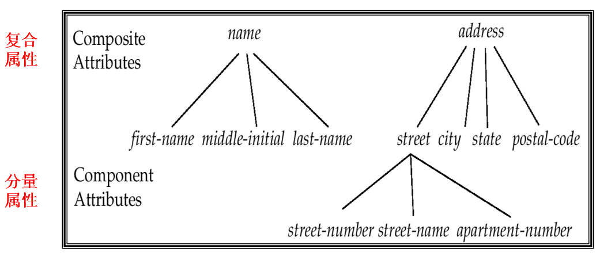

# Chapter 5: Entity-Relationship Model

## 一、E-R 模型概述

数据库可以建模为实体（Entity）的集合与实体之间的关系（Relationship）

### 1. 实体集 Entity Sets

1. 实体集是具有相同属性（特征）的同类实体的集合
2. 实体具有属性（Attribute），分为如下类型：
    - 简单属性（Simple Attribute）和复合属性（Composite Attribute）
    - 单值属性（Single-valued Attribute）和多值属性（Multi-valued Attribute）
    - 派生属性（Derived Attribute）：派生属性可以由其它的属性计算得出，例如“年龄”是“生日”的派生属性

2. 派生属性内部又分为如下类型：

- 基属性（Base Attribute）：用于计算派生属性的原始属性
- 存储属性（Stored Attribute）：对于简单的派生属性，数据库可以不存储，而在被调用时实时计算，因此被数据库实际存储的属性称为存储属性
- 基属性一定是存储属性，存储属性不一定是基属性
1. 复合属性的设计不满足第一范式，在实现中常分解为分量属性（Component Attributes）
    
    
    

### 2. 联系集 Relationship Sets

1. 联系集表示两个或多个实体集之间的关联
2. **联系集的度 Degree**
    - 概念：联系集关联的实体集数目
    - 通常，一个联系关联两个实体，其度为 2，这样的联系集称为二元联系集（Binary Relationship Set）
    - 一般的自环联系集的度为 2
3. **映射基数 Mapping Cardinalities**
    - 概念：一个联系集中，一个实体可以与另一类实体相联系的实体数目
    - 对于二元联系集，映射基数可以有以下类型：一对一、一对多、多对一、多对多
    
    
    
4. 参与一个联系集的各实体集的主键的组合，构成该联系集的键码

## 二、E-R Diagram

### 1. 图例总览

1. **方案 1**

1. **方案 2**

### 2. 集合与属性的表示

- 长方形表示实体集
- 菱形表示联系集
- 椭圆表示属性
- 双椭圆表示多值属性
- 虚线椭圆表示派生属性
- 树形结构表示复合属性
- 加下划线的属性表示主键
- 联系集可以拥有属性

### 3. 自环联系集 Recursive Relationship Set

1. 自环联系集（Recursive Relationship Set）对同一个实体集内部实体之间发生的联系进行描述
2. 角色（Role）是指实体在特定联系中扮演的功能或身份；角色在自环联系中尤为重要，因为需要通过角色来区分同一实体集中实体的不同参与方式

### 4. 关联数目的限制

- 映射基数限制了实体参与关联的上限（1 或多）
- 全参与和部分参与限制了实体参与关联的下限（0 或 1）
1. **映射基数限制**
    
    使用直线表示 “X 对多”，使用箭头表示 “X 对一”
    

1. **实体集在联系集中的参与性**
    - 全参与（Total Participation）：实体集中的每个实体在联系集中至少参与 1 个联系，使用双连线表示
    - 部分参与（Partial Participation）：实体集中的一些实体可以不参与联系集，使用单连线表示

1. **关联数目限制的另一种表示法**

### 5. 将非二元关系转化为二元关系

通过创建新的实体集，任何非二元关系都可以转化为二元关系

## 三、弱实体集 Weak Entity Sets

### 1. 基本概念

1. 不具有主键的实体集称为弱实体集（Weak Entity Set）
2. 弱实体集依附于强实体集存在，被依附的强实体集称为识别实体集（Identifying Entity Set）
3. 弱实体集与识别实体集间的联系称为识别联系集（Identifying Relationship Set），识别关系集在数据库的真实实现中不存在
4. 在识别关系集中，每个弱实体都对应唯一一个强实体
5. 弱实体集的鉴别器（Discriminator）又称部分键（Partial Key），它是一组属性，用于区分弱实体集中依赖于一个特定强实体的所有实体
6. 弱实体集的主键由识别实体集的主键和弱实体集的鉴别器两部分组成

### 2. 图例表示

- 双长方形表示弱实体集
- 双菱形表示识别联系集
- 加虚线下划线的属性表示鉴别器（Discriminator）

## 四、Extended E-R Features

### 1. 对泛化 / 特殊化的支持

1. **泛化与特殊化**
    - 泛化（Generalization）：一种自底向上（Bottom-Up）的设计思路，通过抽离共同点构建更高层级的实体
    - 特殊化（Specialization）：一种自上而下（Top-Down）的设计思路，通过分离不同点构建更低层级的实体
    - 泛化与特殊化是互逆的过程，它们在数据库中的实现方法完全相同

1. **相交性与完全性**
    - 根据高层级的实体是否可以属于多个低层级的实体，设置两种对立的约束条件：不相交（Disjoint）、可重叠（Overlapping）
    - 根据高层级的实体是否一定属于低层级的实体，设置两种对立的约束条件：完全泛化（Total Generalization）、部分泛化（Partial Generalization）

### 2. 聚合 Aggregation

聚合是一种抽象机制，用于表示 “关系之间的关系”，它将多个实体及其关系抽象为一个更高层次的实体，称为复合实体集

图：聚合前

图：聚合后

## 五、E-R Schema 的设计

### 1. 设计流程

1. 需求分析 Requirement Analysis
2. 概念数据库设计 Conceptual Database Design：构建 E-R 模型等 High level data model
3. 逻辑数据库设计 Logical Database Design：将概念设计转化为数据库范式（表）
4. 物理数据库设计 Physical Database Design：构建索引、集群、数据库调优

### 2. 构建 E-R 模型

!!! example
    > **示例 1：**
    > 
    > 
    > 
    > 
    > 
    > 

!!! example
    > **示例 2：**
    > 
    > 
    > 
    > 
    > 
    > 

### 3. 将 E-R 模型转化为 Table

1. 为每个实体集和联系集设计一张表与之对应
2. 为每个弱实体集设计一张表与之对应，但该表的属性中包含其识别实体集的主键；不需要为识别联系集设计单独的表
3. 为联系集设置外键，并根据映射基数限制选取合适的主键，这里的主键可能由一个属性构成，也可能由两个或更多个属性构成
    
    !!! example
        > **示例：**
        > 
        > 
        > 
        > 

4. 对于一对多关系的联系，可将联系集对应的表合并到对应 “多” 端实体的表中
    

    !!! example
        > **示例：**
        > 
        > 
        > 
        > 

5. 将复合属性进行扁平化处理
    
    !!! example
        > **示例：**
        > 
        > 
        > 
        > 

6. 将多值属性进行单独成表处理
    
    !!! example
        > **示例：**
        > 
        > 
        > 
        > 
    
7. 对泛化与特殊化用表表示

