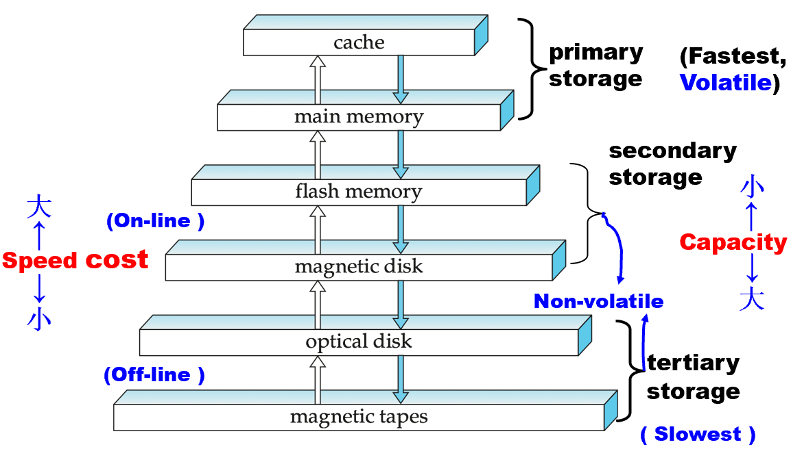

# Chapter 7: Storage and File Structure

## 一、存储介质 Physical Storage Media

### 1. 存储层次 Storage Hierarchy

1. 一级存储（Primary Storage）
    - 最快，易失
    - 包括 Cache 和 Main Memory
2. 二级存储（Secondary Storage）
    - 慢于一级存储，不易失
    - 又称为联机存储器（on-line storage）
    - 包括 Flash Memory 和 Magnetic Disk
3. 三级存储（Tertiary Storage）
    - 最慢，不易失，常用于数据备份
    - 又称为脱机存储器（off-line storage）
    - 包括 Optical Disk（光盘）和 Magnetic Tapes（磁带）

### 2. 磁盘 Magnatic Disk

1. **磁盘的特性**
    - 磁盘是长期数据的主要介质，通常将整个数据库存储于磁盘上
    - 磁盘支持直接访问（Direct-access），即磁盘上的数据可以按任意顺序读取（反例：磁带只能按顺序读取 Sequential-access）
2. **磁盘的结构**
    
    
    
    - 盘片（Platter）：一块磁盘约有 4-16 个盘片
    - 磁道（Track）：每个盘片约有 50K-100K 个磁道
    - 扇区（Sector）：每个磁道包含千余个扇区，每个扇区常规为 512 字节，扇区是数据读写的最小单元
    - 柱面（Cylinder）：柱面是磁盘中所有盘片上相同半径的磁道的集合
    - 转轴（Spindle）：多个盘片连接在同一个转轴上，共同旋转
    - 读写头（Read-write head）：与盘片接触，用于读写数据
    - 臂（Arm）：所有读写头固定在一个共用的臂上
3. **磁盘的工作原理**
    - 臂旋转到正确的磁道上方
    - 盘片持续地转动，当扇区经过读写头下方时，进行数据的读写
4. **磁盘控制器 Disk Controller**
    - 磁盘控制器是计算机系统和磁盘硬件之间的接口，可以接受磁盘读写的高级命令，并对相应位置进行读写操作
    - 在读取数据后，计算数据的校验和（Checksum）附加到每个扇区，以验证数据是否被正确读取（如果数据损坏，存储的校验和很可能与重新计算的校验和不匹配）
    - 在写入数据后，通过读回扇区来确保成功写入
    - 执行不良扇区的重映射（remapping of bad sectors）：将该扇区从逻辑上映射到预留的物理扇区，并且重映射被记录在磁盘或其他非易失性存储器中
5. **磁盘子系统 Disk Subsystem**
    
    
    
    - 多个磁盘通过同一个控制器连接到总线
    - 磁盘接口分为不同标准（ATA、SATA …），对应不同的速度等级和能力
6. **磁盘的性能评估**
    - 访问时间（Access Time）
        - 含义：从读写请求发出，到数据开始传输的时间
        - 访问时间 = 寻道时间 + 旋转延迟
        - 寻道时间（Seek Time）：将读写头移动到正确的磁道上方需要的时间
        - 旋转延迟（Rotational Latency）：将扇区旋转到读写头下方的时间，平均为盘片旋转一圈用时的二分之一
    - 数据传输速率（Data-transfer rate）
        - 内侧的磁道慢于外侧
        - 多个磁盘通过同一个控制器连接到总线时，数据传输速率受到控制器的影响
    - 平均故障时间（MTTF）
        - 含义：磁盘在没有任何故障的情况下连续运行的平均时间
        - MTTF 随磁盘老化而降低
7. **磁盘的优化技术**
    - 块（Block）
        - 含义：单个磁道上多个连续扇区组成的序列
        - 数据在磁盘与主存之间的传输，实际上以块为单位，是对空间局部性的利用
        - 常见的块大小为 4-16 千字节
    - 磁盘臂调度算法（Disk-arm-scheduling algorithms）
        - 对待处理的轨道访问进行排序，以使磁盘臂的移动最小化
        - 电梯算法：在一个方向上移动磁盘臂（从外轨道到内轨道，反之亦然），处理该方向上的下一个请求，直到该方向上没有更多请求，然后反转方向并重复
    - 文件组织（File Organization）
        - 文件可能会随着时间的推移而碎片化，对碎片文件的顺序访问会导致磁盘臂移动增加，从而降低速度
        - 对文件系统进行碎片整理，以加快文件访问速度；但是，在碎片整理期间，系统通常无法使用
    - 非易失性写缓冲区（Non-volatile Write Buffers）
        - 当写请求时，立即将块写入非易失 RAM 缓冲区，从而加速磁盘写入
        - 当磁盘空闲时，控制器才将缓冲区的数据写入磁盘
        - 缓冲区的非易失性保证了数据的断电安全
    - 日志磁盘（Log Disk）
        - 日志磁盘是顺序记录块更新（block updates）的磁盘，所有写入操作以追加日志的形式存储，类似于非易失性 RAM 的行为
        - 无需寻道：数据始终顺序写入，磁头无需移动，大幅提升写入速度

### 3. 光盘 Optical Disk

1. CD-ROM（Compact Disk ROM）
    - 出厂时数据已经固化，仅可读，不可写
    - 常见于商业软件、音乐专辑等预录制内容
    - 相比于磁盘，寻道时间更长，转速更高，数据传输速率更低
2. CD-R / DVD-R：不可擦写，一次写入，多次读取
3. CD-RW / DVD-RW / DVD-RAM：可擦写，多次写入，多次读取

### 4. RAID 技术

1. **RAID：**独立磁盘冗余阵列，Redundant Arrays of Independent Disks
2. **比特级拆分和块级拆分**
    - 比特级拆分（Bit-Level Striping）：将文件的每个字节按位拆分到多个磁盘上（很少使用）
    - 块级拆分（Block-Level Striping）：将文件按块拆分到多个磁盘上
3. **RAID Levels**
    - Level 0：按块拆分，无任何冗余
        - 适用于高性能要求，数据丢失不重要的场景
    - Level 1：按块拆分，硬盘镜像
        
        
        
    - Level 2：按比特拆分，ECC 校验
        - 已被淘汰
    - Level 3：位交错奇偶校验
        - 与单个磁盘相比，数据传输更快，但每秒 I/O 更少，因为每个磁盘都必须参与每个 I/O
        
        
        
    - Level 4：块交错奇偶校验
        
        
        
    - Level 5：高 I/O 速率交错奇偶校验
        
        
        
    - Level 6：P+Q 冗余校验
        
        
        
4. **RAID Level 的选择**
    - 最常用的是 Level 1 和 Level 5
        - Level 1 和 5 已经可以 提供足够的安全性，因此 Level 6 不常用
        - Level 2、3、4 都可被 5 替代，因此不常用
    - Level 1 的写性能强于 Level 5
        - Level 1：1 次逻辑写 = 2 次物理写
        - Level 5：1 次逻辑写 = 2 次物理读 + 2 次物理写
            
            
            
    - Level 1 的存储开销大于 Level 5
        - 然而，在技术发展的当下，磁盘容量快速增长，但访问速度提升有限
        - 许多场景（如Web服务器）的 I/O 需求激增，购买足够磁盘满足 I/O 需求后，剩余存储空间常被闲置，因此选择 Level 1 通常无需额外成本
    - 总结
        - Level 5 适用于大量数据、数据更新慢的情形
        - Level 1 适用于其它所有情形

## 二、存储访问 Storage Access

- 数据库文件在逻辑上被划分为称为块（Block）的固定长度存储单元
- 块是数据库系统中存储分配和数据传输的单位
- 数据库系统旨在尽量减少磁盘和内存之间的块传输次数
- 缓冲区（Buffer）：位于 **内存（Main Memory）**中，可用于存储磁盘块的副本
- 缓冲区管理器（Buffer Manager）：负责在内存中分配缓冲区空间

### **1. 缓冲区的结构**

- 页、块与帧
    - 页（Page）：数据单元
    - 块（Block）：磁盘空间单元（在实践上，页 = 块）
    - 帧（Frame）：缓冲区单元
- 为了使缓冲区正常工作，需要维护一个 <帧号，页号> 的表
- 缓冲区的所有帧被填满时，若有新数据需要取入缓冲区，则需要根据替换策略（Replacement Policy）替换掉原有的某个帧

### **2. 缓冲区管理器**

- 应用程序在需要磁盘中的块时，会调用缓冲区管理器
- 如果块已经在缓冲区中，则向请求程序提供内存中块的地址
- 如果块不在缓冲区中：
    - 缓冲区管理器在缓冲区中为新块分配空间
    - 被覆盖的旧块，若已被修改过（dirty），则先写回磁盘
    - 将新块读入缓冲区中，并向请求程序提供内存中块的地址

### 3. 替换策略

1. **最近最少使用 Least Recently Used（LRU）**
2. **最近最常使用 Most Recently Used（MRU）**
3. **特殊情况**
    - 被钉住的块（Pinned Block）：不允许将被钉住的块写回磁盘
        - 若某个块正在被使用，则可以将其钉住
        - 使用钉住计数（Pin Count）记录某个块正被多少个事务同时使用，仅当 Pin Count = 0 时才允许将块写回磁盘
    - 立即丢弃策略（Toss-Immediate Strategy）：对缓冲区中的每个块，用后立即丢弃
    - 强制写出（Forced Output）：某些情况需要把块写回磁盘，以确保磁盘上的数据处于一致性状态，称为 “强制写出”

## 三、文件组织 File Organization

- 数据库由一系列文件进行存储，每个文件都是记录（records）的序列
- 记录分为两类：
    - 定长记录（Fixed-Length records）
    - 变长记录（Variable-Length records）

### 1. 定长记录的表示法

- 在文件的开头，分配特定数量的字节作为文件头（File Header），文件头中存储一个内容被删除的第一条记录的地址
- 使用被删除的第一条记录的地址存储被删除的第二条记录的地址，以此类推，构成一个由被删除记录组成的链表，称为 **自由链表（Free List）**
- 在插入新记录时，优先插入到自由链表的第一个节点处；若自由链表中没有可用的空间，则把新记录查到表的末尾

### 2. 变长记录的表示法

- 具有变长属性的记录的表示分为两个部分：
    - 第一部分：为定长，记录第二部分的位置和长度，通常表示为一个（偏移量，长度）对，其中 “偏移量” 表示在记录中该属性的数据开始的位置，“长度” 表示变长属性的字节长度
    - 第二部分：为变长，记录属性的实际内容
- 在记录的初始定长部分之后，变长属性的值是连续存储的
- 空位图（Null Bitmap）记录哪些属性是空值，若为空值，则对应的位将被置为 “1”

!!! example

    > **示例：**
    > 
    > 
    > 下图显示了一条记录，前三个属性为变长字符串，第四个属性是一个大小固定的数值
    > 
    > - 第一个属性：定长部分位于 0-3 字节，表示变长部分开始于 21 字节、长度 5 字节
    > - 第二个属性：定长部分位于 4-7 字节，表示变长部分开始于 26 字节、长度 10 字节
    > - 第三个属性：定长部分位于 8-11 字节，表示变长部分开始于 36 字节、长度 5 字节
    > - 第四个属性：位于 12-19 字节，记录一个整数 65000
    > - 空位图：位于 20 字节，表明上述四个属性均非空值
    > 
    > 
    > 

### 3. 变长记录的定长表示法

1. **通过预留空间（reserve space）进行定长表示**
    - 要求：变长属性的最大长度已知
    - 未被使用的空间可使用 `null` 或 `end-of-record` 标识进行填充
    
    
    
2. **通过指针进行定长表示**
    - 实现方案一：直接使用指针
    
    
    
    - 实现方案二：使用锚块和溢出块以减小空间浪费
        - 锚块（Anchor Block）：存储定长和变长属性
        - 溢出块（Overflow Block）：存储锚块无法容纳的变长属性
        - 溢出块与锚块通过指针相连，溢出块也可与溢出块通过指针相连
    
    
    

### 4. 在块中存储变长记录

- 使用 **分槽的页结构（Slotted-Page Structure）**在块中存储记录
- 每个块的开始处有一个块头，包含以下信息：
    - 块中记录项的数量
    - 块中自由空间的末尾处
    - 一个由包含每条记录的位置和大小的项组成的数组

- 块中的自由空间是连续的
- 插入新记录时，在自由空间的尾部给这条记录分配空间，并将包含这条记录的位置和大小的项加到块头中
- 删除记录时，需要通过移动块中其它记录的方式，保证自由空间的连续性
- 由外界指向记录的指针不应当直接指向记录的存储位置，而是指向块头中该记录的位置，称为间接指针（Indirect Pointer）

## 四、文件中记录的组织 Organization of Records in Files

本节研究记录的组织顺序，分为以下四种：

- **堆文件（Heap File）：**只要有空间，一条记录可以存储在文件的任何位置
- **顺序文件（Sequential File）：**根据某个指定的 Search Key，按其排序进行存储
- **散列文件（Hashing File）：**根据某些指定的属性和指定的哈希函数，决定每条记录应当存储于文件的哪一个块中
- **聚集文件组织（Clustering File Organization）：**多个不同的关系可以存储于同一文件中，有助于减小 I/O

### 1. 顺序文件 Sequential File

- 删除：直接修改指针链
- 插入：先确定新记录应当被插入的位置，然后选定一个空位置插入新记录，最后修改指针链（如果表中没有空位置，则将新记录放在溢出块中）
- 需要定期对文件重新排序

### 2. 多表聚集文件组织 Multi-table Clustering File Organization

- 若常进行两表的 `Join` 操作，则将两表存储于同一文件中可提高查询速度
- 若常对某一个表进行操作，则可能降低效率
- 可以使用指针，对属于某一个表的记录进行串联

## 五、其它存储组织形式

### 1. 元数据的存储

1. 数据库系统需要对元数据进行维护，元数据存储在一种称为 **数据字典（Data Dictionary）**或 **系统目录（System Catalog）**的结构中
2. 元数据通常包含以下内容：
    - 关系的信息：关系的名称、属性的名称和类型、视图的名称和定义、完整性约束
    - 账户名、密码等信息
    - 数据库的统计信息、描述性信息
    - 文件的物理存储信息：文件名、组织类型（堆、顺序、散列 …）

### 2. 面向列的存储 Column-Oriented Storage

1. 原理：将同一个关系的不同属性分开存储
2. 优点：非常适合数据分析查询
    - 减小 I/O：当查询只需要访问某几个属性时，其余属性并不需要从磁盘提取到内存中；相反，在面向行的存储中，无关的属性也从磁盘提取到内存中
    - 提高 CPU Cache 性能：当查询只需要访问某几个属性时，列存储更有利于发挥空间局部性，避免将不需要的属性存入 Cache
    - 提高压缩效率：同一列的数据具有相同的类型，便于压缩
    - 支持向量处理：支持向量处理的 CPU 可以并行地应用于一个数组的多个元素上。通过按列存储数据，可以对操作进行向量处理，并行计算多个值的聚集
3. 缺点：
    - 元组重构的代价
    - 元组删除和更新的代价
    - 解压缩的代价（如果使用压缩表示）
4. 一些数据库同时支持行存储和列存储，称为混合行列存储（Hybrid row/column stores）