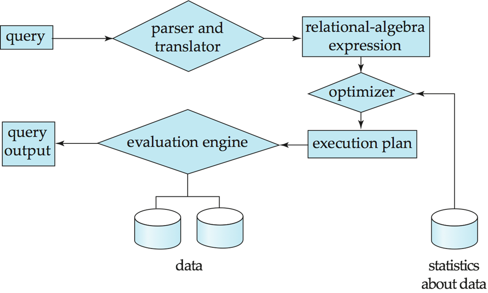

# Chapter 9: Query Processing

## 一、概述

### 1. 查询处理的基本流程

- 语法分析与解释器：将 SQL 语言转化为关系代数
- 优化器：结合统计数据，在关系代数的若干等价形式中选择最优的等价形式，确定关系代数的执行算法，输出执行方案

### 2. 查询代价的衡量

1. **代价（Cost）：**执行查询操作的总经过时间（Total Elapsed Time），包括磁盘访问（Disk Access）、CPU、网络通信时间等，其中磁盘访问时间影响最大，其它时间可以忽略不计
2. **磁盘访问代价**
    - 包括寻道时间（Seek Time）和块传输时间（Block Transfer Time）
    - 写的代价大于读，因为写入的数据需要被重新读出以确保写入的正确性
    - 寻道的代价大于块传输
    - 计寻道时间为 $t_S$，块传输时间为 $t_T$，寻道次数为 $S$，块传输个数为 $b$，则总代价为 $b\times t_T+S\times t_S$
3. 查询代价与主存中缓冲区的大小紧密相关，难以精确估计，因此常常只对最好情况和最坏情况进行估计

## 二、选择操作 Select Operation

### 1. 基本选择算法

1. **A1 Linear Search**
    - 原理：顺序读每个块，对每条记录进行选择条件的检验
    - 代价分析：
        - 块传输： $b_r$（存储关系 $r$ 所用的块数）
        - 寻道：1
    - 代价分析（若检索条件是主键或唯一键，则扫描到记录后无需继续扫描，平均情况如下）：
        - 块传输： $\frac{b_r}2$（存储关系 $r$ 所用的块数）
        - 寻道：1
2. **A2 Binary Search**
    - 适用性：仅适用于有序文件，查询条件必须是等值比较
    - 代价分析：
        - 块传输： $\lceil \log_2(b_r)\rceil+\lceil sc(A,r)/f_r\rceil -1$
            - $sc(A,r)$ 是满足选择条件的记录数
            - $f_r$ 是每个块存储的记录数
            - $-1$ 表示第一个块已经被 $\lceil \log_2(b_r)\rceil$ 中完成读取，不需重复计数
        - 寻道： $\lceil \log_2(b_r)\rceil$

### 2. 使用索引的选择算法

1. **A3 Primary Index, Equality on Key**
    - 适用性：
        - 最多一个元组满足查询条件
        - 查询条件是等值比较
        - 查询条件的索引为主索引
    - 代价分析：
        - 块传输 = 寻道： $h_i+1$
            - $h_i$ 表示索引树的高
            - 1 表示对实际存储块的访问
2. **A4 Primary Index, Equality on Nonkey**
    - 适用性：多个元组满足查询条件
    - 代价分析：
        - 块传输： $h_i+b$
            - 满足查询条件的多个元组应当位于连续的块上，令 $b$ 为这些块的总数
        - 寻道： $h_i+1$
3. **A5 Secondary Index, Equality on Nonkey**
    - 代价分析（单个元组满足查询条件）：
        - 块传输 = 寻道： $h_i+1$
    - 代价分析（多个元组满足查询条件）：
        - 块传输 = 寻道： $h_i+n$
            - 设共有 $n$ 个元组满足查询条件
            - 由于这 $n$ 个元组可能分布在不同块上，因此查询开销非常大，甚至大于 A1 算法

### 3. 进行比较的选择算法

1. **A6 Primary Index, Comparison**
    - 对于 $\sigma_{A≥v}(r)$，使用索引找到第一个满足 $A≥v$ 的元组，从此开始进行顺序扫描
    - 对于 $\sigma_{A≤v}(r)$，无需使用索引，从头进行顺序扫描，直到第一个不满足 $A≤v$ 的元组
2. **A7 Secondary Index, Comparison**
    - 对于 $\sigma_{A≥v}(r)$，使用索引找到第一个满足 $A≥v$ 的指针，从此开始对 B+ 树的叶子进行顺序扫描，获得指针并进行访问
    - 对于 $\sigma_{A≤v}(r)$，从 B+ 树的第一个叶子开始进行顺序扫描，获得指针并进行访问，直到第一个不满足 $A≤v$ 的元组

### 4. 复杂条件的选择算法

1. **A8 Conjunctive Selection using one Index**
    - Conjunction： $\sigma_{\theta_1\land\theta_2\land…}(r)$
    - 从 n 个条件 $\theta_1,…,\theta_n$ 中选择代价最小的 $\theta_i$ 先执行（使用 A1 至 A7 算法），将执行结果存入内存，然后重复上述过程
2. **A9 Conjunctive Selection using Composite Index**
    - 若有可用的多值索引，则可进行使用
3. **A10 Conjunctive Selection by Intersection of Identifiers**
    - 对每个选择条件各自使用相应的索引，获得对应的指针，然后将分属不同选择条件的指针取交集，得到的指针集合即为结果的指针集合
    - 对这些指针进行访问，即得到最终结果
    - 如果一部分选择条件中出现的属性没有对应的索引，则先对其他选择条件执行上述操作，再对没有索引的属性进行单独检测
4. **A10 Disjunctive Selection by Union of Identifiers**
    - Disjunction： $\sigma_{\theta_1\lor\theta_2\lor…}(r)$
    - 对每个选择条件各自使用相应的索引，获得对应的指针，然后分属不同选择条件的指针取并集，得到的指针集合即为结果的指针集合
    - 对这些指针进行访问，即得到最终结果
5. **Negation**
    - Negation： $\sigma_{\lnot \theta}(r)$
    - 法一：线性扫描
    - 法二：若满足条件 $\lnot \theta$ 的元组非常少，且对应的属性上具有索引，则使用索引进行查找，从全集中排除查找到的条目，即得到最终结果

## 三、外部排序 External Sorting

**代价分析：**

- 归并轮数： $\lceil\log_{M-1}(b_r/M)\rceil$
- 块传输：
    - 若最后数据不写回磁盘： $b_r(2\lceil\log_{M-1}(b_r/M)\rceil+1)$
    - 若最后数据写回磁盘： $b_r(2\lceil\log_{M-1}(b_r/M)\rceil+2)$
- 寻道：
    - 若最后数据不写回磁盘：
        
        $2\lceil b_r/M\rceil+\lceil b_r/b_b\rceil(2\lceil\log_{M-1}(b_r/M)\rceil -1)$
        
    - 若最后数据写回磁盘：
        
        $2\lceil b_r/M\rceil+\lceil b_r/b_b\rceil(2\lceil\log_{M-1}(b_r/M)\rceil )$
        

**符号含义：**

- $b_r$ 表示待排序的关系所占据的磁盘块数
- $M$ 表示内存中可用的块数
- $b_b$ 表示缓冲区的大小，即一次性可以读写的块的数量，越大越好

## 四、连接操作 Join Operation

实现两表的连接操作有多种算法：

- Nested-Loop Join
- Blocked Nested-Loop Join
- Indexed Nested-Loop Join
- Merge Join
- Hash Join

### 1. Nested-Loop Join

1. **算法代码**
    
    
    
    - $r$ 称为外关系（Outer Relation）， $s$ 称为内关系（Inner Relation）
2. **代价分析**
    - 如果较小的关系能完全放入内存，则令较小的关系作为内关系
        
        最好情形：较小的关系能完全放入内存 
        
        - 块传输： $b_r+b_s$
        - 寻道：2
    - 如果任何一个关系都不能完全放入内存，则令较小的关系作为外关系
        
        最坏情形：对于连接的两个关系，内存只能各放下一个块
        
        - 块传输： $n_r\times n_s+b_r$
        - 寻道： $n_r+b_r$

### 2. Blocked Nested-Loop Join

1. **算法代码**
    
    
    
2. **代价分析**
    - 如果较小的关系能完全放入内存，则令较小的关系作为内关系
        
        最好情形：较小的关系能完全放入内存 
        
        - 块传输： $b_r+b_s$
        - 寻道：2
    - 如果任何一个关系都不能完全放入内存，则令较小的关系作为外关系
        
        最坏情形：对于连接的两个关系，内存只能各放下一个块
        
        - 块传输： $b_r\times b_s+b_r$
        - 寻道： $2\times b_r$
    - 优化方案：设 $M$ 表示内存中可用的块数，使用 $M-2$ 个块缓存外关系，使用剩下的 2 个块分别缓存内关系和输出
        - 块传输： $\lceil b_r/(M-2)\rceil\times b_s+b_r$
        - 寻道： $2\lceil b_r/(M-2)\rceil$

### 3. Indexed Nested-Loop Join

1. **适用性**
    - 等值连接
    - 内关系的连接属性具有索引
2. **算法原理**
    - 对于外关系中的每个元组，使用索引查找可进行连接的内关系元组
    - 如果外关系和内关系的连接属性上都具有索引，选取具有较少元组数的关系作为外关系
3. **代价分析**
    - 最坏情形：内存只能放下外关系的一个块，外关系的每个元组都需要在 $s$ 的索引中进行检索
        - 块传输： $b_r+n_r\times c$
        - 寻道： $b_r+n_r\times c$
        - $c$ 表示遍历 $s$ 的索引并获取 $r$ 的一个元组在 $s$ 中所有的匹配元组的块传输 / 寻道成本

### 4. Merge Join

1. **适用性**
    - 等值连接
    - 要连接的两个关系均已按照连接属性进行了排序
2. **代价分析**
    - 块传输： $b_r+b_s$
    - 寻道： $\lceil b_r/b_b\rceil+\lceil b_s/b_b\rceil$
    - 如果关系未进行排序，还需考虑外部排序的代价
3. **变体：混合归并连接 Hybrid Merge Join**
    - 适用性：一个关系是排好序的，另一个关系在连接属性上具有辅助索引（Secondary Index）
    - 算法原理：
        - 将两个关系进行归并，得到一个新的关系，其元组格式为（排好序的关系的元组，未排序的关系的指针）
        - 按照指针的物理地址对上述关系进行排序，然后按排序的顺序访问指针，得到最终的结果
        - 该算法将未排序的关系的访问方式由随机访问优化为顺序访问，提高了操作效率

### 5. Hash Join

1. **适用性：**等值连接
2. **算法原理：分组**
    - 使用同一个哈希函数 $h$ 对两个关系的元组进行分组（Partition），每个关系的分组数为 $n_h$
    - 对于关系 $r$ 和 $s$，其第 $i$ 个分组分别记为 $H_{ri}$、 $H_{si}$
    
    
    
3. **算法代码**
    
    
    
4. **实现细节**
    - 关系 $s$ 称为构造输入（Build Input），关系 $r$ 称为探测输入（Probe Input）
    - 选择较小的关系作为构造输入
    - 在选取哈希函数时，要求构造输入的每个分组 $H_{si}$ 都能完全放入内存中；但不对探测输入作此要求
        - 具体地，如果构造关系包含 $b_s$ 个块， 每个分组的大小不超过 $M$，则分组的数量 $n_h≥\lceil b_s/M\rceil$
        - 通常选取 $n_h=\lceil b_s/M\rceil\times f$，其中 $f$ 为修正因子（Fudge Factor），一般约为 1.2
    - 如果分组数 $n_h$ 大于内存的可用块数 $M$，则无法在一次内对关系划分完毕，需要进行 **递归分组（Recursive Partitioning）**
        - 将关系划分为 $M-1$ 组，再使用另一个哈希函数对这 $M-1$ 组进行进一步划分
        - **不需要** 进行递归分组的条件：
            - $n_h≤M$，即 $M>n_h+1$，即 $M>\frac {b_s}M+1$
            - 可简化为 $M>\sqrt b_s$
        - 此技术很少用到
5. **代价分析**
    - 最好情形：较小的关系（构造输入）能完全放入内存，此时不需要进行分组， $n_h=1$
        - 块传输： $b_r+b_s$
        - 寻道：2
    - 若不需要进行递归分组：
        - 块传输： $3(b_r+b_s)+4\times n_h$
        - 寻道： $2(\lceil b_r/b_b\rceil +\lceil b_s/b_b\rceil)+2\times n_h$
        - 和其它量相比， $n_h$ 是很小的量，若不知道可以忽略
    - 若需要进行递归分组：
        - 块传输： $2(b_r+b_s)\lceil\log_{M-1}(b_s)-1\rceil+b_r+b_s$
        - 寻道： $2(\lceil b_r/b_b\rceil+\lceil b_s/b_b\rceil)\times\lceil\log_{M-1}(b_s)-1\rceil$

!!! example

    > **示例：**
    > 
    > 
    > 
    > 

### 6. Complex Join

