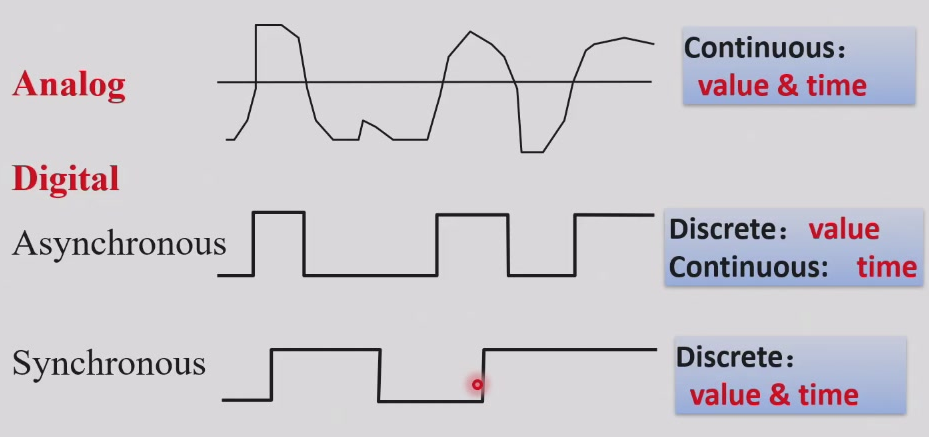

# Chapter 1: Digital Systems and Information

## 一、信号 Signal

1. 在数字系统中，信息变量（Information Varibles）只能取离散的值，抽象地表示为二进制
2. 二进制在物理上表示为物理量的 **取值范围**，例如电压、磁场方向等
3. 模拟信号（Analog）与数字信号（Digital）
    
    物理信号（电压）和数字信号相互转换时，依赖一定的阈值（Threshold Region），起到抗干扰的作用
    

图：模拟信号与数字信号，异步信号与同步信号

图：电压范围阈值（输入信号的阈值范围宽于输出信号）

## 二、数字系统 Digital System

1. 数字系统的构成要素
    - 接受一组离散的信息输入
    - 具有离散的内部信息（系统状态）
    - 由上述二要素，按一定规律进行作用，产生一组离散的信息输出
2. 数字计算机是一个数字系统

图：数字系统的模型图

图：数字计算机的模型图

## 三、计数系统 Number Systems

### 1. 数制

1. **数制的要素：**
    - 基数（Radix）
    - 数字的基本符号（Cardinality）
    - 位权重（Bit Weight）
    
    !!! example

        > **示例：**（以十六进制为例）
        > 
        > - Radix：R=16
        > - Cardinality：0，1，2，…，9，A，B，…，F
        > - Bit Weight：对于十六进制数 ${(31A.5B4)}_{16}$，“3“ 的位权重为 $16^2$，”5“ 的位权重为 $16^{-1}$

### 2. 数制转换

## 四、编码 Codes

### 1. 独热码 One Hot Code

1. 独热码要求比特向量中只有 1 位为“1”，其它位全为“0“
    
    示例：将四个元素分别编码为（0001，0010，0100，1000）
    
2. 优点：逻辑简单直接
    
    缺点：信息表示率较低
    

### 2. 十进制数的二进制编码

| 十进制 | 8,4,2,1（BCD） | Excess 3 | 8,4,-2,-1 | Gray |
| --- | --- | --- | --- | --- |
| 0 | 0000 | 0011 | 0000 | 0000 |
| 1 | 0001 | 0100 | 0111 | 0001 |
| 2 | 0010 | 0101 | 0110 | 0011 |
| 3 | 0011 | 0110 | 0101 | 0010 |
| 4 | 0100 | 0111 | 0100 | 0110 |
| 5 | 0101 | 1000 | 1011 | 1110 |
| 6 | 0110 | 1001 | 1010 | 1010 |
| 7 | 0111 | 1010 | 1001 | 1011 |
| 8 | 1000 | 1011 | 1000 | 1001 |
| 9 | 1001 | 1100 | 1111 | 1000 |

1. **Excess 3（余3码）：**在 BCD 码的基础上加 3 而得
2. **Gray（格雷码）：**相邻两数之间只有 1 个比特的差别，适合描述连续变化的物理量
    
    格雷码的编制规则：
    
    
    

### 3. 奇偶校验

引入**奇偶校验位（Parity Bit）**。它分为**奇校验（Odd Parity）** 和**偶校验（Even Parity）**。通过引入额外的一位校验，来保证整个信息串中 “1” 的数量是奇数/偶数

!!! example

    > **示例：**
    > 
    > - 在偶校验下，信息串 “11011” 是合法的，因为该串中 “1“ 的数目是偶数。若规定最后一位为校验位，则原始信息串即为 ”1101“
    > - 在偶校验下，信息串 “10010” 是合法的，因为该串中 “1“ 的数目是偶数。若规定最后一位为校验位，则原始信息串即为 ”1001“

### 4. 非数的编码

1. **ASCII 码**
    - 使用 7 bit 进行编码
    - 数字 0-9 对应 ASCII 码的 0x30-0x39
    - 大写字母 A-Z 对应 ASCII 码的 0x41-0x5A
    - 小写字母 a-z 对应 ASCII 码的 0x61-0x7A
    - 将字母进行大小写之间的转换，只需将从低到高第 6 个 bit 进行翻转
    - DEL 的 ASCII 码为 7‘b1111111
2. **UNICODE**
    - UTF-8：1-4 字节
        - 占一个字节的形式：0xxxxxxx
        - 占两个字节的形式：110xxxxx 10xxxxxx
        - 占三个字节的形式：1110xxxx 10xxxxxx 10xxxxxx
        - 占四个字节的形式：11110xxx 10xxxxxx 10xxxxxx 10xxxxxxx
    - UTF-16：2 或 4 字节
    - UTF-32：4 字节