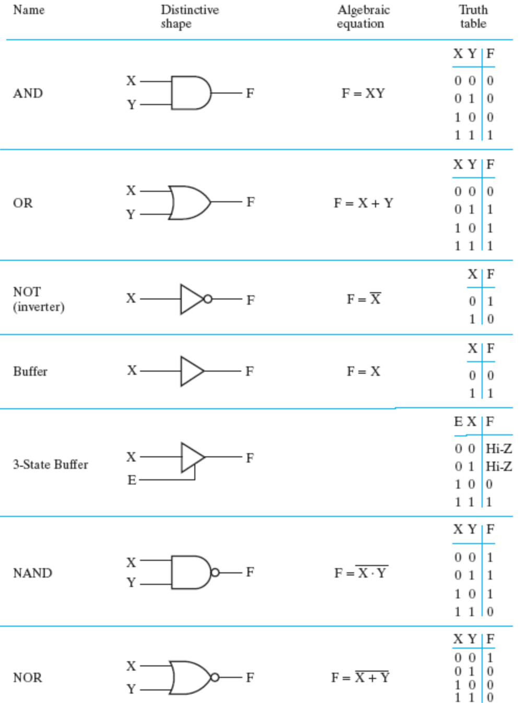

# Chapter 2: Combinational Logic Circuits

## 一、逻辑门

### 1. 逻辑运算符 Logical Operations

1. 基本逻辑运算：AND、OR、NOT
2. 符号表示
    - AND 的表示： $（\cdot）,（\times）,（\land）$或不标符号
    - OR 的表示： $（+）,（\lor）$
    - NOT 的表示：变量加上划线，变量后加单引号，变量前加 ~ 号

### 2. 逻辑门 Logic Gates

1. **逻辑门的分类**
    - Primitive Gate：AND、OR、NOT 门
    - Complex Gate：需要使用多个 Primitive Gate 进行描述的门
    
    !!! note
    
        **Universal Gate：**NAND、NOR 门，只用这两个门就可以实现所有的逻辑
        
        **Controllable Inverter：**XOR 门，一输入为 0 时，输出和另一输入相同；一输入为 1 时，输出和另一输入的取反相同，从而实现取反的可控
    
    
2. **符号和真值表总览**

1. **传输门 Transmission Gate：**与三态门功能类似
    
    
    
2. **Exclusive OR（XOR）的性质**
    - 基本运算性质
        
        
        
    - 对于多个变量的异或：当输入为奇数个 1 时，输出为 1，否则输出为 0
3. **放大器 Buffer：**不改变输入的值，将输入的信号放大后输出，可以提高电路的运行速度

### 3.  门延迟 Gate Delay

门延迟 Gate Delay：输出变化和输入变化之间的时间间隔，用 $t_G$ 表示

## 二、布尔代数 Boolean Algebra

### 1. 布尔函数 Boolean Function

- 形如 $F=f(X_1,X_2,…,X_n)$
- 注意与一般的代数方程进行辨析：布尔方程 $X+Y=X+Z$ 或 $XY=XZ$ 均无法得出 $Y=Z$

### 2. 布尔函数的基本定律

1. **交换律（Commutative）**
    - $X+Y=Y+X$
    - $XY=YX$
2. **结合律（Associative）**
    - $(X+Y)+Z=X+(Y+Z)$
    - $(XY)Z=X(YZ)$
3. **分配律（Distributive）**
    - $X(Y+Z)=XY+XZ$
    - $X+YZ=(X+Y)(X+Z)$
4. **狄摩根定律（DeMorgan’s）**
    - $\overline{X+Y}=\overline{X}+\overline{Y}$
    - $\overline{X\cdot Y}=\overline X+\overline Y$

### 3. 布尔函数的相等关系

设 $F_1=f_1(X_1,X_2,…,X_n)$、 $F_2=f_2(X_1,X_2,…,X_n)$

若对 $X_1,X_2,…,X_n$ 的任一组取值，都有 $F_1=F_2$，则称 $F_1=F_2$

### 4. 布尔函数的反函数 Complementing Function

- 表示符号： $\overline F$
- 变化规则：
    - 将 AND 与 OR 互换
    - 对常量（T、F）和变量取反
    - 各部分间的运算优先级不变
    - 横跨多个变量的取反，在反函数中依然保持为一个整体，且不消去这个横跨多个变量的取反（如例 2）
    
    !!! example
        
        > **示例：**
        > 
        > 
        > 
        > 

### 5. 布尔函数的对偶 Duality

- 表示符号： $F'$
- 变化规则：
    - 将 AND 与 OR 互换
    - 对常量（T、F）取反，但不对变量取反
    - 各部分间的运算优先级不变
- 求反函数的一个简单方法：先求出原函数的对偶，然后再对每个变量取反
- 如果布尔函数 $F$ 和 $G$ 是相等的，那么它们的对偶 $F'$ 和 $G'$ 也是相等的
- 布尔函数的对偶的对偶是它本身
- 如果布尔函数的对偶等于它本身，则称为自对偶（self-dual）
    
    !!! example

        > **示例：**
        > 
        > 
        > 
        > 

### 6. 常用定理

1. **Minimization**
    - $X\times Y+\overline X\times Y=Y$
    - $(X+Y)(\overline X+Y)=Y$
    
    证明：第二个式子由第一个式子两侧取对偶而得
    
2. **Absorption**
    - $X+XY=X$
    - $X(X+Y)=X$
    
    证明：第二个式子由第一个式子两侧取对偶而得
    
3. **Simplification**
    - $X+\overline X\times Y=X+Y$
    - $X\times (\overline X+Y)=XY$
    
    证明：第一个式子由分配律而得，第二个式子由第一个式子取两侧对偶而得（这里看起来像“加法分配律”，实则在逻辑运算中是成立的）
    
    $$
    A+\overline A\times B=(A+\overline A)(A+B)=1\cdot(A+B)=A+B
    $$
    
4. **Consensus**
    - $XY+YZ+\overline XZ=XY+\overline XZ$
    - $(X+Y)(Y+Z)(\overline X+Z)=(X+Y)(\overline X+Z)$

### 7. 扩展定理

1. **Shannon Formula**
    
    假设布尔函数 $F$ 包含变量 $x$ 或 $\overline x$，那么：
    
    - 在 $x$ AND $F$ 的运算中， $F$ 中的 $x$可以用“1”替换， $\overline x$ 可以用“0”替换
        
        $xf(x,\overline x,y,…,z)=xf(1,0,y,…,z)$
        
        $\overline xf(x,\overline x,y,…,z)=\overline xf(0,1,y,…,z)$
        
    - 在 $x$ OR $F$ 的运算中， $F$ 中的 $x$可以用“0”替换， $\overline x$ 可以用“1”替换
        
        $x+f(x,\overline x,y,…,z)=x+f(0,1,y,…,z)$
        
        $\overline x+f(x,\overline x,y,…,z)=\overline x+f(1,0,y,…,z)$
        
2. **Shannon Expansion（逻辑函数分解）**
    
    假设布尔函数 $F$ 同时包含变量 $x$ 与 $\overline x$，那么：
    
    - $F(x,\overline x,y,…,z)\\=xf(x,\overline x,y,…,z)+\overline x f(x,\overline x,y,…,z)\\=xf(1,0,y,...,z)+\overline xf(0,1,...,y,z)$
    - $F'(x,\overline x,y,…,z)\\=[x+f(1,0,y,...,z)]\cdot[\overline x+f(0,1,...,y,z)]$

## 三、布尔表达式的规范和标准形式

### 1. 标准形式 Standard Forms

1. 表达式的简化目标：让文字（Literals，即变量）的数目最少，从而使实现所需的电路元件最少
2. 任何表达式可以表示为下面两种**标准形式**：
    - AND-OR Forms（Standard Sum of Products，**SOP**）：
        
         $AB+\overline ACD+\overline ABD+ABCD$
        
    - OR-AND Forms（Standard Product of Sums，**POS**）：
        
         $(\overline A+\overline B)(\overline A+\overline C+\overline D)(A+C)$
        
3. 对 POS 进行简化时，可以先求对偶再进行简化，完成简化后再求对偶以复原，从而减少工作量
4. 有些形式既不是 SOP 也不是 POS

### 2. 规范形式 Canonical Forms

1. **最小项与最大项**
    - 概念
        - 最小项：为乘积项；点到谁，谁不取反
        - 最大项：为和项；点到谁，谁取反
        
        
        
        
        
    - 最小项与最大项互为反函数： $M_i=\overline{m_i}\ ，m_i=\overline{M_i}$
2. 任何表达式可以表示为下面两种 **规范形式**：
    - **最小项之和**（Sum of Minterms，**SOM**）：对应离散数学的 **全析取形式**（Full Disjunctive Form）
    - **最大项之积**（Product of Maxterms，**POM**）
    
    !!! example

        > **示例：**
        > 
        > - SOM 表示法
        >     
        >     
        >     
        > - POM 表示法
        >     
        >     
        >     

3. **由其它形式转化为规范形式**
    
    !!! example

        > **示例：**
        > 
        > - 转化为 SOM 形式
        >     
        >     
        >     
        > - 转化为 POM 形式
        > 
        > 
        > 

4. **规范形式的反函数**
    
    对于形如 $E(X,Y,Z)=\sum_m(0,1,2,4,5)$ 的 SOM 形式，其反函数有两种表示：
    
    - $\overline{E(X,Y,Z)}=\sum_m(3,6,7)$
    - $\overline{E(X,Y,Z)}=\prod_M(0,1,2,4,5)$

5. **SOM 与 POM 形式的相互转换**
    - 由 4，不难得出： $\sum_m(3,6,7)=\prod_M(0,1,2,4,5)$

6. SOM 形式可以直接由真值表写出

7. 在电路实现中，SOM 可以由二级逻辑门实现（设变量的数目为 n），但若将 SOM 简化为 SOP，可以减小硬件的开销
    - 第一级包含 n 个与门
    - 第二级包含少于 $2^n$ 个或门

## 四、电路的优化

### 1. 二级电路的优化

1. **Literal Cost（L）：**布尔表达式中出现的变量（包括取反的变量、重复出现的变量）数目
    
    !!! example
        
        > **示例：**
        > 
        > - $F=BD+A\overline BC+A\overline C\overline D$ ，L 为 8
        > - $F=(A+B)(A+D)(B+C+\overline D)$ ，L 为 7

2. **Gate Input Cost（G）：**对于给定布尔表达式的实现，所有门（不含非门）的输入信号数目
3. **Gate Input Cost with NOTs（GN）：**对于给定布尔表达式的实现，所有门（含非门）的输入信号数目
    
    !!! example
        > **示例：**
        > 
        > 
        > 
        > 
        > **答：**L 为 5，G 为 7，GN 为 9
        > 

### 2. 多级电路的优化

- 相比于 SOP / POS 形式的二级电路，将其进行变换（例如：提取公因式）优化为多级电路，可以减小 Gate Input Cost
    
    !!! example
        > **示例：**
        > 
        > 
        > 
        > 

## 五、卡诺图 Karnaugh Maps（K-map）

### 1. 卡诺图的结构

1. **双变量**
    
    
    
2. **三变量**
    
    
    
3. **四变量**
    
    
    
4. **五变量**
    
    
    

### 2. 卡诺图的使用

1. **基本规则**

1. **不定项 Don‘t Cares**
    - **不定项** 指的是需要化简的逻辑函数中，没有给出定义的几项，它们可能是：
        - 输入组合不会出现
        - 输入组合的输出不被使用
    - 不定项在卡诺图中用 X 来表示，我们可以随意定义它们的输出，此时就可以利用这些项来方便我们的优化
    
    !!! example
        > **示例：**
        > 
        > 
        > 
        > 

2. **蕴含项、主蕴含项与基本主蕴含项**
    - **蕴含项**（implicant） 分为 **主蕴含项**（prime implicant）和 **基本主蕴含项**（essential prime implicant）
        - 在卡诺图中，一个蕴含项就是任意一个包含 $2^n$ 个 `1` 的单元
        - 主蕴含项是在卡诺图中的 **极大** 蕴含项（尽量框最多的 `1`）
        - 基本主蕴含项是包含只被它覆盖的 `1` 的主蕴含项
    - 对于任意函数，主蕴含项一定存在，但是基本主蕴含项不一定存在
    - 正因为有基本主蕴含项的存在，对于一个任意函数，优化的多解结果总有一部分是不变的（没有基本主蕴含项时，这部分为零）
    
    !!! example
        > **示例：（相关概念）**
        > 
        > 
        > 
        > 

3. **由卡诺图得到乘积结果**
    - 反转 K-map 中所有的 `0` 和 `1`，然后着眼于求最小值之和进行优化，最后再对结果取反，用狄摩根定律来得到结果
    
    !!! example
        > **示例：**
        > 
        > 
        > 
        > 

## 六、HDL 简介

1. HDL（Hardware Description Language）：硬件描述语言，例如 VHDL 和 Verilog
2. RTL（Register transfer language level）：是硬件描述语言中的一种抽象层次，用于描述数字电路的行为和结构
3. DUT（Device Under Test）：用于测试的设备
4. Testbench：一组硬件和软件功能，将 input 应用于 DUT，并分析输出的正确性
5. Synthesis（综合）：将 HDL 描述的电路结构描述为表示存储元件和组合逻辑的优化网表（Netlist）
6. Verilog 支持结构描述（Structure Description）和行为描述（Behavior Description）