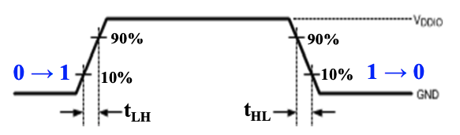
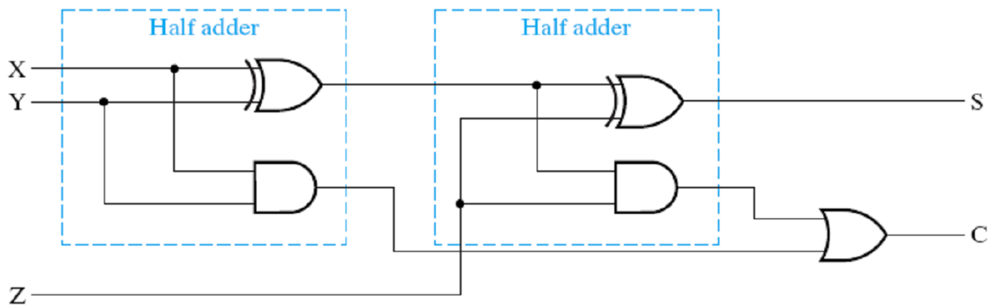
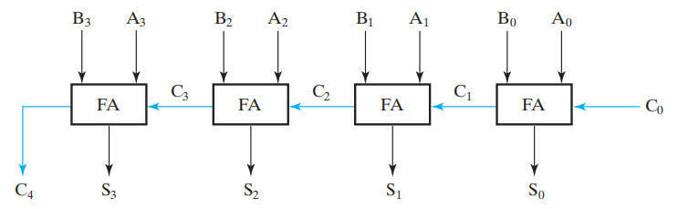
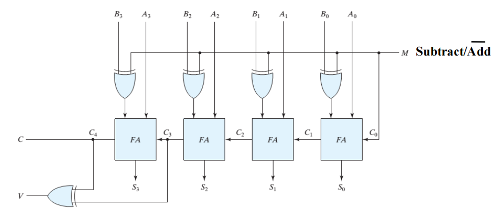
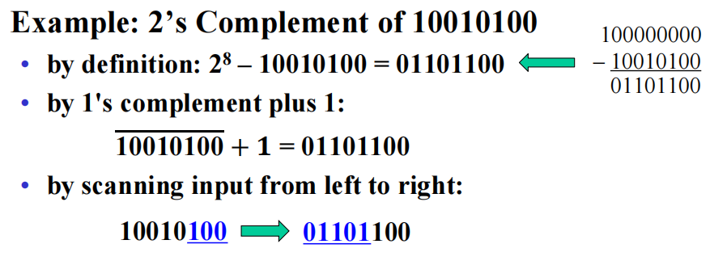

# Chapter 3: Combinational Logic Design

## 一、相关概念

### 1. 集成电路

1. 组合电路（Combinational Circuits）的组成部分
    - $m$ 个输入， $n$ 个输出
    - $n$ 个切换函数（Switching Functions），每个切换函数将 $2^m$ 种不同的输入映射为一个用于输出的布尔值
2. 集成电路（Integrated Circuit）是集成了逻辑门和存储单元的半导体晶片
    
    
    | **简称** | **全名** | **逻辑门的数量** |
    | --- | --- | --- |
    | SSI | small scale integrated | < 10 |
    | MSI | medium scale integrated | 10 - 100 |
    | LSI | large scale integrated | 100 - 数千 |
    | VLSI | very large scale integrated | 数千 - 数百万 |

### 2. 分层设计 Hierachical Design

1. 为了避免组合电路内部的映射关系过于复杂，采用模块化的设计思路：
    - 将整个映射函数分解（Decompose）为若干个块（Blocks）
    - 将每个块内部的函数分解为更小的块，直到每个块都足够小
    - 无法再分解的块称为 Primitive Block
    - 所有块（包含被分解的块）的集合称为一个 **层次结构（Hierachy）**
2. 可复用的函数（Reusable Functions）：将复杂的设计分解为常见的、可复用的函数块，这些块的功能经过验证、附有完善的文档，常放置于库（Library）中供大家调用

### 3. 技术参数

门的实现主要通过以下参数特性描述：

| **Name** | **Description** |
| --- | --- |
| **Fan-in** | 一个门可接收的输入数 |
| **Fan-out** | 一个门的输出可驱动的标准负载数量 |
| **Logic Levels** | 高低电平的输入输出电压范围 |
| **Noise Margin** | 对外界噪声的容忍能力（具体来说是不会导致行为异变的最大噪声压值） |
| **Cost for a gate** | 门的成本 |
| **Propagation Delay** | 从输入信号改变到输出信号改变所需的时间 |
| **Power Dissipation** | 门的能耗 |

1. **扇入扇出 Fan-in & Fan-out**
    - 扇入：一个门能够接受的最多输入量，例如：一个四输入与非门的扇入就是 4
    - 扇出：一个门在不降低工作性能的情况下，其输出可以驱动多少门，例如：一个非门的输出能够同时负载 4 个非门并且都能正常工作，则其扇出为 4，其也能通过 **标准负载** 来定义
    
    !!! note
    
        标准负载：是衡量“负载”的一个“单位砝码”，其大小等于一个非门贡献的负载压力
    
    
2. **门的成本 Cost for a gate**
    - 门的成本与门占用的芯片面积成正比
    - 门的面积大致与晶体管的数量和尺寸以及连接它们的布线量成正比
    - 忽略布线面积，门的面积大致与门的输入计数（Gate Input Cost）成正比
    因此，门输入计数是门成本的粗略衡量标准

### 4. 延迟 Delay

1. **转换时间 Transition Time**
    
    转换时间分为 $t_{LH}$ 和 $t_{HL}$ 两部分
    
    - $t_{LH}$：门输出从 10% 升高到 90% 的时间
    - $t_{HL}$：门输出从 90% 降低到 10% 的时间
    
    
    
    !!! note
        
        可以用转换时间（Transition Time）评估负载的大小：随着负载增加，转换时间也会增加（如图），而扇出定义中提到的“正常工作”，就是指门的转换时间不超过其预定的最大转换时间
        
        
        
2. **传播延迟 Propagation Delay**
    - 传播延迟分为 $t_{PLH}$ 和 $t_{PHL}$ 两部分，以输入和输出的变化中点时间差进行计算
    - 传播延迟常用 $t_{PD}=(t_{PLH}+t_{PHL})/2$ 表示
    
    
    
    !!! note "转换时间与传播延迟的辨析"
        
        - 转换时间专注于输出的变化，而传播延迟则包含了输入的变化和输出的变化整个过程
        - 转换时间只需输出的时序图即可表示；传播延迟则需通过比较输入和输出的偏差来表示的
    
3. **延迟模型 Delay Model**
    
    为了刻画门的延迟，需要对其建模，常见的模型有两种：
    
    - **传输延迟模型（Transport Delay）：**认为输入和输出之间的延迟是定值
    - **惯性延迟模型（Inertial Delay）：**在传输延迟模型基础上，引入了拒绝时间（Rejection Time），表征当输入达到一定能量后才能触发门输出；如果输入信号发生变化后在拒绝时间以内变回原值，则输出信号不变
    
    
    
    !!! note "意外情形——毛刺（Glitch）"
        
        分析下图的二路选择器（每个逻辑门的延迟标注在其上）
        
        在传输延迟模型下，由于反相器存在延迟，因此会出现下图 Y 波形中箭头所指的毛刺，这是一种意外情况
        
        
    
    
4. **由负载导致的额外延时**
    - 计算电路的延迟时，有两方面需要考虑，一方面是电路自身所导致的一个固定延迟，另一方面则是由于不同的负载导致的额外延迟（即：门的负载 / 扇出越多，则延迟越大）
    - 如果考虑到这种影响，电路中门的延迟会根据其输出上的电路负载而呈现不同的值
        
        !!! example
            > **示例：**
            > 
            > 
            > 
            > 

## 二、设计流程

### 1. 流程概述

1. **Specification：**为集成电路撰写设计说明（包括实现的逻辑和实现要求）
2. **Formulation：**根据设计要求，撰写真值表或布尔方程；按需要进行分层设计
3. **Optimization：**使用卡诺图等工具对电路进行设计优化；为电路绘制逻辑图或网表
4. **Technology Mapping（工艺映射）：**根据设计说明中所要求的实现技术，修改逻辑图或网表
5. **Verification（验证）：**人工或使用仿真工具验证设计的正确性

### 2. 工艺映射 Technology Mapping

1. **工艺映射：**将逻辑图或网表转化为可以用工艺实现的新的图或网表的过程
2. **常见的工艺映射要求**
    - 将所有门转化为 NAND 门和反相器
    - 将所有门转化为 NOR 门和反相器
3. **操作步骤**
    - 按下图规则，将所有门用 NAND 门或 NOR 门替换
        
        
        
    - 优化反相器的位置排布，消去成对的反相器
        
        
        

### 3. 验证 Verification

1. **验证：**用于证明最终的电路设计能够实现预期行为（Specification）
2. **基本的验证方法**
    - 人工逻辑分析（Manual Logic Analysis）：找到最终电路的真值表或布尔代数式，判断其是否和预期行为一致
    - 仿真（Simulation）：在仿真环境中，使用合适的测试输入（激励信号）来测试最终电路（或其网表，可能编写为 HDL），通过观察其响应结果来判断是否实现预期行为

## 三、常见的组合逻辑电路

### 1. 基本逻辑方程 Rudimentary Logic Functions

1. 用于实现每项基本功能的组合逻辑电路称为函数块（Functional Block）
2. **基本逻辑方程的分类**
    - **常量函数（Value-Fixing）**：输出定值
    - **传输函数（Transferring）**：直接输出输入值
    - **逆变函数（Inverting）**：输出输入的取反
    - **使能函数（Enabling）**：通过使能控制输出是否可变，分为下图中的两种（注意与三态门的区分）
        - a 型：EN=0 时，输出为 0
        - b 型：EN=0 时，输出为 1
        - 三态门：EN =0 时，输出为高阻态

1. **多位（Multiple-bit）方程**
    - 图中粗线用于表示总线（Bus）
    - 总线可以被分成若干组，每组可以为一位或多位，每组中的多位可以不连续（如图 c、d）
    
    
    

### 2. 译码器 Decoder

1. n-to-m 译码器接受 $n$ 位的输入，产生 $m(n≤m≤2^n)$ 位的输出
2. 译码器的每个输出对应一个 Minterm，即只有某一位为 1，其它位为全 0
3. **译码器的构建**
    - **1-to-2 译码器**
        
        
        
    - **2-to-4 译码器：**由 2 个 1-to-2 译码器和 4 个 AND 门构成
        
        
        
    - **n-to-m 译码器：**
        - 若 n 为偶数，则由 2 个 $\frac n2$-to-$2^{(\frac n2)}$ 译码器和 m 个 AND 门构成
        - 若 n 为奇数，则由 1 个 $\frac {n+1}{2}$-to-$2^{(\frac{n+1}{2})}$ 译码器、1 个 $\frac {n-1}{2}$-to-$2^{(\frac{n-1}{2})}$ 译码器和 m 个 AND 门构成
        
        
        
4. **带使能的译码器**
    - 在实现中，带使能的 n-to-m 译码器比不带使能的 n-to-m 译码器多 m 个 AND 门
        
        
        
        图：带使能的 2-to-4 译码器
        
5. **基于译码器实现组合逻辑**
    
    !!! example
        > **示例：**使用译码器实现下述逻辑
        > 
        > 
        > $S(X,Y,Z)=\sum_m(1,2,4,7)\\C(X,Y,Z)=\sum_m(3,5,6,7)$
        > 
        > **实现：**
        > 
        > 
        > 

### 3. 编码器 Encoder

1. 编码器接受 $m$ 位的输入，产生 $n(n≤m≤2^n)$ 位的输出
2. 编码器的每个输入有且只有某一位为 1，其它位为全 0；编码器将与输入中的 1 出现的位置相对应的二进制数作为输出
    
    !!! example
        > **示例：**
        > 
        > 
        > 
        > 

3. **优先编码器 Priority Encoder**
    
    有时我们无法确保编码器的输入有且只有某一位为 1，在优先编码器中，我们引入一个 Valid 位并作如下规定：
    
    - 当输入全 0 时，Valid 位为 0；否则 Valid 位为 1
    - 当输入中包含多个 1 时，只将最高位（或最低位）输入的 1 视为有效输入
    
    !!! example
        > **示例：**一个 4-to-2 优先编码器
        > 
        > 
        > 
        > 
        > 使用卡诺图等工具化简后，得到下述布尔方程：
        > 
        > 
        > 

### 4. 多路选择器 Multiplexer

1. 多选器接受 n 位控制信号（Selection Inputs）、 $2^n$ 位待选信息（Information Inputs）作为输入，产生 1 位的输出信号 Y
2. 多选器由 1 个 n-to-$2^n$ 译码器、 $2^n$ 个 AND 门和 1 个 $2^n$ 输入的 OR 门组成（ $2^n$ 个 AND 门和 1 个 $2^n$ 输入的 OR 门，又称为 $2^n\times 2$ AND-OR 门）
    
    !!! example

        > **示例：**四输入多选器
        > 
        > 
        > 
        > 

3. **接收多位输入的多选器**
    
    !!! example

        > **示例：**接收 4 位信号输入的四输入多选器
        > 
        > 
        > 
        > 

4. **使用三态门实现的多选器**
    
    
    
5. **基于多选器实现组合逻辑**
    
    使用 $2^n$ -to-1 的多选器，可以实现具有 $(n+1)$ 个变量的组合逻辑
    
    !!! example

        > **示例：**将 BCD 码转化为七段数码管信号的译码器
        > 
        > 
        > 
        > 

## 四、二进制加减法器

### 1. 半加器 Half-Adder（HA）

- 真值表
    
    
    

- 布尔表达式
    - $S=X\overline Y+\overline XY=X\oplus Y$
    - $C=XY$
    
- 电路实现
    - 最常见的实现形式： $S=X\oplus Y,C=XY$
        
        
        
    - 使用与非门和非门的实现形式： $S=(X+Y)\overline C, C=\overline{\overline{XY}}$
        
        
        

### 2. 全加器 Full-Adder（FA）

- 元件的输入与输出
    
    
    

- 真值表
    
    
    
- 布尔表达式
    - $S=X\overline{YZ}+\overline XY\overline Z+\overline{XY}Z+XYZ\\=X\oplus Y\oplus Z$
    - $C=XY+XZ+YZ=XY+(X\oplus Y)Z$
- 电路实现
    
    
    

### 3. 行波进位加法器 Ripple Carry Adder

1. 四位行波进位加法器
    
    
    
2. 支持减法、溢出检测的四位行波进位加法器
    
    
    

### 4. 超前进位加法器 Carry-Lookahead Adder（CLA）

## 五、二进制加减法

### 1. 反码与补码

1. 基数补（radix complement）—— 补码
    - r 进制：r's complement
    - 二进制：2's complement
    - N 的补码为 $r^n-N$
2. 缩小基数补 （diminished radix complement）—— 反码
    - r 进制：(r - 1)'s complement
    - 二进制：1's complement
    - N 的反码为 $(r^n-1)-N$
3. 对 $X$ 求二进制补码的几种方法
    - 根据定义： $2^n-X$
    - 将其反码 +1
    - 从最低位到高位扫描，遇到第 1 个 ‘1’ 后，这个 ‘1’ 后面所有的位均取反（这个 “1” 不取反）
    
    
    

### 2. 无符号减法

对于 $n$ 位无符号数 $M$ 与 $N$，计算 $M-N$ ：

- 将 $M$ 的原码与 $N$ 的补码相加
- 若最高位有进位，则说明 $M≥N$ ，结果大于 0，忽略最高位的进位，所得结果即为正确答案
- 若最高位无进位，则说明 $M<N$，结果小于 0，所得结果是正确答案的补码形式；将结果转化为原码，并加负号，即为正确答案

!!! example

    > **示例：**无进位
    > 
    > 
    > 
    > 

!!! example

    > **示例：**有进位
    > 
    > 
    > 
    > 

### 3. 符号位的表示法

1. Signed-Magnitude：最高位为符号位，其它位使用原码表示
2. Signed-Complement：最高位为符号位，其它位使用反码或补码表示，具体分为 Signed 1’s Complement 和 Signed 2’s Complement

### 4. 有符号加减法及溢出判断

1. 对于 $n$ 位有符号数 $M$ 与 $N$，计算 $M+N$ ：
    - 将 $M$ 与 $N$ 的原码相加
    - 若最高位有进位，则忽略
2. 对于 $n$ 位有符号数 $M$ 与 $N$，计算 $M-N$ ：
    - 将 $M$ 的原码与 $N$ 的补码相加
    - 若最高位有进位，则忽略
3. 溢出判断
    - 下图汇聚了所有可能引起溢出的情形，其中两位红色数字分别是最高位的更高一位和最高位
        
        
        
    - 检测溢出的公式： $V=C_n\oplus C_{n-1}$

## 六、其它代数方程的实现

1. 自增器和自减器（Incrementer & Decrementer）
    - 为输入的数字增加或减小固定值
    - 在完整加法器的基础上，使用缩减设计（Design By Contraction）得到
    
    
    
    图：对一个完整的三位加法器进行缩减设计，得到自增 1 的自增器
    
2. 乘或除以 $2^n$
    
    将一个数乘或除以 2 的 $n$ 次幂，可用左移位 / 右移位实现
    
    
    
3. 零填充（Zero Fill）
    - 将 $m$ 位的操作数填充 $n$ 个 0，从而得到 $m+n$ 位的操作数
    - 通常在最高位（MSB, Most Significant Bit）进行零填充，也可以在最低位（LSB, Least Significant Bit）进行零填充
    
    !!! example

        > **示例：**将 1111_0101 填充至 16 bit
        > 
        > - MSB end：0000_0000_1111_0101
        > - LSB end：1111_0101_0000_0000

4. 符号位扩展（Extension）
    
    对于补码表示的数字，在其最高位左侧使用其符号位进行填充
    
    !!! example

        > **示例：**
        > 
        > - 将 0111_0101 填充至 16 位：0000_0000_0111_0101
        > - 将 1111_0101 填充至 16 位：1111_1111_1111_0101