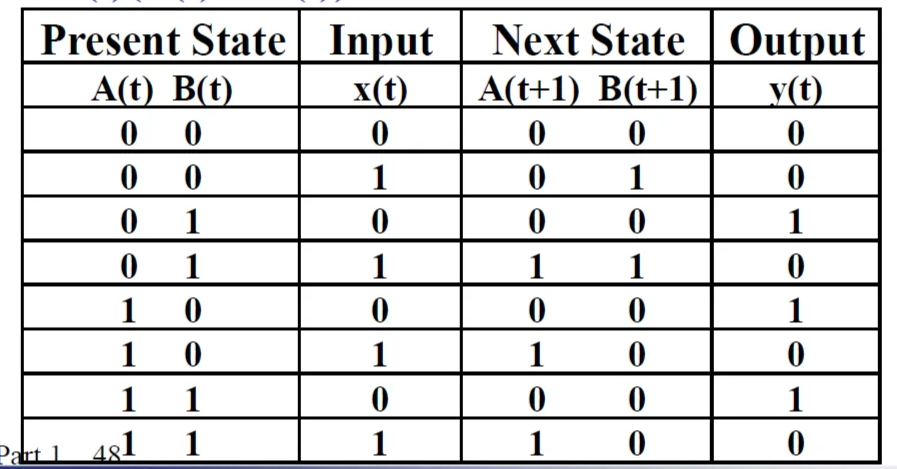

# Chapter 4: Sequential Circuits

## 一、时序电路简介


1. 时序电路（Sequential Circuits）由组合逻辑和存储元件（Storage Elements）连接组成
2. 某一时刻存储在存储原件中的信息称为该时刻时序电路的状态（State）
3. 时序电路按照内部状态改变的时间可分为两类：
    - 同步时序电路（Synchronous）：由时钟等控制行为
    - 异步时序电路（Asynchronous）
4. 存储元件可以使用 Buffer 或 Inverter 进行朴素的实现
    - 设 Buffer 的传播延迟为 $t_G$ ，则信息在 $t_G$ 时间内被有效存储
    - 将 Buffer 的输出端连接到它自己的输入端，则信息可以一直被存储
    - 使用两个 Inverter 代替 Buffer，可以起到相同的效果
    
    
    
5. 使用 Buffer 或 Inverter 实现的存储元件难以改变所存储的信息
6. 存储元件主要由 **锁存器** 和 **触发器** 两种，其中前者是后者的基础，后者由前者构成
7. 可以使用离散事件模拟（Discrete Event Simulation）对时序电路的行为进行研究

## 二、锁存器 Latch

### 1. S-R Latch（NOR）


- 通过两个或非门的交叉耦合（cross-coupling）实现
- S = 1，R = 1 是未定义的输入，将导致 Q 和 Q’ 均输出 0

### 2. $\overline S-\overline R$ Latch（NAND）


- 通过两个与非门的交叉耦合实现
- S‘ = 0，R’ = 0 是未定义的输入，将导致 Q 和 Q’ 均输出 1

### 3. Clocked S-R Latch


- 该锁存器加入了时钟控制信号 C，当时钟 C 位于高电平时允许锁存器更新，当时钟 C 位于低电平时保持状态

### 4. Clocked D Latch


- 在 Clocked S-R Latch 中，S = 0，R = 0 是未定义的输入；为避免该情况发生，将 S 与 R 信号合并为一个 D 信号，从而保证 S 与 R 信号一定相反，得到 D Latch

### 5. 锁存器的时序问题 The Latch Timing Problem

- 对于 Clocked Latch，当时钟 C 位于高电平时，锁存器的值将不断跳变，可以从锁存器的输出中实时观察到其输入的变化，此时称锁存器为 **透明的（Transparent）**
- 由于锁存器为透明的，锁存器的输入信号可能因为其余锁存器的输出信号的改变而改变，从而在一个时钟周期内发多次变化
- 对于下图的锁存器，当时钟 C 位于高电平时，Y 的值会反复震荡，而我们可能希望 Y 只在时钟边沿时发生一次变化，这是我们要引入触发器的原因
    
    
    

### 6. 锁存器的标准符号


## 三、触发器 Flip-Flops

按触发方式进行分类，触发器可分为脉冲触发式和边沿触发式

- **脉冲触发式触发器 （Pulse-triggered）**
    - 当时钟信号为高电平时，触发器可以改变第 1 个锁存器的值，且保持第 2 个锁存器的值（以正脉冲触发式触发器为例，下图）
    - 当时钟信号为低电平时，触发器可以改变第 2 个锁存器的值，且保持第 1 个锁存器的值
- **边沿触发式触发器 （Edge-triggered）**
    - 只有当时钟信号发生 0-1 或者 1-0 的 **跳变（Transition）**时，触发器才被触发
    - 在其他任何时间内，触发器的状态将保持不变

### 1. S-R Master-Slave Flip-Flop


- 由两个锁存器组成的触发器称为 **主从式触发器（Master-Slave Flip-Flop）**，其中前者称为主锁存器，后者称为从锁存器，二者的时钟控制信号相反
- S-R 主从触发器是脉冲触发式触发器
    - 当 C=1 时，主锁存器的值可以改变，但无法改变第二个锁存器的状态
    - 当 C=0 时，从锁存器将主锁存器的输出作为输入，产生相应的输出，此时主锁存器的状态保持不变
- 当 C = 1 时，R 或 S 的 0-1-0 Glitch（短暂跳变）会被主锁存器发现，从而使锁存器的状态发生意外的改变（例如：R 的 0-1-0 跳变导致意外发生 reset），而这个异常会被写入到从锁存器中，这种现象被称为 **一次性采样 （1‘s catching）**
- 为解决一次性采样问题，需使用边沿触发式触发器

### 2. Edge-Triggered D Flip-Flop

- 将 S-R 主从触发器的主锁存器更换为 D 锁存器，即得到 D 触发器
- D 触发器是边沿触发式触发器，解决了一次性采样的问题
- 正边沿（上升沿，0 $\rightarrow$ 1）触发的 D 触发器
    
    
    
- 负边沿（下降沿，1 $\rightarrow$ 0）触发的 D 触发器
    
    
    

### 3. 触发器的标准符号


- 对于主从式触发器，输入信号 C 的外侧加小圆圈，表示是负脉冲（即时钟值为 0 时有效）
- 对于边沿触发式触发器，输入信号 C 的外侧加小圆圈，表示在时钟负边沿触发
- 对于主从式触发器，输出信号内侧的直角符号，称为延时输出指示器（Postponed Output Indicator），表明输出信号在脉冲的结尾才发生改变
- 对于边沿触发式触发器，输入信号 C 内侧的三角符号，表示 C 是一个动态输入（Dynamic Input），表示该触发器为边沿触发

### 4. 直接输入 Direct Inputs


- 在上电或复位时，时序电路应当在开始运行之前初始化为已知状态，该初始化步骤应当独立于时钟输入（即：异步地）
- 为此，在 D 触发器的基础上新增两个输入 $\overline R$ 和 $\overline S$
    - $\overline R$ 输入为 0 时，reset to 0 state
    - $\overline S$ 输入为 0 时，set to 1 state
    - 正常情况下， $\overline R$ 和 $\overline S$ 都输入 1

### 5. J-K Flip-Flop


- J-K 触发器的功能与 S-R 触发器类似，其中 J 对应 S，K 对应 R
- 与 S-R 触发器不同的是，J = K = 1 是允许的，代表将状态取为相反状态
- 为避免一次性采样问题，J-K 触发器使用 D 触发器进行实现

### 6. T Flip-Flop


- T 触发器只有一个输入 T（时钟信号除外），它的功能可以看做 J-K 触发器下的 T=J=K
- T = 0 时，不改变状态；T = 1 时，将状态取为相反状态
- 为避免一次性采样问题，T 触发器使用 D 触发器进行实现

### 7. 触发器的描述

- 特征表（Characteristic Table）：根据触发器的输入和当前状态，揭示触发器的下一个状态，用于分析
- 特征方程（Characteristic Equation）：将触发器的下一个状态定义为触发器的输入和当前状态的布尔函数，用于分析
- 激励表（Excitation Table）：将触发器输入变量值定义为当前状态和下一状态的函数，用于设计

**描述 S-R 触发器**


**描述 J-K 触发器**


**描述 D 触发器**


**描述 T 触发器**


## 四、时序电路分析

### 1. 基本模型


- t 时刻的状态使用一组触发器进行存储
- t+1 时刻的状态是 t 时刻状态和 t 时刻输入的函数
- t 时刻的输出是 t 时刻状态和 t 时刻输入的函数

!!! example

    > **示例：**
    > 
    > - 输入：X
    > - 输出：Y
    > - 状态：A、B
    > 
    > 
    > 
    > - 时间 t 的定义节点
    > 
    > 
    > 

### 2. 状态表 State Table

!!! example

    > **示例：**
    > 
    > 
    > 对于上例的布尔方程：
    > 
    > - 下图为 一般的状态表，包含要素：当前状态、输入、下一状态、输出
    > 
    > 
    > 
    > - 下图为交替状态表（Alternate State Table），将输入和下一状态整合在了一起
    > 
    > 
    > 

### 3. 状态图 State Diagram

- 状态图模型分为两类：
    - Moore Model：输出只是当前状态的函数，输出值标注在圆圈内
    - Mealy Model：输出是当前状态和输入的函数，输出值标注在弧线上
- 上述两类模型可以混用，即某些状态为 Moore Model，而其它状态为 Mealy Model
- Moore 型的输出比 Mealy 晚一个时钟周期

!!! example

    > **示例：**
    > 
    > 
    > 
    > 

### 4. 使用等价状态优化状态图

- 等价的两个状态可以合并为一个状态
- 如果两个状态在接收任意相同的输入时，具有相同的输出，且跳转到相同（或等价）的下一状态，则这两个状态等价

!!! example

    > **示例：**
    > 
    > 
    > 
    > 
    > 
    > 

## 五、时序电路设计

### 1. 设计流程

1. **Specification：**为集成电路撰写设计说明（包括实现的逻辑和实现要求）
2. **Formulation：**根据设计要求，设计状态，撰写状态图或状态表
3. **State Assignment：**为每个状态分配独一无二的二进制码
4. **Flip-Flop Input Equation Determination：**确定触发器的型号，为触发器的输入确定函数关系
5. **Output Equation Determination：**为输出确定函数关系
6. **Optimization：**对上述方程进行优化
7. **Technology Mapping（工艺映射）：**根据设计说明中所要求的实现技术，修改逻辑图或网表
8. **Verification（验证）：**人工或使用仿真工具验证设计的正确性

### 2. 状态分配 State Assignment

1. 通常情况下，状态分配的方案不一样，所得到的函数表达式不同，由此设计出来的电路复杂程度也不同
2. 基本的状态分配方案
    - 计数顺序（Counting Order）：00、01、10、11 …
    - 格雷码顺序（Gray Code Order）：00、01、11、10 …
    - 独热码（One-Hot）：1000、0100、0010、0001、 …
3. 在状态数较多时，真正找到最佳的分配方案是十分困难的，实际应用时采用工程近似的方法，依据以下四条原则进行状态分配：（下面的 “相邻” 是指格雷码意义上的相邻，可用卡诺图判断）
    - 在相同输入条件下具有相同次态的现态，应尽可能分配相邻的二进制代码
    - 同一现态的次态，应尽可能分配相邻的二进制代码
    - 输出完全相同的现态，应尽可能分配相邻的二进制代码
    - 初始状态或出现次数最多的状态，应分配逻辑 0

!!! example

    > **示例：**对下表所示的状态表进行状态分配
    > 
    > 
    > 
    > 
    > 
    > 

!!! example

    > **示例：**序列识别器（Sequence Recognizer）设计
    > 
    > - 设计要求：识别比特序列中的 “1101”
    > - Mealy Model
    >     
    >     
    >     
    > - Moore Model：新增一个状态 E，用于在识别到信号后输出信号 1
    >     
    >     
    >     

## 六、Verilog HDL

### 1. 常用关键词

- `begin ... end`：标记代码块的开始与结束
- `Reg`：寄存器，在组合逻辑或时序逻辑中保存变量的值
- `initial`：只执行一次代码块，用于测试时进行变量初始化
- `always` ：重复执行代码块
- `#`：延迟若干时长
- `@`：等待条件发生

### 2. 阻塞和非阻塞赋值

1. **阻塞赋值 Blocking Assignment（ `=` ）**
    - 多条赋值语句顺序执行，适用于实现组合逻辑
    
    !!! example

        > **示例：**使用 B 的新值（即 A 的值）为 C 赋值
        > 
        > 
        > ```verilog
        > begin
        > 	B = A;
        > 	C = B;
        > end
        > ```
        > 

2. **非阻塞赋值 Nonblocking Assignment（ `<=` ）**
    - 多条赋值语句同时执行，然后同时进行赋值操作，适用于实现时序逻辑
    
    !!! example

        > **示例：**使用 B 的旧值为 C 赋值
        > 
        > 
        > ```verilog
        > begin
        > 	B <= A;
        > 	C <= B;
        > end
        > ```
        > 

3. **注意**
    - 阻塞赋值和非阻塞赋值不能在同一代码块中同时出现
    - `Reg` 类型的赋值语句不能在多个 `always` 块中同时出现

### 3. D 触发器的实现

```verilog
module dff_v(CLK, RESET, D, Q);
	input CLK, RESET, D;
	output reg Q;
always @(posedge CLK or posedge RESET)
begin
	if(RESET)
		Q <= 0;
	else
		Q <= D;
end
endmodule
```

### 4. 状态机的实现

```verilog
module seq_rec_v(CLK, RESET, X, Z);
	input CLK, RESET, X;
	output reg Z;
	reg [1:0] state, next_state;;
	parameter A = 2'b00, B = 2'b01, C = 2'b10, D = 2'b11;
	
always @(posedge CLK or posedge RESET)
begin
	if(RESET)
		state <= A;
	else
		state <= next_state;
end

always @(X or state)
begin
	case(state)
		A: next_state = X ? B : A;
		B: next_state = X ? C : A;
		C: next_state = X ? C : D;
		D: next_state = X ? B : A;
	endcase
end

always @(X or state)
begin
	case (state)
		A: Z = 1'b0;
		B: Z = 1'b0;
		C: Z = 1'b0;
		D: Z = X ? 1'b1 : 1'b0;
	endcase
end
endmodule
```

## 七、状态机设计

### 1. 有限状态机 Finite State Machines（FSM）

1. 有限状态机包含三个集合和两个函数：
    - I：输入组合集（Set of Input Combinations）
    - O：输出组合集（Set of Output Combinations）
    - S：状态集（Set of States）
    - f（I，S）：下一状态函数（Next State Functions）
    - g（I，S）：输出函数（Output Functions）
2. FSM 有多种表示方法，第四节定义的状态表和状态图都是 FSM 的表示方法之一
3. 使用状态表或状态图表示 FSM 时，必须枚举每个状态的所有输入组合，难以表示逻辑复杂的 FSM，为此引入一种更广泛使用的状态机图（SMD）

### 2. 状态机图 State Machine Diagram（SMD）

1. **输入条件**（Input Condition）：一个布尔表达式，值为 1 或 0
2. **转换条件**（Transition Condition，TC）：一个输入条件，表示状态转换的条件
    - 分为无条件转换（Unconditional Transition）和有条件转换（Conditional Transition）
    - 对于无条件转换，弧线上不标注任何转换条件
    - 对于有条件转换，弧线上标注一或多个转换条件，只要其一为真，就按弧线的方向进行状态转换
3. **输出条件**（Output Condition，OC）：一个输入条件，表示输出特定值的条件；值为 1 则输出特定值，否则不输出
4. **输出行为**（Output Actions）：分为以下四类
    - Moore 输出行为
        - 输出只与状态有关，在该状态下无条件输出
        - 使用一根与状态节点相连的线表示，在线的一端标注输出内容
    - Transition Condition-Independent Mealy 输出行为（TCI）
        - 使用一根与状态节点相连的线表示，在线的一端标注输出条件 / 输出内容
        - 当输出条件满足时，输出指定内容
    - Transition Condition-Dependenct Mealy 输出行为（TCD）
        - 在弧线上标注转换条件 / 输出内容
        - 当转换条件满足时，输出指定内容
    - Transition and Output Condition-Dependent Mealy 输出行为（TCOD）
        - 使用一根与弧线相连的线表示，在线的一端标注输出条件 / 输出内容
        - 当转换条件和输出条件同时满足时，输出指定内容

!!! example

    > **示例：**
    > 
    > 
    > 
    > 

### 3. 约束条件 Constraint

1. **转换条件约束 TC Constraints**
    - 约束 1：从 $S_i$ 状态到其它不同状态的所有转换条件对 $(T_{ij},T_{ik}$) 互斥，即 $T_{ij}\times T_{ik}=0$
    - 约束 2：从 $S_i$ 状态到其它不同状态的所有转换条件 $T_{ij}$，有 $\sum T_{ij}=1$
2. **输出条件约束 OC Constraints** 
    - 约束 1：对于 $S_i$ 状态的每个输出行为，相应的输出条件对 $(O_{ij},O_{ik})$ 互斥，即 $O_{ij}\times O_{ik}=0$
    - 约束 2：对于每个输出变量，其输出条件必须涵盖所有可能的输入变量组合，即 $\sum O_{ij}=1$

!!! example

    > **示例：**
    > 
    > 
    > 
    > 
    > 
    > 

### 4. 状态机表 State Machine Table（SMT）

1. 状态机表格式
    
    
    
2. 状态机表示例
    
    
    
    
    

## 八、延迟与时间参数

### 1. 触发器的时间参数


1. 建立时间（Setup Time）： $t_s$
    - 在时钟边沿到来之前，数据必须已经稳定并保持不变的最小时间
    - 当时钟即将跳变（比如上升沿）时，D 触发器会“读取”输入端 D 的值，并将它锁存到输出 Q，但 D 的值不能在时钟跳变那一刻才变化，它需要提前一段时间（ $t_s$ ）就稳定下来，否则触发器可能会进入亚稳态（Metastability）
    - 对于主从触发器， $t_s$ 等同于时钟脉冲（Trigger Pulse）的宽度，以避免一次性采样问题；对于边沿触发器， $t_s$ 的值远远小于时钟脉冲的宽度
2. 保持时间（Hold Time）： $t_h$
    - 在时钟边沿到来之后，输入数据必须继续保持稳定不变的最小时间
    - 通常为 0
3. 时钟脉冲宽度（Clock Pulse Width）： $t_w$
4. 传输延迟（Propagation Delay）： $t_{px}$
    - 从使触发器输出值改变的时钟边沿到触发器输出新值的时间

### 2. 回路和系统级时间参数 Circuit and System Level Timing


1. 时钟周期（Clock Period）： $t_p$
2. 组合逻辑延迟： $t_{pd,COMB}$
    
    
    
    - 从触发器的输出到下一触发器的输入之间的组合逻辑的总延迟
3. 触发器延迟： $t_{pd,FF}$
    - 触发器内部逻辑的延迟
4. 时序裕量： $t_{slack}$
    - 在一个时钟周期内，除 $t_{pd,FF}$、 $t_{pd,COMB}$ 和 $t_s$ 之外剩余的时间
    - 时序裕量可正可负，但所有路径的时序裕量之和必须大于等于 0
    - $t_p=t_{slack}+t_{pd,FF}+t_{pd,COMB}+t_s$
    - $t_p≥\max\set{t_{pd,FF}+t_{pd,COMB}+t_s}$ For all paths from flip-flop output to flip-flop input

### 3. 非同步信号的同步化

- 在同步系统中，可能会存在非同步信号的输入；若非同步信号恰巧在某个时钟边沿发生变化，系统中的多个触发器可能会对该信号的变化做出不同的响应，进而导致不确定的行为发生
- 为了解决这一问题，可以在输入非同步信号之前，先将其传入一个 D 触发器，该触发器的输出再作为同步信号输入到系统；这样，非同步信号经过触发器同步化后，能够有效避免由时钟边沿引起的不同响应，确保系统的稳定性与一致性