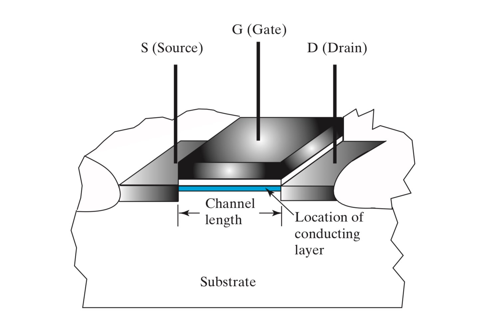

# Chapter 5: Hardware Implementation

## 一、设计空间 The Design Place

### 1. MOS 原理

1. MOS 的作用相当于一个开关，通过控制门极（Gate）的电压，来控制 MOS 的开闭
    
    
    
2. MOS 可分为 n-channel MOS（NMOS）和 p-channel MOS（PMOS）
    - 对于 NMOS，门极输入 G 为 `0` 时断开，G 为 `1` 时导通，称为 Normally Open（NO，常开）
    - 对于 PMOS，门极输入 G 为 `0` 时导通，G 为 `1` 时断开，称为 Normally Closed（NC，常闭）
    
    
    
3. 使用 MOS 的开关特性，可实现简单的逻辑（真正的实现应该用 CMOS）
    
    !!! example

        > **示例：**
        > 
        > - 左图：实现 $\overline X\times\overline Y$
        > - 右图：实现 $X+Y$
        > 
        > 
        > 

### 2. CMOS 原理

1. CMOS 可以分为上下两部分，上半部分接电源，由 PMOS 设计出 $F$ 的逻辑；下半部分接地，由 NMOS 设计出 $\overline F$ 的逻辑
2. CMOS 的 PMOS 电路和 NMOS 电路是对偶的，这使得我们只需要设计出两者中的一个，就可以利用对偶直接得到另一个
3. 在设计时，先使用 NMOS 实现 $\overline F$ 的逻辑，然后再对偶地设计出上半部分
4. 对于任何输入，CMOS 的上下两部分总是一个导通，而另一个断开。这就意味着理论上 CMOS 并不存在电流通路（即从电源指向接地的电路），所以不论 CMOS 是否处在工作状态，其总是没有能耗的

## 二、**可编程技术 Programmable Implementation Technologies**

### 1. 可编程技术概述

1. **硬件层面实现手段**
    - 控制连接（Control Connections）
        - Mask programing
        - Fuse（类似于保险丝，通过高电压来切断部分电路来实现）
        - Anti-fuse（Fuse 的反操作，通过高电压来联通部分电路来实现）
        - Single-bit storage element
    - 使用查找表（Lookup Tables）
    - 控制晶体管开关（Control Transistor Switching）
2. **永久与可重编程技术**
    - 永久（Permanent）编程技术：出厂后经过一次编程，便永久成型
        - Mask programming
        - Fuse
        - Anti-fuse
    - 可重（Reprogrammable）编程技术：允许重复进行编程
        - 按断电后编程信息是否丢失分为易失性和非易失性
3. **常见的可编程技术**
    - 只读内存 Read Only Memory（ROM）
    - 可编程阵列逻辑 Programmable Array Logic（PAL）
    - 可编程逻辑阵列 Programmable Logic Array（PLA）
    - Complex Programmable Logic Device（CPLD）
    - Field-Programmable Gate Array（FPGA）
    
    前三者属于永久编程技术，只能编程一次，如下是它们的可编程内容：
    
    
    

### 2. Read Only Memory（ROM）

- $2^N\times M$ ROM 由 $N$ 个输入、 $M$ 个输出组成
- AND 门是固定的，用于设计译码器，输出 $2^N$ 个最小项；OR 门是可编程的，通过对最小项进行或运算，实现特定逻辑
- ROM 可以被视作一个 Memory，输入一组地址（address），输出这组地址对应的 Memory 中存储的信息
- ROM 可以表达所有逻辑函数

### 3. Programmable Array Logic（PAL）

- AND 门是可编程的，OR 门是固定的，通过对乘积项进行或运算，实现特定逻辑
- 其中的一个输出信号 $W$ 可以作为其它与门的输入，从而实现多级逻辑
- 由于或门是固定的，因此 PLA 只能对有限个乘积项进行或运算；若逻辑中需要进行或运算的乘积项数量超出或门的输入限制，则需要通过多级逻辑来实现
- 由于上述原因，PAL 无法表达所有逻辑函数

### 4. Programmable Logic Arrays（PLA）

- PLA 在设计上和 ROM 类似，区别在于 PLA 并不使用译码器获得所有最小项，而是用可编程的 AND 阵列来代替译码器，获取所需的乘积项
- PLA 具有可编程的 AND 和 OR，因此比起 PAL 和 ROM 更具灵活性
- PLA 无法表达所有逻辑函数
    - 一种改进方法是在输出时做一次异或（实现对输出的取反），从而充分利用 $F_1$ 和 $\overline{F_2}$ 的乘积项的公共部分