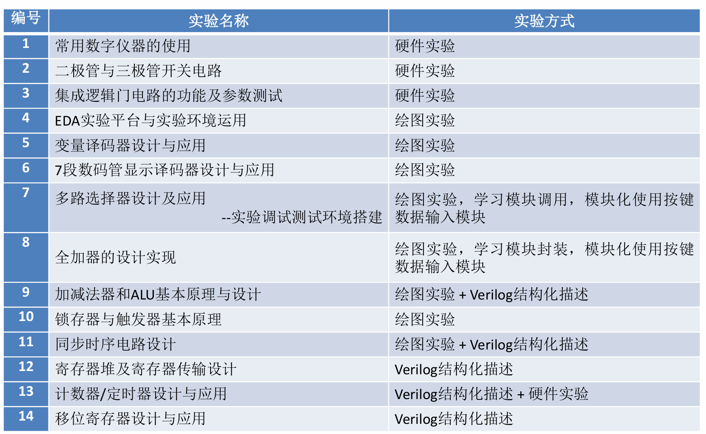

# 数字逻辑设计

-   :fontawesome-solid-code:{ .lg .middle } __Abstract__

    ---
    
    - 教师：马德
    - 课程代码：CS1019F
    - 学分：4.0
    - 开课学期：24-25 春夏学期
    - 上课时间：周四 6,7,8,9,10（实验课时不强制上机，需定期验收）
    - 评分规则：
        - 课上小测：30%（2 次，提前通知，每次 2 小时）
        - 实验和大作业：30%（源码+报告，截止于期末考试一周前）
        - 期末考试：40%（斩杀线约 40 分，不允许带 A4 纸）
    - 课程目录：
        - 数的表示
        - 布尔代数和逻辑最小化技术
        - 组合电路（Combinational Circuits）设计与分析
        - 时序电路（Sequential Circuits）设计与分析
        - 可编程逻辑设备和存储器
    - 实验目录：
        
        

    - 小测时间：
        - 2025.4.10（范围：前 3 章，闭卷，2 小时）
        - 2025.5.22（范围：前 4 章，闭卷，2 小时）

-   :material-table-of-contents:{ .lg .middle } __Table Of Contents__

    ---

    - [x] [Chapter 1: Digital Systems and Information](chap1/chap1.md)
    
    - [x] [Chapter 2: Combinational Logic Circuits](chap2/chap2.md)
    
    - [x] [Chapter 3: Combinational Logic Design](chap3/chap3.md)
    
    - [x] [Chapter 4: Sequential Circuits](chap4/chap4.md)
    
    - [x] [Chapter 5: Hardware Implementation](chap5/chap5.md)
    
    - [ ] [Chapter 6: Register and Register Transfer](chap6/chap6.md)

-   :fontawesome-solid-code:{ .lg .middle } __Files__

    ---

    - [x] [资料下载：实验报告](file_download.md)

