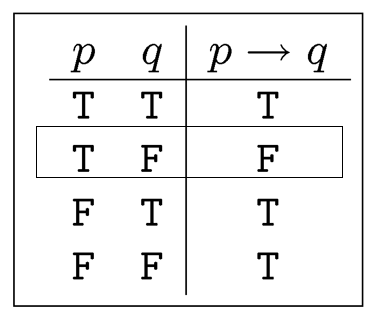
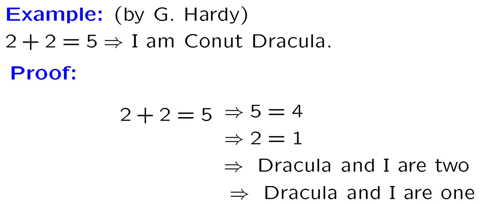

# Chapter 1: The Foundations—Logic and Proofs

## 一、命题逻辑 Proposition Logic

### 1. 命题 Proposition

1. 命题的定义：或为真、或为假的陈述（statement）
    - 命题必须为陈述，因此疑问句不能作为命题
    - 用小写字母表示命题： $p,q,r,…$
2. 可分为原子命题（Atom）和复合命题（Compound）
    - 原子命题：在结构上不能再分解出其他*命题*
    - 复合命题：由原子命题结合而成

### 2. 逻辑运算符 Logical Operators

1. **Negation（非）**
    - 符号： $\neg p$
2. **Conjunction（与，合取）**
    - 符号： $p\land q$
3. **Disjunction（或，析取）**
    - 符号： $p\lor q$
    - “或”的两重解释：
        - 包含或（Inclusive Or）：两者至少一者为真，则结果为真（本处所指的含义）
        - 互斥或（Exclusive Or）：两者有且只有一者为真，则结果为真（又称“异或”，用 $\oplus$ 表示）
4. **Implication（蕴含）**
    - 符号： $p\rightarrow q$
    - 含义：若 p 成立，则 q 必定成立
    - 称呼：
        - 称 p 为 hypothesis（假设）或 premise（前提）
        - 称 q 为 conclusion（结论）或 consequence（结果）
    - 真值表：
        
        
        
    - **常用称法**
        
        
        | if p then q | 如果 p 成立，则 q 成立 |
        | --- | --- |
        | p is sufficient for q | p 是 q 的充分条件 |
        | p implies q | p 揭示了 q |
        | **p only if q** | p 成立，只有当 q 成立时 |
        | q is necessary for p | q 是 p 的必要条件 |
        | **if q whenever p** | q 成立，每当 p 成立 |
        
        !!! example
            > **示例（p 和 q 的先后判断）：**
            > 
            > 
            > 
            > 

    - Everything implies truth, False implies Everything.
        
        !!! example

            > **示例：**
            > 
            > 
            > 
            > 

5. **Bioconditional（等价）**
    - 符号： $p\leftrightarrow q$
    - 含义：当且仅当 p 和 q 的真值相同时，该式为真
    - 真值表：
        
        
        

### 3. 命题公式 Proposition Formula

1. **命题公式的定义**
    
    
    
2. **优先级**
    - 第一优先级： $\neg$
    - 第二优先级： $\land , \lor$
    - 第三优先级： $\rightarrow , \leftrightarrow$
3. **命题公式的分类**
    - 恒真式（Tautology）
    - 恒假式（Contradiction）
    - 或真或假式（Contigence）

### 4. 命题的规范形式 Propositional Normal Forms

1. **命题的规范形式有两种：**
    - Disjunctive Normal Form（DNF，析取形式）
    - Conjunctive Normal Form（CNF，合取形式，不使用）
2. **析取形式**
    - 定义：**每个局部为与关系，局部与局部之间是或关系**
        - 字面量（Literal）是一个变量或它的取反
        - 析取形式是指由析取（或运算） 连接的合取项（与运算）组成的逻辑表达式
    - 基本形式
        
        $(A_1\land A_2\land … \land A_m)\lor (B_1\land B_2\land … \land B_n) \lor …$
        
        （其中，每个 $A_i、B_i$ 都是字面量）
        
    - 定理：任一命题公式一定与一个以析取形式表述的命题公式逻辑等价
    
    !!! example
        
        > **示例：**
        > 
        > 
        > 
        > 

3. **将表达式转化为析取形式**
    - 使用以下二式，将蕴含和等价关系转化为与、或、非关系
    
    
    
    - 使用双重否定为肯定的规律，以及狄摩根定律，处理括号外面的取反操作
    - 使用分布律
    
    !!! example

        > **示例：**
        > 
        > 
        > 
        > 

4. **全析取形式（Full Disjunctive Form）**
    - 定义
        - 全析取形式是一种严格的析取形式，它确保每个合取项都包含所有变量（即所有变量都出现一次，要么是原变量，要么是其否定）
        - 满足上述定义条件的合取项称为最小项（minterm）
    - 最小项的性质
        - 若 $A、B$ 是两个不同的最小项，则 $A\land B \Leftrightarrow F$
        - 最小项用符号 $m_i$ 表示，注意 i 的二进制形式与 $m_i$ 的表达式形式的联系
            
            
            
5. **将表达式转化为全析取形式**
    - 首先将表达式转化为析取形式
    - 然后使用下述方法，将缺失的变量加入表达式
        
        
        
    !!! example

        > **示例：**
        > 
        > 
        > 
        > 

## 二、命题等价性 Propositional Equivalence

### 1. 概念

1. **定义：** $A$、 $B$ 是逻辑等价的，若 $A\leftrightarrow B$ 恒真。
2. **示例**
    - 原命题 $p\rightarrow q$ 与它的反命题（Converse） $q\rightarrow p$ 不是逻辑等价的
    - 原命题与它的逆否命题（Contrapositive）是逻辑等价的
        
        $$
        p\rightarrow q \Leftrightarrow \neg q\rightarrow \neg p
        $$
        
3.  **数学术语**
    - 公理（axiom）：被广泛接受，但未经数学证明的命题
    - 定理（theorem）：经数学证明为真的命题
    - 引理（lemma）：用于证明更大的定理的小定理
    - 推论（corollary）：可以被另一个定理证明的逻辑结果，属于定理
    - 猜想（conjecture）：未知真伪的陈述

### 2. 等价变换规律

### 3. 推理规则

1. **Law of detachment or modus ponens**
    - $p\rightarrow q$
    - $p$
    - Therefore $q$
2. **Modus tollens**
    - $p\rightarrow q$
    - $\lnot q$
    - Therefore $\lnot p$
3. **Rule of Addition**
    - $p$
    - Therefore $p\lor q$
4. **Rule of Simplification**
    - $p\land q$
    - Therefore $p$
5. **Rule of Conjunction**
    - $p$
    - $q$
    - Therefore $p\land q$
6. **Rule of hypothetical syllogism**
    - $p\rightarrow q$
    - $q\rightarrow r$
    - Therefore $p\rightarrow r$
7. **Rule of disjunctive syllogism**
    - $p\lor q$
    - $\lnot p$
    - Therefore $q$

!!! example

    > **示例：**
    > 
    > 
    > 
    > 
    > 
    > 

## 三、谓词逻辑

### 1. 谓词 Predicates

- **定义：**一些命题中含有变量，命题的真伪取决于变量的取值，这样的命题称为命题函数（Propotional Function），又称谓词
    
    !!! example

        > **示例：**
        > 
        > 
        > 
        > 

### 2. 量词 Quantifiers

1. **将命题函数转化为命题的两种方法**
    - 给定命题函数中所有变量的值
    - 量词化（本节讲述）
2. **全称量词与存在量词**
    - 全程量词（Universal Quantifier）
    - 存在量词（Existential Quantifier）
    
    | **命题** | **何时为真** | **何时为假** |
    | --- | --- | --- |
    | $\forall xP(x)$ | 对每一个 $x$ ， $P(x)$ 都为真 | 有一个 $x$ ，使得 $P(x)$ 为假 |
    | $\exists xP(x)$ | 有一个 $x$ ，使得 $P(x)$ 为真 | 对每一个 $x$ ， $P(x)$ 都为假 |
    
    !!! note
        - **论域（Universe of discourse）：**讨论的范围
        - 量词的 **优先级** 高于命题演算中所有逻辑符号的优先级

    !!! example    

        > **示例：**
        > 
        > 
        > 
        > 

### **3. 等价变换规律**

1. 可拆分
    
    
    
2. 交换律
    
    
    
    !!! example "∀ 和 ∃ 不能随意交换"
            
        > **示例：**
        > 
        > 
        > 
        > 
    
3. 狄摩根定律
    - $\lnot \forall xp(x)\Leftrightarrow \exists x\lnot p(x)$
        
        左侧：并非任意 $x$ 都满足 $p(x)$
        
        右侧：存在 $x$ 不满足 $p(x)$
        
    - $\lnot \exists xp(x)\Leftrightarrow \forall x\lnot p(x)$
        
        左侧：不存在 $x$ 满足 $p(x)$
        
        右侧：任意 $x$ 都不满足 $p(x)$
        
4. 分配律
    
    
    
    !!! note "不满足分配律的条件"
        
        - “任意”、“或”搭配
        - “存在”、“与”搭配
        
        （但它们在其中一个方向上仍然是正确的）
        
        
    
    
5. 更多规律

### 4. 前束范式 Prenex Normal Form

!!! note

    - 前束范式是一阶逻辑的一种 **标准形式**
    - 一个公式被称为前束范式，如果它的所有量词（∀, ∃）都被移到公式的最前面，而不改变其逻辑含义
    - 换句话说，在前束范式中，公式的主干部分（不含量词的部分）仅由命题逻辑连接词（∧, ∨, →, ¬ 等）和谓词组成，而所有量词按适当顺序出现在最前面

1. **定义**
    
    一个一阶逻辑公式为前束范式，若其形如 $Q_1x_1Q_2x_2…Q_nx_n\psi$，其中：
    
    - 每个 $Q_i$ 是量词（ $\forall, \exist$）
    - $\psi$ 是量词自由（Quantifier Free）的，即它不含量词（ $\forall, \exist$）
2. **将表达式转化为前束范式**
    
    任何表达式都可以通过以下步骤转换为前束范式：
    
    - 消除所有蕴含（→）和双向蕴含（↔）连接词
    - 将所有否定（¬）向内移动，使得最终的否定只出现在文字（literals）中
    - 标准化变量，重命名约束变量（若有必要）
    - 将所有量词移动到公式的最前面
    
    !!! example
        > **示例：**
        > 
        > 
        > 
        > 
        > **过程分析：**
        > 
        > - 第一步：消除蕴含（→）连接词
        > - 第二步：将否定（¬）向内移动
        > - 第三步：重命名约束变量
        > - 第四步：将所有量词移动到公式的最前面

### 5. 推理规则

!!! example
    > **示例：**
    > 
    > 
    > 
    > 
    > 
    > 
    > 
    >