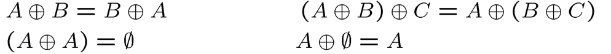

# Chapter 2: Basic Structures: Sets, and Functions

## 一、集合的基本概念

### **1. 集合的表示方法**

1. 列表（List）
2. 命题（Predicate）：使用命题对集合中的元素进行限定
3. 韦恩图（Venn Diagram）

### **2. 集合的性质**

1. 无序性
2. 可重复性
3. 确定性

### **3. 子集 Subset**

- 子集（Subset）的符号： $\subseteq$
- 真子集（Proper Subset）的符号： $\subset$
- 空集（Empty Set）的符号： $\emptyset$
- 全集（Universal Set）的符号： $U$

### **4. 无限集和有限集 Finite and Infinite Sets**

1. **集合的基数（Cardinality）**
    - 基数是集合论中刻画 **任意集合** 大小的一个概念
    - 有限集和无限集都有基数
    - 基数通常可以理解为集合 $S$ 中元素的个数，用 $|S|$ 表示
2. **有限集都是可数集，无限集有可数集和不可数集之分**
    - 无限可数集（Countable / Denumerable）：自然数集、整数集 …
    - 无限不可数集（Uncountable）：实数集 …

## 二、集合的运算 Set Operations

### 1. 交、并、差、取反

1. **Union：** $\cup$
2. **Intersection：** $\cap$
    - 若 $A\cap B=\emptyset$ ，则称 $A,B$ 不相交（Disjoint）
3. **Difference：** $A-B=\{x|x\in A\land x \notin B\}$
    - 若 $A,B$ 不相交，则 $A-B=A$
4. **Complement：**令 $U$ 为全集，则 $\overline A=U-A$

### **2. 异或 Symmetric Difference**

1.  $A\oplus B=(A-B)\cup (B-A)$
2. **运算性质**
    
    
    

!!! example

    > **示例：**
    > 
    > 
    > 求证：若 $A\oplus B=A\oplus C$ ，则 $B=C$
    > 
    > **证明：**
    > 
    > 
    > 

### 3. 幂集 Power Set

1. **幂集（Power Set）**是原集合 $S$ 中所有的子集（包括全集和空集）构成的集族，用 $P(S)$ 或 $2^S$ 表示，符号语言： $2^S=\{\ T\ |\ T\subseteq S\ \}$
2. 若集合中有 $n$ 个元素，则该集合的幂集有 $2^n$ 个元素

### 4. 笛卡尔乘积 Cartesian Product

1. **元组 Turple**
    - n 维元组形如 $(a_1,a_2,…,a_n)$
    - 元组内的元素是有序的，不能随意交换位置
    - 元组等价关系的定义
        
        $(a_1,a_2,…,a_n)=(b_1,b_2,…,b_n)\Leftrightarrow a_i=b_i\ for\ i=1,...,n$
        
2. **笛卡尔乘积的定义**
    
    
    
3. **笛卡尔乘积对有限集的影响**
    - 若 $A$ 和 $B$ 都是有限集，则 $A\times B$ 是有限集；若 $A$ 和 $B$ 各有 $m$ 个和 $n$ 个元素，则 $A\times B$ 有 $m\times n$ 个元素
    - 若 $A$ 是无限集， $B$ 集合非空，则 $A\times B$ 和 $B\times A$ 都是无限集
4. **笛卡尔乘积的性质**
    
    
    

!!! example

    > **示例：**
    > 
    > 
    > 
    > 
    > **解答：**只有（2）正确
    > 
    > - （1）存在反例： $A=D=\empty\ ;B=C=\{1\}$
    > - （2）正确
    > - （3、4）使用性质（4）展开可发现漏项错误

## 三、基数 Cardinality

1. **计算有限集的基数**
    
    
    
    !!! example
        
        
        
2. **定理：**两集合的基数相等，当且仅当两个集合之间能够构成双射

    !!! example
        
        
        
3. **定理：**一个集合是无限集，当且仅当它 **存在** 一个 **真子集** 与它具有相同的基数

    !!! example "Hilbert Hotel"
        
        假设有一家酒店，它有无限多个房间，即酒店的房间数量是 **可数无限个**，与自然数集 N 等大
        
        1. **情景：酒店满员，但还能接待有限多的新客人**
            - 假设现在酒店已经满员，每个房间都有客人，如果有一位新客人来入住，酒店还能接待吗？
            - 解决方案：让每位住客向后移动一间房，这样房间 1 就空出来了，新的客人可以住进房间 1
            - 这说明：对于可数无穷集，增加有限个新元素不会改变它的大小
        2. **情景：酒店满员，但还能接待无限多的新客人**
            - 现在，假设有无限多个新客人到来，酒店还能接待吗？
            - 解决方案：让原本住在房间 n 的客人搬到房间 2n（即编号翻倍）。这样，所有原住客都被安置到了偶数编号的房间，而所有奇数编号的房间都空出来了，正好可以安排无限多个新客人
            - 这说明：即使已经满员，可数无穷集仍然可以容纳额外的可数无穷个元素

4. **定理：**所有无限可数集具有相同的基数，记为 $\aleph_0$（阿列夫零）；无限不可数集的基数一定大于 $\aleph_0$
    - 自然数集 $N$、整数集 $Z$ 、有理数集 $Q$ 、集合 $N\times N$ 都是可数无限集，它们的基数相同
    - 实数集 $R$ 是不可数无限集，它的基数大于 $\aleph_0$

        !!! note "证明"
            - **第一步：**证明 $(0,1)$ 范围内的实数集是不可数的
                
                
                
            - **第二步：** $(0,1)$ 范围内的实数集与 $R$ 构成双射，因此 $|(0,1)|=|R|$
            - 结合以上两步，可知 $R$ 是不可数集

5. **定理：**幂集的基数一定大于原集合的基数 $|2^A|>|A|$
6. **并运算对可数性的影响**
    - 有限个可数集的并是可数集
    - 可数个数个可数集的并是可数集
7. **连续性假设 Continuum Hypothesis（CH）**
    - 问题：是否存在集合，其基数介于自然数集的基数和实数集的基数之间
    - 这是一个不可判定（Undecidable）问题

## 四、函数 Functions

### 1. 函数的定义

1. **Domain：**定义域
2. **Codomain：**上域
3. **Range：**值域（值域是上域的子集）
4. **Image：**像
5. **Pre-Image：**原像

### 2. 单射、满射和双射

### 3. 反函数和组合函数

1. **反函数 Inverse**
    - 只有双射才有反函数
    
    
    
2. **组合函数 Composition**
    
    
    

### 4. 常用的函数：向上 / 向下取整

1. **定义**
    
    
    
2. **性质**
    
    
    

### 5. 函数的增长性 Growth of Functions

1. **$O$ Notation**
    
    
    
2. **$\Omega$ Notation**
    
    
    
3. **$\Theta$ Notation**
    
    
    
    - **Of Order：**同阶
4. **定理**
    
    
    
    !!! note "部分证明"
        > **证明此定理的一部分：** $f(x)=O(x^n)$
        > 
        > 
        > 
        >