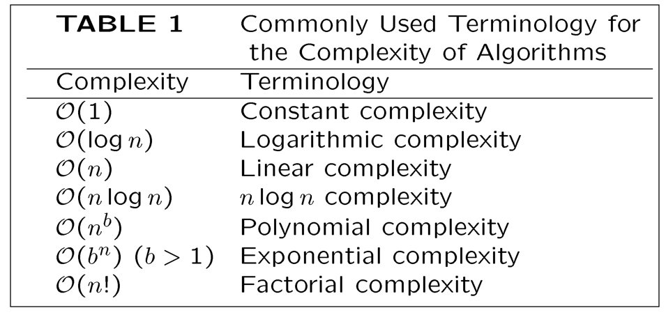

# Chapter 3: The Fundamentals: Algorithms

## 一、算法的基本概念

### 1. 算法的定义

**Algorithm：**A finite set of precise instructions for performing a computation or solving ploblem

### 2. 算法的性质

1. **Input：**算法需要从特定的集合中接收输入
2. **Output：**算法需要产生输出
3. **Definiteness：**算法的步骤是精准定义的
4. **Correctness：**算法对任何输入产生结果都是正确的
5. **Finiteness：**对任意一组输入，算法在有限步操作后停止运行
6. **Effectiveness：**在有限的时间内精确地执行算法的每一步
7. **Generality：**适用于所有所需形式的问题，而不仅仅是一组特定的输入值

## 二、算法的复杂度

### 1. 复杂度的定义

1. **复杂度（Complexity）：**运行算法所需的时间、空间量
2. **空间复杂度（Space Complexity）：**与实现算法所用的数据结构紧密相关
3. **时间复杂度（Time Complexity）：**当输入具有特定大小时，可以用算法使用的运算次数来表示

### 2. 复杂度的分类

1. **Best-case Time：**执行算法所需的最小时间
2. **Worst-case Time：**执行算法所需的最大时间
3. **Average-case Time：**执行算法所需的平均时间

### 3. NP 问题

1. **P 问题：**能在多项式时间内解决的问题
2. **NP 问题：**能在多项式时间内验证的问题
3. **NP-Complete 问题：**如果 NPC 问题能在最坏情况下以多项式时间解决，那么所有 NP 问题都能在最坏情况下以多项式时间解决

## 三、算法及复杂度分析示例

### 1. 查找最大元素算法

- **问题背景：**在列表中搜索最大的元素，并返回其值
- **算法伪代码：**
    
    
    
- **时间复杂度分析：**
    
    
    

### 2. 线性搜索算法

- **问题背景：**在列表中搜索与给定整数相等的列表元素，并返回该元素的下标；若无相应元素，返回 0
- **算法伪代码：**
    
    
    
- **时间复杂度分析：**
    
    
    

### 3. 二分搜索算法

- **问题背景：**在列表中搜索与给定整数相等的列表元素，并返回该元素的下标；若无相应元素，返回 0；其中，列表元素已按递增顺序排序
- **算法伪代码：**
    
    
    
- **时间复杂度分析：**
    
    