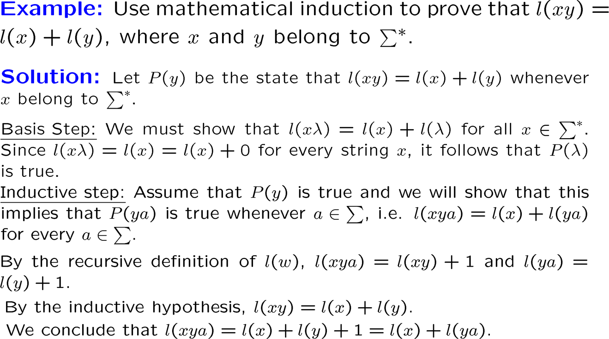

# Chapter 4: Induction and Recursion

## 一、数学归纳法 Mathmatical Induction

1. 良序性质（The Well-ordering Property）：任何非负整数的集合中，必然存在一个最小的元素
2. 数学归纳法的形式 
    
    使用数学归纳法证明 $P(n)$ 为真：
    
    - 形式 1
        - Basic Step：证明 $P(1)$ 为真
        - Inductive Step：证明 $P(n)\rightarrow P(n+1)$ 对每个 $n$ 都成立
    - 形式 2
        - Basic Step：证明 $P(1)$ 为真
        - Inductive Step：证明 $[P(1)\land P(2)\land …\land P(n)]\rightarrow P(n+1)$ 对每个 $n$ 都成立

## 二、递归 Recursive Definitions

### 1. 递归定义函数

在非负整数域上，可以使用递归定义新的函数：

- 指定函数在 0 处的值
- 给出一个规则，由较小整数处的函数值推导较大整数处的函数值

!!! example
    > **示例：**斐波那契函数
    > 
    > 
    > $f(0)=0,f(1)=1,f(n)=f(n-1)+f(n-2)$
    > 

### 2. 递归定义集合

!!! example
    > **示例：**以递归方法定义能被 3 整除的整数集
    > 
    > - $3\in S$
    > - $x+y\in S$, if $x\in S$ and $y\in S$

递归的定义常用于对字符串的研究之中：

1. 字母表（Alphabet） $\Sigma$ 上的字符串是由字母表 $\Sigma$ 上的符号（Symbol）组成有限序列
2. 字符串 $x$ 与 $y$ 的连接（concatenation）记作 $xy$
3. 记空字符串为 $\lambda$
4. 字母表 $\Sigma$ 上的所有字符串组成的集合记作 $\Sigma^*$，可由如下递归定义：
    - 若 $\lambda$ 为空字符串，则 $\lambda \in \Sigma^*$
    - 若 $w\in \Sigma^*, x\in \Sigma$ ，则 $wx\in \Sigma^*$
5. 字符串 $w$ 的长度记作 $l(w)$，可由如下递归定义：
    - 若 $\lambda$ 为空字符串，则 $l(\lambda)=0$
    - 若 $w\in \Sigma^*, x\in \Sigma$ ，则 $l(wx)=l(w)+1$

!!! example
    > **示例：**
    > 
    > 
    > 
    > 

### 3. 使用递归的算法

