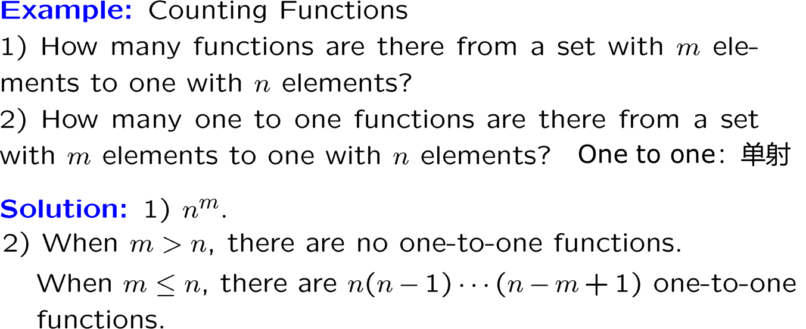

# Chapter 5: Counting

## 一、加法法则与乘法法则

### **1. 加法法则 The Sum Rule**

- **适用场景**：当任务可分解为 **互斥** 的若干子任务时（即完成方式之间无重叠）
- **规则**：若任务有 $k$ 种互斥的完成方式，分别有 $n_1,n_2,…,n_k$ 种方法，则总方法数为各方法数之和： $n_1+n_2+…+n_k$
- **使用集合进行描述：**若 $A_1,A_2,…,A_m$ 是不相交集，那么集合中元素个数满足： $|A_1\cup A_2\cup…\cup A_m|=|A_1|+|A_2|+…+|A_m|$

!!! example

    > **示例**：从北京到上海可选高铁（5 班次）或飞机（3 班次），共有 5+3=8 种出行方式
    > 

### **2. 乘法法则 The Product Rule**

- **适用场景**：当任务需 **连续完成多个独立步骤** 时（每一步的选择不影响其他步骤）
- **规则**：若任务分 $k$ 个独立步骤，第 $i$ 步有 $n_i$ 种方法，则总方法数为各步骤方法数之积： $n_1\times n_2\times …\times n_k$
- **使用集合进行描述：**若 $A_1,A_2,…,A_m$ 是有限集，那么集合中元素个数满足： $|A_1\times A_2\times…\times A_m|=|A_1|·|A_2|·…·|A_m|$ （等式左侧为笛卡尔乘积）

!!! example

    > **示例**：选一件衬衫（3 款）和一条裤子（4 款），共有 3×4=12 种搭配
    > 

!!! example

    > **示例：**
    > 
    > 
    > 
    > 

!!! example

    > **示例：**
    > 
    > 
    > 
    > 

!!! example

    > **示例：**
    > 
    > 
    > 
    > 

## 二、鸽巢原理

### 1. 鸽巢原理 Pigeonhole Principle

1. **基本：**若 $k+1$ 或更多物体被放到 $k$ 个箱子中，则至少有一个箱子有至少 2 个物体
2. **广义：**若 $N$ 个物体被放到 $k$ 个箱子中，则至少有一个箱子有至少 $\lceil N/k\rceil$ 个物体
    
    !!! example

        > **示例：**367 个人必定有至少两人生日相同
        > 

3. **定理：**任意不超过 $2n$ 的 $n+1$ 个正整数中，必有一个整数能整除另一个整数
    
    !!! note "证明"

        > **证明：**
        > 
        > - 把 $n+1$ 个整数 $a_1,a_2,…,a_{n+1}$ 表示为 2 的指数次幂与一个奇数的乘积
        >     
        >     $a_j=2^k\times q_j\ |\ k\in Z^+\land (q_j\ is\ odd)$
        >     
        >     （ $k$ 可为 0，因此所有整数都可按此方法表示）
        >     
        > - 不超过 $2n$ 的奇数只有 $n$ 个，而在上式中定义的 $q_j$ 有 $n+1$ 个，因此至少有两个整数 $a_i$ 和 $a_j$ 对应的奇数相同，即 $q_i=q_j=q$
        > - 设这两个数的分解形式为： $a_i=2^{k_i}q_i,\ a_j=2^{k_j}q_j$
        > - 若 $k_i<k_j$，则 $a_i=2^{k_i}⋅q$ 能整除 $a_j=2^{k_j}⋅q$ ，因为 $a_i/a_k=2^{k_i-k_j}$；若 $k_i≥k_j$ 则同理

### 2. 子序列问题 Subsequence

1. **定义**
    - 设 $a_1,…,a_N$ 是实数序列（sequence）
    - 则它的子序列（subsequence）为序列 $a_{i_1},…,a_{i_m}$，其中 $1≤i_1<…<i_m≤N$
    - 即：子序列是通过按原始顺序包含原始序列的某些项而从原始序列中获得的序列
2. **严格单增和严格单减**
    - 若序列中每个元素比前一个元素大，这个序列称为严格单增的（strictly increasing）
    - 若序列中每个元素比前一个元素小，这个序列称为严格单减的（strictly decreasing）
3. **定理：**每个长为 $n^2+1$ 的由 **不同的** 实数组成的序列，都包含长为 $n+1$ 的或者严格单增、或者严格单减的子序列
    
    !!! example

        > **示例：**
        > 
        > 
        > 
        > 
    
    !!! note "证明"

        > **证明：**
        > 
        > - 核心思路：反证法
        >     
        >     
        >     
        >     
        >     
        > - 解释： $a_k\leftrightarrow (i_k,d_k)$
        >     
        >     
        >     
        
4. **定理：**设 $x_1, x_2,…,x_n$ 是长度为 $n$ 的整数序列，则存在某个连续（Consecutive）子序列，其和能被 $n$ 整除
    
    !!! note "证明"
    
        > **证明：**
        > 
        > 1. **定义前缀和**：
        >     
        >     设 $A_i$ 为序列前 $i$ 项之和，特别地 $A_0=0$
        >     
        > 2. **分两种情况讨论**：
        >     - **情况 1**：若某个 $A_i$  本身能被 $n$ 整除（即 $n∣Ai$），则直接取子序列 $x_1,…,x_i$，其和满足条件
        >     - **情况2**：若所有 $A_i$ 都不能被 $n$ 整除（即 $n∤Ai$ 对 $i=1,2,…,n$），则进入鸽巢原理的论证
        > 3. **鸽巢原理的应用**：
        >     - **鸽子**： $n+1$ 个前缀和 $A_0,A_1,…,A_n$
        >     - **鸽巢**：可能的余数 $[1]_n,[2]_n,…,[n−1]_n$（共 $n−1$ 个非零余数）
        >     - 由于 $A_i$ 均不被 $n$ 整除，它们的余数只能是 $1,2,…,n−1$
        >     - 根据鸽巢原理，至少有两个前缀和 $A_i$ 和 $A_j$（假设 $i<j$）的余数相同，即：从 $i+1$ 到 $j$ 的连续子序列的和能被 $n$ 整除

5. **定理：**设 $a_1, a_2,…,a_N$ 是长度为 $N=2^n$ 的序列，由 $n$ 个不同的负整数组成，则存在某个连续子序列，其乘积是完全平方数（Perfect Square）
    
    !!! note "证明"
        
        > **证明：**
        > 
        > 1. **定义前缀积**：
        >     
        >     设 $A_i$ 为序列前 $i$ 项之积，特别地 $A_0=1$
        >     
        >     由于 $a_k$ 是负整数，将 $A_i$ 分解为质因数的形式：
        >     
        >      $A_i=x_1^{α_{i1}}x_2^{α_{i2}}⋯x_n^{α_{in}}$
        >     
        >     其中 $x_1,…,x_n$ 是序列中不同的负整数， $α_{ik}≥0$ 是幂次
        >     
        > 2. **关键观察**：
        >     - 若 $A_i$ 表达式中所有质因数的幂次 $α_{ik}$ 均为偶数，则 $A_i$ 为完全平方数
        > 3. **分两种情况讨论**：
        >     - **情况 1**：若某个 $A_i$ 本身是完全平方数，即所有 $α_{ik}≡0(mod2)$，则子序列 $a_1,…,a_i$ 满足条件
        >     - **情况 2**：若所有 $A_i$ 都不是完全平方数，则进入鸽巢原理的论证
        > 4. **鸽巢原理的应用**：
        >     - **鸽子**： $2^n$ 个前缀积 $A_1,A_2,…,A_{2^n}$
        >     - **鸽巢**：所有可能的奇偶性组合
        >         
        >         （ $α_{i1}\ mod\ 2,…,α_{in}\ mod\ 2$）
        >         
        >         由于每个 $α_{ik}\ mod\ 2$ 只能是 0 或 1，且排除全 0 的情况（对应完全平方数），共有 $2^n−1$ 个可能的非零组合
        >         
        >     - **结论**：根据鸽巢原理，至少有两个前缀积 $Ai$ 和 $A_j$ 的幂次奇偶性相同，这意味着 $A_j/A_i$ 的所有幂次为偶数（因为相减后奇偶性抵消），即：子序列 $a_{i+1},…,a_j$ 的乘积是完全平方数

6. **其它应用**
    
    !!! example
        > **示例：**
        > 
        > 
        > 
        > 

7. **拉姆齐理论（Ramsey Theory）：**在任何 6 个人的群体中，必然存在 3 个人互相是朋友，或者 3 个人互相是敌人（假设“朋友”和“敌人”关系是相互的，且任意两人之间只有一种关系）
    
    !!! note "证明"
        
        > **证明：**
        > 
        > 1. **任选一人（A）作为起点**：
        >     
        >     从 6 人中任意选择一个人，记为 A，剩下的 5 个人与 A 的关系只有两种可能：A 的朋友或敌人
        >     
        > 2. **应用广义鸽巢原理**：
        >     
        >     5 个人分配到“朋友”或“敌人”两类中
        >     
        >     - **情况 1**：A 至少有 3 个朋友（记为 B、C、D）
        >     - **情况 2**：A 至少有 3 个敌人（证明类似）
        > 3. **分析情况 1（A 有 3 个朋友：B、C、D）**：
        >     - **子情况 1**：如果 B、C、D 中有任意两人是朋友（例如 B 和 C 是朋友），则 A、B、C 就是 3 个互相是朋友的人
        >     - **子情况 2**：如果 B、C、D 中没有任何两人是朋友（即两两互为敌人），则 B、C、D 本身就是 3 个互相是敌人的人
        > 4. **分析情况 2（A 有 3 个敌人）**：证明类似

## 三、排列与组合 Permutations and Combinations

### 1. 排列 Permutations

1. **定义**
    
    给定一个由不同元素组成的集合 $X=\set{x_1,x_2,…,x_n}$
    
    - $X$ 的 **排列** 是 $x_1,…,x_n$ 的一个有序组织
    - $X$ 的 **r-排列** 是包含 $r$ 个元素的 $X$ 的子集的一个有序组织
    - $P(n,r)$ 表示包含 $n$ 个元素的集合具有的 r-排列的种类数
2. **定理**
    - $P(n,r)=\frac{n!}{(n-r)!}$
    - $P(n,n)=n!$

### 2. 组合 Combination

1. **定义**
    
    给定一个由不同元素组成的集合 $X=\set{x_1,x_2,…,x_n}$
    
    - $X$ 的 **r-组合** 是包含 $r$ 个元素的 $X$ 的子集的一个无序组织
    - $C(n,r)$ 表示包含 $n$ 个元素的集合具有的 r-组合的种类数
2. **定理**
    - $C(n,r)=\frac{n!}{(n-r)!r!}=\frac{P(n,r)}{r!}$

### 3. 二项式分解 Binomial Coefficients

1. **二项式定理 Binomial Theorem**
    
    设 $a$ 和 $b$ 是实数， $n$ 是正整数，则：
    
    $(a+b)^n=C(n,0)a^n+C(n,1)a^{n-1}b+…+C(n,n-1)ab^{n-1}+C(n,n)b^n$
    
2. **杨辉三角 Pascal’s Triangle**
    
    
    
3. **定理：** $C(n+1,k)=C(n,k)+C(n,k-1)$
4. **定理：** $\sum_{k=0}^nC(n,k)=2^n$
5. **定理：** $C(m+n,r)=\sum_{k=0}^rC(m,r-k)C(n,k)$

### 4. 广义的排列组合 Generalized Permutations & Combination

1. 允许重复的排列：对于一个含 $n$ 个元素的集合，允许重复的 r-排列，共有 $n^r$ 种
2. 允许重复的组合：对于一个含 $n$ 个元素的集合，允许重复的 r-组合，共有 $C(n+r-1,r)$ 种
    
    !!! note "解释"
    
        > **解释：**可用 “插板法” 进行理解
        > 
        > 
        > 
        > 
    
    !!! example
        > **示例：**
        > 
        > - 饼干店有 4 种饼干，准备购买 6 块，有多少种方法？
        >     - $n=4,\ r=6$
        >     - 方法数： $C(4+6-1,6)=C(9,6)=84$
        > - $x_1+x_2+x_3+x_4=29$ 有多少组非负整数解？
        >     - $n=4,\ r=29$
        >     - 解数： $C(4+29-1,29)=C(32,29)=C(32,3)=4960$
        > - $x_1+x_2+x_3+x_4=29$ 有多少组满足 $x_1>0,x_2>1,x_3>2,x_4≥0$ 的整数解？
        >     - 提前为 $x_1,x_2,x_3$ 分别预留 1, 2, 3
        >     - $n=4,\ r=23$
        >     - 解数： $C(4+23-1,23)=C(26,23)=2600$

3. **将物品分配到箱子中**
    - 若物品是不可区分的（例如：完全相同的球），则将问题转化为求非负整数解的数量
    - 若物品是可区分的（例如：扑克牌），则使用下述定理：
        
        将 $m$ 个可区分的物体分配到 $k$ 个可区分的箱子中，使箱子 $i$ 中具有 $n_i$ 个物体，总方法数为 $\frac{n!}{n_1!n_2!…n_k!}$
        
    !!! example
        
        > **示例：**将 $2t+1$ 个不可区分的球放进 3 个可区分的箱子，要求任意两个箱子中的球数之和大于第三个箱子，有多少种方法？
        > 
        > - **第一步：无约束条件下的总方法数**
        >     - 由于球不可区分、盒子可区分，问题转化为求非负整数解的数量：
        >         
        >         $x_1+x_2+x_3=2t+1$，其中 $x_i$ 表示第 $i$ 个盒子中的球数
        >         
        >     - 于是，无约束条件下的总方法数为：
        >         
        >          $C(3+2t+1-1,2t+1)=C(2t+3,2)$
        >         
        > - **第二步：排除不满足条件的情况**
        >     - 需排除以下非法情况：存在某个盒子中的球数 ≥ 其他两个盒子球数之和
        >     - 由于总球数为 $2t+1$，非法情况等价于：某个盒子中的球数 ≥ $t+1$，具体分为三种对称的非法子情况
        >     - 考虑每一个非法子情况，假设 1 号盒子球数大于其它两个盒子球数之和，则有 $x_1≥t+1$
        >         
        >         进行变量替换，令 $y_1=x_1-(t+1)$，于是非法子情况的数量转化为求非负整数解的数量：
        >         
        >         $y_1+x_2+x_3=(2t+1)-(t+1)=t$
        >         
        >         其解数为 $C(3+t-1,t)=C(t+2,2)$
        >         
        >     - 考虑到非法子情况共有三种，那么总的非法情况数即为 $3\times C(t+2,2)$
        > - **第三步：综合**
        >     - 综上，共有 $C(2t+3,2)-3\times C(t+2,2)$ 种方法
        
    !!! example

        > **示例：**
        > 
        > 
        > 
        > 

### 5. 生成排列 Generating Permutations

1. **字典序（Lexicographic Order）的定义**
    
    给定集合 ${1,2,…,n}$ 的两个排列 $a_1a_2⋯a_n$ 和 $b_1b_2⋯b_n$，称 $a_1a_2⋯a_n$ 在字典序中 **先于（Precede）** $b_1b_2⋯b_n$，如果存在某个位置 $k（1≤k≤n）$，使得：
    
    - 前 $k−1$ 位完全相同： $a_1=b_1,a_2=b_2,…,a_{k−1}=b_{k−1}$
    - 第 $k$ 位满足 $a_k<b_k$
    
    !!! example

        > **示例**：
        > 
        > 
        > 在集合 ${1,2,3,4,5}$ 中，排列 `23415` 先于 `23514`，因为：
        > 
        > - 前两位相同
        > - 第三位 `4 < 5`
        
2. **生成下一个字典序排列的算法**
    
    给定一个排列 $a_1a_2⋯a_n$，如何找到字典序中下一个更大的排列？
    
    - 找到满足 $a_j<a_{j+1}$ 且 $a_{j+1}>a_{j+2}>…>a_n$ 的整数 $a_j$ 和 $a_{j+1}$，即排列中最后一对前者小于后者的相邻整数
    - 在第 $j$ 个位置放置 $a_j,a_{j+1},…,a_n$ 中大于 $a_j$ 的最小整数
    - 将剩余的整数 $a_j,a_{j+1},…,a_n$ 按升序排列在第 $j+1$ 到 $n$ 的位置上