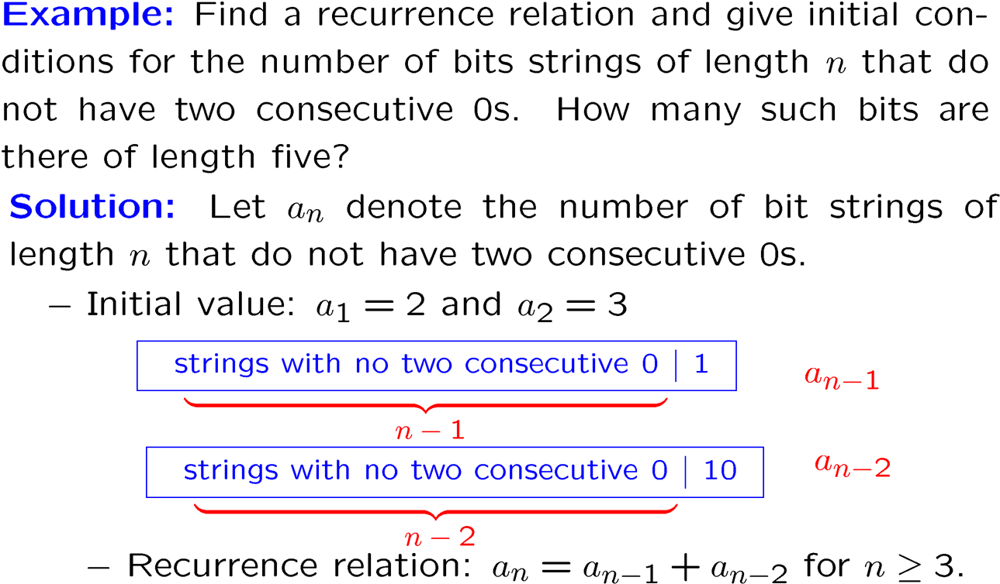

# Chapter 6: Advanced Counting Techniques

## 一、递推关系 Recurrence Relations

### 1. 基本概念

- 一个数列 $\set{a_n}$ 的递推关系，是指用一个或多个该数列的前项来表示 $a_n$ 的方程
- 若一个数列的项满足递推关系，则称该数列为该递推关系的解（Solution）

!!! example
    > **示例：**斐波那契数列
    > 
    > - $f_1=f_2=1$
    > - $f_n=f_{n-1}+f_{n-2}$，当 $n≥3$ 时

!!! example

    > **示例：**汉诺塔问题的移动步数
    > 
    > - 令 $H_n$ 表示解决 $n$ 个碟子的汉诺塔问题所需的移动步数
    > - $H_1=1$
    > - $H_n=2H_{n-1}+1$
    > - 该递推关系的解： $H_n=2^n-1$

!!! example

    > **示例：**
    > 
    > 
    > 
    > 

!!! example

    > **示例：**
    > 
    > 
    > 
    > 

### 2. 递推关系求解的相关定义

1. **定义：k 阶线性齐次常系数递推关系**
    
    **Linear Homogeneous Recurrence Relation of Degree k with Constant Coefficients**
    它是形如 $a_n=c_1a_{n-1}+c_2a_{n-2}+…+c_ka_{n-k}$ 的递推关系，其中 $c_1,…,c_k$ 都是实数，且 $c_k \neq 0$
    
    !!! example "反例"

        > 
        > - 递推关系 $a_n=a_{n-1}+a_{n-2}^2$ 不是线性的
        > - 递推关系 $a_n=2a_{n-1}+1$ 不是齐次的
        > - 递推关系 $a_n=na_{n-1}$ 不是常系数的
2. **定义：特征方程与特征根**
    
    为求解线性齐次常系数递推关系，我们需要列出递推关系的特征方程，根据特征方程求出特征根
    
    - 特征方程（Characteristic Equation）：在递推关系中代入 $a_n=r^n$，即得到特征方程
        - 设递推关系为 $a_n=c_1a_{n-1}+c_2a_{n-2}+…+c_ka_{n-k}$
        - 其特征方程为 $r^k-c_1r^{k-1}-c_2r^{k-2}-…-c_{k-1}r-c_k=0$
    - 特征根（Characteristic Roots）：特征方程的解

### **3. 求解 2 阶线性齐次常系数递推关系**

- **定理：**令 $c_1,c_2$ 为实数，若特征方程 $r^2-c_1r-c_2=0$ 有 2 个不同的根 $r_1,r_2$，则递推关系的解形如：
    
     $a_n=\alpha_1r_1^n+\alpha_2r_2^n$
    
- **定理：**令 $c_1,c_2$ 为实数，若特征方程 $r^2-c_1r-c_2=0$ 只有 1 个根 $r$，则递推关系的解形如：
    
    $a_n=\alpha_1r_0^n+\alpha_2nr_0^n$
    

### **4. 求解 k 阶线性齐次常系数递推关系**

- **定理：**令 $c_1,…,c_k$ 为实数，若特征方程 $r^k-c_1r^{k-1}-c_2r^{k-2}-…-c_{k-1}r-c_k=0$ 有 $k$ 个不同的根 $r_1,…,r_k$，则递推关系的解形如：
    
     $a_n=\alpha_1r_1^n+\alpha_2r_2^n+…+\alpha_kr_k^n$
    
- **定理：**令 $c_1,…,c_k$ 为实数，若特征方程 $r^k-c_1r^{k-1}-c_2r^{k-2}-…-c_{k-1}r-c_k=0$ 有 $t$ 个不同的根 $r_1,…,r_t$，且它们的重数（Multiplicities）分别为 $m_1,…,m_t$，则递推关系的解形如：
    
    $a_n=(\alpha_{1,0}+\alpha_{1,1}n+…+\alpha_{1,m_1}n^{m_1-1})r_1^n\\+(\alpha_{2,0}+\alpha_{2,1}n+…+\alpha_{2,m_2}n^{m_2-1})r_2^n\\+...\\+(\alpha_{t,0}+\alpha_{t,1}n+…+\alpha_{t,m_t}n^{m_t-1})r_t^n$
    
!!! example

    > **示例：**
    > 
    > 
    > 
    > 
    > 
    > 

### 5. **求解线性非齐次常系数递推关系**

1. **定义：线性非齐次常系数递推关系**
    - 它是形如 $a_n=c_1a_{n-1}+c_2a_{n-2}+…+c_ka_{n-k}+F(n)$ 的递推关系，其中 $c_1,…,c_k$ 都是实数， $F$ 只是 n 的函数且不恒为 0
    - 其中， $a_n=c_1a_{n-1}+c_2a_{n-2}+…+c_ka_{n-k}$ 称为相伴齐次递推关系（Associated Homogeneous Recurrence Relation）
2. **定义：齐次解与特解**
    - 齐次解（Homogeneous Solution）：相伴齐次递推关系的解，记为 $\set {a_n^{(h)}}$
    - 特解（Particular Solution）：根据 $F(n)$ 的形式猜测得到的递推关系的一组解，记为 $\set{a_n^{(p)}}$
    - 则线性非齐次常系数递推关系的解为 $\set{a_n^{(p)}+a_n^{(h)}}$
3. **如何得到特解**
    
    设 $F(n)=(b_tn^t+b_{t-1}n^{t-1}+…+b_1n+b_0)s^n$
    
    - 若 s 不是相伴齐次递推关系的特征根，则特解形如：
        
        $(p_tn^t+p_{t-1}n^{t-1}+…+p_1n+p_0)s^n$
        
    - 若 s 是相伴齐次递推关系的特征根，重数为 m，则特解形如：
        
        $n^m(p_tn^t+p_{t-1}n^{t-1}+…+p_1n+p_0)s^n$
        
!!! example

    > **示例：**
    > 
    > 
    > 
    > 
    > - 写出齐次解的形式：$\alpha\times 3^n$
    > - 写出特解的形式：$cn+d$
    > - 将特解代入递推关系：
    >     - 得到 $cn+d=3[c(n-1)+d]+2n$，对任意 $n$ 成立
    >     - 解得 $c=-1, d=-3/2$
    > - 从而，递推关系的解形如： $a_n=\alpha\times 3^n-n-3/2$
    > - 代入 $a_1=3$，解得 $\alpha=11/6$
    > - 从而，递推关系的解为： $a_n=11/6\times 3^n-n-3/2$

## 二、容斥原理 Inclusion-Exclusion

### 1. 容斥原理的内容

1. **基本形式**
    
    
    
2. **替代形式**
    
    
    
!!! example

    > **示例：**
    > 
    > 
    > 
    > 

### 2. 求满射函数的数量

- **定理：**令 $m$ 和 $n$ 为正整数（ $m≥n$ ），则从具有 $m$ 个元素的集合到具有 $n$ 个元素的集合的满射函数（Onto Functions） 的数量为：
    
    $n^m-C(n,1)(n-1)^m+…+(-1)^{n-1}C(n,n-1)\times 1^m$
    
!!! note "解释"

    > **解释：**
    > 
    > 
    > 求 6 个元素的集合到 3 个元素的集合的满射函数的数量
    > 
    > - 设 3 个元素的集合为 $\set{b_1,b_2,b_3}$
    > - 令性质 $P_i$ 表示 $b_i$ 不在函数的值域中，则一个函数不是满射函数当且仅当它不具备性质 $P_1,P_2,P_3$
    > - 从而满射函数的数量为：
    >     
    >     
    >     

!!! example

    > **示例：**
    > 
    > 
    > 
    > 

## 三、生成函数 Generating Functions

### 1. 生成函数的概念与求法

1. **定义**
    - 对于无限实数序列 $a_0,a_1,…,a_k,…$，其生成函数为
        
        $G(x)=a_0+a_1x+…+a_kx^k+…=\sum_{k=0}^\infin a_kx^k$
        
    - 对于有限实数序列，类似地定义生成函数
    
    !!! example

        > **示例：**
        > 
        > - 序列 1,1,1,1,1,1 的生成函数为 $1+x+x^2+x^3+x^4+x^5$
        > - 序列 $a_k=C(m,k)$ 的生成函数如下（二项式定理）
        >     
        >      $G(x)\\=C(m,0)+C(m,1)x+C(m,2)x^2+...+C(m,m)x^m\\=(1+x)^m$
        >     

2. **常用定理**
    
    
    
!!! example

    > **示例：**
    > 
    > 
    > $f(x)=\frac 1{1-4x^2}$，求生成函数 $\sum_{k=0}^\infin a_kx^k$ 的系数 $a_k$
    > 
    > - 法一
    >     
    >     
    >     
    > - 法二
    >     
    >     
    >     

!!! example

    > **示例：**
    > 
    > 
    > 
    > 

### 2. 扩展二项式定理

1. **扩展二项式系数 Extended Binomial Coefficient**
    - 令 $u$ 为实数， $k$ 为非负整数，则定义扩展二项式系数：
        
        
        
    - 当上式中 $u$ 的位置为负数时，有如下公式成立：
        
        
        
    !!! note "证明"

        

2. **扩展二项式定理 Extended Binomial Theorem**
    - 令 $x,u$ 为实数，且 $|x|<1$，则有 $(1+x)^u=\sum_{k=0}^\infin\begin{pmatrix}u\\k\end{pmatrix}x^k$
    - 当 $u$ 为正整数时，则上式与普通的二项式定理无异
    - 有如下公式成立：
        
        
        
3. **常用生成函数**
    
    
    

### 3. 使用生成函数求解递推问题

!!! example "示例：求解线性齐次常系数递推关系"

    

    

!!! example "示例：求解线性非齐次常系数递推关系"

    
    
    

    

### 4. 生成函数与组合数

!!! example

    > **示例：**
    > 
    > 
    > 
    > 

!!! example

    > **示例：**
    > 
    > 
    > 
    > 
    > 
    > 

### 5. 生成函数与排列数

- **定义：指数生成函数**
    
    序列 $\set{a_n}$ 的指数生成函数（Exponential Generating Function）为 $\sum_{n=0}^\infin\frac{a_n}{n!}x^n$
    
!!! example

    > **示例：**
    > 
    > 
    > 
    > 

!!! example

    > **示例：**
    > 
    > 
    > 
    > 
    > 
    >