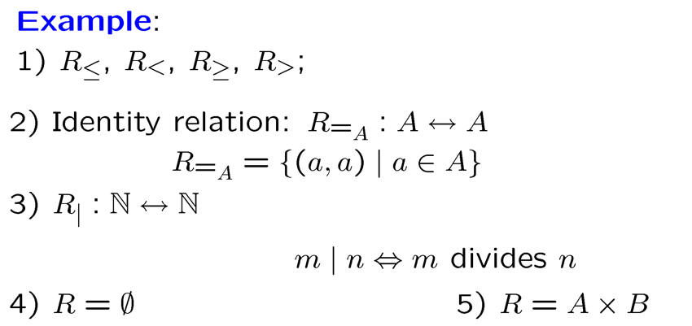

# Chapter 7: Relations

## 一、关系的定义

1. **二元关系的定义：**集合 $A、B$ 上的二元关系（Binary Relation） $R$ 是笛卡尔乘积 $A\times B$ 的一个子集；集合 $A$ 上的二元关系是笛卡尔乘积 $A\times A$ 的一个子集
    
    !!! example

        > **示例：**
        > 
        > 
        > 
        > 
        > - $R_|$ 的含义：后者除以前者，商为整数

2. **二元关系的数量：**具有 n 个元素的集合上共存在 $2^{n^2}$ 个二元关系
3. **定义域与值域：**设关系 $R$ 是从集合 $A$ 到 $B$ 的二元关系，则：
    - $R$ 的定义域（Domain）
        
         $Dom(R)=\set{x\in A|(x,y)\in R\ for\ some\ y\in B}$
        
    - $R$ 的值域（Range）
        
        $Ran(R)=\set{y\in B|(x,y)\in R\ for\ some\ x\in A}$
        
4. **n 元关系的定义：**令 $A_1, A_2, …,A_n$ 都是集合，n 元关系为 $A_1\times A_2\times …\times A_n$ 的一个子集，n 称为它的度（Degree）
5. **复合关系的定义：**设 $R$ 是从集合 $A$ 到 $B$ 的关系， $S$ 是从集合 $B$ 到 $C$ 的关系，则 $R$ 和 $S$ 的复合关系（Composite）定义为：
    
    
    
6. **关系的幂的定义：** $R^1=R,\ R^{n+1}=R^n\circ R$
7. **反关系的定义：**设 $R$ 是从集合 $A$ 到 $B$ 的关系，则 $R$ 的反关系（Inverse） $R^{-1}$ 是从集合 $B$ 到 $A$ 的关系，定义为：
    
    $R^{-1}=\set{(y,x)|(x,y)\in R}$
    
    !!! example

        > **示例：**
        > 
        > 
        > 
        > 

## 二、关系的性质

### 1. 自反性 Reflexive

1. **定义：**设 $R$ 是集合 $A$ 上的关系
    - $R$ 是自反的（Reflexive） $\Leftrightarrow \forall x\in A,(x,x)\in R$
    - $R$ 是反自反的（Irreflexive） $\Leftrightarrow \forall x\in A,(x,x)\notin R$
    
    !!! example

        > **示例：** $R_{≤},R_=,R_|$ 具有自反性
        > 

2. **性质**
    - $R$ 是自反的 $\Leftrightarrow R_=\subseteq R$
    - 具有 $n$ 个元素的集合共存在 $2^{n(n-1)}$ 个自反的关系

### 2. 对称性 Symmetric

1. **定义：**设 $R$ 是集合 $A$ 上的关系
    - $R$ 是对称的（Symmetric）
        
        $\Leftrightarrow \forall x,y\in A,(x,y)\in R\Rightarrow (y,x)\in R$
        
    - $R$ 是反对称的（Antisymmetric）
        
        $\Leftrightarrow \forall x,y\in A,(x,y)\in R\ and\ (y,x)\in R \Rightarrow x=y$ 
        
2. **性质**
    - $R$ 是对称的 $\Leftrightarrow R^{-1}=R$
    - $R$ 是反对称的 $\Leftrightarrow R\cap R^{-1}\subseteq R_=$
    - 不对称不等同于反对称（例如 $R_=$ 既是对称的，又是反对称的）
    - 具有 $n$ 个元素的集合共存在 $2^n\times 2^{\frac{n(n-1)}{2}}=2^{\frac{n(n+1)}2}$ 个对称的关系
    - 具有 $n$ 个元素的集合共存在 $2^n\times 3^{\frac{n(n-1)}2}$ 个反对称的关系
        
        !!! note "解释（反对称关系的数量）"

            > 
            > - $n$ 表示对角线上元素的个数，对角线上的每个元素 $A$ 有 2 种情况：
            >     - $(A,A)\in R$
            >     - $(A,A)\notin R$
            > - $\frac{n(n-1)}2$ 表示非对角线上元素的对数，非对角线上的每对元素 $(A,B)$ 有 3 种情况：
            >     - $(A,B)\in R,(B,A)\notin R$
            >     - $(A,B)\notin R,(B,A)\in R$
            >     - $(A,B)\notin R,(B,A)\notin R$

### 3. 传递性 Transitive

1. **定义：**设 $R$ 是集合 $A$ 上的关系，则 $R$ 是传递的（Transitive）
    
    $\Leftrightarrow \forall x,y,z\in A((x,y)\in R \land (y,z)\in R)\Rightarrow (x,z)\in R$
    
    !!! example

        > **示例：** $R_{≤},R_<,R_=,R_|,\subseteq$ 具有传递性
        > 

2. **定理：** $R$ 具有传递性 $\Leftrightarrow R^n\subseteq R\ for\ n=2,3,…$
    
    !!! note "证明"

        
        
        

## 三、关系的表示

### 1. 使用矩阵表示关系

1. **矩阵的定义**
    - 设 $R$ 是从集合 $A=\set{a_1,…,a_m}$ 到 $B=\set{b_1,…,b_n}$
    - $R$ 可使用矩阵 $M_R=(m_{ij})_{m\times n}$ 表示
    - 其中， $m_{ij}=\begin{cases}1,当\ (a_i,b_j)\in R\\0,当\ (a_i,b_j)\notin R\end{cases}$
    

    !!! warning
        这里的矩阵行与列与《线性代数》中相反

    
2. **自反性、对称性、传递性的矩阵表示**
    - 自反性 $\Leftrightarrow$ 主对角线上元素全为 1
    - 对称性 $\Leftrightarrow$ $m_{ij}=m_{ji},\forall i,j$
    - 反对称性 $\Leftrightarrow 若\ m_{ij}=1\ 且\ i\neq j\ 则\ m_{ji}=0$
    - 传递性 $\Leftrightarrow 若\ C=M_R^2\ 中的\ c_{ij}\ 非零，则\ M_R\ 中的\ m_{ij}\ 也非零$
        
        （利用定理： $R^2\subseteq R$） 
        
3. **复合关系的矩阵表示**
    - $M_{S\circ R}=M_R⊙M_S$
    - $⊙$ 运算表示布尔积，定义如下：
        - $0\land X=0,1\land 1=1$
        - $1\lor X=1,0\lor 0=0$

### 2. 使用图表示关系

1. **有向图的定义**
    - 有向图（Directed Graphs，Digraphs） $G=(V,E)$，包含节点（Vertex）集合 $V$ 和有向边（Edge）集合 $E$
    - 在边 $(a,b)$ 中， $a$ 称为 Initial Vertex， $b$ 称为 Terminal Vertex
    - 形如 $(a,a)$ 的边称为 Loop
2. **自反性、对称性的图表示**
    - 自反性 $\Leftrightarrow$ 每个节点都存在 Loop
    - 对称性 $\Leftrightarrow$ 每条边都与一条与之方向相反的边成对出现（Loop 除外）

## 四、关系的闭包

### 1. 关系闭包的定义

1. **定义：**令 $R$ 是集合 $A$ 上的关系，若存在一个关系 $S$ 满足以下条件，则称 $S$ 为 $R$ 的 $P$ 闭包
    - $S$ 具有性质 $P$（ $P$ 为以下性质之一：自反性、对称性、传递性）
    - $R\subseteq S$
    - $S$ 是任意满足前两条要求的集合 $S'$ 的子集（保证 $S$ 最小）
2. **符号表示**
    - $R$ 的自反闭包： $r(R)$
    - $R$ 的对称闭包： $s(R)$
    - $R$ 的传递闭包： $t(R)$

!!! example

    

    

### 2. 自反闭包、对称闭包的计算

令 $R$ 是集合 $A$ 上的关系

- $R$ 的自反闭包： $r(R)=R\cup\Delta$
    
    其中， $\Delta=\set{(a,a)|a\in A}$，称为 $A$ 上的对角关系（Diagonal Relation）
    
- $R$ 的对称闭包： $s(R)=R\cup R^{-1}$

### 3. 传递闭包的计算

1. **定义（路径与回路 Path）**
    - 在有向图 $G$ 中，从 $a$ 到 $b$ 的路径（Path）是由一或多条边组成的序列 $(x_0,x_1),(x_1,x_2),…,(x_{n-1},x_n)$ ，其中 $x_0=a,x_n=b$
    - 这样的路径长度为 $n$，使用节点的序列 $x_0,x_1,…,x_n$ 来描述
2. **定理**
    
    令 $R$ 是集合 $A$ 上的关系，则有：
    
    存在从 $a$ 到 $b$ ，长度为 $n$ 的路径 $\Leftrightarrow (a,b)\in R^n$
    
    !!! note "证明"
        > **证明：**（数学归纳法）
        > 
        > 
        > 
        > 

3. **定义（联通关系 Connectivity Relation）**
    
    $R^*=\set{(a,b)|存在从\ a\ 到\ b\ 的路径}=\cup_{n=1}^\infin R^n$
    
4. **定理**
    
    关系 $R$ 的传递闭包 $t(R)=R^*$
    
    !!! note "证明"

        > **证明：**
        > 
        > 
        > 
        > 
        > 
        > 

5. **定理**
    - 令集合 $A$ 包含 $n$ 个元素， $R$ 是 $A$ 上的关系
    - 若在 $R$ 上存在从 $a$ 到 $b$ 的路径，则一定存在长度不超过 $n$ 的这样的路径
    - 若在 $R$ 上存在从 $a$ 到 $b$ 的路径，且 $a\neq b$ ，则一定存在长度不超过 $n-1$ 的这样的路径
    
    !!! note "证明"

        > **证明：**
        > 
        > 
        > 
        > 

6. **定理**
    
    令集合 $A$ 包含 $n$ 个元素， $R$ 是 $A$ 上的关系，则有：
    
    - $R^*=\cup_{i=1}^n R^i$
    - 令 $M_R$ 是表示 $R$ 的 0-1 矩阵，则 $M_{R^*}=M_R\lor M_R^{[2]}\lor M_R^{[3]}\lor …\lor M_R^{[n]}$
7. **计算传递闭包的朴素算法**
    
    
    
    - 时间复杂度： $O(n^4)$
        - 计算布尔幂 $M_R,M_R^{[2]},…,M_R^{[n]}$，需要 $(n-1)n^2(2n-1)$ 次运算
        - 计算 $n-1$ 个 0-1 矩阵的并，需要 $(n-1)n^2$ 次运算
    
    !!! example
        > **示例：**
        > 
        > 
        > 
        > 

8. **计算传递闭包的 Warshall 算法**
    
    
    
- 基本原理
    
    
    
    
    
- 时间复杂度： $O(n^3)$

## 五、等价关系和等价类

### 1. 等价关系 Equivalence Relation

1. **等价关系的定义**
    - 一个关系是等价关系，若它同时满足自反性、对称性、传递性
    
    !!! example

        > **示例：**
        > 
        > 
        > 证明模 $n$ 同余关系是等价关系
        > 
        > 
        > 
        > 
        > 

### 2. 等价类 Equivalence Class

1. **等价类的定义**
    - 令 $R:A\leftrightarrow A$ 是等价关系，对于任意 $a\in A$， $a$ 的等价类（Equivalence Class）是如下的集合：
        
        $[a]_R=\set{x\in A|(x,a)\in R}$
        
    - 其中， $a$ 称为该等价类的代表元（Representative of this equivalence class）
2. **等价类的性质**
    - $\forall a\in A,[a]_R\neq \emptyset$
    - $(a,b)\in R\Rightarrow [a]_R=[b]_R$
    - $(a,b)\notin R\Rightarrow [a]_R\cap [b]_R=\emptyset$
    - $\cup_{a\in A}[a]_R=A$

!!! example

    

### 3. 商集 Quotient Set

1. **商集的定义**
    - 集合 $A$ 在关系 $R$ 上的商集为 $R$ 的所有等价类组成的集合
        
        $A/R=\set{[a]_R|a\in A}$
        
2. **商集的性质**
    - 如果 $A$ 是有限集，则 $A/R$ 也是有限集
    - 如果 $A$ 有 $n$ 个元素，且每个等价类 $[a]_R$ 包含 $m$ 个元素，则 $m|n$，且 $A/R$ 包含 $n/m$ 个元素

### 4. 等价类的划分 Equivalence Class and Partitions

1. **划分的定义**
    
    集合 $S$ 上的划分 $\pi$ 是 $S$ 的一组子集 $\set{A_1,A_2,…,A_n}$，并且满足：
    
    - $\cup_{k=1}^nA_k=S$
    - $A_j\cap A_k=\emptyset\ (j\neq k)$
    
    !!! example

        
    
2. **定理**
    - 令 $R$ 为集合 $S$ 上的等价关系，则 $R$ 的等价类构成 $S$ 的一组划分
    - 令 $\set{A_i|i\in I}$ 为集合 $S$ 的一组划分，则存在 $S$ 上的等价关系 $R$，使得每个 $A_i$ 都是 $R$ 的等价类
    
    !!! example

        

## 六、偏序 Partial Orderings

### 1. 偏序的定义

1. **偏序**
    - 关系 $R_\preceq :S\leftrightarrow S$ 称为偏序关系，如果它满足自反性、反对称性和传递性
    - $S$ 称为偏序集（poset），用 $(S,\preceq)$ 表示
    
    !!! example

        > **示例：**
        > 
        > - 其中，第二条的符号 $P(S)$ 表示 $S$ 的幂集（ $S$ 的全部子集组成的集合）
        > 
        > 
        > 
    
    !!! example

        > **示例：**
        > 
        > 
        > 证明 $\N_|$ 是偏序关系
        > 
        > 
        > 
2. **可比性**
    - 可比的（Comparable）：在偏序集中，若元素 $a,b$ 满足 $a≤b$ 或 $b≤a$ 其中之一，则称 $a,b$ 是可比的
    - 不可比的（Incomparable）：在偏序集中，若元素 $a,b$ 不满足 $a≤b$ 和 $b≤a$，则称 $a,b$ 是不可比的
3. **全序集 Totally Ordered Set** 
    - 若偏序集 $(S,\preceq)$ 中任意两个元素都是可比的，则称 $S$ 为全序集（Totally Ordered Set）或线性序集（Linearly Ordered Set）或链（Chain），关系 $\preceq$ 称为全序（Total Order）或线性序（Linear Order）
    
    !!! example
        
        > **示例：**
        > 
        > 
        > 
        > 
        > - $P(S)$ 中的元素（子集）之间可能不存在包含关系，因此存在不可比的元素对，例如 $S=\set{1,2,3},A=\set{1,2},B=\set{2,3}$，则 $A,B$ 不可比

### 2. 字典序 Lexicographic Order

- 字典序（Lexicographic Order）是一种从多个偏序集构造新偏序集的方法
- 给定两个偏序集 $(A,\preceq),(B,\preceq)$，它们的笛卡尔乘积 $A\times B$ 上的字典序定义为：
    
    $(a_1, b_1) \prec (a_2, b_2) \iff
    \begin{cases}
    a_1 \prec_A a_2, & \text{或} \\
    a_1 = a_2 \text{ 且 } b_1 \prec_B b_2.
    \end{cases}$
    

### 3. Hasse 图

哈斯图是一种用于表示 **有限集上的偏序关系** 的简化图示方法，其构造步骤如下：

- 初始绘制偏序关系的有向图：每个元素为顶点，偏序关系为有向边
- 移除所有环：由于偏序是自反的，故移除这些环以简化图形
- 移除传递性导致的冗余边：若存在 *a*≤*b* 和 *b*≤*c*，则根据传递性必然有 *a*≤*c；*此时直接移除 *a*≤*c* 的边，保留最短路径
- 调整边方向并去除箭头：将每条边排列为初始顶点在下、终止顶点在上，并隐去箭头（默认方向向上）

最终得到的简化图称为哈斯图，它仅保留偏序关系的必要结构，但仍能完整反映原始偏序关系

!!! example

    

### 4. 极值、最值、界、确界

令 $(A,\preceq)$ 是一个偏序集， $B\subseteq A$

1. **极大元、极小元**
    - $a$ 是 $B$ 的极大元（Maximal Element）： $a\in B$ 且不存在 $x\in B$ 使得 $a\prec x$
    - $a$ 是 $B$ 的极小元（Minimal Element）： $a\in B$ 且不存在 $x\in B$ 使得 $x\prec a$
2. **最大元、最小元**
    - $a$ 是 $B$ 的最大元（Greatest Element）： $a\in B$ 且对任意 $x\in B$ 有 $x\prec a$
    - $a$ 是 $B$ 的最小元（Least Element）： $a\in B$ 且对任意 $x\in B$ 有 $a\prec x$
3. **上界、下界**
    - $a$ 是 $B$ 的上界（Upper Bound）： $a\in A$ 且对任意 $x\in B$ 有 $x\prec a$
    - $a$ 是 $B$ 的下界（Lower Bound）： $a\in A$ 且对任意 $x\in B$ 有 $a\prec x$
4. **上确界、下确界**
    - $a$ 是 $B$ 的上确界（Least Upper Bound）： $a$ 是 $B$ 的上界，且对 $B$ 的其它上界 $x$，都有 $a\preceq x$
    - $a$ 是 $B$ 的下确界（Greatest Lower Bound）： $a$ 是 $B$ 的下界，且对 $B$ 的其它下界 $x$，都有 $x\preceq b$

!!! note "辨析"

    - 极大元是局部概念，表示 “在该元素的可比范畴内，没有比它更大的元素” ，可以存在多个
    - 最大元是全局概念，表示 “该元素与其它元素都可比，且它比所有元素都大”，可能不存在，最多存在一个

!!! example

    

!!! example
    

### 5. 良序集 Well-Ordered Set

- $(S,\preceq)$ 是一个良序集，若 $\preceq$ 是一个全序，且每个 $S$ 的非空子集都存在最小元

!!! example

    $(\Z,≤)$ 不是一个良序集，因为不存在最小的负整数

### 6. 格 Lattices

- 一个偏序集称为 Lattice，若其中的每一对元素组成的集合都存在上确界和下确界

!!! example

    > **示例：**
    > 
    > 
    > 偏序集 $(\set{1,2,3,4,5},|)$ 不是一个 Lattice，解释如下：
    > 
    > - 任取一对元素组成的集合 $\set{2,3}$ ，若存在上确界，其值应当为它们的最小公倍数 6，而 6 不在集合 $\set{1,2,3,4,5}$ 中，因此这一对元素组成的集合 $\set{2,3}$ 不存在上确界