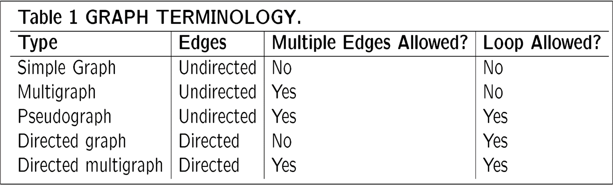

# Chapter 8: Graphs

## 一、图的简介

- $G=(V,E)$ 包含节点（Vertex）集合 $V$（非空）、边（Edge）集合 $E$

### 1. 图的类型

1. **简单图 Simple Graph**
    - 边集合是无序对组成的集合，无序对中的两个元素是不同的（Distinct）
    - 由集合的元素唯一性，边集合中不存在两个相同的无序对
    - **总结：简单图是无向图，不含环，两节点之间最多只存在一条边**
2. **多图 Multi-Graph**
    - 存在一个从 $E$ 到 $\set{\set{u,v}|u,v\in V,u\neq v}$ 的函数 $f$，若 $f(e_1)=f(e_2)$，则边 $e_1,e_2$ 称为并行边（Multiple/Parallel Edges ）
    - **总结：多图是无向图，不含环，两节点之间可以存在多条边**
3. **伪图 Pseudo-Graph**
    - 存在一个从 $E$ 到 $\set{\set{u,v}|u,v\in V}$ 的函数 $f$，若 $f(e)=\set{u,u}$，则边 $e$ 称为环（Loops）
    - **总结：伪图是无向图，可以含有环，两节点之间可以存在多条边**
4. **有向图 Directed Graph**
    - 边集合是有序对组成的集合，有序对中的两个元素可以相同
    - **总结：有向图，可以含有环，两节点之间最多只存在一条边**
5. **有向多图 Directed Multi-Graph**
    - 存在一个从 $E$ 到 $\set{(u,v)|u,v\in V,u\neq v}$ 的函数 $f$，若 $f(e_1)=f(e_2)$，则边 $e_1,e_2$ 称为并行边（Multiple/Parallel Edges ）
    - **总结：有向多图，可以含有环，两节点之间可以存在多条边**

### 2. 无向图的术语

1. **基本术语**
    - 两节点 $u,v$ 称为邻居（Adjacent/Neighbors），若这两节点之间存在边 $e=\set{u,v}$
    - 称边 $e=\set{u,v}$ 关联于（incident with）节点 $u,v$
    - 称节点 $u,v$ 为边 $e=\set{u,v}$ 的端点（Endpoint）
2. **节点的度 Degree**
    - 节点 $v$ 的度（Degree）是与之相连的边的数量（例外：一个环贡献 2 个度），记作 $deg(v)$
    - 度为 0 的节点称为孤立节点（Isolated Vertex），度为 1 的节点称为悬挂节点（Pendant Vertex）
3. **握手定律 The Handshaking Theorem**
    - 设 $G$ 是具有 $m$ 条边和 $n$ 个节点 $v_1,v_2,…,v_n$ 的图，则 $\sum_{i=1}^n deg(v_i)=2m$
    - **总结：所有节点的度之和是偶数**
    
    !!! example

        

### 3. 有向图的术语

1. **基本术语**
    
    对于有向边 $(u,v)$：
    
    - $u$ is adjacent **to** $v$， $v$ is adjacent **from** $v$
    - $v$ 称为出发节点（Initial Vertex）， $v$ 称为到达节点（Terminal/End Vertex）
    - 对于环，出发节点和到达节点是同一个
2. **入度和出度**
    - 节点 $v$ 的入度（in-degree）是以它为到达节点的边数，记作 $deg^-(v)$
    - 节点 $v$ 的出度（out-degree）是以它为出发节点的边数，记作 $deg^+(v)$
    - 一个环为节点贡献一个入度、一个出度
3. **定理**
    - $\sum_{i=1}^n deg^-(v_i)=\sum_{i=1}^n deg^+(v_i)=|E|$

### 4. 简单图的特例

1. **完全图 Complete Graph**
    - $n$ 阶完全图记作 $K_n$
    - 完全图是每一对节点之间都存在边的简单图
    - $n$ 阶完全图的边数 $|E|=C(n,2)=\frac{n(n-1)}{2}$
    
    
    
2. **环图 Cycles**
    - $n$ 阶环图记作 $C_n(n≥3)$
    - 环图是 $n$ 个节点首尾相连的图
    
    
    
3. **车轮图 Wheels**
    - $n$ 阶车轮图记作 $W_n(n≥3)$
    - $n$ 阶车轮图由 $n$ 阶环图添加一个新顶点组成（共计 $n+1$ 个顶点），这个新顶点与其它每个节点之间都存在一条新的边
    
    
    
4. **n 维体图 n-Cubes**
    - $n$ 维体图记作 $Q_n$
    - $n$ 维体图由递归构造：
        - **基础**： $Q_1$ 是仅含两个顶点和一条边的图
        - **递推**： $Q_n$ 由两个 $Q_{n-1}$ 复制后，将对应顶点用边连接而成
    - $n$ 维体图共计 $2^n$ 个节点，每个节点对应一个长度为 $n$ 的 bit string，若两个节点的 bit string 之间仅在一个二进制位上不同，则这两个节点之间存在边
    
    
    
5. **二分图 Bipartite Graph**
    
    二分图 $G=(V,E)$ 满足如下性质：
    
    - $V=V_1\cup V_2$
    - $V_1\cap V_2=\emptyset$
    - $V_1(\ 和\ V_2\ )$ 的任意两个节点之间不存在边
    
    总结：顶点被分为两个集合，使得任意一个集合中的任意两个节点之间不存在边
    
    !!! example

        - $K_3$ 不是二分图
        - $C_6$ 是二分图，因为可以把节点划分为 $\set{v_1,v_3,v_5}$ 和 $\set{v_2,v_4,v_6}$两个集合，而图的所有边 $\set{v_1,v_2},\set{v_2,v_3},\set{v_3,v_4},\set{v_4,v_5},\set{v_5,v_6},\set{v_6,v_1}$ 均不是某一个集合内部节点之间的边

6. **完全二分图 Complete Bipartite Graph**
    - 完全二分图 $K_{m,n}$ 是一个完全图，其中两个顶点集合 $V_1,V_2$ 的大小分别为 $m,n$，且 $V_1$ 的每个节点都连接到 $V_2$ 的每个节点， $V_2$ 的每个节点都连接到 $V_1$ 的每个节点
    
    
    

### 5. 由旧图生成新图

1. **子图**
    
    设图 $G=(V,E),H=(W,F)$
    
    - $H$ 是 $G$ 的子图（Subgraph），若 $W\subseteq V,F\subseteq E$
    - $H$ 是 $G$ 的生成子图（Spanning Subgraph），若 $W=V,F\subseteq E$
2. **图的并 Union**
    - 设图 $G_1=(V_1,E_1),G_2=(V_2,E_2)$
    - 两图的并记作 $G_1\cup G_2=(V_1\cup V_2,E_1\cup E_2)$

## 二、图的表示与图的同构

### 1. 图的表示——邻接矩阵 Adjacency Matrix

1. **简单图的邻接矩阵**
    
    $a_{ij}=\begin{cases}1,当\ \set{v_i,v_j}\in E\\0,当\ \set{v_i,v_j}\notin E\end{cases}$
    
    - 简单图的邻接矩阵是对称的，因为 $a_{ij}=a_{ji}$
    - $a_{ii}=0$，因为简单图不允许出现环
    - $deg(v_i)=\sum_{j=1}^n a_{ij}$
    
    !!! example
        
    
2. **伪图的邻接矩阵**
    
    $a_{ij}=\set{v_i,v_j}$ 之间的边的数目
    
    - 所有无向图的邻接矩阵都是对称的
    
    !!! example

        
    
3. **有向图的邻接矩阵**
    
    $a_{ij}=\begin{cases}1,当\ (v_i,v_j)\in E\\0,当\ (v_i,v_j)\notin E\end{cases}$
    
    - 有向图的邻接矩阵不一定是对称的

### 2. 图的表示——关联矩阵 Incidence Matrix

设图 $G=(V,E)$ 是无向图，设 $n$ 个节点 $v_1,v_2,…,v_n$， $m$ 个节点 $e_1,e_2,…,e_m$，则为该图定义如下的关联矩阵 $M=[m_{ij}]_{n\times m}$

$m_{ij}=\begin{cases}1,当边e_j与顶点v_i邻接\\0,其它情形\end{cases}$

!!! example

    

### 3. 图的同构 Isomorphism of Graphs

1. **图同构的定义**
    - 两个简单图 $G_1=(V_1,E_1),G_2=(V_2,E_2)$ 是同构（Isomorphic）的，若存在从 $V_1$ 到 $V_2$ 的双射 $f$，满足性质：
        
         $\forall a,b\in V_1,(a,b)\in E_1\Leftrightarrow (f(a),f(b))\in E_2$
        
    - 总结：对 $V_1$ 中所有的顶点 $a$ 和 $b$ 来说， $a$ 和 $b$ 在 $G_1$ 中相邻当且仅当 $f(a)$ 和 $f(b)$ 在 $G_2$ 中相邻，则 $G_1,G_2$ 同构；即 $G_1,G_2$ 的顶点之间存在一一对应关系，使得所有的边得到保持
2. **图同构的判定**
    - 判定两个简单图是否同构是困难的，可通过证明它们不满足同构下的不变性质（如 **顶点数、边数、各顶点度数** 相同）来表明两个图不同构
    - 若两个图的邻接矩阵的行和列按顶点在映射 $f$ 下的像进行标记后相同，则可证明图同构
    
    !!! example

        

        

## 三、图的连通性 Connectivity

### 1. 路径 Path

1. **无向图的路径定义**
    
    
    
2. **有向图的路径定义**
    
    
    

### 2. 无向图的连通性

1. **定义**
    
    
    
    !!! note

        单个孤立的节点也可视为一个 Connected Components
    
    
2. **定理**
    
    
    
3. **割点与割边**
    
    
    

### 3. 有向图的连通性

**强连通与弱连通**

### 4. 确定节点之间存在路径的数量

### 5. 路径与同构

## 四、欧拉路径和哈密顿路径 Euler and Hamilton Paths

!!! note 

    **欧拉路径：**遍历每条边恰好一次的路径

    **欧拉回路：**遍历每条边恰好一次，最终回到起点的路径

    **哈密顿路径：**遍历每个节点恰好一次的路径

    **哈密顿回路：**遍历每个节点恰好一次，最终回到起点的路径

### 1. 欧拉路径和欧拉回路

1. **定义：欧拉路径和欧拉回路**
    
    
    
2. **充要条件：判断图是否存在欧拉回路**
    
    一个连通的多图存在欧拉回路，当且仅当它的每个节点的度数均为偶数
    
    !!! note "证明"
        > **证明：**
        > 
        > 
        > 
        > 
        > 
        > 
        > 
        > 

3. **充要条件：判断图是否存在欧拉路径但不存在欧拉回路**
    
    一个连通的多图存在欧拉路径但不存在欧拉回路，当且仅当它恰有两个节点的度数为奇数
    
4. **算法：构建欧拉回路**
    
    
    
    !!! example
        
    

### 2. 哈密顿路径和哈密顿回路

1. **定义：哈密顿路径和哈密顿回路**
    
    
    
2. **定理：判断图是否存在哈密顿回路**
    
    
    

## 五、最短路径问题 Shortest Path Problems

### 1. 有权图 Weighted Graphs

1. **有权图：**每条边包含一个数字作为权重
2. **路径的长度：**在有权图中，路径的长度（Length）为该路径上所有边的权重之和
3. **最短路径问题：**给定图中的两个节点，寻找两节点之间长度最短的路径
4. **旅行商问题：**在完全图中寻找一条遍历每个节点恰好一次的最短路径

### 2. 求解最短路径问题—— Dijkstra 算法

1. **使用条件**
    - 要求为简单、无向、带权、连通的图
    - 每条边的权值不能为负数
2. **时间复杂度：** $O(n^2)$
3. **算法描述**
    
    
    
    
    
4. **算法证明**
    
    
    
    
    
    
    
    
    

!!! example
    > **示例：**
    > 
    > 
    > 
    > 
    > 
    > 
    > 
    > 

## 六、平面图 Planar Graphs

1. **定义**
    - 一个图被称为 **平面图（Planar Graph）**，若它能在一个平面中被画出，且不存在相交的边
    - 上述表示的图称为 **图的平面表示（Planar Representation of the graph）**
    
    !!! example
    
        > **示例：**
        > 
        > - $K_4,Q_3$ 是平面图
        > - $K_{3,3}$ 不是平面图