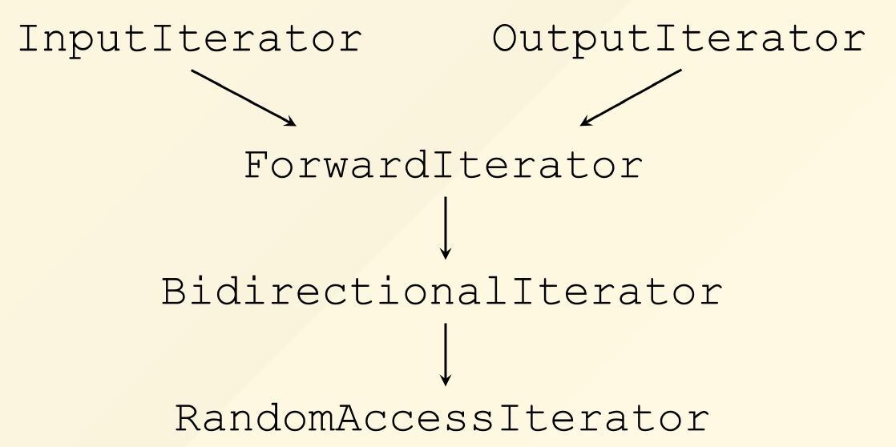

# Chapter 11: Iterators

## 一、迭代器的概念

1. 设计目标：提供一种顺序访问聚合对象的元素而不暴露其底层表示的方法
2. 迭代器的使用方式应尽量与指针贴近，包括通过运算符重载实现 `++`、 `*` 、 `->` 等

```cpp
// 定义 list 迭代器
template <class T>
class ListIter
{
private:
	ListItem<T> *ptr;
public:
	ListIter(ListItem<T> *p = 0): ptr(p) {}
	ListIter<T>& operator++()
	{ 
		ptr = ptr->next(); 
		return *this;
	}
	bool operator==(const ListIter& i) const
	{
		return ptr == i.ptr;
	}
	T& operator*()
	{
		return ptr->val();
	}
	T* operator->()
	{
		return &(**this);
	}
}

// 定义 find 函数
template <class Iterator, class T>
Iterator find(Iterator first, Iterator last, const T& value)
{
	while (first != last && *first != value) ++first;
	return first;
}

// Usage
vector<int> vecTemp;
if(find(vecTemp.begin(), vecTemp.end(), 3) == vecTemp.end())
	cout << "3 not found" << endl;
```

## 二、关联类型 Associated Type

### 1. 问题描述

- 问题：不知道 `iter` 指向的数据类型，需要借助另一个变量 `v` 推导出类型 `T`
    
    ```cpp
    template <class I, class T>
    void func_impl(I iter, T& v)
    {
      T tmp;
      tmp = *iter;
      // 处理代码
    ```
    
- 包装一层，自动推导类型：
    
    ```cpp
    template <class I>
    void func(I iter)
    {
      func_impl(iter, *iter);
      // 处理代码
    }
    ```
    

### 2. 改进：在迭代器内部显式定义类型

- 在迭代器内部，使用 `typedef` 显式定义类型：
    
    ```cpp
    template <class T>
    struct myIter {
      typedef T value_type;
      T* ptr;
      myIter(T *p = 0) : ptr(p) {}
      T& operator*() { return *ptr; }
    };
    ```
    
- 使用：
    
    ```cpp
    template <class I>
    typename I::value_type func(I iter) {
      return *iter;
    }
    
    myIter<int> iter(new int(8));
    cout << func(iter);
    ```
    
- **问题：**指针不是结构体，不能在指针内部使用 Typedef 显式定义类型，从而只支持迭代器，而无法支持指针类型（如 `int*` 、`double*` ），影响 STL 编程

### 3. 改进：iterator_traits

- 定义通用模板：
    
    ```cpp
    template <class I>
    struct iterator_traits {
      typedef typename I::value_type value_type;
    };
    ```
    
- 使用：
    
    ```cpp
    template <class I>
    typename iterator_traits<I>::value_type func(I iter) {
      return *iter;
    }
    
    myIter<int> iter(new int(8));
    cout << func(iter);
    
    int* p = new int[20]();
    cout << func(p); // 需要处理指针类型，详见下文
    ```
    

### 4. 模板特化 Template Specialization

- **完全特化（Full Specialization）**：
    
    ```cpp
    template<>
    class A<int, double, 5> { /*...*/ };
    ```
    
- **部分特化（Partial Specialization）**：
    
    ```cpp
    template<class T2>
    class A<int, T2, 3> { /*...*/ };
    ```
    

### 5. 针对指针的 iterator_traits 特化

```cpp
// 针对指针的特化
template<class T>
class iterator_traits<T*> {
public:
  typedef T value_type;
  typedef T* pointer_type;
};
// 针对常量指针的特化
template<class T>
class iterator_traits<const T*> {
public:
  typedef T value_type;
  typedef const T* pointer_type;
};
```

### 6. STL 中标准 traits 定义

```cpp
template<class I>
class iterator_traits {
public:
  typedef typename I::iterator_category iterator_category;
  typedef typename I::value_type value_type;
  typedef typename I::difference_type difference_type;
  typedef typename I::pointer pointer;
  typedef typename I::reference reference;
};
```

### 7. 迭代器的种类 Iterator Categories

- 迭代器类型之间有继承关系，它们关系如下：
    
    
    

### 8. advance() 方法的多态实现

- 针对不同迭代器类型，定义不同的 `__advance`：
    
    ```cpp
    // InputIterator版本
    template<class InputIterator, class Distance>
    void __advance(InputIterator &i, Distance n, input_iterator_tag)
    {
      while (n--) ++i;
    }
    
    // BidirectionalIterator版本
    template<class BidirectionalIterator, class Distance>
    void __advance(BidirectionalIterator &i, Distance n, bidirectional_iterator_tag)
    {
      if (n >= 0)
        while (n--) ++i;
      else
        while (n++) --i;
    }
    
    // RandomAccessIterator版本
    template<class RandomAccessIterator, class Distance>
    void __advance(RandomAccessIterator &i, Distance n, random_access_iterator_tag)
    {
      i += n;
    }
    ```
    
- 总接口：
    
    ```cpp
    template<class Iterator, class Distance>
    void advance(Iterator &i, Distance n)
    {
      __advance(i, n, iterator_traits<Iterator>::iterator_category());
    }
    ```
    
- **针对指针**，特化 `iterator_traits`：
    
    ```cpp
    template<class T>
    struct iterator_traits<T*> {
      typedef random_access_iterator_tag iterator_category;
    };
    ```
    

### 9. distance() 方法的实现

- 针对不同迭代器类型，定义不同的 `__distance`：
    
    ```cpp
    // InputIterator版本
    template<class InputIterator>
    iterator_traits<InputIterator>::difference_type
    __distance(InputIterator first, InputIterator last, input_iterator_tag)
    {
      iterator_traits<InputIterator>::difference_type n = 0;
      while (first != last) {
        ++first;
        ++n;
      }
      return n;
    }
    
    // RandomAccessIterator 版本
    template<class RandomAccessIterator>
    iterator_traits<RandomAccessIterator>::difference_type
    __distance(RandomAccessIterator first, RandomAccessIterator last, random_access_iterator_tag)
    {
      return last - first;
    }
    ```
    
- 总接口：
    
    ```cpp
    template<class Iterator>
    iterator_traits<Iterator>::difference_type
    distance(Iterator first, Iterator last)
    {
      return __distance(first, last, iterator_traits<Iterator>::iterator_category());
    }
    ```