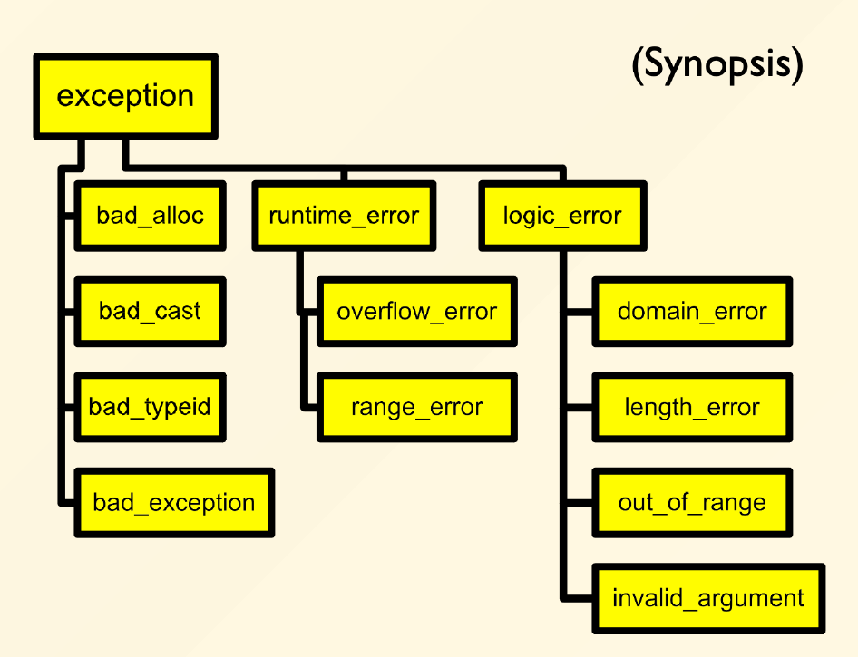

# Chapter 12: Exceptions

## 一、异常处理的背景

**运行时错误 Run-Time Error**

- 在运行过程中发生的错误，无法在编译期间被预测（例如：打开某个文件但内存不足、Vector 容器下标访问越界）
- 使用抛出异常的方式进行处理，由发生异常的函数的调用者（Callee）进行处理

## 二、异常的发出与捕获

### 1. 发出异常 Raise an Exception

1. **异常对象**
    - 使用异常对象记录异常信息
        
        ```cpp
        // 一个异常对象的示例
        class VectorIndexError {
        public:
          VectorIndexError(int v) : m_badValue(v) {}
          void diagnostic() {
            cerr << "Index " << m_badValue << " out of range!" << endl;
          }
        private:
          int m_badValue;
        };
        
        ```
        
    - 异常对象常在 `throw` 语句中使用构造函数进行构造
    - 异常对象之间常常具有继承关系
        
        ```cpp
        // 基类：数学错误
        class MathErr {
        public:
            virtual void diagnostic() = 0;  // 纯虚函数，要求派生类实现
        };
        
        // 派生类1：溢出错误
        class OverflowErr : public MathErr { 
        public:
            void diagnostic() override { /* 实现细节 */ }
        };
        
        // 派生类2：下溢错误
        class UnderflowErr : public MathErr {
        public:
            void diagnostic() override { /* 实现细节 */ }
        };
        
        // 派生类3：除零错误
        class ZeroDivideErr : public MathErr {
        public:
            void diagnostic() override { /* 实现细节 */ }
        };
        ```
        
    - 标准库定义多种异常对象（Standard Library Exceptions），其继承关系如图所示；自定义的异常类型通常继承于标准库异常对象
        
        
        
2. **`throw` 语句**
    - 格式一：`throw e`
        
        抛出值 e，其中 e 通常为异常对象，但也可为 int、string 等普通的对象或值
        
        ```cpp
        template <class T>
        T& Vector<T>::operator[](int idx) {
            if (idx < 0 || idx >= m_size) {
                throw VectorIndexError(idx); // 使用构造函数构造一个异常对象，并将其抛出
            }
            return m_elements[idx];
        }
        ```
        
    - 格式二：`throw`
        
        在 catch 块中使用，用于将该 catch 块捕获的异常对象重新抛出，从而将异常信息沿函数调用链（Call Chain）逐层向外传导
        
        
        
3. **`noexpect` 标签**
    - 由于异常处理需要代价，可在函数声明中加入 `noexpect` 标签，表明该函数内部无需进行异常处理，从而帮助编译器提高代码运行效率
        
        ```cpp
        void func(int a) noexcept {...}
        ```
        
    - 若带 `noexpect` 标签的函数内部试图抛出异常，则触发 `std::terminate`；
        - `std::terminate` 一般情况下会导致程序的中断
        - 可以自定义 `std::terminate` 的行为
            
            ```cpp
            void my_terminate() {...}
            set_terminate(my_terminate);
            ```
            
4. **`new` 语句发出的异常**
    - `new` 语句发生异常时，不会返回 0 或空指针，而是发出 `bad_alloc()` 异常

### 2. 捕获异常 Catch an Exception

1. **Try-Catch 块**
    
    ```cpp
    try {
        // code to exercise math options
        throw UnderFlowErr();  // 触发下溢错误
    
    } catch (ZeroDivideErr& e) {
        // 处理除零错误
        
    } catch (UnderFlowErr& e) {
        // 处理数值下溢错误
        
    } catch (MathErr& e) {
        // 处理其他数学相关错误（基类捕获）
        
    } catch (...) {
        // 捕获所有未被上述catch处理的异常（兜底处理）
    }
    ```
    
    - catch 花括号内的语句称为异常处理器（Exception Handlers）
    - 一组 Try-Catch 块可以包含多个异常处理器
    - 异常处理器的参数分为两种：
        - 格式一： `catch (sometype v)` 捕获某个具体类型的参数
        - 格式二： `catch (...)` 捕获所有未被前述 catch 语句捕获的异常
2. **捕获顺序**
    - 异常处理器按照它们出现的先后顺序进行选择
    - catch 语句捕获参数时，可以自动发生由派生类向基类的类型转换（向上造型，仅限参数为引用或指针类型）；因此，若异常对象之间存在继承关系，应当先对派生类型进行捕获，再对基类型进行捕获
    - 在下面的反例中，由于向上造型， `UnderFlowErr` 将被第一个 catch 语句捕获，而不会被第二个 catch 语句捕获
    
    ```cpp
    // 反例
    try {
        // code to exercise math options
        throw UnderFlowErr();  // 触发下溢错误
    
    } catch (MathErr& e) {
        // 处理除零错误
        
    } catch (UnderFlowErr& e) {
        // 处理数值下溢错误
        
    } catch (...) {
        // 捕获所有未被上述catch处理的异常（兜底处理）
    }
    ```
    
3. **未被捕获的异常**
    - 如果一条异常发出后未被捕获，则触发 `std::terminate`
4. **异常处理器的参数类型**
    
    ```cpp
    // 异常处理器一般接收引用类型参数
    catch (Exception& e) {...}
    
    // 如果接收指针类型参数，则指针指向的动态空间何时被销毁不易确定，可能导致内存泄漏
    catch (Exception* p) {...}
    
    // 如果是值传递，则向上造型时会发生截断，导致类型信息和部分字段的丢失
    catch (Exception p) {...}
    ```
    

## 三、构造与析构过程的异常处理

### 1. 构造过程的异常处理

1. **若构造函数内部抛出异常**
    - 认为该对象没有完成构造，即该对象的析构函数不会被调用
    - 在抛出异常前，已构造的成员会被自动析构（按与构造相反的顺序）
    - 在抛出异常前，需要手动对已经分配的资源（例如通过 `new` 分配的空间，打开的文件等）进行释放
2. **二阶构造 Two Stages Construction**
    - 在构造函数中进行如下工作：
        - 对所有成员对象进行初始化
        - 将所有指针初始化为 0
        - 不请求任何内存、文件、网络连接等资源
    - 资源请求在一个单独的 `init()` 函数中实现
3. **智能指针 Smart Pointers**
    - 可以使用智能指针代替普通指针
    - 通过智能指针分配的内存会自动释放，无需手动 delete

### 2. 析构过程的异常处理

1. **栈展开 Stack Unwinding**
    - 当发出异常时，系统会进行栈展开，即自动逆向销毁当前调用栈中已构造的局部对象（调用它们的析构函数），避免内存泄漏
    - 通过 `new` 分配的空间不会自动释放，因为 `new` 分配的是堆内存
2. 编译器为析构函数自动添加 `noexpect` 标签
    - 这是因为 C++ 不允许同时存在两个活跃的异常（即 “异常处理中又抛出新异常” ）；析构函数在栈展开期间被调用时，若其抛出异常，会导致异常处理流程被中断，引发未定义行为
    - 因此，析构函数必须自己进行异常处理，不能把异常发送出来