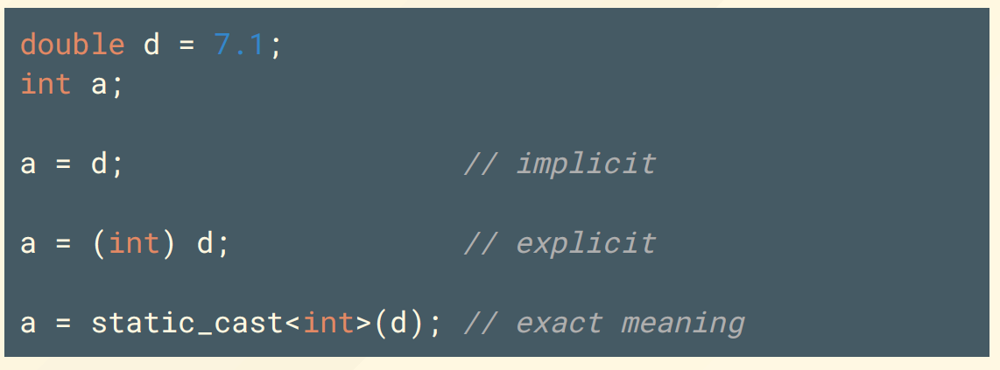

# Chapter 14: Miscellaneous Topics

## 一、类型转换 Named Casts

### 1. C++ 四种类型转换

1. `static_cast`：静态类型转换
2. `dynamic_cast`：动态类型转换
    - 用于对多态类型进行安全的向下转型，即从基类指针/引用转换为派生类指针/引用
    - 只能对多态类的对象（包含虚函数）进行动态类型转换，否则报错
    - 若无法按要求进行转型，则返回 `nullptr`
3. `reinterpret_cast`：强制转换
    - 不进行任何类型检查，直接对原内存布局进行重新解释
4. `const_cast`：常量转换，将同类型的常量强制转换为同类型的非常量
    - `const_cast<T*>` 可将 `const T*` 转换为 `T*`
    - 但 `const_cast` 不改变内存的实际可写性，尝试对内存进行写操作可能会导致未定义行为（Undefined Behaviour，UB）

### 2. 类型转换示例




## 二、多重继承 Multiple Inheritance

### 1. 基本概念


图示：箭头由派生类指向基类


```cpp
class Employee {
	protected:
		string name;
		EmpID id;
};

class MTS: public Employee {
	protected:
		Degrees degree_info;
};

class Temporary {
	protected:
		Company employer;
};

// 发生多重继承的类：Consultant 类包含了 MTS 和 Temporary 类的所有属性
class Consultant: public MTS, public Temporary {
	...
};
```

### 2. 菱形多重继承问题 Vanilla MI

1. **菱形多重继承问题 Vanilla MI**
    - 若派生类继承自多个基类，且不同的基类中具有相同名称的属性，由于派生类将每个基类完全拷贝，所以派生类中将出现来自不同基类的多个同名属性；在访问基类的同名属性时，可能发生冲突，称为菱形多重继承问题
    
    ```cpp
    struct B1 { int m_i; };
    struct D1: public B1 {};
    struct D2: public B1 {};
    // 发生菱形多重继承问题的类：D1、D2 具有公共的基类 B1，使得 B1 在 M 中被包含两次
    struct M: public D1, public D2 {};
    
    int main() {
    	M m;
    	m.m_i++;       // Error: D1::B1.m_i or D2::B1.m_i?
    	B1* p = &m;    // Error: which B1?
    	B1* p1 = static_cast<D1*>(&m);    // OK
    	B1* p1 = static_cast<D2*>(&m);    // OK
    }
    ```
    
2. **解决办法：Virtual Base Class**
    - 在继承时，声明为虚继承，使得所有以虚继承方式继承该基类的派生类共享一个指向基类的指针，而不是将基类完全拷贝
    
    ```cpp
    struct B1 { int m_i; };
    struct D1: virtual public B1 {};
    struct D2: virtual public B1 {};
    // 发生多重继承的类：D1、D2 具有公共的基类 B1，由于使用虚继承，使得 B1 在 M 中仅包含一次
    struct M: public D1, public D2 {};
    
    int main() {
    	M m;
    	m.m_i++;       // OK
    	B1* p = &m;    // OK
    }
    ```
    
    
    

## 三、命名空间 Namespace

### 1. 基本用法

1. **基本定义与使用方法**
    
    ```cpp
    // MyLib.h
    namespace MyLib{
    	void foo();
    	class Cat{
    		public:
    			void Meow();
    	};
    };
    
    // MyLib.cpp
    #include "MyLib.h"
    
    void MyLib::foo() {cout << "foo\n"; }
    void MyLib::Cat::Meow() {cout << "Meow\n"; }
    
    // Usage
    #include "MyLib.h"
    int main(){
    	MyLib::foo();
    	MyLib::Cat c;
    	c.Meow();
    }
    ```
    
2. 命名空间的定义可以在多个文件中进行
    
    ```cpp
    // header1.h
    namespace X { void f(); }
    
    // header2.h
    namespace X { void g(); }  // X now has f() and g(), i.e. 命名空间的定义可以在多个文件中进行
    ```
    
3. `std` 命名空间不支持定义新元素，但可以对已有元素进行模版特化

### 2. `Using` 命令

1. 使用 `using` 命令引入命名空间的特定元素
    
    ```cpp
    int main(){
    	using MyLib::Cat;
    	Cat c;
    	c.Meow();
    }
    ```
    
2. 使用 `using namespace` 命令引入命名空间的全部元素
    
    ```cpp
    int main(){
    	using namespace MyLib;
    	Cat c;
    	c.Meow();
    }
    ```
    
3. 使用 `using` 命令解决不同命名空间的同名元素冲突问题
    
    ```cpp
    namespace XLib { int x(); int y(); }
    namespace YLib { int y(); int z(); }
    
    // Case 1
    int main(){
    	using namespace XLib;
    	using namespace YLib;
    	x();    // OK
    	y();    // Error: 同名元素冲突
    	XLib::y();    // OK
    }
    
    // Case 2
    int main(){
    	using namespace XLib;
    	using namespace YLib;
    	usint XLib::y;   // 指定元素y默认来自命名空间XLib
    	x();    // OK
    	y();    // OK
    }	
    ```
    

### 3. 命名空间的嵌套 Namespace Composition

```cpp
namespace XLib { int x(); int y(); }
namespace YLib { int y(); int z(); }
namespace ZLib { int a(); int b(); }

namespace mine {
	using namespace XLib; // 引入整个命名空间
	using namespace YLib;
	using XLib::y;  // 解决同名元素冲突
	using ZLib::a;  // 引入命名空间的特定元素
	void mystuff(); // 定义新的元素
}

int main(){
	mine::x();
	mine::y();    // 调用 first::y()
	mine::a();
	mine::mystuff();
}
```

### 4. 命名空间的别名 Namespace Aliases

```cpp
namespace supercalifragilistic { void f(); }
namespace short_ns = supercalifragilistic; 

// Usage
short_ns::f();
```