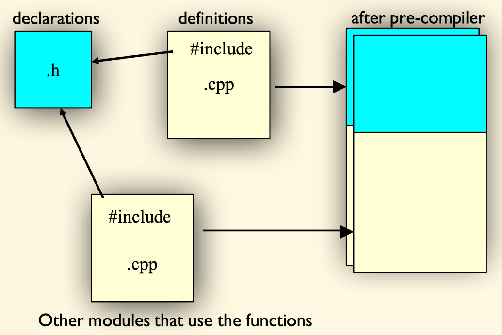

# Chapter 5: Class

## 一、基本概念

1. **对象（Object）**
    - 对象是类（Class）的实例
    - 对象 = 属性（Attributes）+ 服务（Services）
    - 万物皆为对象
    - 每个对象都有自己的由其它对象组成的内存
    - 每个对象都有一个类型
2. **消息传递（Message Communication）**
    - 程序是一系列对象，它们通过消息传递来交互
    - 特定类型的所有对象都可以接收相同的消息
    - 消息可以有返回值
    - 消息可以造成其接收者的状态发生变化
    - 消息传递由方法调用（Method Calls）实现
3. **封装（Encapsulation）：**将数据和方法捆绑在一起，隐藏数据处理的细节，限制仅对公开的方法的访问
4. **抽象（Abstraction）：**隐去实现细节，关注更高维度的问题，需要模块化设计（Modularization）

## 二、类的定义与多文件编程

1. **Class 与 Struct 的区别**
    - 类：默认 `private` 访问权限和继承，适合复杂对象封装
    - 结构体：默认 `public` 访问权限和继承，适合简单数据聚合
2. **类的定义方法**
    
    使用头文件和源文件分离的方式定义类，每定义一个类应当建立两个文件：
    
    - `className.h` ：包含类的声明、成员函数的声明
    - `className.cpp` ：包含成员函数的函数体（具体实现）

    ```cpp
    // 示例：Point 类的定义和使用
    // Point.h
    class Point{
    private:
        int x, y;
    public:
        void init(int ix, int iy);
        void move(int dx, int dy);
    };

    // Point.cpp
    #include "point.h"
    #include <iostream 
    using namespace std;

    void Point::init(int ix, int iy){
        x = ix;
        y = iy;
    }

    void Point::move(int dx, int dy){
        x += dx;
        y += dy;
    }

    // main.cpp
    #include<iostream 
    #include "point.h"
    using namespace std;

    int main(){
        Point p;
        p.init(2, 3);
        p.move(5, 5);
    }
    ```
     
3. **作用域解析运算符 Resolver `::`**
    - 上例使用了 `Point::` 来指定这个函数是属于 `Point` 类的，该操作符称为作用域解析运算符
    - 格式：`Class::Function` 或 `Class::Attribute`
    - 如果冒号前面没有类名，则代表全局作用域
    
      
    ```cpp
    void S::f(){    // 定义类 S 的 f 函数
    ::f();        // 调用全局作用域的 f 函数
    ::a++;        // 对全局作用域的 a 变量操作
    a--;          // 对当前作用域的 a 变量操作
    }
    ```
      
4. **编译单元 Computation Unit**
    - 一个 `.cpp` 文件就是一个编译单元，编译器会将 `.cpp` 文件编译成 `.obj` 文件，链接器会将所有的 `.obj` 文件链接成一个可执行文件
    - `#include` 指令会将 `.h` 文件的内容直接复制到 `.cpp` 文件中
    - 以下是一个标准的头文件结构，里面的声明仅出现一次，这样可以避免头文件内容被多次包含，从而导致编译失败的问题
        
        ```cpp
        #ifndef HEADER_FLAG
        #define HEADER_FLAG
        // Type declaration here...
        #endif // HEADER_FLAG
        ```
        
5. **文件关系图**
    
    
    

!!! note

    若要为函数的参数指定默认值，只能在函数声明处指定，在函数实现处不写


## 三、构造函数和析构函数

### **1. 构造函数 Constructor**

1. 构造函数与类名 / 结构体名完全相同，可以有参数，没有返回类型
2. **默认构造函数**
    - 默认构造函数没有参数，在对象被隐式创建或者没有为构造函数传入参数时调用
    - 如果该类 / 结构体没有定义任何构造函数，则编译器会为其自动创建默认构造函数
    - 如果该类 / 结构体已经定义了含参的构造函数，则编译器不会为其创建默认构造函数
3. **构造函数的调用时机**
    
    对象被创建时，构造函数会被调用：
    
    - 对象为全局变量： `main` 函数运行前调用构造函数
    - 对象为静态变量：第一次访问该对象时调用构造函数
    
    ```cpp
    struct Y{
        int i;
        Y(int a) { i = a; }        // 含参的构造函数
    };
    struct Z{
        int i;
        Z(int a) { i = a; }        // 含参构造函数
        Z() { i = 0; }             // 默认构造函数（需手动定义）
    };
    int main(){
        Y y1[2] = {Y(1), Y(2)};    // 正常工作
        Y y2[3] = {Y(1), Y(2)};    // 报错，y2[2] 的创建需调用默认构造函数，而我们没有定义，编译器也没有为其创建
        Z z1[3] = {Z(1), Z(2)}:    // 正常工作
    }
    ```
      
4. **聚合初始化 Aggregate Initialization**
    - 聚合初始化允许使用花括号 `{}` 来直接初始化数组、结构体或类的对象，而无需显式调用构造函数
    - 如果初始化列表中的值少于成员数量，剩余成员会被初始化为 `0`、`nullptr` 等
    - 使用聚合初始化进行类的对象初始化的条件：
        - 所有成员都是公有的（`public`）
        - 没有用户定义的构造函数
        - 没有基类
        - 没有虚函数
        - 没有私有或保护的非静态数据成员
    - 使用聚合初始化进行数组初始化
        
        ```cpp
        int a[5]={1,2,3,4,5};
        int b[6]=5;
        int c[]={1,2,3};
        ```
        
    - 使用聚合初始化进行类的对象初始化
        
        ```cpp
        struct X{
        	int i;
        	float f;
        	char c;
        };
        
        X obj_1={1,2.2,'c'};
        X obj_list[3]={{1,1.1,'a'},{2,3.3,'f'}}；
        ```
        
5. **初始化列表 Initializer List**
    - 初始化列表是初始化类成员变量的一种机制，在类的构造函数中使用，以直接初始化成员变量
    - 初始化列表中进行的初始化是在构造函数体执行前执行的
    - `const` 成员、引用类型成员、没有默认构造函数的类类型成员，必须在初始化列表中进行初始化
    - 初始化列表的用法
        
        ```cpp
        class SubClass {
        public:
        		SubClass(int x){}
        };
        
        class MyClass {
        private:
            const int a;
            int& ref;
            SubClass obj;
        public:
            MyClass(int x, int& y, int z) : a(x), ref(y), obj(z） 
            {// 构造函数体}
        };
        ```
        
    - 成员变量的初始化顺序与它们在类中声明的顺序一致，而不是初始化列表中的顺序
        
        ```cpp
        class MyClass {
        private:
            int a;
            int b;
        public:
            MyClass(int x) : b(x), a(b) {} 
            // 错误：a 先初始化，但 b 还未初始化
        };
        ```
        

### 2. 析构函数 Destructor

1. 析构函数的定义为 `~Classname()` ，没有参数和返回类型
2. 对象被析构时，其中元素被析构的顺序是它们在类中声明的相反顺序

## 四、类的成员

### 1. 字段与局部变量

1. 类的成员数据称为 **字段（Field）**
2. 字段的作用域：可在整个类内被访问
3. 在类的成员函数（方法）内部，若局部变量和类的字段重名，则在该函数内无法访问类的字段，除非使用 `this` 指针

### 2. `this` 指针

1. `this` 指针是一个隐含的指针，指向当前对象的地址；它是类成员函数中的一个关键字，用于访问当前对象的成员变量和成员函数
2. `this` 指针在类的非静态成员函数中可用，但在静态成员函数中不可用
3. `this` 指针的类型是 `ClassName*`（指向当前类类型的指针）
4. 在 `const` 成员函数中，`this` 指针的类型是 `const ClassName*`，不能用其修改成员变量
5. `this` 指针本身是一个常量指针（`ClassName* const`），不能修改其指向
6. `this` 指针的底层原理：当调用一个类的非静态成员函数时，编译器会隐式地将当前对象的地址作为第一个参数传递给函数

### 3. 常量对象与常量成员 Const

1. **常量对象**
    - 在创建对象时声明其为常量对象，则该对象内的字段不可修改
    
    ```cpp
    // non-const object
    Date when(1,1,2001);
    when.setDay(2,2,2002);    // OK
    
    // const object
    const Date birthday(12,25,1994);
    birthday.setDay(02,11,2004);    // ERROR
    ```
    
2. **常量成员函数**
    - 在定义和声明时都需使用 `const` 关键词
    - 常量成员函数不能修改对象的字段
    
    ```cpp
    // 定义和声明常量成员函数
    int getDay() const;
    int getDay() const 
    { 
    	day++;    // ERROR: const cannot modift data member
    	setDay(12);    // ERROR: calls non-const member
    	return day 
    };
    ```
    
3. 类的常量成员必须在构造函数的初始化列表中完成初始化

### 4. 类的静态成员 Static

1. 静态成员变量是类的所有对象共享的变量，它在类的所有实例中只有一份拷贝
2. 静态成员变量必须在类内声明，但在类外定义和初始化（若未完成初始化，将无法通过编译）
3. 静态成员函数没有 `this` 指针，只能访问静态成员
4. 静态成员变量的初始化顺序与它们在文件中的定义顺序一致
    
    ```cpp
    class MyClass {
    public:
        static int count; // 类内声明
    };
    
    int MyClass::count = 0; // 类外定义和初始化
    ```
    

### 5. 内联函数 Inline Functions

1. 内联函数是一种优化机制，用于减少函数调用的开销；通过在函数定义前加上 `inline` 关键字，编译器会尝试将函数体直接插入到调用处，而不是生成函数调用的代码
2. 内联函数对参数类型进行检查，相比于宏（Macro）更安全
3. 在类（Class）中定义的函数默认就是内联函数
4. 通常将较简单的函数定义为内联函数，复杂函数、递归函数不适合被定义为内联函数
5. `inline` 关键字是对编译器提出的建议，编译器不一定会采纳
6. 内联函数的函数体常放在头文件中，需要调用时即使用 `#include` 将其包含在内
7. 与普通的函数相比，内联函数可以在 .cpp 文件内重复定义