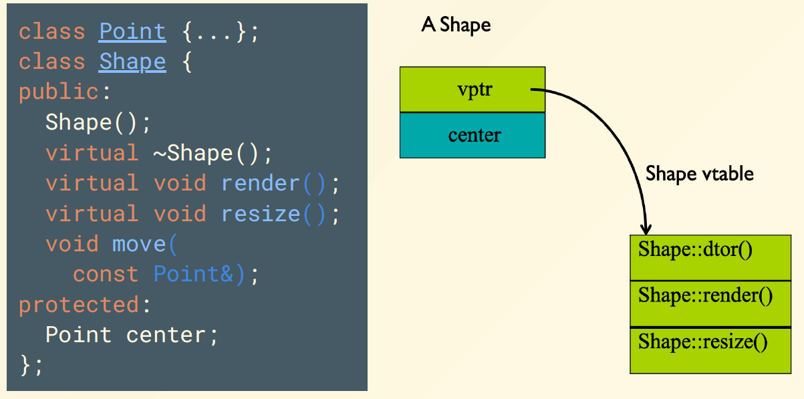

# Chapter 6: Composition, Inheritance & Polymorphism

## 一、组合 Composition

1. **组合（Composition）：**将类 $A$ 的对象作为类 $B$ 的成员，包含两种方式：
    - 完全包含（Fully Inclusion）：自动调用构造函数和析构函数
    - 引用包含（Reference Inclusion）：需要手动初始化和销毁对象
2. **完全包含**
    - $A$ 的初始化发生在 $B$ 的初始化过程之时
    - 在 $B$ 被构造或析构时， $A$ 的构造函数和析构函数会被自动调用
        - $A$ 的构造函数先于 $B$ 的构造函数被调用
        - $A$ 的析构函数晚于 $B$ 的析构函数被调用
    - 需在 $B$ 的初始化列表中对 $A$ 进行初始化，否则 $A$ 的默认构造函数将被调用

## 二、继承 Inheritance

**继承（Inheritance）：**从已存在的类中克隆新的类并扩展

- 定义一个基类（Base class），用于定义共同属性
- 定义多个派生类（Derived Class），用于继承基类的属性，并添加自己的属性

### **1. 基类成员的访问权限**

| 成员限定词 | 同一类内 | 派生类内 | 类外 |
| --- | --- | --- | --- |
| `private` | Yes | No | No |
| `protected` | Yes | Yes | No |
| `public` | Yes | Yes | Yes |

### **2. 继承方式与访问权限**

设类 $A$ 为基类，类 $B$ 为派生类

| B 的继承方式 | A 的 public 成员 | A 的 protected 成员 | A 的 private 成员 |
| --- | --- | --- | --- |
| `B: private A`  | private in B | private in B | B 中不可访问 |
| `B: protected A` | protected in B | protected in B | B 中不可访问 |
| `B: public A` | public in B | protected in B | B 中不可访问 |

### **3. 派生类的构造与析构**

- 设类 $A$ 为基类，类 $B$ 为派生类
- 在 $B$ 被构造或析构时， $A$ 的构造函数和析构函数会被自动调用
    - $A$ 的构造函数先于 $B$ 的构造函数被调用
    - $A$ 的析构函数晚于 $B$ 的析构函数被调用
- 析构函数的调用顺序与构造函数的调用顺序恰好相反
- 需在 $B$ 的初始化列表中对 $A$ 进行初始化，否则 $A$ 的默认构造函数将被调用

```cpp
class Employee{
public:
	Employee(const string& name);
	const string& get_name() const { return m_name; }
	void print(ostream& out) const { out<<m_name<<endl; }
	void print(ostream& out, const string& msg) const
	{ out<<msg<<endl; print(out); }
	
protected:
	string m_name;
};

class Manager: public Employee{
public:
	Manager(const string& name, const string& title = "")
	: Employee(name) {}
	const string& get_title() const { return m_title; }
	void print(ostream& out) const { out<<m_name<<m_title<<endl; }
	
private:
	string m_title;
};
```

### **4. 友联 Friends**

- C++ 在访问保护当中还有一种关键词为 `friend`，可以让一个函数或者类访问另一个类的私有成员
- `friend` 可以修饰：
    - 全局函数
    - 某个类的成员函数
    - 某个类

!!! note "访问权限的补充"

    - 设 $A, B$ 都是某个类的对象，则 $A$ 可以访问 $B$ 的 private 成员
    - 事实上可以通过指针来绕过 private 限制，在任意地方访问 private 成员，可用于对软件的破解

## 三、多态 Polymorphism

### **1. 向上转型**

- 向上转型（Upcast）指的是将子类的对象视为父类的对象，通过指针或者引用来实现
- 向上转型会失去关于对象的类型信息，在调用方法时调用声明类型的方法，称为 **静态绑定（Static Binding）**
- 若要在调用方法时调用对象实际类型的方法，需要在基类中声明该方法时使用 `virtual` 关键词，称为 **动态绑定（Dynamic Binding）**

```cpp
Manager pete( "Pete", "444-55-6666", "Bakery");
Employee* ep = &pete; // Upcast
Employee& er = pete;  // Upcast

ep->print(cout); // 调用基类的 print()，而非派生类的 print()，因为向上转型失去关于对象的类型信息 
```

!!! example

    ```cpp
    class Shape{
    public:
        void render(){...}
    };

    class Ellipse : public Shape{
    public:
        void render(){...}
    };

    void foo(Shape *p){
        p->render();
    }

    int main(){
        Ellipse e;
        foo(&e);
    }
    ```

    - 在上述代码中，我们希望能在调用 `foo` 函数时，根据对象的实际类型来调用 `render` 函数，但是事实上， `foo` 函数一直在调用 `Shape` 的 `render` 函数
    - 原因：这是一种利用指针的静态绑定，即在编译时就已经确定了调用的函数，而不是在运行时根据对象的实际类型来调用函数

### **2. 使用虚函数重写成员函数**

1. 若派生类重写了基类的非 `virtual` 成员函数，则基类中该成员函数及其所有重载都无法访问（称为 Name Hiding）
    
    解决方法：在定义基类成员函数时使用 `virtual` 关键词
    
2. 在基类中声明某成员函数为 `virtual` 后，在派生类重写该成员函数时：
    - 无论是否加 `virtual` 都会被视为虚函数（前提是参数表匹配）
    - 重写的函数需要与原函数具有完全相同的参数类型，否则会触发 Name Hiding
    - 需要重写原函数的所有重载形式，否则会触发 Name Hiding
3. 在派生类重写基类的 `virtual` 成员函数时，可以使用 `override` 关键词，它用于显式标记派生类对基类虚函数的重写，可以提高代码可读性，且帮助编译器检查重写是否正确，避免因参数类型不匹配导致触发 Name Hiding

```cpp

int main {
	Employee bob("Bob Jones");
	Manager bill("Bill Smith", "Headmaster");
	
	bob.print(cout, "Employee");    // OK，Employee 类有对应的方法
	bill.print(cout, "Employee");   // ERROR, Manager 类的 print 方法经过重写，不可再调用 Employee 类中 print 方法的重载
}
```

```cpp
class Base {
public:
	virtual void func();
}

class Derived: public Base {
public:
	void func() override {...}
}
```

### **3. 虚函数的实现原理**




### 4. 截断现象

1. **直接操作对象**
    
     `vptr` 只会在构造函数执行的时候对其进行赋值，在此种情况下， `circ` 的 `vptr` 不会被赋给 `elly`
    
    
    
2. **操作指针**
    
    
    
3. **操作引用**
    
    
    

### 5. 使用场景

1. **虚析构函数**
    
    若某个类存在派生类，则这个类的析构函数必须定义为 `virtual` ，否则在向上转型时无法正确调用派生类的析构函数
    
2. **调用基类函数**
    
    子类在重写基类的虚函数时，使用 `基类名::函数名()` 的方式可以调用基类函数
    
    ```cpp
    void Derived::func{
    	Base::func();
    	...
    }
    ```
    
3. **协变返回类型 Return Type Relaxation**
    - 协变返回类型是一种特殊的函数重写规则，允许子类在重写基类的虚函数时，将返回类型放宽（relax）为更具体的派生类类型
    - 这里的返回类型必须为指针或引用形式，直接返回对象的不支持协变返回类型
    
    ```cpp
    class Expr {
    public:
        virtual Expr* newExpr();
        virtual Expr& clone();
        virtual Expr self(); 
    };
    
    class BinaryExpr : public Expr {
    public:
        virtual BinaryExpr* newExpr();  // OK
        virtual BinaryExpr& clone();    // OK
        virtual BinaryExpr self();      // ERROR
    };
    ```
    

### 6. 纯虚函数与抽象类

1. 纯虚函数
    - 定义：在基类中声明但没有实现的虚函数，用 `= 0` 标记
    - 作用：强制派生类必须实现该函数，否则派生类也会成为抽象类
2. 抽象类（Abstract Class）
    - 定义：包含至少一个纯虚函数的类
    - 不能直接实例化：会编译报错
    - 派生类必须实现所有纯虚函数，否则派生类也是抽象类