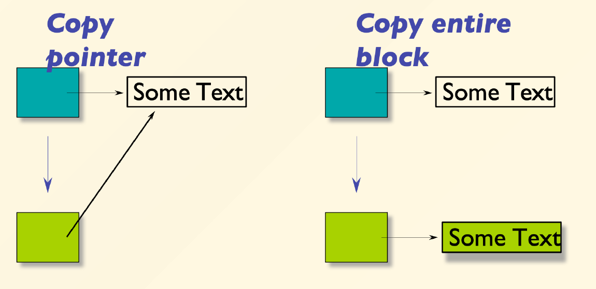

# Chapter 7: Copy Constructor

## 一、拷贝对象

### 1. 对象发生拷贝的情形

以下情形会发生对象的拷贝（根据原有的对象，创建一个新的对象）：

- 使用原有的对象，为一个新的对象进行初始化（Initialization）
    
    ```cpp
    Person baby_a("Fred");
    
    Person baby_b(baby_a);    // 使用对象 baby_a 初始化对象 baby_b，发生对象的拷贝
    Person baby_c = baby_a;   // 同上
    ```
    
- 函数的传值调用（Call By Value）
    
    ```cpp
    void func(Currency p) {...}
    
    Currency bucks(100, 0);    // 初始化一个对象
    func(bucks);    // 这里是传值调用，发生对象的拷贝
    ```
    
- 函数返回一个对象（Function Return）
    
    ```cpp
    Person captain(){
    	Person player("George");
    	return player;   // 函数返回一个对象，发生对象的拷贝
    };
    
    Person who = captain();
    ```
    

### 2. 返回值优化 Return Value Optimization, RVO

- 返回值优化是编译器的一种优化技术，目的是消除函数返回对象时不必要的拷贝行为
- 它通过在函数内部直接构造返回对象到调用者的内存区域，来避免临时对象的创建
- 编译器将返回对象直接构造在目标内存上，而非先构造在函数内部再拷贝

!!! example

    ```cpp
    struct Person {
        string name;
        Person(const char* s) : name(s) {
            cout << "Person(const char*)" << endl;
        }
        Person(const Person& other) {
            cout << "Person(&)" << endl;
        }
    };
    
    Person foo(Person p){
        cout << "in foo()" << endl;
        return p;
    }

    Person bar(const char *s) {
        cout << "in bar()" << endl;
        return Person(s);
    }

    int main() {
        Person p1 = foo("Trump");
        cout << "-----------------------" << endl;
        Person p2 = bar("Biden");
    }
    ```

    考虑上述代码，其输出为：

    ```
    Person(const char*)
    in foo()
    Person(&)
    -----------------------
    in bar()
    Person(const char*)
    ```

    **解释：**

    - 在 `p1` 的构造中，直接传入的是字符串，该过程并没有调用拷贝函数，而是在 `return p` 时调用拷贝构造函数
    - 在 `bar` 函数中 `Person(s)` 会直接在 `p2` 的内存地址上构造，无需中间临时对象，因此不会调用拷贝构造函数

### 3. 区分构造与赋值

- 构造（Construction）：每个对象只能被构造一次
- 赋值（Assignment）：对象完成构造后，可以被多次进行赋值

!!! example

    ```cpp
    int main() {
        Person p1("Trump");    // 构造
        Person p2("Biden");
        Person p3 = p1;        // 构造（由拷贝构造函数）
        p3 = p2;               // 赋值
    }
    ```
 

## 二、拷贝构造函数 Copy Constructor

### 1. 定义

- 拷贝构造函数是定义如何复制对象的构造函数
- 其签名为：`T::T(const T&)`

### 2. 默认拷贝构造函数

- 如果没有为类定义拷贝构造函数，C++ 会创建一个默认的拷贝构造函数
- **默认拷贝构造函数的工作**
    - 如果成员是类（字符串等），分别递归地调用它们（和它们的基类）的拷贝构造函数
    - 如果成员是基本类型（整型、指针等），直接赋值（plain assignment）
- **默认拷贝函数的问题**
    - 默认拷贝函数直接拷贝指针成员的值
    - 这导致如果有成员变量是指针，会和原来对象一样指向同一块内存
    - 如果有一个对象被析构，那么这块内存就被 delete, 其它的对象也无法访问
    - 一般情况下无需自己定义拷贝构造函数，但如果有成员变量是指针时，必须要自己定义拷贝构造函数



图：我们希望实现右侧的效果，但默认拷贝函数实现的是左侧的效果

!!! example
 
    定义一个包含字符数组的类，并进行如下工作：

    - 手动定义拷贝构造函数（适用于构造）
    - 对赋值运算符进行重载（适用于赋值）

    ```cpp
    #include <cstring>
    #include <iostream>
    using namespace std;

    struct Person {
        char * name;
        Person(const char* s) {
            name = new char[strlen(s) + 1];
            strcpy(name, s);
        }
        
            Person(const Person & other) {
                name = new char[strlen(other.name) + 1];
                strcpy(name, other.name);
            }
            
        ~Person() {
            delete[] name;
        }
    };

    Person & operator=(const Person & other) {
        if (this != &other){
            delete[] name;
            name = new char[strlen(other.name) + 1];
            strcpy(name, other.name);
        }
        return *this;
    }

    int main() {
        Person p1("Trump");
        Person p2 = p1;
    }
    ```


!!! note

    Vector 的容量是自动管理的，当其容量满时，就会将其中所有的元素都拷贝到一片新的、更大的空间内；为了减小这种拷贝的开销，建议在创建 Vector 时为其指定容量


### 3. 对拷贝行为进行限制

若不希望对象被拷贝：

- 在 C++11 前：将拷贝构造函数定义为 `private` 类型，并且不指定函数体
    
    ```cpp
    private Person (const Person& rhs) ;
    ```
    
- 在 C++11 后：将拷贝构造函数定义为 `= delete`
    
    ```cpp
    Person (const Person& rhs) = delete;
    ```