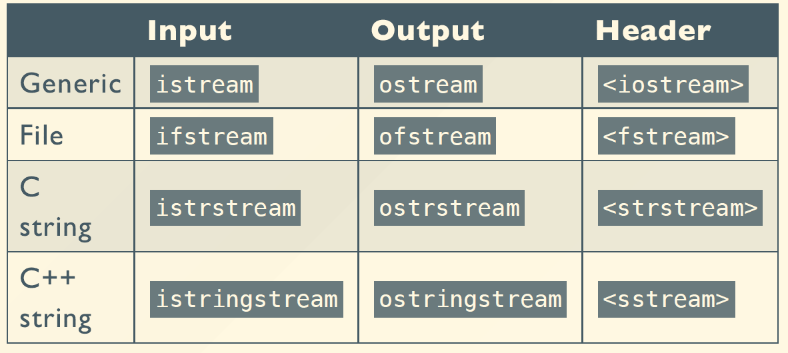

# Chapter 9: Streams

## 一、流的概念

1. **流的概念**
    - 流是用于处理数据的输入和输出的通用逻辑接口，在 C++ 中引入
    - 单向性：
        - 流具有一维性（one-dimensional）、单向性（unidirectional）
        - 双向流（如 `fstream`）需要明确读写方向，因此也可以体现单向性
    - 随机访问：
        - 标准流不支持随机访问，只能按顺序处理数据
        - 文件流支持随机访问，可跳转到任意位置读写
2. **使用流的优势**
    - 统一接口：无论操作对象是文件、字符串还是控制台，语法一致
    - 类型安全：通过运算符重载和类型检查避免错误
    - 可扩展性：支持自定义类型的流操作（重载 `<<` 和 `>>`）
3. **流的名字和所需的头文件**



1. **流的分类**
    - 文本流（Text Stream）：处理 ASCII 文本
    - 二进制流（Binary Stream）
2. **预定义流**
    - `cin`：标准输入流
    - `cout`：标准输出流
    - `cerr`：无缓冲区（unbuffered）错误 / Debug 输出流
    - `clog`：有缓冲区（buffered）错误 / Debug 输出流

## 二、流操作 Stream Operations

流操作共分为三种类型：

- 流提取（Extractor）：在流中读取一个值，通过重载运算符 `>>` 实现
- 流插入（Inserter）：在流中插入一个值，通过重载运算符 `<<` 实现
- 流操纵（Manipulator）：改变流的状态，例如流的显示格式

### 1. 流提取

1. **预定义的流提取器**
    - 包含 char，int，short，long，float，double，char*，void*
    - 流提取器通常忽略前导的空格
2. **定义一个流提取器**
    - 流提取器需要是一个自由函数
    - 参数表包含两个参数
        - 第一个参数为 `istream&`
        - 第二个参数为一个引用类型
    - 返回类型为 `istream&`
    
    ```cpp
    istream& operator>>(istream& is, T& obj) { return is; }
    
    cin >> a >> b >> c; // ((cin >> a) >> b) >> c;
    ```
    
3. **输入流的方法**
    - `int get()`
        - 返回输入流的下一个字符，若流为空返回 `EOF`
    - `get(char *buf, int limit, char delim='\n')`
        - 读取输入流，直至读到 `limit` 个字符或读到 `delim` 参数指定的分割字符
        - 返回读到的字符串，并在末尾补上 `\0`
        - 返回的字符串中不包含 `delim` 参数指定的分割字符
    - `getline(char *b, int l, char d='\n')`
        - 与 `get` 类似，但返回的字符串中包含 `delim` 参数指定的分割字符
    - `int gcount()`
        - 返回刚刚读取的字符数量
    - `void putback(char c)`
        - 把一个单字符送回输入流
    - `char peek()`
        - 查看输入流中的下一个字符是什么，但不把这个字符从输入流中取出

### 2. 流插入

1. **预定义的流插入器**
    - 包含 char，int，short，long，float，double，char*，void*
2. **定义一个流插入器**
    - 流插入器需要是一个自由函数
    - 参数表包含两个参数
        - 第一个参数为 `ostream&`
        - 第二个参数为一个常量引用类型
    - 返回类型为 `ostream&`
    
    ```cpp
    ostream& operator<<(ostream& os, const T& obj) { return os; }
    
    cout << a << b << c; // ((cout << a) << b) << c;
    ```
    
3. **输出流的方法**
    - `put(char)`
        - 把一个单字符送入输出流
    - `flush()`
        - 强制流中的内容全部输出，然后清空流缓冲区

### 3. 流操纵

1. 使用头文件： `#include<iomanip>`
2. **预定义的流操纵器**
    
    
    
    ```cpp
    cout << setprecision(2) << 1230.243 << endl;
    cout << setw(20) << "Enter number in hexadecimal" << endl;
    cin >> hex >> n;
    ```
    
3. **定义一个流操纵器**
    
    ```cpp
    ostream& tab(ostream& out){
    	return out << "\t";
    }
    
    cout << "Hello" << tab << "World!" << endl;
    ```