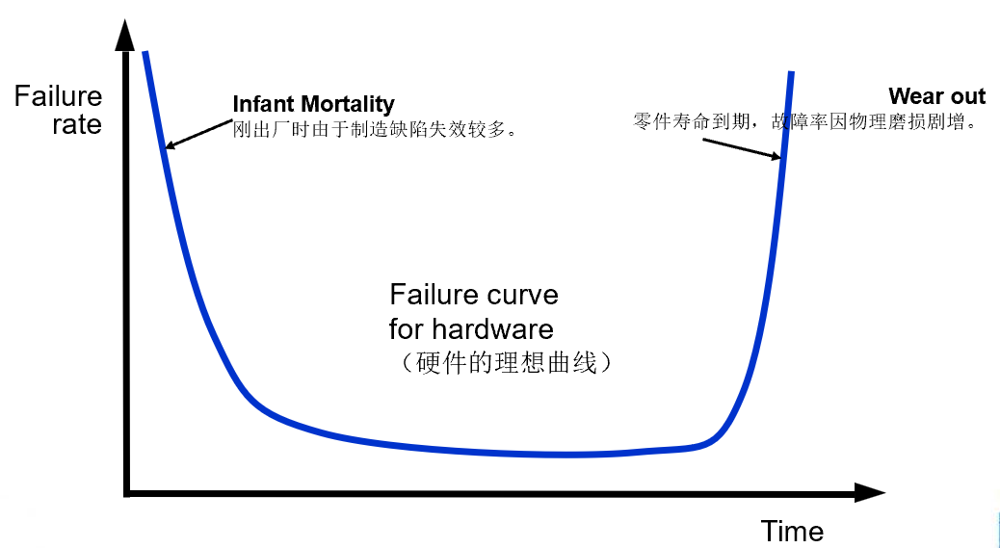

# Chapter 1: The Nature of Software

## 1.1 The Nature of Software

1. **软件的定义（直观）**
    - Software = Product (Infomation transformer) + Vehicle for delivering a product (OS, Network, Tools)
    - 软件 = 产品（即信息的变换器）+ 用于交付产品的载具
2. **软件的定义（完整）**
    
    软件是一组项目或对象，构成如下的配置（Configuration）：
    
    - 指令（Instruction）：提供期望的功能和表现
    - 数据结构（Data Structure）：使程序能充分操作信息
    - 文档（Document）：描述程序的操作与使用方法
3. **软件与硬件的区别**
    - 核心观点：磨损（Wear Out）与退化（Deteriorate）
        - 软件不会磨损：硬件可能因为物理老化而损坏，称为磨损。而软件是逻辑实体，不会出现物理老化现象。
        - 软件会退化：随着时间推移，因为不断地修改、补丁和环境变化，软件的内部结构会变得混乱，导致错误率上升。
    - 越来越多的软件采用基于组件的模块化开发（Component-Based Assembly），但大部分软件仍是定制开发的（Custom Built）。

1. **软件的种类**
    - System Software
    - Application Software
    - Engineering/Scientific Software（工程/科学软件）
    - Embedded Software（嵌入式软件）
    - Product-line Software（产品线软件）
    - Web-Applications
    - Artificial Intelligence Software
2. **传统软件（Legacy Software）为什么要修改**
    - 软件必须根据新的计算环境或技术需求进行调整。
    - 软件必须改进以实现新的业务需求。
    - 软件必须被扩展，使其能够与其他更现代的系统或数据库配合（Inter-operable）。
    - 软件必须重新架构，使其在网络环境中具备可行性。

## 1.2 The Changing Nature of Software

1. **Web-Applications**
    - WebApps 配备了 XML 和 Java 等工具，使网页工程师能够具备交互式计算能力。
    - WebApps 可以服务于终端用户，也可以集成于企业数据库和业务应用中。
    - 语义 Web 技术（Semantic Web Technologies, Web 3.0）已发展成为复杂的企业和消费者应用，涵盖了需要网页链接、灵活数据表示和应用程序程序员接口（API）才能访问的语义数据库。
    - 内容的美学性质（The aesthetic nature of the content）是决定 WebApp 质量的重要因素。
2. **Mobile Applications**
    - 依赖手机或平板电脑等移动平台，兼顾设备特性。
    - 移动应用可以直接访问设备上的硬件，提供本地处理和存储能力。
    - 随着时间推移，Mobile Applications 与 WebApps 差异会变得模糊。
3. **Cloud Computing**
4. **Product Line Software**
    - 产品线软件是一组具有**共同特征**的软件系统。这些系统针对的是同一个特定市场（例如一套针对不同银行的网银系统，或者针对不同型号手机的操作系统），它们的大部分功能是重叠的，但每个具体产品之间有差异。
    - 所有的产品都建立在**同一套“地基”**（应用架构和数据架构）之上。开发者不会为每个新产品重写代码，而是利用一个“通用核心组件库”，在其基础上进行微调。
    - “共享”不仅仅指代码，它涵盖了软件开发的全生命周期资产，包括需求分析、架构设计、测试与文档等。

## 1.3 课后习题节选

