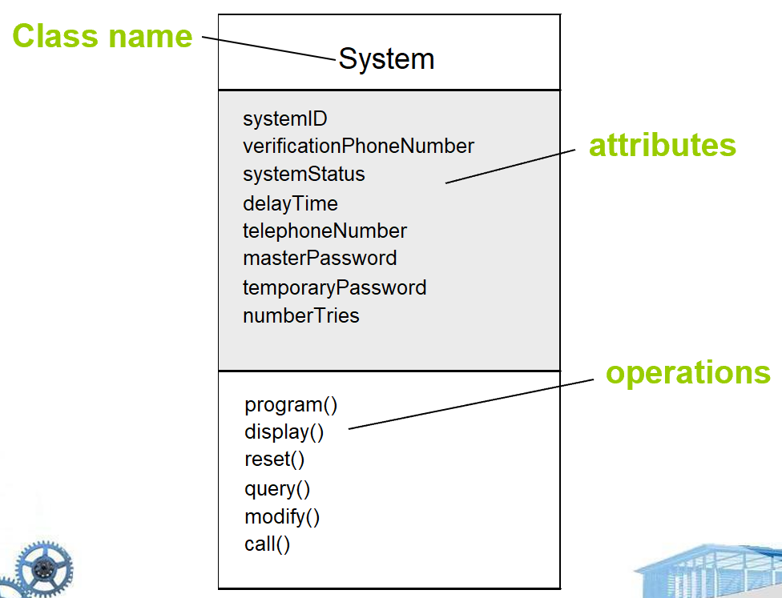

# Chapter 10: Requirements Modeling: Class-Based Methods

## 10.1 需求建模策略

需求建模主要有两种典型方法：

1. **结构化分析（Structured Analysis）**
    - 核心思想：数据与处理过程分离建模。
    - 主要内容包括：
        - 数据对象建模：定义数据对象的 属性（attributes） 与 关系（relationships）。
        - 过程建模：描述对数据对象进行操作的 处理过程（processes），以及数据在系统中的 流动与转换过程。

**2. 面向对象分析（Object-Oriented Analysis）**

- 核心思想：面向对象。
- 主要内容包括：
    - 类（Classes）的定义
    - 类之间的协作方式（Collaboration）

## 10.2 面向对象基本概念

1. **关键概念**
    - 类（Class）与对象（Object）
    - 属性（Attribute）与方法（Operation / Method / Service）
    - 封装（Encapsulation）与实例化（Instantiation）
    - 继承（Inheritance）
2. **关键任务**
    
    在需求分析阶段，以 **迭代** 方式完成下述任务：
    
    - 识别类、属性与方法
    - 定义类的层次结构（Hierarchy）
    - 描述对象之间的关系（Object Relationship）
    - 建模对象行为（Object Behaviour）
3. **类的定义**
    - 类可以理解为：模板（Template），通用描述（Generalized Description），或相似对象集合的抽象
    - 类的层次结构：父类（Metaclass/Superclass）、子类（Subclass）
    - 方法：封装在类中的可执行过程，用于操作类中的数据属性。通过 消息传递（Message Passing） 被调用。
    - 封装：对数据与方法进行封装，使得外部对象无法直接访问内部数据，只能通过方法访问。实现 **信息隐藏（Information Hiding）**。

## 10.3 基于类的建模

1. 基于类的建模主要表示以下内容
    - 系统将要操作的对象（Objects）
    - 对象上的方法（Operations / Methods）
    - 对象之间的关系（Relationships）
    - 类之间的协作（Collaborations）
2. **判断潜在类的标准**
    
    一个候选类通常满足：
    
    - 具有多个属性（multiple attributes）
    - 具有共同属性（common attributes）
    - 具有共同操作（common operations）
    - 表示所需的服务（retained information）
    - 表示基本的要求（essential requirements）
    - 需要长期存储的信息（retained information）
3. **类图（Class Diagram）**
    
    
    
    
    

## 10.4 CRC 建模

1. CRC（Class-Responsibility-Collaborator）模型是一种用于明确类的职责与协作关系的核心分析方法。它提供了一种简单直观的类组织方式：
    - **类（Class）：** 封装的集合体。
    - **职责（Responsibilities）：** 类所封装的属性与方法。
    - **协作者（Collaborators）：** 当一个类为了完成某种职责而需要从其他类获取信息或请求服务时，便产生了协作。这些其它的类称为协作者。

图：CRC 卡片

1. **类的类型（Class Types）**
类通常可以分为以下三大类：
    - **实体类（Entity classes）：** 亦称为模型类（Model classes）或业务类（Business classes） 。它们直接从问题陈述中提取 。
    - **边界类（Boundary classes）：** 用于创建用户在软件使用过程中的交互界面（例如：交互式屏幕或打印报告）。
    - **控制类（Controller classes）：** 负责管理从开始到结束的“工作单元”（Unit of work）。控制类可被设计用于：
        - 管理实体对象的创建或更新 ；
        - 当边界对象从实体对象获取信息时，负责边界对象的实例化
        - 管理对象集之间复杂的通信 ；
        - 以及验证对象之间或用户与应用程序之间通信的数据 。
2. **职责分配指南（Guidelines for Allocating Responsibilities）**
为了优化系统设计，分配职责时应遵循以下原则：
    - **分布智能：** 系统智能应分布在各个类中，以最好地解决问题需求
    - **通用化表述：** 每项职责的陈述应尽可能通用 。
    - **封装性：** 数据及其相关的行为应驻留在同一个类中 。
    - **局部化：** 关于某事物的信息应局部化（Localize）在单个类中，而不是分布在多个类之间 。
    - **职责共享：** 在适当的情况下，职责应在相关的类之间共享 。
3. **类之间的协作关系**
    - 类履行职责的方式有两种：使用自身的方法来操作自身的属性，或者与其他类进行协作（Collaborate）。
    - **协作关系：** 协作识别了类之间的关系 。类之间存在三种通用的关系：
        - 组成关系（is-part-of）：例如引擎是汽车的一部分。
        - 认知关系（has-knowledge-of）：一个类知道另一个类的信息。
        - 依赖关系（depends-upon）：一个类需要依赖另一个类才能工作。
        
        
        
        图：组成关系的类图表示
        
4. **关联与依赖（Associations and Dependencies）：**
    
    在 UML（统一建模语言）中：
    
    - 关联（Association）：表示类之间存在某种联系。例如学生与课程之间存在某种联系。
    - 多重性（Multiplicity）：表示对象数量关系。
        - 1：必须且唯一
        - 0..*：零个或多个
        - 1..*：至少一个
    - 依赖关系（Dependency）：例如客户端与服务器，客户端类依赖服务器类提供服务。
    
    
    
    
    
5. **CRC 模型评审流程（Reviewing the CRC Model）**
    
    CRC（类-职责-协作）模型的评审通常遵循以下步骤：
    
    - **准备阶段：** 所有评审参与者都会分到一组 CRC 模型索引卡 。具有协作关系的卡片应分配给不同的评审员 。
    - **组织场景：** 将所有的用例场景（及对应的用例图）按类别组织好 。
    - **评审过程：**
        - 评审组长读出用例，当提到某个命名对象时，会将一个“令牌（token）”传递给持有相应类索引卡的人员 。
        - 令牌持有者需描述该卡片上记录的职责 。
        - 小组集体判断这些职责是否满足用例需求 。
    - **修改完善：** 如果现有卡片无法满足用例，则需进行修改，包括定义新类、制定新职责或修改现有协作关系 。
6. **分析包（Analysis Packages）**
    - **定义：**分析包是在需求分析阶段为了管理复杂分析模型而引入的一种组织结构，它是把相关的分析元素（如类、用例等）按功能或主题进行分组的一种机制。
    - **符号含义：可见性**
        - `+` ：表示公共可见性，可从其他包访问 。
        - `-` ：表示私有可见性，对所有其他包隐藏 。
        - `#` ：表示受保护可见性，仅限本包内包含的各类访问。

